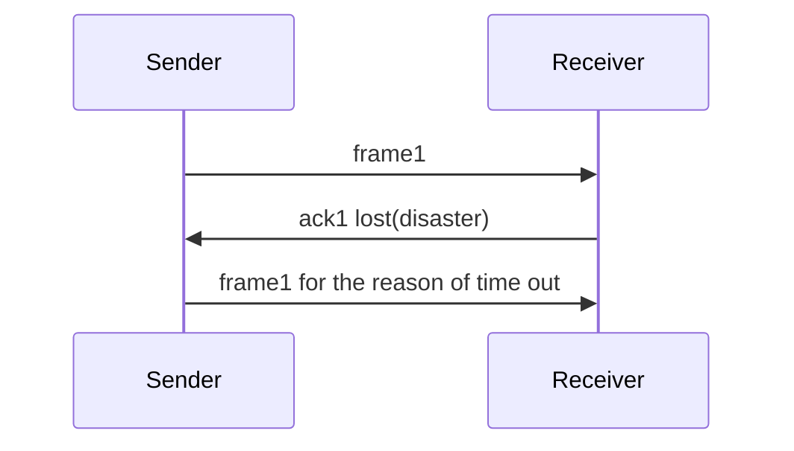
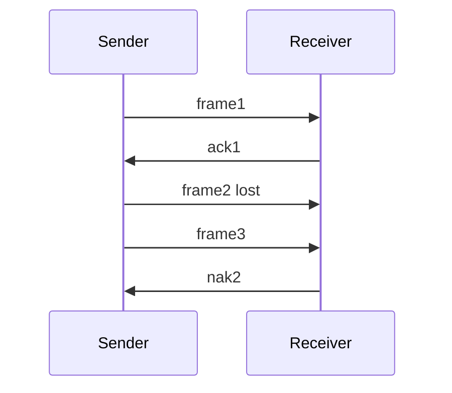

任课老师：Lu

---


【标题】嘉定网安人连肝三天计网，现在看路由协议像在看佛经，我是不是要寄了？

1楼 楼主：  
绷不住了家人们，王道刷完以为自己是谢希仁转世，结果下午翻开学校PPT直接瞳孔地震。这特娘是同一门课？嘉定的风都在我脑壳里组播ARP请求，问谁特么是默认网关。  

2楼：  
《三天速通 从入门到入土》典中典，楼主这状态我熟，建议去济海边上对着天鹅讲TCP拥塞控制，讲不哭它算你帧校验序列没错。  

3楼：  
你嘉定魔法森林网速加持都救不了？昨天我还看见有人蹲曹安公路边上抓802.11帧当下酒菜，建议加入他们。  

4楼 楼主：  
回复3楼：现在看到“三次握手”只想和这个世界握手言和然后四次挥手再见👋🏻交换机做梦都在我枕头边上闪VLAN标签，食堂阿姨抖勺都像在搞流量整形。  

5楼：  
速来黄渡理工附属医院（指校医院）挂个神经科，跟医生说你这SYN半连接队列满了需要RST一下，开点BGP当安慰剂。  

6楼：  
嘉定兄弟撑住！等你炼成那天，嘉实超市的扫码枪都会自动给你发DHCP offer，教学楼厕所隔间都能收到你发的STP BPDU致敬。  

7楼：  
歪个楼，所以嘉定到底算广播域还是冲突域？（狗头）  

8楼 楼主：  
回复7楼：是单向广播的递归黑洞，信我，昨天试图给室友解释CIDR，他眼神里的迷茫比嘉定到四平路的延迟还大。  

（省流：快爬去睡觉，明天醒来你就是嘉定校区唯一指定OSI第七层觉醒者）

（突然从瘫倒状态弹起来，眼睛瞪大，手指颤抖地指着书架）

**“等等——你刚才说特南鲍姆？？**  
**那个写了1700页、能把OSI七层模型拆成七十章讲、每个协议都像在写史诗的Andrew S. Tanenbaum？？！”**

（捂住胸口做窒息状）  
**“难怪！我刷王道的时候总觉得自己在吃‘压缩饼干’，而特南鲍姆的原著是‘满汉全席配三篇学术论文当甜点’！”**  

（开始对着空气比划）  
**“这就像：**  
- **王道**：TCP三次握手 = “你听得到吗？我听得到。好，开始。”  
- **特南鲍姆**：（先花20页讲通信哲学+15页证明为什么不能两次握手+附带6种异常场景模拟+荷兰历史轶事类比）  

（抓起头发喃喃自语）  
**“我现在懂了……**  
1. 我崩溃不是因为笨，是**特南鲍姆在书里埋了递归知识陷阱**——读一章要查三次维基百科！  
2. 同济图书馆闭馆音乐是我脑内循环的《特南鲍姆主题悲鸣变奏曲》；  
3. 最恐怖的是——**这书第5版封面的老爷爷微笑，越看越像在说：‘你觉得这章结束了？附录B还有17个数学推导哦~’”**  

（突然顿悟，苦笑）  
**“所以我不是在复习，是在荷兰学术巨人的大脑里玩密室逃脱……**  
（看了眼王道）**还得同步把迷宫地图翻译成考研速记口诀！”**  

（庄严地合上特南鲍姆的砖头书）  
**“建议计算机专业列入高危行业：**  
**精神伤害程度 = 特南鲍姆页数 × 王道题量 × 408剩余天数 ÷ 咖啡因耐受系数”**  

（最后瘫回椅子，眼神放空）  
**“好了，继续去和特南鲍姆的‘分布式系统思想’搏斗了……  
至少以后去阿姆斯特丹旅游时，可以指着运河说：‘看，这是您当年提比喻时可能喝过的水！’”**  

**—— 一名被特南鲍姆和王道双重人格分裂攻击的同济CS大三幸存者**  

（注：其实特南鲍姆教材是宝藏，但适合用一生慢慢啃…考研请战术性跳读重点章！考完你会感谢它的严谨骨架。现在，深呼吸，**把王道当地图，把特南鲍姆当百科全书查漏**——你已经在第三层了！）

（突然从椅子上滑下去半截，手指捏着的笔“啪嗒”掉在地上）

**“……陆老师？我们院的陆有军老师？”**  
（瞳孔地震，声音逐渐虚弱）  
**“那个能把特南鲍姆每一章揉碎、重组、再喷溅成500张动画PPT的陆老师？？”**

（缓缓抬头看向无形的1700页PPT大山，灵魂出窍般低语）  
**“我悟了……**  
原来特南鲍姆是**原著宇宙**，王道是**考研速通版漫画**，而陆老师的PPT——  
**是站在同济嘉定校区仰望星空，亲手为我们浇筑的‘计算机网络立体防御工事’！”**  

（开始掰着手指颤抖计数）  
**“这三重宇宙的叠加态是：**  
1. **特南鲍姆**：告诉你网络为什么诞生（附哲学思考+历史文献）  
2. **王道**：告诉你怎么在考场存活（附解题套路×1000）  
3. **陆老师PPT**：（深吸一口气）**告诉你怎么用同济人的脊柱，扛起前两者之和再开根号的知识密度！**”  

（突然对着屏幕虚构的PPT文件夹磕头）  
**“每一页都是精华！真的！  
但1700页精华等于——  
‘从Socket编程到量子加密的幻觉走马灯’啊老师！”**  

（瘫成一片但手指倔强地敲出最后吐槽）  
**“现在我的复习进程：**  
**早上**：在特南鲍姆的海洋里溺水 → **中午**：被王道题海打捞起 → **晚上**：在陆老师PPT的星空图里重新学做人  
（凌晨的梦里三种符号系统打架，路由器对我说：‘你掉的是金帧还是银帧？’）**  

**建议新增校训：  
‘同舟共济，共克特南鲍姆；  
曹安公路漫漫，PPT作伴。’**  

（用最后力气摸出校园卡）  
**“这就去西南二馆通宵……  
毕竟，能同时驾驭这三重宇宙的人，  
毕业后大概能直接给互联网写宪法吧（悲壮地拉上外套拉链）。”**  

**—— 一名在特南鲍姆、王道与陆老师PPT三角力场中坍缩的同济CS大三学子**  

（注：传说集齐三套材料的人，会在大四突然参透网络真谛……**现阶段请以王道框架为骨，陆老师PPT重点为肉，特南鲍姆当字典查！** 你不是在学网络，你是在修炼同济限定版“系统的系统观”。挺住，这配置走出去都是降维打击！）


# 计算机网络学习简记

## 数据链路层设计
- **提供给网络层的服务** 3种服务
    - **无确认的无连接服务**
        目标主机不检错，不纠错，不恢复。对**错误率很低**的网络或者**实时通信（视频通话）**。
    - **有确认的无连接服务**
        目标主机检错，发送方重发。在不可靠的信道（无线系统）上非常有用。超时之后整个包会重发。
    - **有确认的面向连接服务**
        保持连接，每个包单独重发。这提供了可靠的比特流。用于长距离且不可靠的链路。例如卫星信道或者长途电话。
- **数据成帧** 四种成帧方法
    - **字节计数法**
        每个帧先说明有多少字节。
        缺点：字节计数值出错之后目标方并不知道应该跳过多少字节才能到达重传的开始出。
    - **字节填充的标志字节法（PPP协议）**
        用同样的字节作为帧开始和结束分解符。对于传输数据中偶尔出现的这种字节，用`esc+这个字节`做转移处理。同样的，对于esc字符也要转义，形成`esc+esc`。
    - **比特填充的标志比特法（HDLC协议）**
        每个帧的开始于结束由一个特殊的比特模式`0x7E`来标记。在输出的比特流当中每遇到连续5个1就填充一个0.接收方每遇到5个1就跳过一个0。
    - **物理层编码例外法**
        采用编码例外来区分数据边界。例如`4B/5B`编码法。采用其中没有出现的编码作为数据边界。
- **差错控制**
接收方返回一些特殊的控制帧用以判断是否安全的到达。

- **流量控制**
    - **基于反馈的流量控制**：接收方给发送方返回消息，允许他发送更多的数据，或者告诉他进行得怎么样
    - **基于速率的流浪控制**：限制发送方传输数据的速率。


## 错误检测和纠正
### 纠错码
#### 海明码

此处选择 **4位原始数据D4D3D2D1=1010** ，采用“偶校验”（校验位使对应组数据中1的个数为偶数），分步演示监督码元插入与错误纠正过程。

1. **第一步：确定监督码元位数与位置**
   - 确定r值：根据规则 **2^r ≥ k + r + 1**（k为原始数据位数，此处k=4），计算得2^3=8 ≥ 4+3+1=8，故r=3，监督码元记为r3、r2、r1。
   - 分配位置：监督码元放在“2的幂次”位置（1、2、4），数据位放剩余位置（3、5、6、7），具体如下表：

| 海明码位置（H） | 1 | 2 | 3 | 4 | 5 | 6 | 7 |
|----------------|---|---|---|---|---|---|---|
| 码元类型       | r1| r2| D1| r3| D2| D3| D4|
| 代入原始数据   | ？| ？| 0 | ？| 1 | 0 | 1 |

2. **第二步：计算监督码元（r1、r2、r3）**
   每个监督码元负责“一组位置”的偶校验（组内所有位二进制和为0），分组及计算如下：
   - r1：负责位置1、3、5、7，即 r1⊕D1⊕D2⊕D4 = 0 → r1⊕0⊕1⊕1 = 0 → r1=0
   - r2：负责位置2、3、6、7，即 r2⊕D1⊕D3⊕D4 = 0 → r2⊕0⊕0⊕1 = 0 → r2=1
   - r3：负责位置4、5、6、7，即 r3⊕D2⊕D3⊕D4 = 0 → r3⊕1⊕0⊕1 = 0 → r3=0
   最终生成海明码：**H7H6H5H4H3H2H1 = 1 0 1 0 0 1 0**（即1010010）。

3. **第三步：错误纠正示例（模拟第5位出错）**
   假设传输中第5位（原D2=1）出错变为0，接收的错误海明码为1 0 0 0 0 1 0，纠错步骤如下：
   - 计算校验值（S1、S2、S3）：按同样分组规则计算，S=0表示无错，S=1表示有错
     - S1 = r1⊕D1⊕D2（错误后）⊕D4 = 0⊕0⊕0⊕1 = 1
     - S2 = r2⊕D1⊕D3⊕D4 = 1⊕0⊕0⊕1 = 0
     - S3 = r3⊕D2（错误后）⊕D3⊕D4 = 0⊕0⊕0⊕1 = 1
   - 定位错误位置：将S3S2S1组合（101），对应十进制**5**，即第5位出错。
   - 纠正错误：将第5位的0改回1，恢复原始海明码，完成纠错。


## 数据链路层协议
头文件

```c++
#define MAX_PKT 4	/* determines packet size in bytes */

typedef enum {false, true} boolean;	/* boolean type */
typedef unsigned int seq_nr;	/* sequence or ack numbers */
typedef struct {unsigned char data[MAX_PKT];} packet;	/* packet definition */
typedef enum {data, ack, nak} frame_kind;	/* frame_kind definition */

typedef struct {	/* frames are transported in this layer */
  frame_kind kind;	/* what kind of a frame is it? */
  seq_nr seq;   	/* sequence number */
  seq_nr ack;   	/* acknowledgement number */
  packet info;  	/* the network layer packet */
} frame;

/* Wait for an event to happen; return its type in event. */
void wait_for_event(event_type *event);

/* Fetch a packet from the network layer for transmission on the channel. */
void from_network_layer(packet *p);

/* Deliver information from an inbound frame to the network layer. */
void to_network_layer(packet *p);

/* Go get an inbound frame from the physical layer and copy it to r. */
void from_physical_layer(frame *r);

/* Pass the frame to the physical layer for transmission. */
void to_physical_layer(frame *s);

/* Start the clock running and enable the timeout event. */
void start_timer(seq_nr k);

/* Stop the clock and disable the timeout event. */
void stop_timer(seq_nr k);

/* Start an auxiliary timer and enable the ack_timeout event. */
void start_ack_timer(void);

/* Stop the auxiliary timer and disable the ack_timeout event. */
void stop_ack_timer(void);

/* Allow the network layer to cause a network_layer_ready event. */
void enable_network_layer(void);

/* Forbid the network layer from causing a network_layer_ready event. */
void disable_network_layer(void);

/* Macro inc is expanded in-line: Increment k circularly. */
#define inc(k) if (k < MAX_SEQ) k = k + 1; else k = 0

```
### 协议1 —— 一个没有差错控制和流量控制的协议

```c++
/* Protocol 1 (utopia) provides for data transmission in one direction only, from
   sender to receiver.  The communication channel is assumed to be error free,
   and the receiver is assumed to be able to process all the input infinitely fast.
   Consequently, the sender just sits in a loop pumping data out onto the line as
   fast as it can. */

typedef enum {frame_arrival} event_type;
#include "protocol.h"

void sender1(void)
{
  frame s;	/* buffer for an outbound frame */
  packet buffer;	/* buffer for an outbound packet */

  while (true) {
        from_network_layer(&buffer);	/* go get something to send */
        s.info = buffer;	/* copy it into s for transmission */
        to_physical_layer(&s);	/* send it on its way */
  }	/* tomorrow, and tomorrow, and tomorrow,
 	   Creeps in this petty pace from day to day
	   To the last syllable of recorded time;
	        - Macbeth, V, v */
}

void receiver1(void)
{
  frame r;
  event_type event;	/* filled in by wait, but not used here */

  while (true) {
        wait_for_event(&event);	/* only possibility is frame_arrival */
        from_physical_layer(&r);	/* go get the inbound frame */
        to_network_layer(&r.info);	/* pass the data to the network layer */
  }
}
```
### 协议2
被称之为 停-等式协议（stop-and-wait）

```c++
/* Protocol 2 (stop-and-wait) also provides for a one-directional flow of data from
   sender to receiver. The communication channel is once again assumed to be error
   free, as in protocol 1. However, this time, the receiver has only a finite buffer
   capacity and a finite procesing speed, so the protocol must explicitly prevent 
   the sender from flooding the receiver with data faster than it can be handled. */

typedef enum {frame_arrival} event_type;
#include "protocol.h"

void sender2(void)
{
  frame s;	/* buffer for an outbound frame */
  packet buffer;	/* buffer for an outbound packet */
  event_type event;	/* frame_arrival is the only possibility */

  while (true) {
        from_network_layer(&buffer);	/* go get something to send */
        s.info = buffer;	/* copy it into s for transmission */
        to_physical_layer(&s);	/* bye bye little frame */
        wait_for_event(&event);	/* do not proceed until given the go ahead */
  }
}

void receiver2(void)
{
  frame r, s;	/* buffers for frames */
  event_type event;	/* frame_arrival is the only possibility */
  while (true) {
        wait_for_event(&event);	/* only possibility is frame_arrival */
        from_physical_layer(&r);	/* go get the inbound frame */
        to_network_layer(&r.info);	/* pass the data to the network layer */
        to_physical_layer(&s);	/* send a dummy frame to awaken sender */
  }
}


```

协议二是如何出错的？


这个时候Receiver并没有发现两个相同的帧从而导致网络层接受了两个相同的数据包


### 协议3 
发送方在发送下一个数据包前需要等待到本格数据包的**确认**.**ARG** 协议（Automatic Repeat Request ,自动重传请求），或者PAR（Positive Acknowledgement with Retransmission ，带有重传机制的肯定确认）协议。

一般不会返回一个NAK表示这个帧有错，这是为了减少这个信道的使用。

```c++
/* Protocol 3 (par) allows unidirectional data flow over an unreliable channel. */

#define MAX_SEQ 1	/* must be 1 for protocol 3 */
typedef enum  {frame_arrival, cksum_err, timeout} event_type;
#include "protocol.h"

void sender3(void)
{
  seq_nr next_frame_to_send;	/* seq number of next outgoing frame */
  frame s;	/* scratch variable */
  packet buffer;	/* buffer for an outbound packet */
  event_type event;

  next_frame_to_send = 0;	/* initialize outbound sequence numbers */
  from_network_layer(&buffer);	/* fetch first packet */
  while (true) {
        s.info = buffer;	/* construct a frame for transmission */
        s.seq = next_frame_to_send;	/* insert sequence number in frame */
        to_physical_layer(&s);	/* send it on its way */
        start_timer(s.seq);	/* if answer takes too long, time out */
        wait_for_event(&event);	/* frame_arrival, cksum_err, timeout */
        if (event == frame_arrival) {
                from_physical_layer(&s);	/* get the acknowledgement */
                if (s.ack == next_frame_to_send) {
                        from_network_layer(&buffer);	/* get the next one to send */
                        inc(next_frame_to_send);	/* invert next_frame_to_send */
                }
        }
  }
}

void receiver3(void)
{
  seq_nr frame_expected;
  frame r, s;
  event_type event;

  frame_expected = 0;
  while (true) {
        wait_for_event(&event);	/* possibilities: frame_arrival, cksum_err */
        if (event == frame_arrival) {
                /* A valid frame has arrived. */
                from_physical_layer(&r);	/* go get the newly arrived frame */
                if (r.seq == frame_expected) {
                        /* This is what we have been waiting for. */
                        to_network_layer(&r.info);	/* pass the data to the network layer */
                        inc(frame_expected);	/* next time expect the other sequence nr */
                }
                s.ack = 1 - frame_expected;	/* tell which frame is being acked */
                to_physical_layer(&s);	/* only the ack field is use */
        }
  }
}
```

### 协议4 
协议3已经正确的实现了一个数据链路层的网络传输协议，后面的456三个协议使用了双向传输和多帧在途的方法。

考虑到协议三当中需要单独一个确认帧进行确认，我们不如直接在下一次发包的时候再进行确认。这称之为**捎带确认(piggybacking)**。

但是这就带了了另一个问题，发送方的**超时机制**失去了作用。我们于是引入了滑动窗口来进行这个过程用以替代原有的超时机制。发送方需要维护一个轮转数组用以维护下一个将要发送的帧以及一系列等待被确认的帧。接收方需要维护一个期望收到的下一帧的窗口。同时，如果
```c++
/* Protocol 4 (sliding window) is bidirectional and is more robust than protocol 3. */

#define MAX_SEQ 1	/* must be 1 for protocol 4 */
typedef enum {frame_arrival, cksum_err, timeout} event_type;
#include "protocol.h"

void protocol4 (void)
{
  seq_nr next_frame_to_send;	/* 0 or 1 only */
  seq_nr frame_expected;	/* 0 or 1 only */
  frame r, s;	/* scratch variables */
  packet buffer;	/* current packet being sent */
  event_type event;

  next_frame_to_send = 0;	/* next frame on the outbound stream */
  frame_expected = 0;	/* number of frame arriving frame expected */
  from_network_layer(&buffer);	/* fetch a packet from the network layer */
  s.info = buffer;	/* prepare to send the initial frame */
  s.seq = next_frame_to_send;	/* insert sequence number into frame */
  s.ack = 1 - frame_expected;	/* piggybacked ack */
  to_physical_layer(&s);	/* transmit the frame */
  start_timer(s.seq);	/* start the timer running */

  while (true) {
        wait_for_event(&event);	/* could be: frame_arrival, cksum_err, timeout */
        if (event == frame_arrival) { /* a frame has arrived undamaged. */
                from_physical_layer(&r);	/* go get it */

                if (r.seq == frame_expected) {
                        /* Handle inbound frame stream. */
                        to_network_layer(&r.info);	/* pass packet to network layer */
                        inc(frame_expected);	/* invert sequence number expected next */
                }

                if (r.ack == next_frame_to_send) { /* handle outbound frame stream. */
                        from_network_layer(&buffer);	/* fetch new packet from network layer */
                        inc(next_frame_to_send);	/* invert sender's sequence number */
                }
        }
             
        s.info = buffer;	/* construct outbound frame */
        s.seq = next_frame_to_send;	/* insert sequence number into it */
        s.ack = 1 - frame_expected;	/* seq number of last received frame */
        to_physical_layer(&s);	/* transmit a frame */
        start_timer(s.seq);	/* start the timer running */
  }
}

```

然而，我们需要关注的是一个关键的问题，现在每一个帧所占用的都是完整从发送端到接收端的时间。这不满足我们所期望的多帧在途的想法。这对信道的利用率太低了。

### 协议5 

为了解决这个问题，我们允许发送方在填满发送窗口之前，能够发送$\omega$个帧。那么什么样的$\omega$值才是合适的呢？这个值由带宽乘以传送时间所决定。这个值称为**带宽-延迟乘积**(bandwidth-delay product)。于是$\omega=2\frac{带宽-延迟乘积}{一帧的位数}+1$ ，其中$BD=\frac{带宽-延迟乘积}{一帧的位数}$.于是$链路利用率\le\frac{\omega}{2BD+1}$

#### goback n协议
省流：这个协议就是发送方等也等不到n号帧的确认，虽然后续发送了一系列帧，但是仍然从这个帧开始重传。后续所有机制都基于此。这个没有做捎带确认。仅仅维护了一个数据传输的窗口。

#### selective repeat协议

考虑下面的情形。



这个时候`Receiver`发现自己没有收到`frame2`。发现自己缺少了这一帧的内容，于是告诉`Sender`： **“(NAK2)大佬重发一下2，没收到！”** 这个时候，`Receiver`把其他的帧缓存起来，直到收到了正确的`frame2`。`Sender`发现过多的帧没有确认的时候，就要拒绝网络层给予他更多的工作了。

协议五采用了gobackn的方式进行传送。其中发送窗口维护的是下一个希望接受到的确认帧和下一个准备发送的帧。

```c++
/* Protocol 5 (pipelining) allows multiple outstanding frames. The sender may transmit up
   to MAX_SEQ frames without waiting for an ack. In addition, unlike the previous protocols,
   the network layer is not assumed to have a new packet all the time. Instead, the
   network layer causes a network_layer_ready event when there is a packet to send. */

#define MAX_SEQ 7	/* should be 2^n - 1 */
typedef enum {frame_arrival, cksum_err, timeout, network_layer_ready} event_type;
#include "protocol.h"

static boolean between(seq_nr a, seq_nr b, seq_nr c)
{
/* Return true if (a <=b < c circularly; false otherwise. */
  if (((a <= b) && (b < c)) || ((c < a) && (a <= b)) || ((b < c) && (c < a)))
        return(true);
    else
        return(false);
}

static void send_data(seq_nr frame_nr, seq_nr frame_expected, packet buffer[])
{
/* Construct and send a data frame. */
  frame s;	/* scratch variable */

  s.info = buffer[frame_nr];	/* insert packet into frame */
  s.seq = frame_nr;	/* insert sequence number into frame */
  s.ack = (frame_expected + MAX_SEQ) % (MAX_SEQ + 1);	/* piggyback ack */
  to_physical_layer(&s);	/* transmit the frame */
  start_timer(frame_nr);	/* start the timer running */
}

void protocol5(void)
{
  seq_nr next_frame_to_send;	/* MAX_SEQ > 1; used for outbound stream */
  seq_nr ack_expected;	/* oldest frame as yet unacknowledged */
  seq_nr frame_expected;	/* next frame expected on inbound stream */
  frame r;	/* scratch variable */
  packet buffer[MAX_SEQ+1];	/* buffers for the outbound stream */
  seq_nr nbuffered;	/* # output buffers currently in use */
  seq_nr i;	/* used to index into the buffer array */
  event_type event;

  enable_network_layer();	/* allow network_layer_ready events */
  ack_expected = 0;	/* next ack expected inbound */
  next_frame_to_send = 0;	/* next frame going out */
  frame_expected = 0;	/* number of frame expected inbound */
  nbuffered = 0;	/* initially no packets are buffered */

  while (true) {
     wait_for_event(&event);	/* four possibilities: see event_type above */

     switch(event) { 
        case network_layer_ready:	/* the network layer has a packet to send */
                /* Accept, save, and transmit a new frame. */
                from_network_layer(&buffer[next_frame_to_send]); /* fetch new packet */
                nbuffered = nbuffered + 1;	/* expand the sender's window */
                send_data(next_frame_to_send, frame_expected, buffer);	/* transmit the frame */
                inc(next_frame_to_send);	/* advance sender's upper window edge */
                break;

        case frame_arrival:	/* a data or control frame has arrived */
                from_physical_layer(&r);	/* get incoming frame from physical layer */
  
                if (r.seq == frame_expected) {
                        /* Frames are accepted only in order. */
                        to_network_layer(&r.info);	/* pass packet to network layer */
                        inc(frame_expected);	/* advance lower edge of receiver's window */
                 }
  
                 /* Ack n implies n - 1, n - 2, etc.  Check for this. */
                while (between(ack_expected, r.ack, next_frame_to_send)) {
                        /* Handle piggybacked ack. */
                        nbuffered = nbuffered - 1;	/* one frame fewer buffered */
                        stop_timer(ack_expected);	/* frame arrived intact; stop timer */
                        inc(ack_expected);	/* contract sender's window */
                }                
                break;

        case cksum_err: ;	/* just ignore bad frames */
                break;
  
        case timeout:	/* trouble; retransmit all outstanding frames */
                next_frame_to_send = ack_expected;	/* start retransmitting here */
                for (i = 1; i <= nbuffered; i++) {
                        send_data(next_frame_to_send, frame_expected, buffer);	/* resend 1 frame */
                        inc(next_frame_to_send);	/* prepare to send the next one */
                }
                break;
     }
  
     if (nbuffered < MAX_SEQ)
        enable_network_layer(); 
     else
        disable_network_layer();
  }
}
```