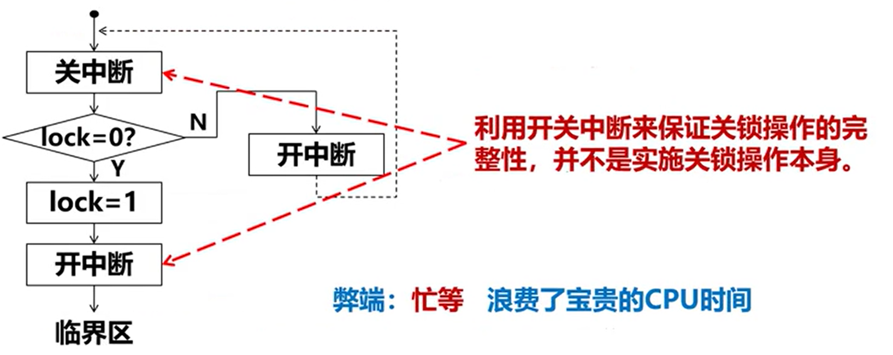
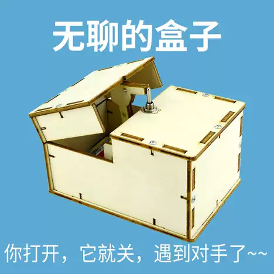
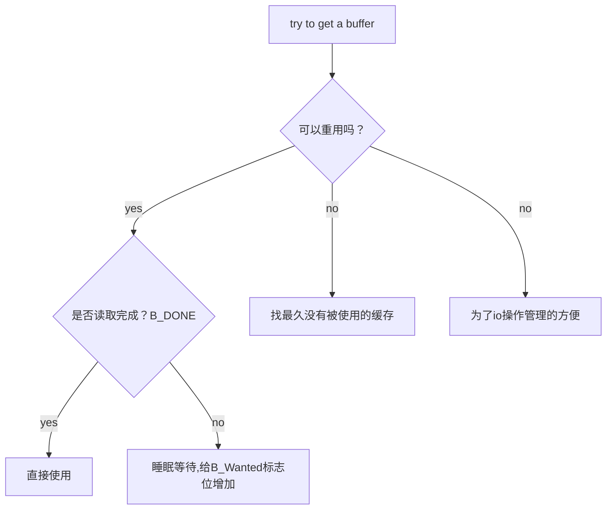
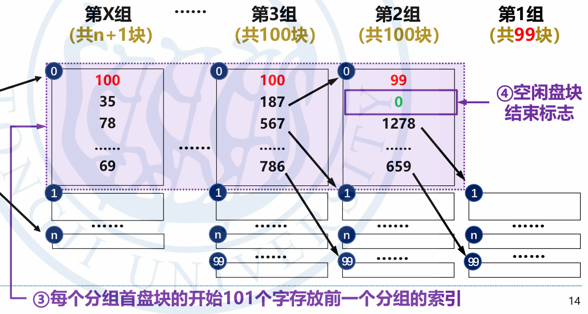

任课老师：Fang
---

# 中断
## 外设控制器
发出中断请求信号的外设控制器是中断源。系统为每一个可以发出中断请求的外设分配一个唯一的标识符，称此标识符为中断号。
## CPU对某个中断请求作出相应后会获得
- 相应的中断处理程序的入口地址
- 中断处理时处理机的状态字
## 中断的硬件机构
2块级联的8259A芯片

## 中断的一般处理流程
- 硬件中断响应
- 保存运行现场
- 中断处理函数
- 恢复现场
- 中断返回
## 中断优先级与中断嵌套
- 每一个中断源有一个中断优先级
- 多个中断有限响应高优先级中断
- 关中断下不响应任何中断
- 开中断下可以被高优先级的中断打断

# 异常
## 类型
- 程序出错
    包括：算术溢出，除数为0，试图执行非法指令，访问到不允许访问的位置，访问存储在磁盘上的指令和数据（可以通过虚拟存储器解决）
- 硬件故障
    奇偶校验错或者掉电等等
- Debug

# 进程
## UnixV6++ 进程类图


# 4 进程管理
## 4.1 进程的调度状态和状态转换


### swtch 函数

```c++
/* 在进程切换的过程中，根本没有用到TSS */
int ProcessManager::Swtch()
{	
	//Diagnose::Write("Start Swtch()\n");
	User& u = Kernel::Instance().GetUser();
	SaveU(u.u_rsav);

	/* 0#进程上台*/
	Process* procZero = &process[0];

	/* 
	 * 将SwtchUStruct()和RetU()作为临界区，防止被中断打断。
	 * 如果在RetU()恢复esp之后，尚未恢复ebp时，中断进入会导致
	 * esp和ebp分别指向两个不同进程的核心栈中位置。 good comment！
	 *
	 * 为什么，由0#进程承担挑选就绪进程上台的操作？
	 * 单从进程切换的角度，完全可以由下台进程挑选就绪进程上台。 但是，考虑时钟中断。
	 * 一秒末的 例行处理，最好系统idle时，其次是在执行应用程序过程中；不可以放在内核执行过程中。
	 * 如何判断？
	 * 内核idle的标志：  0#进程在睡眠态执行idle()子程序。
	 * 看 TimeInterrupt.cpp的Line 82.
	 * 如是，必须由0#进程执行select()。
	 *
	 */
	X86Assembly::CLI();
	SwtchUStruct(procZero);
	/* 原来的宏调用是这样写的   RetU(u0)，u0参数没用到，会引起歧义，删除 */
	RetU();
	X86Assembly::STI();

	/* 挑选最适合上台的进程 */
	Process* selected = Select();
	//Diagnose::Write("Process id = %d Selected!\n", selected->p_pid);

	/* 恢复被保存进程的现场 */
	X86Assembly::CLI();
	SwtchUStruct(selected);

	RetU();
	X86Assembly::STI();

	User& newu = Kernel::Instance().GetUser();

	newu.u_MemoryDescriptor.MapToPageTable();
	
	/*
	 * If the new process paused because it was
	 * swapped out, set the stack level to the last call
	 * to savu(u_ssav).  This means that the return
	 * which is executed immediately after the call to aretu
	 * actually returns from the last routine which did
	 * the savu.
	 *
	 * You are not expected to understand this.
	 */
	if ( newu.u_procp->p_flag & Process::SSWAP )
	{
		newu.u_procp->p_flag &= ~Process::SSWAP;
		aRetU(newu.u_ssav);
	}
	
	/* 
	 * 被fork出的进程在上台之前会在被调度上台时返回1，
	 * 并同时返回到NewProc()执行的地址
	 */
	return 1;
}

```

#### 就绪状态进程的特点
 - p_stat = SRUN
 - p_flag 包含 SLOAD标志
 - p_wchan = 0
当前运行的进程除了有就绪进程的特点以外，还有
 - cpu是当前进程的用户现场
 - cr3 寄存器登记这该进程的地址映射方式 即0x201号页框中的1023号页表项指向了这个进程的ppda区，同时0x202和0x203等记者该用户页表。
 - p_pri >= 100

#### 高优先级睡眠和低优先级睡眠的区别

|高优先级|低优先级|
|-------|---------|
|-100<=p_pri<0|0<=p_pri<100|
|等待快速设备的系统中断|等待低速设备的系统中断（鼠标）|
|SSLEEP|SWAIT|


- 睡眠状态会有
    - p_stat = SSLEEP/SWAIT
    - p_flags  拥有sload 标志位，表示进程在内存当中
    - p_wchan 记录了一个变量的地址
    - p_pri<0

    - 核心栈帧
        |栈帧|
        |--|
        |swait|
        |sleep|
        |外设栈帧|
        |Trap|
        |一次中断响应的栈帧|
- 唤醒之后会有
    - p_stat = SRUN
    - p_wchan = 0
    这个过程由WakeUpAll完成
#### 核心态就绪和用户态就绪

|核心态就绪|用户态就绪|
|-------|---------|
|p_pri<=100|p_pri>=100|
|用于等待io中断，是非抢占调度的结果|由于cpu占用时间过程，是抢占式调度的结果|

因此p_pri重算的过程中，不会重算核心态就绪的p_pri值，因为他们是人工设置得来的。而用户态就绪的是计算而来的。

- 由于系统调用睡眠的进程，它最近一次上台的机会是什么？
 
 当前cpu上的运行进程最近的一次例行调度。

### schedule 函数
#### 如果内存不足以容纳所有的进程？
更换优先级：
低睡>高睡>就绪

低谁和高睡在换出之后不会再换回来，只有到了就绪的状态才会回来。

### newProc 函数
新进程的 p_pri = 0

## 4.2 进程的睡眠与唤醒
- 低优先级睡眠在返回的时候需要进行信号处理和唤醒0号进程


### 睡眠原因不止一个？
- 如果系统中没有定时，进程自行设置定时。Time::Tout <= Time::time 
- 如果发现定时过晚，设置为更早的时间。Time :: Tout > waketime
- 如果发现定时过早，等着到这个闹钟被叫醒的时候改成合适的时间再睡。


```c++
void Process::SetRun()
{
	ProcessManager& procMgr = Kernel::Instance().GetProcessManager();

	/* 清除睡眠原因，转为就绪状态 */
	this->p_wchan = 0;
	this->p_stat = Process::SRUN;
	if ( this->p_pri < procMgr.CurPri )
	{
		procMgr.RunRun++;
	}
	if ( 0 != procMgr.RunOut && (this->p_flag & Process::SLOAD) == 0 )
	{
		procMgr.RunOut = 0;
		procMgr.WakeUpAll((unsigned long)&procMgr.RunOut);
	}
}
void ProcessManager::WakeUpAll(unsigned long chan)
{
	/* 唤醒系统中所有因chan而进入睡眠的进程 */
	for(int i = 0; i < ProcessManager::NPROC; i++)
	{
		if( this->process[i].IsSleepOn(chan) )
		{
			this->process[i].SetRun();
		}
	}
}


int SystemCall::Sys_Sslep()
{
	User& u = Kernel::Instance().GetUser();

	X86Assembly::CLI();

	unsigned int wakeTime = Time::time + u.u_arg[0];	/* sleep(second) */

	/*
	 * 对   if ( Time::tout <= Time::time || Time::tout > wakeTime )  中判断条件的解释：
	 * 1、系统先前设置的所有闹钟均已到期。  其后，第一个设置闹钟的进程看到的是条件 tout <= time成立，将自己的waketime写入tout变量。
	 * 2、系统中，存在闹钟未到期的进程。如果有进程设置闹钟，看到的是条件tout > time，进程比对tout变量和自己的waketime，令tout变量的值是所有进程waketime的最小值。
	 *
	 * 原先的注释：
	 * 此处不可以'wakeTime >= Time::time', 否则极端情况下前一次sleep(sec)刚结束，
	 * 紧接着第二次sleep(0)，会使wakeTime == Time::time == Time::tout，
	 * 而如果此时发生时钟中断恰为一秒末尾，Time::Clock()中Time::time++，
	 * 会导致Time::tout比Time::time小1，永远无法满足Time::time == Time::tout
	 * 的唤醒条件，调用sleep(0)的进程永远睡眠。         The end.
	 *
	 * 原先的注释不对。如果while循环的判断条件是'wakeTime >= Time::time'，执行sleep(0)的进程将把waketime和tout设为上个整数秒。整数秒时钟中断处理程序会time++，之后
	 * 1、如果不再有进程设置新闹钟，系统的闹钟服务就瘫痪了。这是因为， time==tout的条件永远无法满足，时钟中断处理程序不再会唤醒任何因设置了闹钟而入睡的进程。
	 * 2、如果有进程设置新闹钟newWaketime，执行sleep(0)操作的进程以及所有waketime<=newWaketime的进程的唤醒时刻将推迟到newWaketime。
	 *
	 * 现在的闹钟服务正确，执行sleep(0)的进程不会入睡更不会使tout值出现错误。
	 */
	while( wakeTime > Time::time )
	{
		if ( Time::tout <= Time::time || Time::tout > wakeTime )
		{
			Time::tout = wakeTime;
		}
		u.u_procp->Sleep((unsigned long)&Time::tout, ProcessManager::PSLEP);
	}

	X86Assembly::STI();

	return 0;	/* GCC likes it ! */
}
void Process::Sleep(unsigned long chan, int pri)
{
	User& u = Kernel::Instance().GetUser();
	ProcessManager& procMgr = Kernel::Instance().GetProcessManager();

	if ( pri > 0 )
	{
		/* 
		 * 进程在进入低优先权睡眠之前，以及被唤醒之后，如果接收到不可忽略
		 * 的信号，则停止执行Sleep()，通过aRetU()直接跳转回Trap1()函数
		 */
		if ( this->IsSig() )
		{
			/* return确保aRetU()跳回到SystemCall::Trap1()之后立刻执行ret返回指令 */
			aRetU(u.u_qsav);
			return;
		}
		/* 
		* 此处关中断进入临界区，保证进程在设置睡眠原因chan和
		* 改进程状态为SSLEEP之间不会发生切换。
		*/
		X86Assembly::CLI();
		this->p_wchan = chan;
		/* 根据睡眠优先级pri确定进程进入高、低优先权睡眠 */
		this->p_stat = Process::SWAIT;
		this->p_pri = pri;
		X86Assembly::STI();

		if ( procMgr.RunIn != 0 )
		{
			procMgr.RunIn = 0;
			procMgr.WakeUpAll((unsigned long)&procMgr.RunIn);
		}
		/* 当前进程放弃CPU，切换其它进程上台 */
		//Diagnose::Write("Process %d Start Sleep!\n", this->p_pid);
		Kernel::Instance().GetProcessManager().Swtch();
		//Diagnose::Write("Process %d End Sleep!\n", this->p_pid);
		/* 被唤醒之后再次检查信号 */
		if ( this->IsSig() )
		{
			/* return确保aRetU()跳回到SystemCall::Trap1()之后立刻执行ret返回指令 */
			aRetU(u.u_qsav);
			return;
		}
	}
	else
	{
		X86Assembly::CLI();
		this->p_wchan = chan;
		/* 根据睡眠优先级pri确定进程进入高、低优先权睡眠 */
		this->p_stat = Process::SSLEEP;
		this->p_pri = pri;
		X86Assembly::STI();

		/* 当前进程放弃CPU，切换其它进程上台 */
		//Diagnose::Write("Process %d Start Sleep!\n", this->p_pid);
		Kernel::Instance().GetProcessManager().Swtch();
		//Diagnose::Write("Process %d End Sleep!\n", this->p_pid);
	}
}
```

### 在sleep函数当中，为什么这个地方要开中断？

由于是先启动io操作再启动sleep函数。然而如果这个io操作很快，再sleep函数执行到		this->p_wchan = chan;被中断响应设置为中断结束。被setrun后，p_wchan = 0 ，然而，回到断点之后，接着执行p_stat = Process::SWAIT。随后进程就睡在了不明原因的chan上。永远不会被唤醒了。
```c++
		X86Assembly::CLI();
		this->p_wchan = chan;
		/* 根据睡眠优先级pri确定进程进入高、低优先权睡眠 */
		this->p_stat = Process::SWAIT;
		this->p_pri = pri;
		X86Assembly::STI();
```

### 什么时候会修改runrun?
setPri会修改这个值。
```c++
void Process::SetPri()
{
	int priority;
	ProcessManager& procMgr = Kernel::Instance().GetProcessManager();

	priority = this->p_cpu / 16;
	priority += ProcessManager::PUSER + this->p_nice;

	if ( priority > 255 )
	{
		priority = 255;
	}
	if ( priority > procMgr.CurPri )
	{
		procMgr.RunRun++;
	}
	this->p_pri = priority;
}
```
setPri会在如下情况会被重算：
- 整数秒，重算所有用户就绪进程的优先数
- 整数秒，重算当前进程优先数
- 系统调用末尾，重算现运行进程优先数。 

系统调用的末尾重算优先级的目的在于，刷掉核心态下的优先级，回复计算获得的优先数；现运行进程优先级下降，设置Runrun标志位，要求进行进程调度。

## 4.3 进程的创建和中止
### 4.3.1 进程创建的基本流程
-  获得空闲的proc
-  复制父进程的额p_size,p_stat,p_flag,p_uid,p_nice,p_textp
   -  p_textp 代表父子共用了一个代码段
-  设置： p_pri=0;p_time=0;p_pid=新标识符;p_ppid=当前进程（父进程）
   -  p_pri 为0让他更快的进入cpu执行创建的过程。
- 相关计数器的值加一
  - x_count x_ccount
  - 相关资源占用值（file引用属数，ucdir->icount）
- 按照p_size的值为子进程生成一个进程图像。
  - 核心栈一致，用户栈的函数都一样。父子进程的相对虚实地址映射表式一样的。
  - 但是真正的页表不一样，只有代码段的是一样的，还有系统核心栈的值是一样的。0x201号页表，只有最后一项不一样。父子进程的x_daddr的地址是一样的。也就是说，新进程图像的逻辑地址和父进程的逻辑地址是一样的。但是物理地址是不一样的。 

#### 如何让父子进程完成不同的工作？
我们遇到了这样一个问题，在系统所有就绪队列的进程当中，大家的核心栈的栈顶都是一个swtch栈帧，然而，新创建的进程由于直接copy了正在运行的父进程的图像，这就导致它在就绪队列当中，但是它的栈顶是一个NewProc栈帧。
```c++
int ProcessManager::NewProc()
{
	//Diagnose::Write("Start NewProc()\n");
	Process* child = 0;
	for (int i = 0; i < ProcessManager::NPROC; i++ )
	{
		if ( process[i].p_stat == Process::SNULL )
		{
			child = &process[i];
			break;
		}
	}
	if ( !child ) 
	{
		Utility::Panic("No Proc Entry!");
	}

	User& u = Kernel::Instance().GetUser();
	Process* current = (Process*)u.u_procp;
	//Newproc函数被分成两部分，clone仅复制process结构内的数据
	current->Clone(*child);

	/* 这里必须先要调用SaveU()保存现场到u区，因为有些进程并不一定
	设置过 */
	SaveU(u.u_rsav);

	/* 将父进程的用户态页表指针m_UserPageTableArray备份至pgTable */
	PageTable* pgTable = u.u_MemoryDescriptor.m_UserPageTableArray;
	u.u_MemoryDescriptor.Initialize();
	/* 父进程的相对地址映照表拷贝给子进程，共两张页表的大小 */
	if ( NULL != pgTable )
	{
		u.u_MemoryDescriptor.Initialize();
		Utility::MemCopy((unsigned long)pgTable, (unsigned long)u.u_MemoryDescriptor.m_UserPageTableArray, sizeof(PageTable) * MemoryDescriptor::USER_SPACE_PAGE_TABLE_CNT);
	}

	//将先运行进程的u区的u_procp指向new process
	//这样可以在被复制的时候可以直接复制u_procp的
	//地址，在内存不够时，是无法将u区映射到用户区，
	//修改u_procp的地址的
	u.u_procp = child;

	UserPageManager& userPageManager = Kernel::Instance().GetUserPageManager();

	unsigned long srcAddress = current->p_addr;
	unsigned long desAddress = userPageManager.AllocMemory(current->p_size);
	//Diagnose::Write("srcAddress %x\n", srcAddress);
	//Diagnose::Write("desAddress %x\n", desAddress);
	if ( desAddress == 0 ) /* 内存不够，需要swap */
	{
		current->p_stat = Process::SIDL;
		/* 子进程p_addr指向父进程图像，因为子进程换出至交换区需要以父进程图像为蓝本 */
		child->p_addr = current->p_addr;
		SaveU(u.u_ssav);
		this->XSwap(child, false, 0);
		child->p_flag |= Process::SSWAP;
		current->p_stat = Process::SRUN;
	}
	else
	{
		int n = current->p_size;
		child->p_addr = desAddress;
		while (n--)
		{
			Utility::CopySeg(srcAddress++, desAddress++);
		}
	}
	u.u_procp = current;
	/* 
	 * 拷贝进程图像期间，父进程的m_UserPageTableArray指向子进程的相对地址映照表；
	 * 复制完成后才能恢复为先前备份的pgTable。
	 */
	u.u_MemoryDescriptor.m_UserPageTableArray = pgTable;
	//Diagnose::Write("End NewProc()\n");
	return 0;
}

```
父进程，从这里返回的值为0，子进程，利用Swtch函数的返回值1。这样，父子进程就进入了不同的状态。父子进程上返回地址都在newproc当中，但是他们带回来的值是不一样的。

#### fork系统调用
```c++
/*	2 = fork	count = 0	*/
int SystemCall::Sys_Fork()
{
	ProcessManager& procMgr = Kernel::Instance().GetProcessManager();
	procMgr.Fork();

	return 0;	/* GCC likes it ! */
}
void ProcessManager::Fork()
{
	User& u = Kernel::Instance().GetUser();
	Process* child = NULL;;

	/* 寻找空闲的process项，作为子进程的进程控制块 */
	for ( int i = 0; i < ProcessManager::NPROC; i++ )
	{
		if ( this->process[i].p_stat == Process::SNULL )
		{
			child = &this->process[i];
			break;
		}
	}
	if ( child == NULL )
	{
		/* 没有空闲process表项，返回 */
		u.u_error = User::EAGAIN;
		return;
	}

	if ( this->NewProc() )	/* 子进程返回1，父进程返回0 */
	{
		/* 子进程fork()系统调用返回0 */
		u.u_ar0[User::EAX] = 0;
		u.u_cstime = 0;
		u.u_stime = 0;
		u.u_cutime = 0;
		u.u_utime = 0;
	}
	else
	{
		/* 父进程进程fork()系统调用返回子进程PID */
		u.u_ar0[User::EAX] = child->p_pid;
	}

	return;
}
```
应当注意的是，在一个进程刚刚创建的时候p_pri=0。然而，在fork返回之后，由于系统调用结束会产生一个setpri的pri值重算。这样当子进程被重新加入就绪队列之后，父子进程上台机会是相等的。
### 4.3.2 进程的终止
父进程无法设置好正确的时钟去等待子进程的结束时间。因此，父进程会等到子进程活过来再把自己杀掉。父进程会睡在子进程未完成这个睡眠的原因上。
```c++
int wait(int* status)	/* 获取子进程返回的Return Code */
{
	int res;
	__asm__ __volatile__ ( "int $0x80":"=a"(res):"a"(7),"b"(status));
	if ( res >= 0 )
		return res;
	return -1;
}
```
#### 进程终止状态
```c++
int exit(int status)	/* 子进程返回给父进程的Return Code */
{
	int res;
	__asm__ __volatile__ ( "int $0x80":"=a"(res):"a"(1),"b"(status));
	if ( res >= 0 )
		return res;
	return -1;
}
```

```c++
void Process::Exit()
{
	int i;
	User& u = Kernel::Instance().GetUser();
	ProcessManager& procMgr = Kernel::Instance().GetProcessManager();
	OpenFileTable& fileTable = *Kernel::Instance().GetFileManager().m_OpenFileTable;
	InodeTable& inodeTable = *Kernel::Instance().GetFileManager().m_InodeTable;

	Diagnose::Write("Process %d is exiting\n",u.u_procp->p_pid);
	/* Reset Tracing flag */
	u.u_procp->p_flag &= (~Process::STRC);

	/* 清除进程的信号处理函数，设置为1表示不对该信号作任何处理 */
	for ( i = 0; i < User::NSIG; i++ )
	{
		u.u_signal[i] = 1;
	}

	/* 关闭进程打开文件 */
	for ( i = 0; i < OpenFiles::NOFILES; i++ )
	{
		File* pFile = NULL;
		if ( (pFile = u.u_ofiles.GetF(i)) != NULL )
		{
			fileTable.CloseF(pFile);
			u.u_ofiles.SetF(i, NULL);
		}
	}
	/*  访问不存在的fd会产生error code，清除u.u_error避免影响后续程序执行流程 */
	u.u_error = User::NOERROR;

	/* 递减当前目录的引用计数 */
	inodeTable.IPut(u.u_cdir);

	/* 释放该进程对共享正文段的引用 */
	if ( u.u_procp->p_textp != NULL )
	{
		u.u_procp->p_textp->XFree();
		u.u_procp->p_textp = NULL;
	}

	/* 将u区写入交换区，等待父进程做善后处理 */
	SwapperManager& swapperMgr = Kernel::Instance().GetSwapperManager();
	BufferManager& bufMgr = Kernel::Instance().GetBufferManager();
	/* u区的大小不会超过512字节，所以只写入ppda区的前512字节，已囊括u结构的全部信息 */
	int blkno = swapperMgr.AllocSwap(BufferManager::BUFFER_SIZE);
	if ( NULL == blkno )
	{
		Utility::Panic("Out of Swapper Space");
	}
	Buf* pBuf = bufMgr.GetBlk(DeviceManager::ROOTDEV, blkno);
	Utility::DWordCopy((int *)&u, (int *)pBuf->b_addr, BufferManager::BUFFER_SIZE / sizeof(int));
	bufMgr.Bwrite(pBuf);

	/* 释放内存资源 */
	u.u_MemoryDescriptor.Release();
	Process* current = u.u_procp;
	UserPageManager& userPageMgr = Kernel::Instance().GetUserPageManager();
	userPageMgr.FreeMemory(current->p_size, current->p_addr);
	current->p_addr = blkno;
	current->p_stat = Process::SZOMB;

	/* 唤醒父进程进行善后处理 */
	for ( i = 0; i < ProcessManager::NPROC; i++ )
	{
		if ( procMgr.process[i].p_pid == current->p_ppid )
		{
			procMgr.WakeUpAll((unsigned long)&procMgr.process[i]);
			break;
		}
	}
	/* 没找到父进程 */
	if ( ProcessManager::NPROC == i )
	{
		current->p_ppid = 1;
		procMgr.WakeUpAll((unsigned long)&procMgr.process[1]);
	}

	/* 将自己的子进程传给自己的父进程 */
	for ( i = 0; i < ProcessManager::NPROC; i++ )
	{
		if ( current->p_pid == procMgr.process[i].p_ppid )
		{
			Diagnose::Write("My:%d 's child %d passed to 1#process",current->p_pid,procMgr.process[i].p_pid);
			procMgr.process[i].p_ppid = 1;
			if ( procMgr.process[i].p_stat == Process::SSTOP )
			{
				procMgr.process[i].SetRun();
			}
		}
	}

	procMgr.Swtch();
}
```

#### wait 函数
```c++

void ProcessManager::Wait()
{
	int i;
	bool hasChild = false;
	User& u = Kernel::Instance().GetUser();
	SwapperManager& swapperMgr = Kernel::Instance().GetSwapperManager();
	BufferManager& bufMgr = Kernel::Instance().GetBufferManager();
	
	Diagnose::Write("Process %d finding dead son. They are ",u.u_procp->p_pid);
	while(true)
	{
		for ( i = 0; i < NPROC; i++ )
		{
			if ( u.u_procp->p_pid == process[i].p_ppid )
			{
				Diagnose::Write("Process %d (Status:%d)  ",process[i].p_pid,process[i].p_stat);
				hasChild = true;
				/* 睡眠等待直至子进程结束 */
				if( Process::SZOMB == process[i].p_stat )
				{
					/* wait()系统调用返回子进程的pid */
					u.u_ar0[User::EAX] = process[i].p_pid;

					process[i].p_stat = Process::SNULL;
					process[i].p_pid = 0;
					process[i].p_ppid = -1;
					process[i].p_sig = 0;
					process[i].p_flag = 0;

					/* 读入swapper中子进程u结构副本 */
					Buf* pBuf = bufMgr.Bread(DeviceManager::ROOTDEV, process[i].p_addr);
					swapperMgr.FreeSwap(BufferManager::BUFFER_SIZE, process[i].p_addr);
					User* pUser = (User *)pBuf->b_addr;

					/* 把子进程的时间加到父进程上 */
					u.u_cstime += pUser->u_cstime +	pUser->u_stime;
					u.u_cutime += pUser->u_cutime + pUser->u_utime;

					int* pInt = (int *)u.u_arg[0];
					/* 获取子进程exit(int status)的返回值 */
					*pInt = pUser->u_arg[0];

					/* 如果此处没有Brelse()系统会发生什么-_- */
					bufMgr.Brelse(pBuf);
					Diagnose::Write("end wait\n");
					return;
				}
			}
		}
		if (true == hasChild)
		{
			/* 睡眠等待直至子进程结束 */
			Diagnose::Write("wait until child process Exit! ");
			u.u_procp->Sleep((unsigned long)u.u_procp, ProcessManager::PWAIT);
			Diagnose::Write("end sleep\n");
			continue;	/* 回到外层while(true)循环 */
		}
		else
		{
			/* 不存在需要等待结束的子进程，设置出错码，wait()返回 */
			u.u_error = User::ECHILD;
			break;	/* Get out of while loop */
		}
	}
}
```
## 4.4 进程通信

- unix当中其实没有过多地提及进程通讯相关的内容。
- 对于只允许一个进程使用的资源称之为`临界资源`。因此程序不能运行与时序相关的错误。每一个进程在使用临界资源之前，要检查是否被其他进程使用。同时要允许其他进程互斥地使用临界资源。
	例如打印机，同一个时刻，只有一个进程是被允许使用打印机的。
- 原则：
  - 空闲让进
  - 忙则等待
  - 有限等待
  - 让权等待
- 同时我们的关键设计点在于：
  - 进入时检查资源是否被占用
  - 进入后为资源上锁
  - 退出时为资源解锁，同时通知等待这个资源的进程
### 4.4.1 管理的方法
#### 开关中断
在单处理机系统中，借用中央处理机种的硬件中断开关位作为临界区的锁。
中断只关闭了抢占调度，没有关闭非抢占调度。
当临界区比较长的时候，其他进程会饥饿
- 这个方式一般适合系统内核的进程互斥
#### 锁变量
为每个临界资源设置一个锁变量lock
```c++
while(lock==1)
	;
lock =1 ;
//使用临界资源
lock = 0；
```
然而缺点在于，如果一个进程进行完上面的while循环之后，出现了进程调度。会有另一个进程同时看到lock=0 这样两个进程都会看到lock=0 这样会导致出现问题。

我们引入开关中断的机制，然而这不符合让权等待的原则。



### 4.4.2 dijistra方法

```c
typedef struct{
    int value;
    struct process_control_block *list;

}semaphores;
wait(semaphores *S){
    S->value--;
    if (S->value<0) block(S->list);
}
signal(semaphore *S){
    S->value++;
    if(S->value<=0) wakeup(S->list);
}//这就是所谓的P操作
initail(semaphore *S){
	list=NULL;
	value = count;//这个地方的count代表对应临界资源的总量
}//这就是所谓的V操作
```
### 4.4.2 进程同步
同步信号量

```c
typedef struct{
    int value;
    struct process_control_block *list;

}semaphores;
receive (semaphores *S){
    S->value--;
    if (S->value<0) block(S->list);
}
send (semaphore *S){
    S->value++;
    if(S->value<=0) wakeup(S->list);
}//这就是所谓的P操作
initail(semaphore *S){
	list=NULL;
	value = 0;//这个地方的count代表对应临界资源的总量
}//这就是所谓的V操作
```

- 互斥是同步的一种特殊情况？ 
	正确地，因为其他进程在等这个

#### 生产者消费者问题
多个进程之间共享存储。（这个好像计算机网络当中的数据链路层停等法的协议）
1. 生产者和和消费者通过缓冲存储区发生联系
2. 两个进程共同使用一个指针 ，生产者在放入一个产品前，需要确保有一个空的位置；消费者在取走一个产品后，发送一个有一个空单元的消息。
3. 消费者在取走一个满单元前，需要有一个满单元的信号量，生产者在放入一个单元后，发送一个有一个满单元的信息

```c++
// 共享缓冲区
buffer: 固定大小的队列（大小 = N）
// 信号量
mutex = 1           // 互斥信号量，确保缓冲区操作互斥
empty = N           // 空闲缓冲区数量（初始为N）
full  = 0           // 已占用的缓冲区数量（初始为0）
producer() {
    while (true) {
        item = produce_item()// 1. 生产数据项
        wait(empty)// 2. 等待空闲缓冲区
        wait(mutex)// 3. 进入临界区（操作缓冲区）
        buffer.insert(item) // 4. 将数据放入缓冲区
        signal(mutex)// 5. 离开临界区
        signal(full) // 6. 增加已占用缓冲区计数
    }
}


consumer() {
    while (true) {
        wait(full)// 1. 等待缓冲区有数据
        wait(mutex)// 2. 进入临界区
        item = buffer.remove()// 3. 从缓冲区取出数据
        signal(mutex)        // 4. 离开临界区
        signal(empty)         // 5. 增加空闲缓冲区计数
        consume_item(item)        // 6. 消费数据项
    }
}
```

- 为什么不能先进行互斥等待，再进行缓冲区有数据等待，

```c++
// 共享缓冲区
buffer: 固定大小的队列（大小 = N）
// 信号量
mutex = 1           // 互斥信号量，确保缓冲区操作互斥
empty = N           // 空闲缓冲区数量（初始为N）
full  = 0           // 已占用的缓冲区数量（初始为0）
producer() {
    while (true) {
        item = produce_item()// 1. 生产数据项
		wait(mutex)// 3. 进入临界区（操作缓冲区）
        wait(empty)// 2. 等待空闲缓冲区
        buffer.insert(item) // 4. 将数据放入缓冲区
		signal(full) // 6. 增加已占用缓冲区计数
        signal(mutex)// 5. 离开临界区
    }
}


consumer() {
    while (true) {
		wait(mutex)// 2. 进入临界区
        wait(full)// 1. 等待缓冲区有数据
        item = buffer.remove()// 3. 从缓冲区取出数据
        signal(mutex)        // 4. 离开临界区
        consume_item(item)        // 6. 消费数据项
		signal(empty)         // 5. 增加空闲缓冲区计数
    }
}
```
原因是，如果这个时候，资源量满，这个时候producer上台，由于empty信号不满足陷入睡眠，这个时候consumer没有办法上台消费一个产品让producer上台，因为mutex信号量被producer占用了。这个时候，两个进程陷入死锁。

一般情况下，同步信号量在外，互斥信号量在内。

#### 理发师问题

开关被拨亮了意味着有人来找，拨关意味着服务完成。
```c++
#define CHAIRS 5

semaphore customers = 0;
semaphore barbers = 0;
semaphore mutex = 1; //互斥信号量保证waiting的访问
int waiting = 0;

void barber() {
    while (true) {
        wait(customers);  // 理发师需要有顾客等候的消息
        wait(mutex);
        waiting--;
        signal(mutex);// 理发
		signal(barbers);  // 通知可以来剪发 #@#
        cut_hair();
    }
}

void customer() {
    wait(mutex);
    if (waiting < CHAIRS) {
        waiting++;
        signal(customers);//顾客来了要告诉理发师有人在等
        signal(mutex);
        wait(barbers);  // 等待理发师
        get_haircut();
    } else {
        signal(mutex);
        leave_shop();
    }
}
```
不必等到cut_hair()结束之后，再进行释放，因为这个时候无法有新的客户来进入等待队列。


#### 读者写者问题

读操作是可以并行执行的，而写操作是串行执行的。
读进程优先的控制策略
```c++
semaphore wmutex;
semaphore rmutex;
int readcount=0;

void writer()
{
	P(wmutex);
	WRITEUNIT();
	V(wmutex);
}

void reader(){
	P(rmutex);
	readcount++;
	if(readcount==1) P(wmutex);
	V(rumtex);
	READUNIT();
	P(rmutex);
	readcount--;
	if(readcount == 0) V(wmutex); //不允许脏读
	V(rmutex);
}
```
然而，如果有太多的读进程，会导致写进程饿死。


一种相对公平的策略的设计：
```c++
semaphore wrmutex;
semaphore wmutex;
semaphore rmutex;
int readcount=0;
void reader()
{
	P(wrmutex);
	V(wrmutex);

	P(rmutex)
	if(readcount==0) P(wmutex);
	readcount++;
	V(rmutex);

	READUNIT();

	P(rmutex);
	readcount--;
	if(readcount==0) V(wmutex);
	V(rmutex);

	
}
void writer()
{
	P(wrmutex);
	P(wmutex);

	WRITEUNIT();

	V(wmutex);
	V(wrmutex);
}
```


## 4.5 并发进程

### swap函数

```c++
	enum BufFlag	/* b_flags中标志位 */
	{
		B_WRITE = 0x1,		/* 写操作。将缓存中的信息写到硬盘上去 */
		B_READ	= 0x2,		/* 读操作。从盘读取信息到缓存中 */
		B_DONE	= 0x4,		/* I/O操作结束 */
		B_ERROR	= 0x8,		/* I/O因出错而终止 */
		B_BUSY	= 0x10,		/* 相应缓存正在使用中 */
		B_WANTED = 0x20,	/* 有进程正在等待使用该buf管理的资源，清B_BUSY标志时，要唤醒这种进程 */
		B_ASYNC	= 0x40,		/* 异步I/O，不需要等待其结束 */
		B_DELWRI = 0x80		/* 延迟写，在相应缓存要移做他用时，再将其内容写到相应块设备上 */
	};
    bool Swap(int blkno, unsigned long addr, int count, enum Buf::BufFlag flag);
	/* Swap I/O 用于进程图像在内存和盘交换区之间传输
	 * blkno: 交换区中盘块号；addr:  进程图像(传送部分)内存起始地址；
     * count: 进行传输字节数，byte为单位；传输方向flag: 内存->交换区 or 交换区->内存。 */
bool BufferManager::Swap(int blkno, unsigned long addr, int count, enum Buf::BufFlag flag)
{
	User& u = Kernel::Instance().GetUser();

	X86Assembly::CLI();

	/* swbuf正在被其它进程使用，则睡眠等待 */
	while ( this->SwBuf.b_flags & Buf::B_BUSY )
	{
		this->SwBuf.b_flags |= Buf::B_WANTED;
		u.u_procp->Sleep((unsigned long)&SwBuf, ProcessManager::PSWP);
	}

	this->SwBuf.b_flags = Buf::B_BUSY | flag;
	this->SwBuf.b_dev = DeviceManager::ROOTDEV;
	this->SwBuf.b_wcount = count;
	this->SwBuf.b_blkno = blkno;
	/* b_addr指向要传输部分的内存首地址 */
	this->SwBuf.b_addr = (unsigned char *)addr;
	this->m_DeviceManager->GetBlockDevice(Utility::GetMajor(this->SwBuf.b_dev)).Strategy(&this->SwBuf);

	/* 关中断进行B_DONE标志的检查 */
	X86Assembly::CLI();
	/* 这里Sleep()等同于同步I/O中IOWait()的效果 */
	while ( (this->SwBuf.b_flags & Buf::B_DONE) == 0 )
	{
		u.u_procp->Sleep((unsigned long)&SwBuf, ProcessManager::PSWP);
	}

	/* 这里Wakeup()等同于Brelse()的效果 */
	if ( this->SwBuf.b_flags & Buf::B_WANTED )
	{
		Kernel::Instance().GetProcessManager().WakeUpAll((unsigned long)&SwBuf);
	}
	X86Assembly::STI();
	this->SwBuf.b_flags &= ~(Buf::B_BUSY | Buf::B_WANTED);

	if ( this->SwBuf.b_flags & Buf::B_ERROR )
	{
		return false;
	}
	return true;
}
```
- 一次和磁盘的交互都是512字节，因为一个盘块是512字节，因此count应当小于等于512字节
### 发生内存交换的情况
#### 当内存空间不足以装下所有就绪进程

```c++
	/* 
	 * 进程图像内存和交换区之间的传送。如果有进程想要换入内存，而内存
	 * 中无法找到能够容纳该进程的连续内存区，则依次将低优先权睡眠状态(SWAIT)-->
	 * 暂停状态(SSTOP)-->高优先权睡眠状态(SSLEEP)-->就绪状态(SRUN)进程换出，
	 * 直到腾出足够内存空间将想要换入的进程调入内存
	 */
	void Sched();
    void ProcessManager::Sched()
{
	Process* pSelected;
	User& u = Kernel::Instance().GetUser();
	int seconds;
	unsigned int size;
	unsigned long desAddress;

	/* 
	 * 选择在交换区驻留时间最长，处于就绪状态的进程换入
	 */
	goto loop;

sloop:
	this->RunIn++;
	u.u_procp->Sleep((unsigned long)&RunIn, ProcessManager::PSWP);

loop:
	X86Assembly::CLI();
	seconds = -1;
	for ( int i = 0; i < ProcessManager::NPROC; i++ )
	{
		if ( this->process[i].p_stat == Process::SRUN 
        && (this->process[i].p_flag & Process::SLOAD) == 0 
        && this->process[i].p_time > seconds )
		{
			pSelected = &(this->process[i]);
			seconds = pSelected->p_time;
		}
	}

	/* 如果没有符合条件的进程，0#进程睡眠等待有需要换入的进程 */
	if ( -1 == seconds )
	{
		this->RunOut++;
		u.u_procp->Sleep((unsigned long)&RunOut, ProcessManager::PSWP);
		goto loop;
	}

	/* 如果有进程满足条件，需要换入，则检查是否有足够内存 */
	X86Assembly::STI();
	/* 计算进程换入需要的内存大小 */
	size = pSelected->p_size;
	/* 
	 * 如果存在共享正文段，但是没有进程图像在内存中，引用该正文段的进程，
	 * 即共享正文段不再内存中，换入时需要读入正文段在交换区中的副本
	 */
	if ( pSelected->p_textp != NULL && 0 == pSelected->p_textp->x_ccount )
	{
		size += pSelected->p_textp->x_size;
	}
	/* 如果内存分配成功，则进行实际换入操作 */
	desAddress = Kernel::Instance().GetUserPageManager().AllocMemory(size);
	if ( NULL != desAddress )
	{
		goto found2;
	}

	/*
	 * 分配内存失败情况下，换出内存中进程，腾出空间。
	 * 换出原则：从易到难；依次将低优先权睡眠状态(SWAIT)-->
	 * 暂停状态(SSTOP)-->高优先权睡眠状态(SSLEEP)-->就绪状态(SRUN)进程换出。
	 */
	X86Assembly::CLI();
	for ( int i = 0; i < ProcessManager::NPROC; i++ )
	{

		bool pFlagIsSLOAD = (this->process[i].p_flag & (int(Process::SSYS) | int(Process::SLOCK) | int(Process::SLOAD))) == int(Process::SLOAD);

		bool statIsSWAITOrSSTOP = (this->process[i].p_stat == Process::SWAIT || this->process[i].p_stat == Process::SSTOP);

		if (pFlagIsSLOAD && statIsSWAITOrSSTOP)
		{
			goto found1;
		}
	}

	/* 
	 * 在换出高优先权睡眠状态(SSLEEP)、就绪状态(SRUN)进程而腾出内存之前，
	 * 检查待换入进程在交换区驻留时间是否已达到3秒，低于则不予换入
	 */
	if ( seconds < 3 )
	{
		goto sloop;
	}

	seconds = -1;
	for ( int i = 0; i < ProcessManager::NPROC; i++ )
	{

		bool pFlagIsSLOAD = (this->process[i].p_flag & (int(Process::SSYS) | int(Process::SLOCK) | int(Process::SLOAD))) == int(Process::SLOAD);
		bool pStatIsSWAITOrSSTOP = this->process[i].p_stat == Process::SWAIT || this->process[i].p_stat == Process::SSTOP;

		if ( pFlagIsSLOAD && pStatIsSWAITOrSSTOP && pSelected->p_time > seconds ) {
			pSelected = &(this->process[i]);
			seconds = pSelected->p_time;
		}
	}

	/* 如果要换出SSLEEP、SRUN状态进程，先检查该进程驻留内存时间是否超过2秒，否则不予换出 */
	if ( seconds < 2 )
	{
		goto sloop;
	}

	/* 换出pSelected指向的被选中进程 */
found1:
	X86Assembly::STI();
	pSelected->p_flag &= ~Process::SLOAD;
	this->XSwap(pSelected, true, 0);
	/* 腾出内存空间后再次尝试换入进程 */
	goto loop;

	/* 已经分配好足够的内存，进行实际的换入操作 */
found2:
	BufferManager& bufMgr = Kernel::Instance().GetBufferManager();
	/* 
	* 如果存在共享正文段，但是没有进程图像在内存中，引用该正文段的进程，
	* 即共享正文段不再内存中，换入时需要读入正文段在交换区中的副本
	*/
	if ( pSelected->p_textp != NULL )
	{
		Text* pText = pSelected->p_textp;
		if ( pText->x_ccount == 0 )
		{
			/* 因为共享正文段，和进程ppda、数据段、堆栈段在交换区中是分开存放的，所以先换入共享正文段 */
			if ( bufMgr.Swap(pText->x_daddr, desAddress, pText->x_size, Buf::B_READ) == false )
			{
				goto err;
			}
			/* 共享正文段在内存中的起始地址 */
			pText->x_caddr = desAddress;
			desAddress += pText->x_size;
		}
		pText->x_ccount++;
	}
	/* 换入剩余部分图像：ppda、数据段、堆栈段 */
	if ( bufMgr.Swap(pSelected->p_addr /* blkno */, desAddress, pSelected->p_size, Buf::B_READ) == false )
	{
		goto err;
	}
	Kernel::Instance().GetSwapperManager().FreeSwap(pSelected->p_size, pSelected->p_addr /* blkno */);
	pSelected->p_addr = desAddress;
	pSelected->p_flag |= Process::SLOAD;
	pSelected->p_time = 0;
	goto loop;

err:
	Utility::Panic("Swap Error");
}
```
- 每次时钟中断，p_time 都会加一，这样sched会按照p_time从小到大的顺序一次把就绪进程移动到磁盘交换区上。
#### 进程图像的换入
- 如果有代码段，判断代码段是否需要进入内存，如果需要进入内存，要调用swap函数，并把x_ccount++
- 随后释放磁盘上进程图像可交换部分所占的空间，把进程图像也搬到内存当中
- 修改换入进程的p_addr p_flag 加上SLOAD 并设置p_time =0  
- 结束之后，代码段的x_daddr会保留，x_caddr被正确赋值能够在内存上找到代码段。

0# 进程负责一个死循环去维护上面的进程保证他们能够不停的执行。只要0#进程在台上，就会一直去查找是否有就绪的进程可以换入，如果没有，那么去sleep(RunOut,-100)，等随后由于这个原因而唤醒。在setRun函数当中，一个进程发现自己的图像不再内存上，会唤醒0#进程来换入自己的进程。

#### 换入进程发现没有多余的空间
原则：
- 无SSYS 和 SLOCK 标志位
- 先换出低睡进程 SWAIT
- 对于所有的高睡进程，以及就绪进程，把这两类进程中最久没有被调用的进程换出。 SLEEP\|SRUN

```c++
	/*
	 * 将进程从内存换出至磁盘交换区上
	 * pProcess: 指向要换出的进程
	 * bFreeMemory: 是否释放进程图像占据的内存
	 * size: 除共享正文段外，进程可交换部分图像长度；参数size为0时，直接使用p_size
	 */
	void XSwap(Process* pProcess, bool bFreeMemory, int size);
void ProcessManager::XSwap( Process* pProcess, bool bFreeMemory, int size )
{
	if ( 0 == size)
	{
		size = pProcess->p_size;
	}

	/* blkno记录分配到的交换区起始扇区号 */
	int blkno = Kernel::Instance().GetSwapperManager().AllocSwap(pProcess->p_size);
	if ( 0 == blkno )
	{
		Utility::Panic("Out of Swapper Space");
	}
	/* 递减进程图像在内存中，且引用该正文段的进程数 */
	if ( pProcess->p_textp != NULL )
	{
		pProcess->p_textp->XccDec();
	}
	/* 上锁，防止同一进程图像被重复换出 */
	pProcess->p_flag |= Process::SLOCK;
	if ( false == Kernel::Instance().GetBufferManager().Swap(blkno, pProcess->p_addr, size, Buf::B_WRITE) )
	{
		Utility::Panic("Swap I/O Error");
	}
	if ( bFreeMemory )
	{
		Kernel::Instance().GetUserPageManager().FreeMemory(size, pProcess->p_addr);
	}
	/* 把进程图像在交换区起始扇区号记录在p_addr中，SLOAD是0、进程是盘交换区上的进程了 */
	pProcess->p_addr = blkno;
	pProcess->p_flag &= ~(Process::SLOAD | Process::SLOCK);
	/* 最近一次被换入或换出以来，在内出或交换区驻留的时间长度清零 */
	pProcess->p_time = 0;

	if ( this->RunOut )
	{
		this->RunOut = 0;
		Kernel::Instance().GetProcessManager().WakeUpAll((unsigned long)&RunOut);
	}
}
```
- 减少x_ccount的值
- 上锁防止被重复换出
- 运行到发现没有进程可以调出，sleep(&runin,-100); 其他进程再sleep函数的时候，就要让0#进程试试能不能把这个进程去换出，这个时候要求换出的进程p_time值要大于2，换入的进程p_time值要大于3
#### 内存空间不足以存放新进程

```c++
//这段代码来自于Newproc
	if ( desAddress == 0 ) /* 内存不够，需要swap */
	{
		current->p_stat = Process::SIDL;
		/* 子进程p_addr指向父进程图像，因为子进程换出至交换区需要以父进程图像为蓝本 */
		child->p_addr = current->p_addr;
		SaveU(u.u_ssav);
		this->XSwap(child, false, 0);
		child->p_flag |= Process::SSWAP;
		current->p_stat = Process::SRUN;
	}
```
- 父进程执行Xswap，二次保存的ssav的结果，栈顶是newproc指针的结果。于是子进程应该使用ssav的newproc栈帧回到自己的执行状态。
- 子进程有SSWAP标志位，要用ssav如替换rsav把无用的核心栈栈帧刷掉。
#### 内存空间不足以扩展自己的图像
```c++
void Process::Expand(unsigned int newSize)
{
	UserPageManager& userPgMgr = Kernel::Instance().GetUserPageManager();
	ProcessManager& procMgr = Kernel::Instance().GetProcessManager();
	User& u = Kernel::Instance().GetUser();
	Process* pProcess = u.u_procp;

	unsigned int oldSize = pProcess->p_size;
	p_size = newSize;
	unsigned long oldAddress = pProcess->p_addr;
	unsigned long newAddress;

	/* 如果进程图像缩小，则释放多余的内存 */
	if ( oldSize >= newSize )
	{
		userPgMgr.FreeMemory(oldSize - newSize, oldAddress + newSize);
		return;
	}

	/* 进程图像扩大，需要寻找一块大小newSize的连续内存区 */
	SaveU(u.u_rsav);
	newAddress = userPgMgr.AllocMemory(newSize);
	/* 分配内存失败，将进程暂时换出到交换区上 */
	if ( NULL == newAddress )
	{
		SaveU(u.u_ssav);
		procMgr.XSwap(pProcess, true, oldSize);
		pProcess->p_flag |= Process::SSWAP;
		procMgr.Swtch();
		/* no return */
	}
	/* 分配内存成功，将进程图像拷贝到新内存区，然后跳转到新内存区继续运行 */
	pProcess->p_addr = newAddress;
	for ( unsigned int i = 0; i < oldSize; i++ )
	{
		Utility::CopySeg(oldAddress + i, newAddress + i);
	}

	/* 释放原来占用的内存区 */
	userPgMgr.FreeMemory(oldSize, oldAddress);
	
	X86Assembly::CLI();
	SwtchUStruct(pProcess);
	RetU();
	X86Assembly::STI();

	u.u_MemoryDescriptor.MapToPageTable();
}
```
发现图像空间不够的时候，给自己一个SSWAP标志位，把自己的整体和自己的扩展部分当成一个整体放在盘交换区上，像是一个刚刚创建的子进程一样归来。
### 神秘的0号进程
可以再睡眠中参与swtch函数的调度，梦游说是.
然而，中间这一棒只能由0号进程来完成，只有它能够自然醒。

# 5 设备管理

## 5.1 硬件
### 5.1.1 设备管理管什么？
- 按照使用特性区分：
	- 存储设备
	- 输入/输出设备
- 按照设备的传输速率区分：
	- 低速设备：键鼠，语音输入输出
	- 中速设备：行式打印机，激光打印机
	- 高速设备：磁带磁盘光盘
- 按照信息交换单位进行分类：
	- 块设备：DMA控制器，每次的读写以数据块位单位
	- 输入输出设备：键盘鼠标投影仪，打印机balabala
- 按照设备共享属性区分：
	- 独占设备 临界资源
	- 共享设备 允许多个进程并发使用
	- 虚拟设备 把独占资源变成一个共享设备，让所有的打印信息成为队列。

### 5.1.2 设备控制器
设备控制不能让cpu来干，必须把这个事情交给设备器完成
由这个控制器完成与外设的交互。
- cpu与设备控制器
	- 接收识别命令
	- 缓存：缓存解决的是cpu与外设速率不匹配的问题。
	- 报告问题
	- 差错控制
	- 地址识别，一个设备控制器管理多个设备，通过地址进行区分
- 设备控制器与外设
	- 数据信号：双向，有缓存
	- 控制信号：控制器要求设备完成相关操作
	- 状态信号：当前外设正在干啥

### 5.1.3 通道
只会做I/O操作的协处理器，cpu生成一个只包含io操作的指令，让通道控制器完成所有内容，让通道控制器自己去内存读数据写到cpu指定的位置。
由通道完成对于设备控制器的操作。

可以有多个通道对同一设备控制器完成控制，完成冗余控制。

## 5.2 软件

中断，驱动，I/O接口

控制层由下到上依次位：硬件，中断处理程序，设备驱动程序，设备无关软件，用户进程。
### 5.2.1 设备驱动程序

- 接收上层软件发来的抽象命令和参数，转换为具体I/O操作要求；
- 检查I/O请求合法性，了解设备状态，传递参数，设置设备工作方式
- 发出I/O命令。（空闲，启动；忙碌，等待）

！！ 系统中没有一个进程始终为io服务，都是通过系统调用来完成

### 5.2.2 设备无关程序
能够把需要翻译成驱动程序看得懂的程序。
- 逻辑设备名到物理设备名的映射，确定相应物理设备的驱动程序
- 设备的分配和释放
- 设备保护，禁止用户直接访问设备
- 缓冲管理与差错控制
- 向用户层软件提供统一接口

优势：
- 设备分配灵活
- 易于I/O重定向

#### 逻辑设备到物理设备的映射
LUT 表 Logical Unit Tables 用于设备的名映射。
例如，命令行控制下
```shell
./proc > log
```
这个过程当中，逻辑名没有变，但是物理名变成了这个文件。每个用户一张LUT表。

#### 设备的分配和释放
进程首先向设备管理程序提出资源申请，然后，由设备分配程序根据设备的固有属性（独占设备、共享设备、可虚拟设备），相应的分配算法（先来先服务、优先级）和系统安全性考虑（死锁？）为进程分配资源（设备和控制器），形成一条数据传输通路。如果资源暂时无法获得，进程将被放入相应的资源等待队列。

依次获得设备，设备控制器，通道，完成所有ai操作的可能性。

#### 缓存
- 缓和cpu速度和io之间的速率不匹配
- 减少cpu的中断频率
- 提高cpu和io之间的并行性
 缓存可以起到数据拷贝的作用。

使用缓冲池完成这个过程

#### 虚拟设备
采用假脱机技术（Simultaneous Peripheral Operating On Line）
放到硬盘当中的队列，让打印机慢慢操作。

## 5.3 磁盘存储器管理
磁盘存储器是由磁盘、驱动器机构和控制器三部分构成
- 磁盘：在铝合金盘或塑料盘上的一层磁性材料作为信息存储媒体
	- 在大容量磁盘中，一个驱动机构上安装由若干个盘片组成的盘组
	- 数据是按柱面来存放的，同一柱面上各磁道放满后，再存到下一柱
	- 盘地址空间是三维地址：< 柱面 c,  磁道t , 块号s> 
- 驱动器机构：读写磁头、可移动磁头臂以及驱动磁盘转动的机构
- 控制器：包括控制读写电路、驱动磁头臂移动和磁盘转动的控制电路等。

文件系统把文件地址交给设备管理器，设备管理器把它转化为盘空间地址。

### 5.3.1 磁盘调度算法

磁盘寻道时间：$$Ta = Ts_{寻道时间} + Tr_{旋转延迟时间} + Tt_{数据传送时间}$$

#### FCFS算法
朴素的先来先服务（First-Come, First-Served）算法，是最基础、最简单的磁盘调度算法。

**核心原理**：按照磁盘I/O请求到达的先后顺序依次处理，完全遵循“先来先服务”的排队规则，不考虑请求所在的磁道位置。

**特点**：
1.  实现简单，无需复杂的磁道位置计算和排序，系统开销小；
2.  公平性高，每个请求都能按到达顺序被处理，不会出现饥饿现象；
3.  效率较低，尤其是当请求磁道分布较为分散时，磁头会在磁道间频繁往返移动（“磁头抖动”），导致平均寻道时间过长，磁盘吞吐量低。

**适用场景**：磁盘I/O请求量少、请求磁道分布较为集中的简单场景。

#### SSTF算法
最短寻道时间优先（Shortest-Seek-Time-First）算法，又称寻找最优路径算法，是一种贪心策略的磁盘调度算法。

**核心原理**：每次总是选择离当前磁头所在磁道最近的I/O请求进行处理，优先最小化单次寻道时间，以此来优化整体寻道性能。

**特点**：
1.  寻道效率较高，相比FCFS算法，能显著缩短平均寻道时间，提升磁盘吞吐量；
2.  存在明显缺陷：可能导致部分进程（I/O请求）饿死（饥饿现象）。当新的、离磁头更近的请求不断到达时，那些远离磁头的旧请求会starving。
3.  磁头移动轨迹仍可能较为杂乱，存在局部集中性，无法保证全局最优。

**适用场景**：对I/O响应速度要求较高，且请求磁道分布相对均衡，不易出现连续近距离请求的场景（需规避饥饿风险）。

#### SCAN算法
电梯调度（Elevator Algorithm）算法，因工作模式与电梯上下运行规则一致而得名。

**核心原理**：磁头沿着一个固定方向（如从外向内，即磁道号由小到大）移动，在移动过程中依次处理经过路径上的所有I/O请求；当到达该方向上的最后一个请求磁道（或磁盘边界）后，立即反转移动方向（如从内向外，磁道号由大到小），再依次处理反向路径上的请求，循环往复。

**特点**：
1.  避免了SSTF算法的饥饿问题，所有请求最终都会被处理，因为磁头会完整扫描一个方向的所有请求后才转向；
2.  寻道效率较优，磁头移动更为有序，减少了不必要的往返，平均寻道时间低于FCFS，且稳定性优于SSTF；
3.  存在“两端请求等待时间较长”的问题：靠近磁盘边界的请求，需要等待磁头完成一个完整的单向扫描+反向移动后才能被处理；
4.  磁头移动具有方向性，不会频繁改变移动方向，降低了磁头机械损耗。

**适用场景**：磁盘I/O请求频繁、请求磁道分布较广，对公平性和稳定性要求较高的场景（如服务器磁盘调度）。

#### CSCAN算法
循环扫描（Circular SCAN）算法，是对SCAN算法的优化改进版本，又称“环形电梯调度算法”。

**核心原理**：磁头同样沿着一个固定方向（如磁道号由小到大）移动，依次处理路径上的所有I/O请求；当到达该方向的最后一个请求磁道（或磁盘边界）后，**不反转移动方向**，而是直接将磁头快速移动（寻道时间可忽略，视为“跳跃”）到当前方向的起始磁道（如最小磁道号），然后继续沿着原方向重复扫描处理请求，形成循环机制。

**特点**：
1.  继承了SCAN算法无饥饿的优点，所有请求均可被有序处理；
2.  进一步优化了请求等待时间的均匀性，相比SCAN算法，两端请求的等待时间更短，磁盘吞吐量更高；
3.  磁头移动更有规律，始终保持单一方向扫描，减少了方向切换带来的开销，但磁头从最远端快速返回起始端时，不处理任何请求，存在一定的资源空闲；
4.  更适合大容量磁盘或磁盘阵列（RAID）的调度场景，能更好地匹配现代磁盘的物理特性。

**适用场景**：大型数据中心、云服务器的存储系统，以及对I/O响应均匀性要求较高的大容量存储场景。


#### 硬件优化
高速缓冲区，重复读，延迟写，预读

## 5.4 磁盘存储器管理

- 磁盘调度算法
- 磁盘高速缓存
	利用数据时空局部性和操作时空局部性

### 5.4.1 UNIX块设备的读过程

- 找到逻辑块号
- 逻辑结构为多个512B的块。文件系统完成了逻辑块号到物理块号的转化。
- 设备管理系统要分配缓存
	- 缓存是否在忙
	- 缓存在读or写

#### buffer control block
##### buf.h

```c++
// buf.h
#ifndef BUF_H
#define BUF_H

/*
 * 缓存控制块buf定义
 * 记录了相应缓存的使用情况等信息；
 * 同时兼任I/O请求块，记录该缓存
 * 相关的I/O请求和执行结果。
 */
class Buf
{
public:
	enum BufFlag	/* b_flags中标志位 */
	{
		B_WRITE = 0x1,		/* 写操作。将缓存中的信息写到硬盘上去 */
		B_READ	= 0x2,		/* 读操作。从盘读取信息到缓存中 */
		B_DONE	= 0x4,		/* I/O操作结束 */
		B_ERROR	= 0x8,		/* I/O因出错而终止 */
		B_BUSY	= 0x10,		/* 相应缓存正在使用中 */
		B_WANTED = 0x20,	/* 有进程正在等待使用该buf管理的资源，清B_BUSY标志时，要唤醒这种进程 */
		B_ASYNC	= 0x40,		/* 异步I/O，不需要等待其结束 */
		B_DELWRI = 0x80		/* 延迟写，在相应缓存要移做他用时，再将其内容写到相应块设备上 */
	};
	
public:
	unsigned int b_flags;	/* 缓存控制块标志位 */
	
	int		padding;		/* 4字节填充，使得b_forw和b_back在Buf类中与Devtab类
							 * 中的字段顺序能够一致，否则强制转换会出错。 */
	/* 缓存控制块队列勾连指针 */
	Buf*	b_forw;
	Buf*	b_back;
	Buf*	av_forw;
	Buf*	av_back;
	
	short	b_dev;			/* 主、次设备号，其中高8位是主设备号，低8位是次设备号 */
	int		b_wcount;		/* 需传送的字节数 */
	unsigned char* b_addr;	/* 指向该缓存控制块所管理的缓冲区的首地址 */
	int		b_blkno;		/* 磁盘逻辑块号 */
	int		b_error;		/* I/O出错时信息 */
	int		b_resid;		/* I/O出错时尚未传送的剩余字节数 */
};

#endif

```

其中
- b_dev b_blkno 负责了一个磁盘上的逻辑块
- b_addr b_wcount 负责了一个缓冲区

- 所有的读操作都是同步的读
- 所有的写是异步的写
- B_DEKWRI 相当于数据的修改位


##### 缓存管理
有两个队列，一个叫做曾用io，一个叫做正在用的io。
内核需要完成如下过程：

|各个标志位|使用场景|
|---|---|
|B_DELWRI|延迟写才有，且这是一个已经读取完成的块|
|B_ASYNC|异步IO才有|
|B_WANTED|等待重用时才有|
|B_BUSY|正在读取时才有|
|B_ERROR|出错时才有|
|B_DONE|读取完成时才有 与 B_BUZY是互斥的|
|B_READ|读操作才有|
|B_WRITE|写操作才有|



在`找最久没有被使用的缓存`这一部分，每个设备的缓存排列为一个fifo队列，寻找缓存的时候，先从本设备的队列当中找重用，找不到再从自由队首分配。
对于一块缓存，它在被使用之后，会在设备队列当中和自由队列当中同时存在，如果被使用，那么回到设备队列当中，如果排到自由队列队首，那么给其他人使用。

其实这个过程是用软件实现的一个精准LRU。

##### BufferManager.h

```c++
// BufferManager.h
#ifndef BUFFER_MANAGER_H
#define BUFFER_MANAGER_H

#include "Buf.h"
#include "DeviceManager.h"

class BufferManager
{
public:
	/* static const member */
	static const int NBUF = 15;			/* 缓存控制块、缓冲区的数量 */
	static const int BUFFER_SIZE = 512;	/* 缓冲区大小。 以字节为单位 */

public:
	BufferManager();
	~BufferManager();
	
	void Initialize();					/* 缓存控制块队列的初始化。将缓存控制块中b_addr指向相应缓冲区首地址。*/
	
	Buf* GetBlk(short dev, int blkno);	/* 申请一块缓存，用于读写设备dev上的字符块blkno。*/
	void Brelse(Buf* bp);				/* 释放缓存控制块buf */
	void IOWait(Buf* bp);				/* 同步方式I/O，等待I/O操作结束 */
	void IODone(Buf* bp);				/* I/O操作结束善后处理 */

	Buf* Bread(short dev, int blkno);	/* 读一个磁盘块。dev为主、次设备号，blkno为目标磁盘块逻辑块号。 */
	Buf* Breada(short adev, int blkno, int rablkno);	/* 读一个磁盘块，带有预读方式。
														 * adev为主、次设备号。blkno为目标磁盘块逻辑块号，同步方式读blkno。
														 * rablkno为预读磁盘块逻辑块号，异步方式读rablkno。 */
	void Bwrite(Buf* bp);				/* 写一个磁盘块 */
	void Bdwrite(Buf* bp);				/* 延迟写磁盘块 */
	void Bawrite(Buf* bp);				/* 异步写磁盘块 */

	void ClrBuf(Buf* bp);				/* 清空缓冲区内容 */
	void Bflush(short dev);				/* 将dev指定设备队列中延迟写的缓存全部输出到磁盘 */
	bool Swap(int blkno, unsigned long addr, int count, enum Buf::BufFlag flag);
										/* Swap I/O 用于进程图像在内存和盘交换区之间传输
										 * blkno: 交换区中盘块号；addr:  进程图像(传送部分)内存起始地址；
										 * count: 进行传输字节数，byte为单位；传输方向flag: 内存->交换区 or 交换区->内存。 */
	Buf& GetSwapBuf();					/* 获取进程图像传送请求块Buf对象引用 */
	Buf& GetBFreeList();				/* 获取自由缓存队列控制块Buf对象引用 */

private:
	void GetError(Buf* bp);				/* 获取I/O操作中发生的错误信息 */
	void NotAvail(Buf* bp);				/* 从自由队列中摘下指定的缓存控制块buf */
	Buf* InCore(short adev, int blkno);	/* 检查指定字符块是否已在缓存中 */
	
private:
	Buf bFreeList;						/* 自由缓存队列控制块 */
	Buf SwBuf;							/* 进程图像传送请求块 */
	Buf m_Buf[NBUF];					/* 缓存控制块数组 */
	unsigned char Buffer[NBUF][BUFFER_SIZE];	/* 缓冲区数组 */
	
	DeviceManager* m_DeviceManager;		/* 指向设备管理模块全局对象 */
};

#endif
```

```c++
/* 块设备表devtab定义 */
class Devtab
{
public:
	Devtab();
	~Devtab();
	
public:
	int	d_active;
	int	d_errcnt;
	Buf* b_forw;
	Buf* b_back;
	Buf* d_actf;
	Buf* d_actl;
};

```
其中，
- Buf bFreeList 自由队列，整个系统只有一个
	- Buf*	b_forw; Nodev 队列与设备无关的buf
	- Buf*	b_back; Nodev 队列与设备无关的buf
	- Buf*	av_forw; 自由队列
	- Buf*	av_back; 自由队列
- Devtab 
	- Buf* b_forw; 设备队列，正在或曾经用于该设备
	- Buf* b_back; 设备队列，正在或曾经用于该设备
	- Buf* d_actf; I/O请求队列，正在用于进行I/O,B_Buzy
	- Buf* d_actl; I/O请求队列，正在用于进行I/O,B_Buzy

一个Buf的生命会经历：
- 出生：自由队列和NODEV队列
- 读写：设备队列和I/O请求队列
- 释放：自由队列 和 设备队列（表示曾用），只要未重分配就保持原内容

##### GetBlk 函数

```c++
Buf* BufferManager::GetBlk(short dev, int blkno)
{
	Buf* bp;
	Devtab* dp;
	User& u = Kernel::Instance().GetUser();

	/* 如果主设备号超出了系统中块设备数量 */
	if( Utility::GetMajor(dev) >= this->m_DeviceManager->GetNBlkDev() )
	{
		Utility::Panic("nblkdev: There doesn't exist the device");
	}

	/* 
	 * 如果设备队列中已经存在相应缓存，则返回该缓存；
	 * 否则从自由队列中分配新的缓存用于字符块读写。
	 */
loop:
	/* 表示请求NODEV设备中字符块 */
	if(dev < 0)
	{
		dp = (Devtab *)(&this->bFreeList);
	}
	else
	{
		short major = Utility::GetMajor(dev);
		/* 根据主设备号获得块设备表 */
		dp = this->m_DeviceManager->GetBlockDevice(major).d_tab;

		if(dp == NULL)
		{
			Utility::Panic("Null devtab!");
		}
		/* 首先在该设备队列中搜索是否有相应的缓存 */
		for(bp = dp->b_forw; bp != (Buf *)dp; bp = bp->b_forw)
		{
			/* 不是要找的缓存，则继续 */
			if(bp->b_blkno != blkno || bp->b_dev != dev)
				continue;

			/* 
			 * 临界区之所以要从这里开始，而不是从上面的for循环开始。
			 * 主要是因为，中断服务程序并不会去修改块设备表中的
			 * 设备buf队列(b_forw)，所以不会引起冲突。
			 */
			X86Assembly::CLI();
			if(bp->b_flags & Buf::B_BUSY)
			{
				bp->b_flags |= Buf::B_WANTED;
				u.u_procp->Sleep((unsigned long)bp, ProcessManager::PRIBIO);
				X86Assembly::STI();
				goto loop;
			}
			X86Assembly::STI();
			/* 从自由队列中抽取出来 */
			this->NotAvail(bp);
			return bp;
		}
	}//end of else

	X86Assembly::CLI();
	/* 如果自由队列为空 */
	if(this->bFreeList.av_forw == &this->bFreeList)
	{
		this->bFreeList.b_flags |= Buf::B_WANTED;
		u.u_procp->Sleep((unsigned long)&this->bFreeList, ProcessManager::PRIBIO);
		X86Assembly::STI();
		goto loop;
	}
	X86Assembly::STI();

	/* 取自由队列第一个空闲块 */
	bp = this->bFreeList.av_forw;
	this->NotAvail(bp);

	/* 如果该字符块是延迟写，将其异步写到磁盘上 */
	if(bp->b_flags & Buf::B_DELWRI)
	{
		bp->b_flags |= Buf::B_ASYNC;
		this->Bwrite(bp);
		goto loop;
	}
	/* 注意: 这里清除了所有其他位，只设了B_BUSY */
	bp->b_flags = Buf::B_BUSY;

	/* 从原设备队列中抽出 */
	bp->b_back->b_forw = bp->b_forw;
	bp->b_forw->b_back = bp->b_back;
	/* 加入新的设备队列 */
	bp->b_forw = dp->b_forw;
	bp->b_back = (Buf *)dp;
	dp->b_forw->b_back = bp;
	dp->b_forw = bp;

	bp->b_dev = dev;
	bp->b_blkno = blkno;
	return bp;
}
```
- 遇到需要的块在B_Buzy的话，因为等待io读写而睡，睡眠原因指向该缓存控制块的指针sleep(bp,PRIBIO)
- 缓冲位的脏位采用写回法，遇到自由队列队首的脏位置后，写回这个缓冲块，并把它放到自由队列的队尾重排一次。
- 如果队列当中所有的缓冲块都在buzy，那么对第一个加一个B_WANTED标志位，睡眠当前进程，等待缓冲块可用。睡眠原因为等待自由缓存队列队首的指针，sleep(Free,PRIBIO)

##### Bread 函数

```c++
Buf* BufferManager::Bread(short dev, int blkno)
{
	Buf* bp;
	/* 根据设备号，字符块号申请缓存 */
	bp = this->GetBlk(dev, blkno);
	/* 如果在设备队列中找到所需缓存，即B_DONE已设置，就不需进行I/O操作 */
	if(bp->b_flags & Buf::B_DONE)
	{
		return bp;
	}
	/* 没有找到相应缓存，构成I/O读请求块 */
	bp->b_flags |= Buf::B_READ;
	bp->b_wcount = BufferManager::BUFFER_SIZE;


	/* 
	 * 将I/O请求块送入相应设备I/O请求队列，如无其它I/O请求，则将立即执行本次I/O请求；
	 * 否则等待当前I/O请求执行完毕后，由中断处理程序启动执行此请求。
	 * 注：Strategy()函数将I/O请求块送入设备请求队列后，不等I/O操作执行完毕，就直接返回。
	 */
	this->m_DeviceManager->GetBlockDevice(Utility::GetMajor(dev)).Strategy(bp);
	/* 同步读，等待I/O操作结束 */
	this->IOWait(bp);
	return bp;
}
```

想要某一个磁盘文件，就要用getblk获得对应的块，如果这个块是已经加载好的，直接用就可以，否则要等待磁盘读取。

等待DMA读取完成之后发出中断请求，读取对应的内容。

##### ATADriver

```c++
void ATADriver::ATAHandler(struct pt_regs *reg, struct pt_context *context)
{
	Buf* bp;
	Devtab* atab;
	short major = Utility::GetMajor(DeviceManager::ROOTDEV);

	BlockDevice& bdev = 
		Kernel::Instance().GetDeviceManager().GetBlockDevice(major);
	atab = bdev.d_tab;
	
	if( atab->d_active == 0 )
	{
		return;		/* 没有请求项 */
	}

	bp = atab->d_actf;		/* 获取本次中断对应的I/O请求Buf */
	atab->d_active = 0;		/* 表示设备已经空闲 */

	/* 检查I/O操作执行过程中磁盘控制器或者DMA控制器是否出错 */
	if( ATADriver::IsError() || DMA::IsError() )
	{
		if(++atab->d_errcnt <= 10)
		{
			bdev.Start();
			return;
		}
		bp->b_flags |= Buf::B_ERROR;// 超过10次出错，则标记为错误
	}
	
	atab->d_errcnt = 0;		/* 错误计数器归零 */
	atab->d_actf = bp->av_forw;		/* 从I/O请求队列中取出已完成的I/O请求Buf */
	Kernel::Instance().GetBufferManager().IODone(bp);	/* I/O结束善后工作 */
	bdev.Start();	/* 启动I/O请求队列中下一个I/O请求 */
	/* 对主、从8259A中断控制芯片分别发送EOI命令。 */
	IOPort::OutByte(Chip8259A::MASTER_IO_PORT_1, Chip8259A::EOI);
	IOPort::OutByte(Chip8259A::SLAVE_IO_PORT_1, Chip8259A::EOI);
	return;
}
```

```c++
void BufferManager::IODone(Buf* bp)
{
	/* 置上I/O完成标志 */
	bp->b_flags |= Buf::B_DONE;
	if(bp->b_flags & Buf::B_ASYNC)
	{
		/* 如果是异步操作,立即释放缓存块 */
		this->Brelse(bp);
	}
	else
	{
		/* 清除B_WANTED标志位 */
		bp->b_flags &= (~Buf::B_WANTED);
		Kernel::Instance().GetProcessManager().WakeUpAll((unsigned long)bp);//睡在这个缓冲块的是B_WANTED 和 真正发起IO操作的进程的 ，这两类进程被唤醒了
	}
	return;
}

void ATABlockDevice::Start()
{
	Buf* bp;

	if( (bp = this->d_tab->d_actf) == 0 )
		return;		/* 如果I/O请求队列为空，则立即返回 */

	this->d_tab->d_active++;	/* I/O请求队列不空，设置控制器忙标志 */

	/* 设置磁盘寄存器，启动I/O操作 */
	ATADriver::DevStart(bp);
}
```


### 5.4.2 UNIX块设备的写过程

1. 找到逻辑地址对应的磁盘块号
	- 如果写入的是512个字节 ，不需要读块上的所有内容，跳过读取异步写。
	- 如果写入的不是512字节，就需要读取所有的blk。如果没有写到最后一个字节，认为有可能还会继续追加，所以不写回。带着延迟写标志在设备队列和自由队列里排队。直到写到最后一个字节，启动一次异步写。
		如果从队尾排列到队头，被其他进程征用，需要启动一次异步写并重新加到队尾。
	- 将用户地址空间内容 **异步** 写入。进程不会等待写入的过程。对于写操作，写完之后缓存会直接释放掉。读操作会留下来，因为这个缓冲块有可能还要用。
2. 分配一个缓存
3. 写入缓存
4. 完成对应的所有写操作

对于一次写的过程，要看写的过程跨越了几个逻辑块，那么一次写操作就要按照逻辑块依次按照我们之前的所有情况异步写入。其实只有最后一个块可能会不被立刻写入。如果突然掉电的话，就寄啦！！！因为就丢掉啦！！！

### 5.4.3 缓存的竞争使用

- 进程有三种情况会睡在缓存上
	- B_BUZY进程，加上B_WANTED
	- 因为等待IO入睡的进程，为进程添加B_BUZY
		睡眠原因一致，优先级一致。如果是第一种进程起来了，发现不是B_BUZY的添加者，无法清除B_BUZY标志，接着睡
	- 获取新缓存失败的进程


# 6 文件系统
文件是具有文件名的一组相关信息的集合。
- 系统角度，文件系统是对文件的存储空间进行组织、分配，负责文件的存储并对存储的文件进行保护、检索的系统。
- 用户角度，文件系统主要实现了对文件的按名存取。

## 6.1 文件系统概述
- 文件系统的接口：
	- 命令接口
	- 程序接口
- 对对象操纵和管理的软件集合
	- 文件的管理
- 对象及其属性
	目录、文件、存储空间

### 6.1.1 分类
- 按用途分类：
	- 系统文件：系统软件构成的文件
	- 库文件: 标准或常用例程
	- 用户文件
- 按照存取控制区分：读、写、可执行
- 按组织形式分：普通文件，目录文件，特殊文件（I/O设备）
- 按文件中的信息流性质分： 输入、输入、输入输出

### 6.1.2 基本要求
1. 按照用户要求创建和删除文件
2. 按用户要求进行文件读写
3. 用户使用文件符号名实现文件访问，文件的物理组织对用户是透明的
4. 管理文件存储空间，自动分配，建立文件逻辑结构以及物理结构之间的映照关系。
5. 共享和保密

## 6.2 UNIX文件系统
带有索引的树状目录接口。

### 6.2.1 文件的创建


fd = creat (name, mode)
- name 文件名
	- 文件存在——提示重复
	- 文件不存在——创建文件
	- 文件路径错误——报错
- mode 权限
	一个9位的二进制变量，从高位到低位依次对应了文件主、同组用户、其他用户RWE权限

```c++

//name 文件名可以是相对路径也可以是绝对路径
//mode 取值
	/* static const member */
	static const unsigned int IALLOC = 0x8000;		/* 文件被使用 */
	static const unsigned int IFMT = 0x6000;		/* 文件类型掩码 */
	static const unsigned int IFDIR = 0x4000;		/* 文件类型：目录文件 */
	static const unsigned int IFCHR = 0x2000;		/* 字符设备特殊类型文件 */
	static const unsigned int IFBLK = 0x6000;		/* 块设备特殊类型文件，为0表示常规数据文件 */
	static const unsigned int ILARG = 0x1000;		/* 文件长度类型：大型或巨型文件 */
	static const unsigned int ISUID = 0x800;		/* 执行时文件时将用户的有效用户ID修改为文件所有者的User ID */
	static const unsigned int ISGID = 0x400;		/* 执行时文件时将用户的有效组ID修改为文件所有者的Group ID */
	static const unsigned int ISVTX = 0x200;		/* 使用后仍然位于交换区上的正文段 */
	static const unsigned int IREAD = 0x100;		/* 对文件的读权限 */
	static const unsigned int IWRITE = 0x80;		/* 对文件的写权限 */
	static const unsigned int IEXEC = 0x40;			/* 对文件的执行权限 */
	static const unsigned int IRWXU = (IREAD|IWRITE|IEXEC);		/* 文件主对文件的读、写、执行权限 */
	static const unsigned int IRWXG = ((IRWXU) >> 3);			/* 文件主同组用户对文件的读、写、执行权限 */
	static const unsigned int IRWXO = ((IRWXU) >> 6);			/* 其他用户对文件的读、写、执行权限 */
```
```c++
//Creat 函数体
/*
 * 功能：创建一个新的文件
 * 效果：建立打开文件结构，内存i节点开锁 、i_count 为正数（应该是 1）
 * */
void FileManager::Creat()
{
	Inode* pInode;
	User& u = Kernel::Instance().GetUser();
	unsigned int newACCMode = u.u_arg[1] & (Inode::IRWXU|Inode::IRWXG|Inode::IRWXO);

	/* 搜索目录的模式为1，表示创建；若父目录不可写，出错返回 */
	pInode = this->NameI(NextChar, FileManager::CREATE);
	/* 没有找到相应的Inode，或NameI出错 */
	if ( NULL == pInode )
	{
		if(u.u_error)
			return;
		/* 创建Inode */
		pInode = this->MakNode( newACCMode & (~Inode::ISVTX) );
		/* 创建失败 */
		if ( NULL == pInode )
		{
			return;
		}

		/* 
		 * 如果所希望的名字不存在，使用参数trf = 2来调用open1()。
		 * 不需要进行权限检查，因为刚刚建立的文件的权限和传入参数mode
		 * 所表示的权限内容是一样的。
		 */
		this->Open1(pInode, File::FWRITE, 2);
	}
	else
	{
		/* 如果NameI()搜索到已经存在要创建的文件，则清空该文件（用算法ITrunc()）。UID没有改变
		 * 原来UNIX的设计是这样：文件看上去就像新建的文件一样。然而，新文件所有者和许可权方式没变。
		 * 也就是说creat指定的RWX比特无效。
		 * 邓蓉认为这是不合理的，应该改变。
		 * 现在的实现：creat指定的RWX比特有效 */
		this->Open1(pInode, File::FWRITE, 1);
		pInode->i_mode |= newACCMode;
	}
}

```
### 6.2.2 文件的读写


- 读写过程用read和write函数完成
- 所有的操作都要先打开文件
- 文件的读写指针一直为0，每次读写为止是上一个读写位置的下一个字节。
- 	int		f_offset;			/* 文件读写位置指针 */


### 6.2.3 文件随机读取

```c++

void FileManager::Seek()
{
	File* pFile;
	User& u = Kernel::Instance().GetUser();
	int fd = u.u_arg[0];

	pFile = u.u_ofiles.GetF(fd);
	if ( NULL == pFile )
	{
		return;  /* 若FILE不存在，GetF有设出错码 */
	}

	/* 管道文件不允许seek */
	if ( pFile->f_flag & File::FPIPE )
	{
		u.u_error = User::ESPIPE;
		return;
	}

	int offset = u.u_arg[1];

	/* 如果u.u_arg[2]在3 ~ 5之间，那么长度单位由字节变为512字节 */
	if ( u.u_arg[2] > 2 )
	{
		offset = offset << 9;
		u.u_arg[2] -= 3;
	}

	switch ( u.u_arg[2] )
	{
		/* 读写位置设置为offset */
		case 0:
			pFile->f_offset = offset;
			break;
		/* 读写位置加offset(可正可负) */
		case 1:
			pFile->f_offset += offset;
			break;
		/* 读写位置调整为文件长度加offset */
		case 2:
			pFile->f_offset = pFile->f_inode->i_size + offset;
			break;
	}
}
```

### 6.2.4 文件勾连与取消

勾连：通过link，虽然物理文件只有一个，但是可以有多个文件名指向它。（软连接，超链接，快捷方式）
所有路径都是等价的，没有先后的次序关系。
删除操作只是一个unlink操作，如果这是最后一条路径，那么就是一个文件的删除操作。

## 6.3 文件的逻辑结构和物理结构

逻辑结构到物理结构的映射代表着从逻辑块到物理块的映射。

### 6.3.1  连续结构文件
为每个文件分配一组相邻接的盘块。文件存放在连续编号的物理块当中，保证了文件中逻辑顺序与占用盘块顺序的一致性。

优点：快；缺点：容易产生磁盘碎片，创建时需确定文件长度，不利于动态增长。

### 6.3.2  链接结构文件
- 为每个文件分配一组盘块，但不要求物理块连续。文件存放在不连续的物理块中，在物理块当中放一个指针指向下一个物理块。
优点：不易产生碎片，适合动态增长；缺点：仅仅适合顺序存取，如果丢掉一个指针，剩下的都丢了。

- 整个磁盘当中有一张文件分配表，指针信息显示存放在这张文件分配表当中。
	使用链接方式，通过链接指针，将属于一个文件的多个离散的盘块链接为一个链表。（FAT16-FAT32-NTFS）

### 6.3.3  索引结构文件
文件索引节点inode区 202~1023盘块

```c++
class DiskInode
{
	/* Functions */
public:
	/* Constructors */
	DiskInode();
	/* Destructors */
	~DiskInode();

	/* Members */
public:
	unsigned int d_mode;	/* 状态的标志位，定义见enum INodeFlag */
	int		d_nlink;		/* 文件联结计数，即该文件在目录树中不同路径名的数量 */
	
	short	d_uid;			/* 文件所有者的用户标识数 */
	short	d_gid;			/* 文件所有者的组标识数 */
	
	int		d_size;			/* 文件大小，字节为单位 */
	int		d_addr[10];		/* 用于文件逻辑块好和物理块好转换的基本索引表 */
	
	int		d_atime;		/* 最后访问时间 */
	int		d_mtime;		/* 最后修改时间 */
};

```
inode对于文件是有且只有一个的，但是路径可以有多个。

- d_addr:
	- 1-6个块称之为小文件。最大为3k
	- 一旦超过3k，转化为间接索引，
	d_addr[6] d_addr[7]找到了一层间接索引。占用7-（6+128*2）个块。
	- 再往下，d_addr[8] d_addr[9]找到了二层间接索引。占用(128 \*2+7)~ ( 6 +128 \* 2 + 128 \* 128 \* 2)

```c++

/*
 * 文件系统存储资源管理块(Super Block)的定义。
 */
class SuperBlock
{
	/* Functions */
public:
	/* Constructors */
	SuperBlock();
	/* Destructors */
	~SuperBlock();
	
	/* Members */
public:
	int		s_isize;		/* 外存Inode区占用的盘块数 */
	int		s_fsize;		/* 盘块总数 */
	
	int		s_nfree;		/* 直接管理的空闲盘块数量 */
	int		s_free[100];	/* 直接管理的空闲盘块索引表 */
	
	int		s_ninode;		/* 直接管理的空闲外存Inode数量 */
	int		s_inode[100];	/* 直接管理的空闲外存Inode索引表 */
	
	int		s_flock;		/* 封锁空闲盘块索引表标志 */
	int		s_ilock;		/* 封锁空闲Inode表标志 */
	
	int		s_fmod;			/* 内存中super block副本被修改标志，意味着需要更新外存对应的Super Block */
	int		s_ronly;		/* 本文件系统只能读出 */
	int		s_time;			/* 最近一次更新时间 */
	int		padding[47];	/* 填充使SuperBlock块大小等于1024字节，占据2个扇区 */
};
```

SuperBlock 200-201 \# 盘块

s_inode 获得100个空闲的inode，采用栈的管理方式。 栈的方式不利于文件恢复。

## 6.4 文件的打开
先找到inode的节点在磁盘上的哪一个盘块，拿出inode分析文件结构。然而由于每一次读写文件都要打开和关闭，太花时间，于是在内存中建立一个索引节点，这叫做文件的打开。

```c++
//Class Inode::imode 由如下磁盘信号位组成
	enum INodeFlag
	{
		ILOCK = 0x1,		/* 索引节点上锁 */
		IUPD  = 0x2,		/* 内存inode被修改过，需要更新相应外存inode */
		IACC  = 0x4,		/* 内存inode被访问过，需要修改最近一次访问时间 */
		IMOUNT = 0x8,		/* 内存inode用于挂载子文件系统 */
		IWANT = 0x10,		/* 有进程正在等待该内存inode被解锁，清ILOCK标志时，要唤醒这种进程 */
		ITEXT = 0x20		/* 内存inode对应进程图像的正文段 */
	};
class Inode{
	unsigned int i_flag;	/* 状态的标志位，定义见enum INodeFlag */
	unsigned int i_mode;	/* 文件工作方式信息 */
	
	int		i_count;		/* 引用计数 */
	int		i_nlink;		/* 文件联结计数，即该文件在目录树中不同路径名的数量 */
	
	short	i_dev;			/* 外存inode所在存储设备的设备号 */
	int		i_number;		/* 外存inode区中的编号 */
	
	short	i_uid;			/* 文件所有者的用户标识数 */
	short	i_gid;			/* 文件所有者的组标识数 */
	
	int		i_size;			/* 文件大小，字节为单位 */
	int		i_addr[10];		/* 用于文件逻辑块好和物理块好转换的基本索引表 */
	
	int		i_lastr;		/* 存放最近一次读取文件的逻辑块号，用于判断是否需要预读 */
};
Inode::Inode()
{
	/* 清空Inode对象中的数据 */
	// this->Clean(); 
	/* 去除this->Clean();的理由：
	 * Inode::Clean()特定用于IAlloc()中清空新分配DiskInode的原有数据，
	 * 即旧文件信息。Clean()函数中不应当清除i_dev, i_number, i_flag, i_count,
	 * 这是属于内存Inode而非DiskInode包含的旧文件信息，而Inode类构造函数需要
	 * 将其初始化为无效值。
	 */
	
	/* 将Inode对象的成员变量初始化为无效值 */
	this->i_flag = 0;
	this->i_mode = 0;
	this->i_count = 0;
	this->i_nlink = 0;
	this->i_dev = -1;
	this->i_number = -1;
	this->i_uid = -1;
	this->i_gid = -1;
	this->i_size = 0;
	this->i_lastr = -1;
	for(int i = 0; i < 10; i++)
	{
		this->i_addr[i] = 0;
	}
}
```

系统的file结构。

```c++
/*
 * 打开文件控制块File类。
 * 该结构记录了进程打开文件
 * 的读、写请求类型，文件读写位置等等。
 */
class File
{
public:
	/* Enumerate */
	enum FileFlags
	{
		FREAD = 0x1,			/* 读请求类型 */
		FWRITE = 0x2,			/* 写请求类型 */
		FPIPE = 0x4				/* 管道类型 */
	};
	
	/* Functions */
public:
	/* Constructors */
	File();
	/* Destructors */
	~File();

	
	/* Member */
	unsigned int f_flag;		/* 对打开文件的读、写操作要求 */
	int		f_count;			/* 当前引用该文件控制块的进程数量  */
	Inode*	f_inode;			/* 指向打开文件的内存Inode指针 */
	int		f_offset;			/* 文件读写位置指针 */
};
```
f_count与i_count 的相关

每一个进程的user结构中有一个u_ofiles数组，用来记录当前进程打开的文件。

```c++
class User{
		/* 文件系统相关成员 */
	OpenFiles u_ofiles;		/* 进程打开文件描述符表对象 */
};

/*
 * 进程打开文件描述符表(OpenFiles)的定义
 * 进程的u结构中包含OpenFiles类的一个对象，
 * 维护了当前进程的所有打开文件。
 */
class OpenFiles
{
	/* static members */
public:
	static const int NOFILES = 15;	/* 进程允许打开的最大文件数 */
	
	/* Functions */
public:
	/* Constructors */
	OpenFiles();
	/* Destructors */
	~OpenFiles();
	
	/* 
	 * @comment 进程请求打开文件时，在打开文件描述符表中分配一个空闲表项
	 */
	int AllocFreeSlot();
	
	/* 
	 * @comment Dup系统调用时复制打开文件描述符表中的描述符
	 */
	int	Clone(int fd);
	
	/* 
	 * @comment 根据用户系统调用提供的文件描述符参数fd，
	 * 找到对应的打开文件控制块File结构
	 */
	File* GetF(int fd);
	/* 
	 * @comment 为已分配到的空闲描述符fd和已分配的打开文件表中
	 * 空闲File对象建立勾连关系
	 */
	void SetF(int fd, File* pFile);
	
	/* Members */
private:
	File *ProcessOpenFileTable[NOFILES];		/* File对象的指针数组，指向系统打开文件表中的File对象 */
};

```

### fd = open (name , mode)

- 根据路径查询目录，(i_dev,i_number) 
- 检查该文件的内存inode是否已经存在，无则分配内存inode，将磁盘inode中的相关信息复制到内存inode。
- 检查打开方式的合法性，在系统打开文件表OpenFileTable 中分配File结构
- 分配进程打开文件表中的一项
- 返回对应内容

```c++
void FileManager::Open()
{
	Inode* pInode;
	User& u = Kernel::Instance().GetUser();

	pInode = this->NameI(NextChar, FileManager::OPEN);	/* 0 = Open, not create */
	/* 没有找到相应的Inode */
	if ( NULL == pInode )
	{
		return;
	}
	this->Open1(pInode, u.u_arg[1], 0);
}


/* 
* trf == 0由open调用
* trf == 1由creat调用，creat文件的时候搜索到同文件名的文件
* trf == 2由creat调用，creat文件的时候未搜索到同文件名的文件，这是文件创建时更一般的情况
* mode参数：打开文件模式，表示文件操作是 读、写还是读写
*/
void FileManager::Open1(Inode* pInode, int mode, int trf)
{
	User& u = Kernel::Instance().GetUser();

	/* 
	 * 对所希望的文件已存在的情况下，即trf == 0或trf == 1进行权限检查
	 * 如果所希望的名字不存在，即trf == 2，不需要进行权限检查，因为刚建立
	 * 的文件的权限和传入的参数mode的所表示的权限内容是一样的。
	 */
	if (trf != 2)
	{
		if ( mode & File::FREAD )
		{
			/* 检查读权限 */
			this->Access(pInode, Inode::IREAD);
		}
		if ( mode & File::FWRITE )
		{
			/* 检查写权限 */
			this->Access(pInode, Inode::IWRITE);
			/* 系统调用去写目录文件是不允许的 */
			if ( (pInode->i_mode & Inode::IFMT) == Inode::IFDIR )
			{
				u.u_error = User::EISDIR;
			}
		}
	}

	if ( u.u_error )
	{
		this->m_InodeTable->IPut(pInode);
		return;
	}

	/* 在creat文件的时候搜索到同文件名的文件，释放该文件所占据的所有盘块 */
	if ( 1 == trf )
	{
		pInode->ITrunc();
	}

	/* 解锁inode! 
	 * 线性目录搜索涉及大量的磁盘读写操作，期间进程会入睡。
	 * 因此，进程必须上锁操作涉及的i节点。这就是NameI中执行的IGet上锁操作。
	 * 行至此，后续不再有可能会引起进程切换的操作，可以解锁i节点。
	 */
	pInode->Prele();

	/* 分配打开文件控制块File结构 */
	File* pFile = this->m_OpenFileTable->FAlloc();
	if ( NULL == pFile )
	{
		this->m_InodeTable->IPut(pInode);
		return;
	}
	/* 设置打开文件方式，建立File结构和内存Inode的勾连关系 */
	pFile->f_flag = mode & (File::FREAD | File::FWRITE);
	pFile->f_inode = pInode;

	/* 特殊设备打开函数 */
	pInode->OpenI(mode & File::FWRITE);

	/* 为打开或者创建文件的各种资源都已成功分配，函数返回 */
	if ( u.u_error == 0 )
	{
		return;
	}
	else	/* 如果出错则释放资源 */
	{
		/* 释放打开文件描述符 */
		int fd = u.u_ar0[User::EAX];
		if(fd != -1)
		{
			u.u_ofiles.SetF(fd, NULL);
			/* 递减File结构和Inode的引用计数 ,File结构没有锁 f_count为0就是释放File结构了*/
			pFile->f_count--;
		}
		this->m_InodeTable->IPut(pInode);
	}
}
```
一个进程最多能够打开15个文件

在new_proc的时候，i_count值要加一。父子进程共享一个读写指针。父子进程的读写指针会互相影响，子进程继承父进程的读写权限。i_count指的是有多少个file结构指向这个inode。

close(fd) 再重新打开，才能让子进程打开独立属于自己的文件。

- 当f_count变成0之后，要撤销掉对应的file结构。此时没有进程在使用它。

### 6.5 文件的读写

#### 6.5.1 Read
- 首先要判断是否越权，create 的时候要写好文件读写权限
```c++

void FileManager::Read()
{
	/* 直接调用Rdwr()函数即可 */
	this->Rdwr(File::FREAD);
}

void FileManager::Write()
{
	/* 直接调用Rdwr()函数即可 */
	this->Rdwr(File::FWRITE);
}

void FileManager::Rdwr( enum File::FileFlags mode )
{
	File* pFile;
	User& u = Kernel::Instance().GetUser();

	/* 根据Read()/Write()的系统调用参数fd获取打开文件控制块结构 */
	pFile = u.u_ofiles.GetF(u.u_arg[0]);	/* fd */
	if ( NULL == pFile )
	{
		/* 不存在该打开文件，GetF已经设置过出错码，所以这里不需要再设置了 */
		/*	u.u_error = User::EBADF;	*/
		return;
	}


	/* 读写的模式不正确 */
	if ( (pFile->f_flag & mode) == 0 )
	{
		u.u_error = User::EACCES;
		return;
	}

	u.u_IOParam.m_Base = (unsigned char *)u.u_arg[1];	/* 目标缓冲区首址 */
	u.u_IOParam.m_Count = u.u_arg[2];		/* 要求读/写的字节数 */
	u.u_segflg = 0;		/* User Space I/O，读入的内容要送数据段或用户栈段 */

	/* 管道读写 */
	if(pFile->f_flag & File::FPIPE)
	{
		if ( File::FREAD == mode )
		{
			this->ReadP(pFile);
		}
		else
		{
			this->WriteP(pFile);
		}
	}
	else
	/* 普通文件读写 ，或读写特殊文件。对文件实施互斥访问，互斥的粒度：每次系统调用。
	为此Inode类需要增加两个方法：NFlock()、NFrele()。
	这不是V6的设计。read、write系统调用对内存i节点上锁是为了给实施IO的进程提供一致的文件视图。*/
	{
		pFile->f_inode->NFlock();
		/* 设置文件起始读位置 */
		u.u_IOParam.m_Offset = pFile->f_offset;
		if ( File::FREAD == mode )
		{
			pFile->f_inode->ReadI();
		}
		else
		{
			pFile->f_inode->WriteI();
		}

		/* 根据读写字数，移动文件读写偏移指针 */
		pFile->f_offset += (u.u_arg[2] - u.u_IOParam.m_Count);
		pFile->f_inode->NFrele();
	}

	/* 返回实际读写的字节数，修改存放系统调用返回值的核心栈单元 */
	u.u_ar0[User::EAX] = u.u_arg[2] - u.u_IOParam.m_Count;
}
```
```c++

void Inode::ReadI()
{
	int lbn;	/* 文件逻辑块号 */
	int bn;		/* lbn对应的物理盘块号 */
	int offset;	/* 当前字符块内起始传送位置 */
	int nbytes;	/* 传送至用户目标区字节数量 */
	short dev;
	Buf* pBuf;
	User& u = Kernel::Instance().GetUser();
	BufferManager& bufMgr = Kernel::Instance().GetBufferManager();
	DeviceManager& devMgr = Kernel::Instance().GetDeviceManager();

	if( 0 == u.u_IOParam.m_Count )
	{
		/* 需要读字节数为零，则返回 */
		return;
	}

	this->i_flag |= Inode::IACC;

	/* 如果是字符设备文件 ，调用外设读函数*/
	if( (this->i_mode & Inode::IFMT) == Inode::IFCHR )
	{
		short major = Utility::GetMajor(this->i_addr[0]);

		devMgr.GetCharDevice(major).Read(this->i_addr[0]);
		return;
	}

	/* 一次一个字符块地读入所需全部数据，直至遇到文件尾 */
	while( User::NOERROR == u.u_error && u.u_IOParam.m_Count != 0)
	{
		lbn = bn = u.u_IOParam.m_Offset / Inode::BLOCK_SIZE;
		offset = u.u_IOParam.m_Offset % Inode::BLOCK_SIZE;
		/* 传送到用户区的字节数量，取读请求的剩余字节数与当前字符块内有效字节数较小值 */
		nbytes = Utility::Min(Inode::BLOCK_SIZE - offset /* 块内有效字节数 */, u.u_IOParam.m_Count);

		if( (this->i_mode & Inode::IFMT) != Inode::IFBLK )
		{	/* 如果不是特殊块设备文件 */
		
			int remain = this->i_size - u.u_IOParam.m_Offset;
			/* 如果已读到超过文件结尾 */
			if( remain <= 0)
			{
				return;
			}
			/* 传送的字节数量还取决于剩余文件的长度 */
			nbytes = Utility::Min(nbytes, remain);

			/* 将逻辑块号lbn转换成物理盘块号bn ，Bmap有设置Inode::rablock。当UNIX认为获取预读块的开销太大时，
			 * 会放弃预读，此时 Inode::rablock 值为 0。
			 * */
			if( (bn = this->Bmap(lbn)) == 0 )
			{
				return;
			}
			dev = this->i_dev;
		}
		else	/* 如果是特殊块设备文件 */
		{
			dev = this->i_addr[0];	/* 特殊块设备文件i_addr[0]中存放的是设备号 */
			Inode::rablock = bn + 1;
		}

		if( this->i_lastr + 1 == lbn )	/* 如果是顺序读，则进行预读 */
		{
			/* 读当前块，并预读下一块 */
			pBuf = bufMgr.Breada(dev, bn, Inode::rablock);
		}
		else
		{
			pBuf = bufMgr.Bread(dev, bn);
		}
		/* 记录最近读取字符块的逻辑块号 */
		this->i_lastr = lbn;

		/* 缓存中数据起始读位置 */
		unsigned char* start = pBuf->b_addr + offset;
		
		/* 读操作: 从缓冲区拷贝到用户目标区
		 * i386芯片用同一张页表映射用户空间和内核空间，这一点硬件上的差异 使得i386上实现 iomove操作
		 * 比PDP-11要容易许多*/
		Utility::IOMove(start, u.u_IOParam.m_Base, nbytes);

		/* 用传送字节数nbytes更新读写位置 */
		u.u_IOParam.m_Base += nbytes;
		u.u_IOParam.m_Offset += nbytes;
		u.u_IOParam.m_Count -= nbytes;

		bufMgr.Brelse(pBuf);	/* 使用完缓存，释放该资源 */
	}
}
int Inode::Bmap(int lbn)
{
	Buf* pFirstBuf;
	Buf* pSecondBuf;
	int phyBlkno;	/* 转换后的物理盘块号 */
	int* iTable;	/* 用于访问索引盘块中一次间接、两次间接索引表 */
	int index;
	User& u = Kernel::Instance().GetUser();
	BufferManager& bufMgr = Kernel::Instance().GetBufferManager();
	FileSystem& fileSys = Kernel::Instance().GetFileSystem();
	
	/* 
	 * Unix V6++的文件索引结构：(小型、大型和巨型文件)
	 * (1) i_addr[0] - i_addr[5]为直接索引表，文件长度范围是0 - 6个盘块；
	 * 
	 * (2) i_addr[6] - i_addr[7]存放一次间接索引表所在磁盘块号，每磁盘块
	 * 上存放128个文件数据盘块号，此类文件长度范围是7 - (128 * 2 + 6)个盘块；
	 *
	 * (3) i_addr[8] - i_addr[9]存放二次间接索引表所在磁盘块号，每个二次间接
	 * 索引表记录128个一次间接索引表所在磁盘块号，此类文件长度范围是
	 * (128 * 2 + 6 ) < size <= (128 * 128 * 2 + 128 * 2 + 6)
	 */

	if(lbn >= Inode::HUGE_FILE_BLOCK)
	{
		u.u_error = User::EFBIG;
		return 0;
	}

	if(lbn < 6)		/* 如果是小型文件，从基本索引表i_addr[0-5]中获得物理盘块号即可 */
	{
		phyBlkno = this->i_addr[lbn];

		/* 
		 * 如果该逻辑块号还没有相应的物理盘块号与之对应，则分配一个物理块。
		 * 这通常发生在对文件的写入，当写入位置超出文件大小，即对当前
		 * 文件进行扩充写入，就需要分配额外的磁盘块，并为之建立逻辑块号
		 * 与物理盘块号之间的映射。
		 */
		if( phyBlkno == 0 && (pFirstBuf = fileSys.Alloc(this->i_dev)) != NULL )
		{
			/* 
			 * 因为后面很可能马上还要用到此处新分配的数据块，所以不急于立刻输出到
			 * 磁盘上；而是将缓存标记为延迟写方式，这样可以减少系统的I/O操作。
			 */
			bufMgr.Bdwrite(pFirstBuf);
			phyBlkno = pFirstBuf->b_blkno;
			/* 将逻辑块号lbn映射到物理盘块号phyBlkno */
			this->i_addr[lbn] = phyBlkno;
			this->i_flag |= Inode::IUPD;
		}
		/* 找到预读块对应的物理盘块号 */
		Inode::rablock = 0;
		if(lbn <= 4)
		{
			/* 
			 * i_addr[0] - i_addr[5]为直接索引表。如果预读块对应物理块号可以从
			 * 直接索引表中获得，则记录在Inode::rablock中。如果需要额外的I/O开销
			 * 读入间接索引块，就显得不太值得了。漂亮！
			 */
			Inode::rablock = this->i_addr[lbn + 1];
		}

		return phyBlkno;
	}
	else	/* lbn >= 6 大型、巨型文件 */
	{
		/* 计算逻辑块号lbn对应i_addr[]中的索引 */

		if(lbn < Inode::LARGE_FILE_BLOCK)	/* 大型文件: 长度介于7 - (128 * 2 + 6)个盘块之间 */
		{
			index = (lbn - Inode::SMALL_FILE_BLOCK) / Inode::ADDRESS_PER_INDEX_BLOCK + 6;
		}
		else	/* 巨型文件: 长度介于263 - (128 * 128 * 2 + 128 * 2 + 6)个盘块之间 */
		{
			index = (lbn - Inode::LARGE_FILE_BLOCK) / (Inode::ADDRESS_PER_INDEX_BLOCK * Inode::ADDRESS_PER_INDEX_BLOCK) + 8;
		}

		phyBlkno = this->i_addr[index];
		/* 若该项为零，则表示不存在相应的间接索引表块 */
		if( 0 == phyBlkno )
		{
			this->i_flag |= Inode::IUPD;
			/* 分配一空闲盘块存放间接索引表 */
			if( (pFirstBuf = fileSys.Alloc(this->i_dev)) == NULL )
			{
				return 0;	/* 分配失败 */
			}
			/* i_addr[index]中记录间接索引表的物理盘块号 */
			this->i_addr[index] = pFirstBuf->b_blkno;
		}
		else
		{
			/* 读出存储间接索引表的字符块 */
			pFirstBuf = bufMgr.Bread(this->i_dev, phyBlkno);
		}
		/* 获取缓冲区首址 */
		iTable = (int *)pFirstBuf->b_addr;

		if(index >= 8)	/* ASSERT: 8 <= index <= 9 */
		{
			/* 
			 * 对于巨型文件的情况，pFirstBuf中是二次间接索引表，
			 * 还需根据逻辑块号，经由二次间接索引表找到一次间接索引表
			 */
			index = ( (lbn - Inode::LARGE_FILE_BLOCK) / Inode::ADDRESS_PER_INDEX_BLOCK ) % Inode::ADDRESS_PER_INDEX_BLOCK;

			/* iTable指向缓存中的二次间接索引表。该项为零，不存在一次间接索引表 */
			phyBlkno = iTable[index];
			if( 0 == phyBlkno )
			{
				if( (pSecondBuf = fileSys.Alloc(this->i_dev)) == NULL)
				{
					/* 分配一次间接索引表磁盘块失败，释放缓存中的二次间接索引表，然后返回 */
					bufMgr.Brelse(pFirstBuf);
					return 0;
				}
				/* 将新分配的一次间接索引表磁盘块号，记入二次间接索引表相应项 */
				iTable[index] = pSecondBuf->b_blkno;
				/* 将更改后的二次间接索引表延迟写方式输出到磁盘 */
				bufMgr.Bdwrite(pFirstBuf);
			}
			else
			{
				/* 释放二次间接索引表占用的缓存，并读入一次间接索引表 */
				bufMgr.Brelse(pFirstBuf);
				pSecondBuf = bufMgr.Bread(this->i_dev, phyBlkno);
			}

			pFirstBuf = pSecondBuf;
			/* 令iTable指向一次间接索引表 */
			iTable = (int *)pSecondBuf->b_addr;
		}

		/* 计算逻辑块号lbn最终位于一次间接索引表中的表项序号index */

		if( lbn < Inode::LARGE_FILE_BLOCK )
		{
			index = (lbn - Inode::SMALL_FILE_BLOCK) % Inode::ADDRESS_PER_INDEX_BLOCK;
		}
		else
		{
			index = (lbn - Inode::LARGE_FILE_BLOCK) % Inode::ADDRESS_PER_INDEX_BLOCK;
		}

		if( (phyBlkno = iTable[index]) == 0 && (pSecondBuf = fileSys.Alloc(this->i_dev)) != NULL)
		{
			/* 将分配到的文件数据盘块号登记在一次间接索引表中 */
			phyBlkno = pSecondBuf->b_blkno;
			iTable[index] = phyBlkno;
			/* 将数据盘块、更改后的一次间接索引表用延迟写方式输出到磁盘 */
			bufMgr.Bdwrite(pSecondBuf);
			bufMgr.Bdwrite(pFirstBuf);
		}
		else
		{
			/* 释放一次间接索引表占用缓存 */
			bufMgr.Brelse(pFirstBuf);
		}
		/* 找到预读块对应的物理盘块号，如果获取预读块号需要额外的一次for间接索引块的IO，不合算，放弃 */
		Inode::rablock = 0;
		if( index + 1 < Inode::ADDRESS_PER_INDEX_BLOCK)
		{
			Inode::rablock = iTable[index + 1];
		}
		return phyBlkno;
	}
}
```

- 先找到m_offset 到底对应了哪一个文件快，找到用户要读写的到底是哪一个逻辑块。
- 使用Bmap完成磁盘映射
	- 利用address数组完成物理块号的查找，依据[前文所述](#733--索引结构文件) 文件索引机制
	- 用物理盘块号读取一个盘块到缓冲区当中
	- 因此索引文件越大，速度越慢
	- BMap函数提供了预读号
	- 如果是顺序读取，要启动一次预读，但是要求这次多读的不能多读一个索引块进来，否则放弃本次预读
- ReadI函数完成了对应的读取和预读的操作

在整个系统调用的过程中，BMap有可能已经启动了磁盘的IO操作。
Bread 当中利用[前文](#641-unix块设备的读过程)所述缓存机制，完成一系列读取

##### 如何完成文件大小到存储块的对应

```c++
lbn = bn = u.u_IOParam.m_Offset / Inode::BLOCK_SIZE;
		
offset = u.u_IOParam.m_Offset % Inode::BLOCK_SIZE;
		/* 传送到用户区的字节数量，取读请求的剩余字节数与当前字符块内有效字节数较小值 */
nbytes = Utility::Min(Inode::BLOCK_SIZE - offset /* 块内有效字节数 */, u.u_IOParam.m_Count);


		/* 用传送字节数nbytes更新读写位置 */
		u.u_IOParam.m_Base += nbytes;
		u.u_IOParam.m_Offset += nbytes;
		u.u_IOParam.m_Count -= nbytes;
```
如果这是一个横跨了3个块的2.25字节大小的文件
读取就是很自然的读取，只不过在编程上想要减少代码异味是一件很困难的事情。应当如何获取新的起始块号和读取数量是一件重要的事情。

此外，系统调用返回的是本次读取的字节的数目，如果和计划中读取的字节数相当则表示本次的读取没有问题，否则就是有问题，就要查看对应的错误信息（在哪呢？）

#### 6.5.2 Write

- 用和read一样的操作获取块号
- 如果写一个满块，那就不读了，直接写 ，否则要先读再写。
- 如果m_Offset 为下一块的首地址，也就是写了完整的一块的情况，启动异步写（要io）
- 如果m_Offset 为还在当前逻辑块，那就没有写满 ，启动一次延迟写（不io）
- 如果造成了文件的长度增加，要增加isize的值
- 如果导致文件的写操作需要增加一个盘块的话，就会在下一节考虑这个问题。

### 6.6 文件存储空间管理

#### 6.6.1 管理方法
- 位图法：采用一个二进制位来表达一个盘块是否被占用，1表示已占用，0表示未占用。
- 空白文件法：将所有的盘空闲区组织成一个或多个空白文件。使用连续结构或者链接结构的方式组织这些空白文件。
	- 对于连续结构：空白文件会占用很多目录项。
	- 对于链接结构：如果链表当中的某一个节点出现了问题，整个系统就会崩溃

#### 6.6.2 成组链接法

先分组（连续） 再链接（链表）
```c++
class SuperBlock {
	int		s_fsize;		/* 盘块总数 */
	int		s_nfree;		/* 直接管理的空闲盘块数量 */
	int		s_free[100];	/* 直接管理的空闲盘块索引表 */
	int		s_flock;		/* 封锁空闲盘块索引表标志 进程互斥*/ 
};

```

隐式链接：下一个盘块的分组只有前一个盘块才知道。

按照100 分组，最后一个分组用99 个分组表示最后一个分组。分到最后会有一个零头组，由superblock管理那个不足100的零头数组，记录在数组（s_free[100]）中。每个分组首盘块的开始101个字存放前一个分组的索引
也就是用6,100,100...100,99这样的方式完成了组织。其中前一个分组的第一个盘块号记录了下一个分组的空闲盘块号有哪些，并在第0个元素上标注了下一个盘块到底有多少个空闲分区。


- 为什么s_free是100 而不是101呢？ 因为他不需要知道自己的大小，只需要知道自己拿到了哪些盘块就好了，其中的第一个盘块正好是下一个分组的分组名单。

一直装，装到满，就放出去。用完了就抓一个回来。

新的分组的制作发生在上一个分组溢出一个的时候，因为需要空间来存放上一个分组的盘块号。

系统初起读取SuperBlock就是在完成文件的挂载。

一旦拿到了盘块之后，内核就分配一块缓存用了读写建立对应的关联。在新的盘块交给进程的时候，文件增加的一次写操作需要一个干净的缓存。

#### 6.6.3


BMap函数发现文件逻辑块号增加导致需要增加一个block。
```c++
//BMap函数内容
/* 
		 * 如果该逻辑块号还没有相应的物理盘块号与之对应，则分配一个物理块。
		 * 这通常发生在对文件的写入，当写入位置超出文件大小，即对当前
		 * 文件进行扩充写入，就需要分配额外的磁盘块，并为之建立逻辑块号
		 * 与物理盘块号之间的映射。
		 */
		if( phyBlkno == 0 && (pFirstBuf = fileSys.Alloc(this->i_dev)) != NULL )
		{
			/* 
			 * 因为后面很可能马上还要用到此处新分配的数据块，所以不急于立刻输出到
			 * 磁盘上；而是将缓存标记为延迟写方式，这样可以减少系统的I/O操作。
			 */
			bufMgr.Bdwrite(pFirstBuf);
			phyBlkno = pFirstBuf->b_blkno;
			/* 将逻辑块号lbn映射到物理盘块号phyBlkno */
			this->i_addr[lbn] = phyBlkno;
			this->i_flag |= Inode::IUPD;
		}
```
事实上这里只拿到了一块干净的缓存，但是盘块还是脏的，事实上没有必要立刻清洗盘块，因为随后延迟写完成之后再写入的时候一定会把对应的盘块写成自己想要的样子。如果只是拿到了这块缓存，那也无所谓，由于加了延迟写的标志，后续还会写入盘块。

后续大型文件和巨型文件同样满足了相同的逻辑。

- inode区有多少个inode(DiskInode)？ $(1023-202+1) \times 8 = 6488$ 最多也就有这么多个文件
- 有可能inode用完了，文件数据区还有空
- 也有可能inode没用完，但是文件数据区已经满了

### 6.7 文件系统的目录管理

目的：实现按名存取，允许文件重名。
FCB：文件控制块，记录文件的相关信息，包括文件名、文件类型、文件大小、文件物理地址等。
- 文件名、文件物理位置（设备名、起始盘号、长度等用于文件逻辑到物理地址变换）等
- 文件主、核准用户及一般用户对文件的存取权限等
- 建立及上次修改时间、当前打开该文件的进程数、在内存中是否修改等

事实上，FCB的集合就是一个文件目录，一个FCB就是一个目录项。

#### 6.7.1 目录项结构

- 线性结构：查找速度慢
- 二级目录：按照用户分级，缺乏灵活性
- 树状目录结构：查找效率高。广义的文件名实际上是文件的路径名。所有的进程都可以设置自己的当前目录。linux允许勾连。

引入inode节点可以优化目录结构，目录项里面可以只放一个正整数指向inode。unix当中文件名最长为28个字节。
```c++
class DirectoryEntry
{
	/* static members */
public:
	static const int DIRSIZ = 28;	/* 目录项中路径部分的最大字符串长度 */

	/* Functions */
public:
	/* Constructors */
	DirectoryEntry();
	/* Destructors */
	~DirectoryEntry();

	/* Members */
public:
	int m_ino;		/* 目录项中Inode编号部分 */
	char m_name[DIRSIZ];	/* 目录项中路径名部分 */
};

#endif
```

目录也是在文件数据区当中的文件，目录文件的用处就是一个个目录项。每一个目录文件在inode节点当中有一个编号。512/32=16 也就是每16个目录项占据一个盘块。

```c++
//Class Inode 当中用于区分一个盘块用于目录还是文件的标志位
	static const unsigned int IALLOC = 0x8000;		/* 文件被使用 */
	static const unsigned int IFMT = 0x6000;		/* 文件类型掩码 */
	static const unsigned int IFDIR = 0x4000;		/* 文件类型：目录文件 */
	static const unsigned int IFCHR = 0x2000;		/* 字符设备特殊类型文件 */
	static const unsigned int IFBLK = 0x6000;		/* 块设备特殊类型文件，为0表示常规数据文件 */
		unsigned int i_flag;	/* 状态的标志位，定义见enum INodeFlag */


```

目录树上的每一个节点都是一个文件。如果这是一个目录文件的话，它的Inode会存储对应的目录项的名称和Inode节点位置。

#### 6.7.2 NameI 按名查找


一个目录文件形式如下


|name|inode_id|
|---|---|
|.|本级目录|
|..|父级目录|
|file1|inode_id1|
|file2|inode_id2|
|file3|inode_id3|

```c++
/* 返回NULL表示目录搜索失败，否则是根指针，指向文件的内存打开i节点 ，上锁的内存i节点  */
Inode* FileManager::NameI( char (*func)(), enum DirectorySearchMode mode )
{
	Inode* pInode;
	Buf* pBuf;
	char curchar;
	char* pChar;
	int freeEntryOffset;	/* 以创建文件模式搜索目录时，记录空闲目录项的偏移量 */
	User& u = Kernel::Instance().GetUser();
	BufferManager& bufMgr = Kernel::Instance().GetBufferManager();

	/* 
	 * 如果该路径是'/'开头的，从根目录开始搜索，
	 * 否则从进程当前工作目录开始搜索。
	 */
	pInode = u.u_cdir;
	if ( '/' == (curchar = (*func)()) )
	{
		pInode = this->rootDirInode;
	}

	/* 检查该Inode是否正在被使用，以及保证在整个目录搜索过程中该Inode不被释放 */
	this->m_InodeTable->IGet(pInode->i_dev, pInode->i_number);

	/* 允许出现////a//b 这种路径 这种路径等价于/a/b */
	while ( '/' == curchar )
	{
		curchar = (*func)();
	}
	/* 如果试图更改和删除当前目录文件则出错 */
	if ( '\0' == curchar && mode != FileManager::OPEN )
	{
		u.u_error = User::ENOENT;
		goto out;
	}

	/* 外层循环每次处理pathname中一段路径分量 */
	while (true)
	{
		/* 如果出错则释放当前搜索到的目录文件Inode，并退出 */
		if ( u.u_error != User::NOERROR )
		{
			break;	/* goto out; */
		}

		/* 整个路径搜索完毕，返回相应Inode指针。目录搜索成功返回。 */
		if ( '\0' == curchar )
		{
			return pInode;
		}

		/* 如果要进行搜索的不是目录文件，释放相关Inode资源则退出 */
		if ( (pInode->i_mode & Inode::IFMT) != Inode::IFDIR )
		{
			u.u_error = User::ENOTDIR;
			break;	/* goto out; */
		}

		/* 进行目录搜索权限检查,IEXEC在目录文件中表示搜索权限 */
		if ( this->Access(pInode, Inode::IEXEC) )
		{
			u.u_error = User::EACCES;
			break;	/* 不具备目录搜索权限，goto out; */
		}

		/* 
		 * 将Pathname中当前准备进行匹配的路径分量拷贝到u.u_dbuf[]中，
		 * 便于和目录项进行比较。
		 */
		pChar = &(u.u_dbuf[0]);
		while ( '/' != curchar && '\0' != curchar && u.u_error == User::NOERROR )
		{
			if ( pChar < &(u.u_dbuf[DirectoryEntry::DIRSIZ]) )
			{
				*pChar = curchar;
				pChar++;
			}
			curchar = (*func)();
		}
		/* 将u_dbuf剩余的部分填充为'\0' */
		while ( pChar < &(u.u_dbuf[DirectoryEntry::DIRSIZ]) )
		{
			*pChar = '\0';
			pChar++;
		}

		/* 允许出现////a//b 这种路径 这种路径等价于/a/b */
		while ( '/' == curchar )
		{
			curchar = (*func)();
		}

		if ( u.u_error != User::NOERROR )
		{
			break; /* goto out; */
		}

		/* 内层循环部分对于u.u_dbuf[]中的路径名分量，逐个搜寻匹配的目录项 */
		u.u_IOParam.m_Offset = 0;
		/* 设置为目录项个数 ，含空白的目录项*/
		u.u_IOParam.m_Count = pInode->i_size / (DirectoryEntry::DIRSIZ + 4);
		freeEntryOffset = 0;
		pBuf = NULL;

		while (true)
		{
			/* 对目录项已经搜索完毕 */
			if ( 0 == u.u_IOParam.m_Count )
			{
				if ( NULL != pBuf )
				{
					bufMgr.Brelse(pBuf);
				}
				/* 如果是创建新文件 */
				if ( FileManager::CREATE == mode && curchar == '\0' )
				{
					/* 判断该目录是否可写 */
					if ( this->Access(pInode, Inode::IWRITE) )
					{
						u.u_error = User::EACCES;
						goto out;	/* Failed */
					}

					/* 将父目录Inode指针保存起来，以后写目录项WriteDir()函数会用到 */
					u.u_pdir = pInode;

					if ( freeEntryOffset )	/* 此变量存放了空闲目录项位于目录文件中的偏移量 */
					{
						/* 将空闲目录项偏移量存入u区中，写目录项WriteDir()会用到 */
						u.u_IOParam.m_Offset = freeEntryOffset - (DirectoryEntry::DIRSIZ + 4);
					}
					else  /*问题：为何if分支没有置IUPD标志？  这是因为文件的长度没有变呀*/
					{
						pInode->i_flag |= Inode::IUPD;
					}
					/* 找到可以写入的空闲目录项位置，NameI()函数返回 */
					return NULL;
				}
				
				/* 目录项搜索完毕而没有找到匹配项，释放相关Inode资源，并推出 */
				u.u_error = User::ENOENT;
				goto out;
			}

			/* 已读完目录文件的当前盘块，需要读入下一目录项数据盘块 */
			if ( 0 == u.u_IOParam.m_Offset % Inode::BLOCK_SIZE )
			{
				if ( NULL != pBuf )
				{
					bufMgr.Brelse(pBuf);
				}
				/* 计算要读的物理盘块号 */
				int phyBlkno = pInode->Bmap(u.u_IOParam.m_Offset / Inode::BLOCK_SIZE );
				pBuf = bufMgr.Bread(pInode->i_dev, phyBlkno );
			}

			/* 没有读完当前目录项盘块，则读取下一目录项至u.u_dent */
			int* src = (int *)(pBuf->b_addr + (u.u_IOParam.m_Offset % Inode::BLOCK_SIZE));
			Utility::DWordCopy( src, (int *)&u.u_dent, sizeof(DirectoryEntry)/sizeof(int) );

			u.u_IOParam.m_Offset += (DirectoryEntry::DIRSIZ + 4);
			u.u_IOParam.m_Count--;

			/* 如果是空闲目录项，记录该项位于目录文件中偏移量 */
			if ( 0 == u.u_dent.m_ino )
			{
				if ( 0 == freeEntryOffset )
				{
					freeEntryOffset = u.u_IOParam.m_Offset;
				}
				/* 跳过空闲目录项，继续比较下一目录项 */
				continue;
			}

			int i;
			for ( i = 0; i < DirectoryEntry::DIRSIZ; i++ )
			{
				if ( u.u_dbuf[i] != u.u_dent.m_name[i] )
				{
					break;	/* 匹配至某一字符不符，跳出for循环 */
				}
			}

			if( i < DirectoryEntry::DIRSIZ )
			{
				/* 不是要搜索的目录项，继续匹配下一目录项 */
				continue;
			}
			else
			{
				/* 目录项匹配成功，回到外层While(true)循环 */
				break;
			}
		}

		/* 
		 * 从内层目录项匹配循环跳至此处，说明pathname中
		 * 当前路径分量匹配成功了，还需匹配pathname中下一路径
		 * 分量，直至遇到'\0'结束。
		 */
		if ( NULL != pBuf )
		{
			bufMgr.Brelse(pBuf);
		}

		/* 如果是删除操作，则返回父目录Inode，而要删除文件的Inode号在u.u_dent.m_ino中 */
		if ( FileManager::DELETE == mode && '\0' == curchar )
		{
			/* 如果对父目录没有写的权限 */
			if ( this->Access(pInode, Inode::IWRITE) )
			{
				u.u_error = User::EACCES;
				break;	/* goto out; */
			}
			return pInode;
		}

		/* 
		 * 匹配目录项成功，则释放当前目录Inode，根据匹配成功的
		 * 目录项m_ino字段获取相应下一级目录或文件的Inode。
		 */
		short dev = pInode->i_dev;
		this->m_InodeTable->IPut(pInode);
		pInode = this->m_InodeTable->IGet(dev, u.u_dent.m_ino);
		/* 回到外层While(true)循环，继续匹配Pathname中下一路径分量 */

		if ( NULL == pInode )	/* 获取失败 */
		{
			return NULL;
		}
	}
out:
	this->m_InodeTable->IPut(pInode);
	return NULL;
}
```

Open模式下：
- 查找目录找到inode
- 检查文件的内存inode 是否已经存在，没有就分配一个inode
- 检查文件打开方式的合法性，在系统打开文件表OpenFileTable当中分配File结构
- 分配进程打开文件表当中的一项
- 返回文件句柄

- 如果没有找到返回NULL

Unlink模式下：
- 找到：返回上一级目录的inode，m_Offset记录目录项位置
- 没找到：返回值为NULL

只有取消最后一条路径时才真正删除一个文件。

Create模式下：
- 找到：返回对应文件的内存Inode，清空文件
- 在最后一级没找到，并没有找到出错码，创建新文件

- 设置工作目录
相对路径的查找更快


##### 如何协调删除和关闭

文件在删除的时候，如果处于打开状态，是不会进行删除的，要等到没有人在使用的时候才会删除它。
可以看到在IPut函数当中，当i_nlink变成0的时候，就会执行删除，这个函数在文件关闭的时候会调用。如果这个进程被打开了，是不会进行删除操作的，可以看到此时最外层的if当中，条件结果不满足。
而当打开这个文件的进程关闭这个文件的时候，才能进到if条件内部，读取到此时的i_nlink=0，执行相应的物理删除操作。

```c++
/* close文件时会调用Iput
 *      主要做的操作：内存i节点计数 i_count--；若为0，释放内存 i节点、若有改动写回磁盘
 * 搜索文件途径的所有目录文件，搜索经过后都会Iput其内存i节点。路径名的倒数第2个路径分量一定是个
 *   目录文件，如果是在其中创建新文件、或是删除一个已有文件；再如果是在其中创建删除子目录。那么
 *   	必须将这个目录文件所对应的内存 i节点写回磁盘。
 *   	这个目录文件无论是否经历过更改，我们必须将它的i节点写回磁盘。
 * */
void InodeTable::IPut(Inode *pNode)
{
	/* 当前进程为引用该内存Inode的唯一进程，且准备释放该内存Inode */
	if(pNode->i_count == 1)
	{
		/* 
		 * 上锁，因为在整个释放过程中可能因为磁盘操作而使得该进程睡眠，
		 * 此时有可能另一个进程会对该内存Inode进行操作，这将有可能导致错误。
		 */
		pNode->i_flag |= Inode::ILOCK;

		/* 该文件已经没有目录路径指向它 */
		if(pNode->i_nlink <= 0)
		{
			/* 释放该文件占据的数据盘块 */
			pNode->ITrunc();
			pNode->i_mode = 0;
			/* 释放对应的外存Inode */
			this->m_FileSystem->IFree(pNode->i_dev, pNode->i_number);
		}

		/* 更新外存Inode信息 */
		pNode->IUpdate(Time::time);

		/* 解锁内存Inode，并且唤醒等待进程 */
		pNode->Prele();
		/* 清除内存Inode的所有标志位 */
		pNode->i_flag = 0;
		/* 这是内存inode空闲的标志之一，另一个是i_count == 0 */
		pNode->i_number = -1;
	}

	/* 减少内存Inode的引用计数，唤醒等待进程 */
	pNode->i_count--;
	pNode->Prele();
}

```