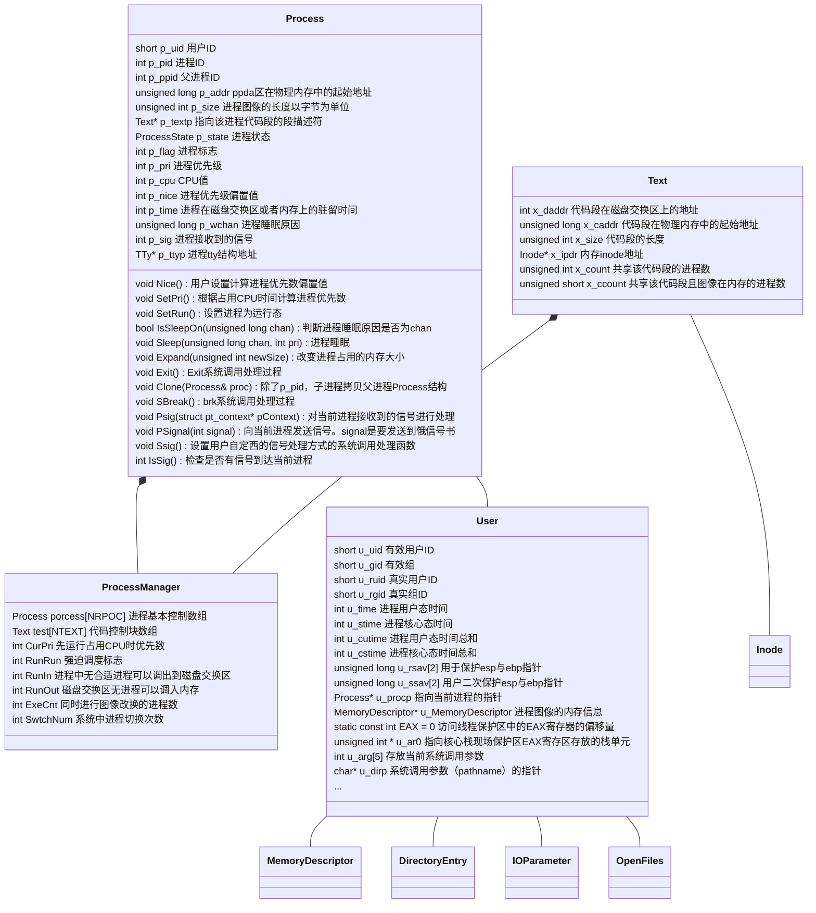
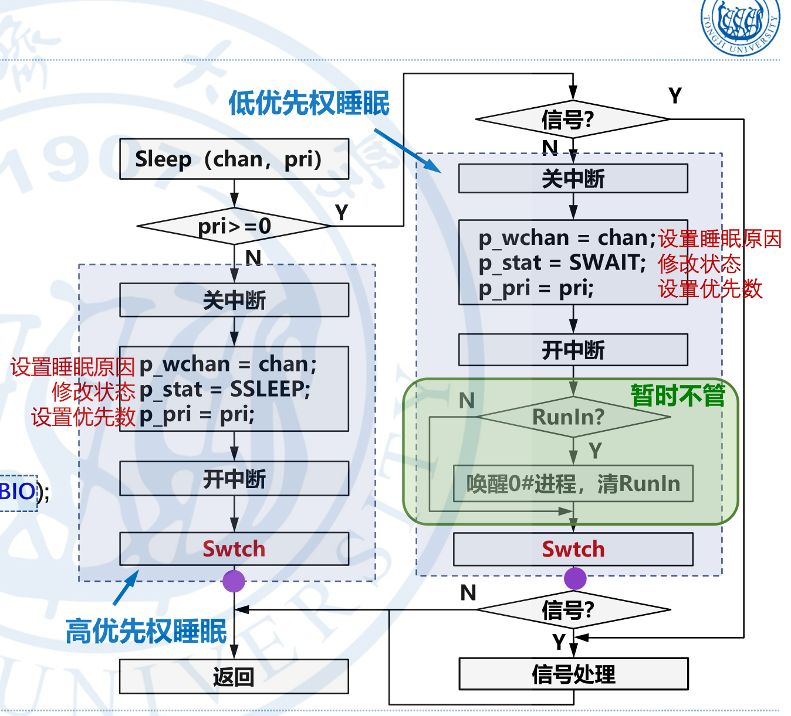
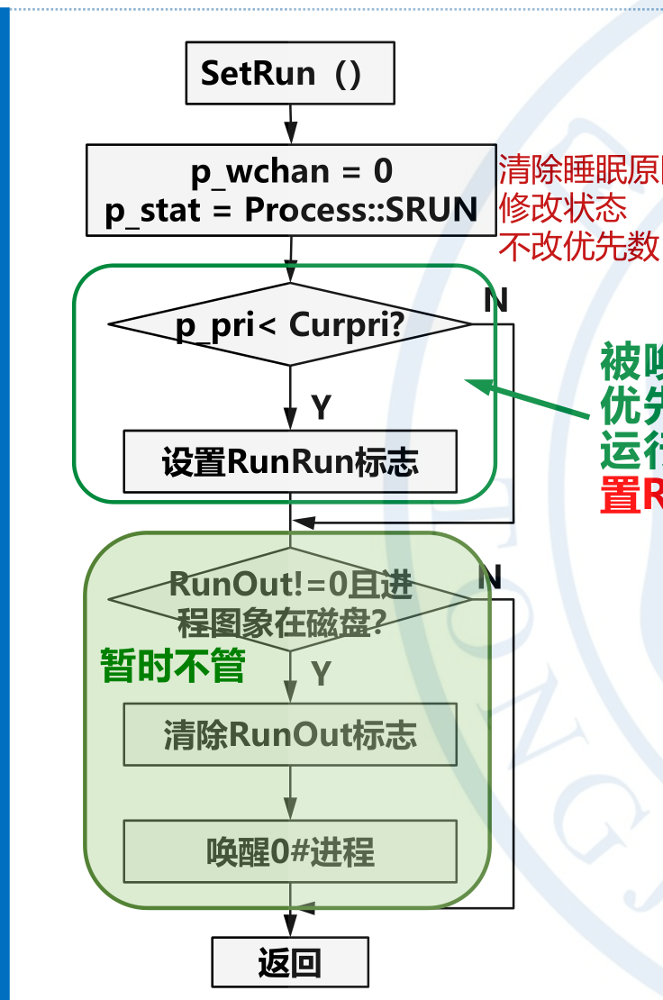

任课老师：Fang
---

# 中断
## 外设控制器
发出中断请求信号的外设控制器是中断源。系统为每一个可以发出中断请求的外设分配一个唯一的标识符，称此标识符为中断号。
## CPU对某个中断请求作出相应后会获得
- 相应的中断处理程序的入口地址
- 中断处理时处理机的状态字
## 中断的硬件机构
2块级联的8259A芯片

## 中断的一般处理流程
- 硬件中断响应
- 保存运行现场
- 中断处理函数
- 恢复现场
- 中断返回
## 中断优先级与中断嵌套
- 每一个中断源有一个中断优先级
- 多个中断有限响应高优先级中断
- 关中断下不响应任何中断
- 开中断下可以被高优先级的中断打断

# 异常
## 类型
- 程序出错
    包括：算术溢出，除数为0，试图执行非法指令，访问到不允许访问的位置，访问存储在磁盘上的指令和数据（可以通过虚拟存储器解决）
- 硬件故障
    奇偶校验错或者掉电等等
- Debug

# 进程
## UnixV6++ 进程类图


# 5 进程管理
## 5.1 进程的调度状态和状态转换
### swtch 函数
```c++
/* 在进程切换的过程中，根本没有用到TSS */
int ProcessManager::Swtch()
{	
	//Diagnose::Write("Start Swtch()\n");
	User& u = Kernel::Instance().GetUser();
	SaveU(u.u_rsav);

	/* 0#进程上台*/
	Process* procZero = &process[0];

	/* 
	 * 将SwtchUStruct()和RetU()作为临界区，防止被中断打断。
	 * 如果在RetU()恢复esp之后，尚未恢复ebp时，中断进入会导致
	 * esp和ebp分别指向两个不同进程的核心栈中位置。 good comment！
	 *
	 * 为什么，由0#进程承担挑选就绪进程上台的操作？
	 * 单从进程切换的角度，完全可以由下台进程挑选就绪进程上台。 但是，考虑时钟中断。
	 * 一秒末的 例行处理，最好系统idle时，其次是在执行应用程序过程中；不可以放在内核执行过程中。
	 * 如何判断？
	 * 内核idle的标志：  0#进程在睡眠态执行idle()子程序。
	 * 看 TimeInterrupt.cpp的Line 82.
	 * 如是，必须由0#进程执行select()。
	 *
	 */
	X86Assembly::CLI();
	SwtchUStruct(procZero);
	/* 原来的宏调用是这样写的   RetU(u0)，u0参数没用到，会引起歧义，删除 */
	RetU();
	X86Assembly::STI();

	/* 挑选最适合上台的进程 */
	Process* selected = Select();
	//Diagnose::Write("Process id = %d Selected!\n", selected->p_pid);

	/* 恢复被保存进程的现场 */
	X86Assembly::CLI();
	SwtchUStruct(selected);

	RetU();
	X86Assembly::STI();

	User& newu = Kernel::Instance().GetUser();

	newu.u_MemoryDescriptor.MapToPageTable();
	
	/*
	 * If the new process paused because it was
	 * swapped out, set the stack level to the last call
	 * to savu(u_ssav).  This means that the return
	 * which is executed immediately after the call to aretu
	 * actually returns from the last routine which did
	 * the savu.
	 *
	 * You are not expected to understand this.
	 */
	if ( newu.u_procp->p_flag & Process::SSWAP )
	{
		newu.u_procp->p_flag &= ~Process::SSWAP;
		aRetU(newu.u_ssav);
	}
	
	/* 
	 * 被fork出的进程在上台之前会在被调度上台时返回1，
	 * 并同时返回到NewProc()执行的地址
	 */
	return 1;
}

```
#### 就绪状态进程的特点
 - p_stat = SRUN
 - p_flag 包含 SLOAD标志
 - p_wchan = 0
当前运行的进程除了有就绪进程的特点以外，还有
 - cpu是当前进程的用户现场
 - cr3 寄存器登记这该进程的地址映射方式 即0x201号页框中的1023号页表项指向了这个进程的ppda区，同时0x202和0x203等记者该用户页表。
 - p_pri >= 100

#### 高优先级睡眠和低优先级睡眠的区别
|高优先级|低优先级|
|-------|---------|
|-100<=p_pri<0|0<=p_pri<100|
|等待快速设备的系统中断|等待低速设备的系统中断（鼠标）|
|SSLEEP|SWAIT|


- 睡眠状态会有
    - p_stat = SSLEEP/SWAIT
    - p_flags  拥有sload 标志位，表示进程在内存当中
    - p_wchan 记录了一个变量的地址
    - p_pri<0

    - 核心栈帧
        |栈帧|
        |--|
        |swait|
        |sleep|
        |外设栈帧|
        |Trap|
        |一次中断响应的栈帧|
- 唤醒之后会有
    - p_stat = SRUN
    - p_wchan = 0
    这个过程由WakeUpAll完成
#### 核心态就绪和用户态就绪

|核心态就绪|用户态就绪|
|-------|---------|
|p_pri<=100|p_pri>=100|
|用于等待io中断，是非抢占调度的结果|由于cpu占用时间过程，是抢占式调度的结果|

因此p_pri重算的过程中，不会重算核心态就绪的p_pri值，因为他们是人工设置得来的。而用户态就绪的是计算而来的。

- 由于系统调用睡眠的进程，它最近一次上台的机会是什么？
 
 当前cpu上的运行进程最近的一次例行调度。

### schedule 函数
#### 如果内存不足以容纳所有的进程？
更换优先级：
低睡>高睡>就绪

低谁和高睡在换出之后不会再换回来，只有到了就绪的状态才会回来。

### newProc 函数
新进程的 p_pri = 0

## 5.2 进程的睡眠与唤醒
- 低优先级睡眠在返回的时候需要进行信号处理和唤醒0号进程



### 睡眠原因不止一个？
- 如果系统中没有定时，进程自行设置定时。Time::Tout <= Time::time 
- 如果发现定时过晚，设置为更早的时间。Time :: Tout > waketime
- 如果发现定时过早，等着到这个闹钟被叫醒的时候改成合适的时间再睡。


```c++
void Process::SetRun()
{
	ProcessManager& procMgr = Kernel::Instance().GetProcessManager();

	/* 清除睡眠原因，转为就绪状态 */
	this->p_wchan = 0;
	this->p_stat = Process::SRUN;
	if ( this->p_pri < procMgr.CurPri )
	{
		procMgr.RunRun++;
	}
	if ( 0 != procMgr.RunOut && (this->p_flag & Process::SLOAD) == 0 )
	{
		procMgr.RunOut = 0;
		procMgr.WakeUpAll((unsigned long)&procMgr.RunOut);
	}
}
void ProcessManager::WakeUpAll(unsigned long chan)
{
	/* 唤醒系统中所有因chan而进入睡眠的进程 */
	for(int i = 0; i < ProcessManager::NPROC; i++)
	{
		if( this->process[i].IsSleepOn(chan) )
		{
			this->process[i].SetRun();
		}
	}
}


int SystemCall::Sys_Sslep()
{
	User& u = Kernel::Instance().GetUser();

	X86Assembly::CLI();

	unsigned int wakeTime = Time::time + u.u_arg[0];	/* sleep(second) */

	/*
	 * 对   if ( Time::tout <= Time::time || Time::tout > wakeTime )  中判断条件的解释：
	 * 1、系统先前设置的所有闹钟均已到期。  其后，第一个设置闹钟的进程看到的是条件 tout <= time成立，将自己的waketime写入tout变量。
	 * 2、系统中，存在闹钟未到期的进程。如果有进程设置闹钟，看到的是条件tout > time，进程比对tout变量和自己的waketime，令tout变量的值是所有进程waketime的最小值。
	 *
	 * 原先的注释：
	 * 此处不可以'wakeTime >= Time::time', 否则极端情况下前一次sleep(sec)刚结束，
	 * 紧接着第二次sleep(0)，会使wakeTime == Time::time == Time::tout，
	 * 而如果此时发生时钟中断恰为一秒末尾，Time::Clock()中Time::time++，
	 * 会导致Time::tout比Time::time小1，永远无法满足Time::time == Time::tout
	 * 的唤醒条件，调用sleep(0)的进程永远睡眠。         The end.
	 *
	 * 原先的注释不对。如果while循环的判断条件是'wakeTime >= Time::time'，执行sleep(0)的进程将把waketime和tout设为上个整数秒。整数秒时钟中断处理程序会time++，之后
	 * 1、如果不再有进程设置新闹钟，系统的闹钟服务就瘫痪了。这是因为， time==tout的条件永远无法满足，时钟中断处理程序不再会唤醒任何因设置了闹钟而入睡的进程。
	 * 2、如果有进程设置新闹钟newWaketime，执行sleep(0)操作的进程以及所有waketime<=newWaketime的进程的唤醒时刻将推迟到newWaketime。
	 *
	 * 现在的闹钟服务正确，执行sleep(0)的进程不会入睡更不会使tout值出现错误。
	 */
	while( wakeTime > Time::time )
	{
		if ( Time::tout <= Time::time || Time::tout > wakeTime )
		{
			Time::tout = wakeTime;
		}
		u.u_procp->Sleep((unsigned long)&Time::tout, ProcessManager::PSLEP);
	}

	X86Assembly::STI();

	return 0;	/* GCC likes it ! */
}
void Process::Sleep(unsigned long chan, int pri)
{
	User& u = Kernel::Instance().GetUser();
	ProcessManager& procMgr = Kernel::Instance().GetProcessManager();

	if ( pri > 0 )
	{
		/* 
		 * 进程在进入低优先权睡眠之前，以及被唤醒之后，如果接收到不可忽略
		 * 的信号，则停止执行Sleep()，通过aRetU()直接跳转回Trap1()函数
		 */
		if ( this->IsSig() )
		{
			/* return确保aRetU()跳回到SystemCall::Trap1()之后立刻执行ret返回指令 */
			aRetU(u.u_qsav);
			return;
		}
		/* 
		* 此处关中断进入临界区，保证进程在设置睡眠原因chan和
		* 改进程状态为SSLEEP之间不会发生切换。
		*/
		X86Assembly::CLI();
		this->p_wchan = chan;
		/* 根据睡眠优先级pri确定进程进入高、低优先权睡眠 */
		this->p_stat = Process::SWAIT;
		this->p_pri = pri;
		X86Assembly::STI();

		if ( procMgr.RunIn != 0 )
		{
			procMgr.RunIn = 0;
			procMgr.WakeUpAll((unsigned long)&procMgr.RunIn);
		}
		/* 当前进程放弃CPU，切换其它进程上台 */
		//Diagnose::Write("Process %d Start Sleep!\n", this->p_pid);
		Kernel::Instance().GetProcessManager().Swtch();
		//Diagnose::Write("Process %d End Sleep!\n", this->p_pid);
		/* 被唤醒之后再次检查信号 */
		if ( this->IsSig() )
		{
			/* return确保aRetU()跳回到SystemCall::Trap1()之后立刻执行ret返回指令 */
			aRetU(u.u_qsav);
			return;
		}
	}
	else
	{
		X86Assembly::CLI();
		this->p_wchan = chan;
		/* 根据睡眠优先级pri确定进程进入高、低优先权睡眠 */
		this->p_stat = Process::SSLEEP;
		this->p_pri = pri;
		X86Assembly::STI();

		/* 当前进程放弃CPU，切换其它进程上台 */
		//Diagnose::Write("Process %d Start Sleep!\n", this->p_pid);
		Kernel::Instance().GetProcessManager().Swtch();
		//Diagnose::Write("Process %d End Sleep!\n", this->p_pid);
	}
}
```

### 在sleep函数当中，为什么这个地方要开中断？

由于是先启动io操作再启动sleep函数。然而如果这个io操作很快，再sleep函数执行到		this->p_wchan = chan;被中断响应设置为中断结束。被setrun后，p_wchan = 0 ，然而，回到断点之后，接着执行p_stat = Process::SWAIT。随后进程就睡在了不明原因的chan上。永远不会被唤醒了。
```c++
		X86Assembly::CLI();
		this->p_wchan = chan;
		/* 根据睡眠优先级pri确定进程进入高、低优先权睡眠 */
		this->p_stat = Process::SWAIT;
		this->p_pri = pri;
		X86Assembly::STI();
```

### 什么时候会修改runrun?
setPri会修改这个值。
```c++
void Process::SetPri()
{
	int priority;
	ProcessManager& procMgr = Kernel::Instance().GetProcessManager();

	priority = this->p_cpu / 16;
	priority += ProcessManager::PUSER + this->p_nice;

	if ( priority > 255 )
	{
		priority = 255;
	}
	if ( priority > procMgr.CurPri )
	{
		procMgr.RunRun++;
	}
	this->p_pri = priority;
}
```
setPri会在如下情况会被重算：
- 整数秒，重算所有用户就绪进程的优先数
- 整数秒，重算当前进程优先数
- 系统调用末尾，重算现运行进程优先数。 

系统调用的末尾重算优先级的目的在于，刷掉核心态下的优先级，回复计算获得的优先数；现运行进程优先级下降，设置Runrun标志位，要求进行进程调度。

## 5.3 进程的创建和中止
### 5.3.1 进程创建的基本流程
-  获得空闲的proc
-  复制父进程的额p_size,p_stat,p_flag,p_uid,p_nice,p_textp
   -  p_textp 代表父子共用了一个代码段
-  设置： p_pri=0;p_time=0;p_pid=新标识符;p_ppid=当前进程（父进程）
   -  p_pri 为0让他更快的进入cpu执行创建的过程。
- 相关计数器的值加一
  - x_count x_ccount
  - 相关资源占用值（file引用属数，ucdir->icount）
- 按照p_size的值为子进程生成一个进程图像。
  - 核心栈一致，用户栈的函数都一样。父子进程的相对虚实地址映射表式一样的。
  - 但是真正的页表不一样，只有代码段的是一样的，还有系统核心栈的值是一样的。0x201号页表，只有最后一项不一样。父子进程的x_daddr的地址是一样的。也就是说，新进程的逻辑地址和父进程的逻辑地址是一样的。但是物理地址是不一样的。 

#### 如何让父子进程完成不同的工作？
我们遇到了这样一个问题，在系统所有就绪队列的进程当中，大家的核心栈的栈顶都是一个swtch栈帧，然而，新创建的进程由于直接copy了正在运行的父进程的图像，这就导致它在就绪队列当中，但是它的栈顶是一个NewProc栈帧。
```c++
int ProcessManager::NewProc()
{
	//Diagnose::Write("Start NewProc()\n");
	Process* child = 0;
	for (int i = 0; i < ProcessManager::NPROC; i++ )
	{
		if ( process[i].p_stat == Process::SNULL )
		{
			child = &process[i];
			break;
		}
	}
	if ( !child ) 
	{
		Utility::Panic("No Proc Entry!");
	}

	User& u = Kernel::Instance().GetUser();
	Process* current = (Process*)u.u_procp;
	//Newproc函数被分成两部分，clone仅复制process结构内的数据
	current->Clone(*child);

	/* 这里必须先要调用SaveU()保存现场到u区，因为有些进程并不一定
	设置过 */
	SaveU(u.u_rsav);

	/* 将父进程的用户态页表指针m_UserPageTableArray备份至pgTable */
	PageTable* pgTable = u.u_MemoryDescriptor.m_UserPageTableArray;
	u.u_MemoryDescriptor.Initialize();
	/* 父进程的相对地址映照表拷贝给子进程，共两张页表的大小 */
	if ( NULL != pgTable )
	{
		u.u_MemoryDescriptor.Initialize();
		Utility::MemCopy((unsigned long)pgTable, (unsigned long)u.u_MemoryDescriptor.m_UserPageTableArray, sizeof(PageTable) * MemoryDescriptor::USER_SPACE_PAGE_TABLE_CNT);
	}

	//将先运行进程的u区的u_procp指向new process
	//这样可以在被复制的时候可以直接复制u_procp的
	//地址，在内存不够时，是无法将u区映射到用户区，
	//修改u_procp的地址的
	u.u_procp = child;

	UserPageManager& userPageManager = Kernel::Instance().GetUserPageManager();

	unsigned long srcAddress = current->p_addr;
	unsigned long desAddress = userPageManager.AllocMemory(current->p_size);
	//Diagnose::Write("srcAddress %x\n", srcAddress);
	//Diagnose::Write("desAddress %x\n", desAddress);
	if ( desAddress == 0 ) /* 内存不够，需要swap */
	{
		current->p_stat = Process::SIDL;
		/* 子进程p_addr指向父进程图像，因为子进程换出至交换区需要以父进程图像为蓝本 */
		child->p_addr = current->p_addr;
		SaveU(u.u_ssav);
		this->XSwap(child, false, 0);
		child->p_flag |= Process::SSWAP;
		current->p_stat = Process::SRUN;
	}
	else
	{
		int n = current->p_size;
		child->p_addr = desAddress;
		while (n--)
		{
			Utility::CopySeg(srcAddress++, desAddress++);
		}
	}
	u.u_procp = current;
	/* 
	 * 拷贝进程图像期间，父进程的m_UserPageTableArray指向子进程的相对地址映照表；
	 * 复制完成后才能恢复为先前备份的pgTable。
	 */
	u.u_MemoryDescriptor.m_UserPageTableArray = pgTable;
	//Diagnose::Write("End NewProc()\n");
	return 0;
}

```
父进程，从这里返回的值为0，子进程，利用Swtch函数的返回值1。这样，父子进程就进入了不同的状态。父子进程上返回地址都在newproc当中，但是他们带回来的值是不一样的。

#### fork系统调用
```c++
/*	2 = fork	count = 0	*/
int SystemCall::Sys_Fork()
{
	ProcessManager& procMgr = Kernel::Instance().GetProcessManager();
	procMgr.Fork();

	return 0;	/* GCC likes it ! */
}
void ProcessManager::Fork()
{
	User& u = Kernel::Instance().GetUser();
	Process* child = NULL;;

	/* 寻找空闲的process项，作为子进程的进程控制块 */
	for ( int i = 0; i < ProcessManager::NPROC; i++ )
	{
		if ( this->process[i].p_stat == Process::SNULL )
		{
			child = &this->process[i];
			break;
		}
	}
	if ( child == NULL )
	{
		/* 没有空闲process表项，返回 */
		u.u_error = User::EAGAIN;
		return;
	}

	if ( this->NewProc() )	/* 子进程返回1，父进程返回0 */
	{
		/* 子进程fork()系统调用返回0 */
		u.u_ar0[User::EAX] = 0;
		u.u_cstime = 0;
		u.u_stime = 0;
		u.u_cutime = 0;
		u.u_utime = 0;
	}
	else
	{
		/* 父进程进程fork()系统调用返回子进程PID */
		u.u_ar0[User::EAX] = child->p_pid;
	}

	return;
}
```
应当注意的是，在一个进程刚刚创建的时候p_pri=0。然而，在fork返回之后，由于系统调用结束会产生一个setpri的pri值重算。这样当子进程被重新加入就绪队列之后，父子进程上台机会是相等的。
### 5.3.2 进程的终止
父进程无法设置好正确的时钟去等待子进程的结束时间。因此，父进程会等到子进程活过来再把自己杀掉。
```c++
int wait(int* status)	/* 获取子进程返回的Return Code */
{
	int res;
	__asm__ __volatile__ ( "int $0x80":"=a"(res):"a"(7),"b"(status));
	if ( res >= 0 )
		return res;
	return -1;
}
```
#### 进程终止状态
```c++
int exit(int status)	/* 子进程返回给父进程的Return Code */
{
	int res;
	__asm__ __volatile__ ( "int $0x80":"=a"(res):"a"(1),"b"(status));
	if ( res >= 0 )
		return res;
	return -1;
}
```

```c++
void Process::Exit()
{
	int i;
	User& u = Kernel::Instance().GetUser();
	ProcessManager& procMgr = Kernel::Instance().GetProcessManager();
	OpenFileTable& fileTable = *Kernel::Instance().GetFileManager().m_OpenFileTable;
	InodeTable& inodeTable = *Kernel::Instance().GetFileManager().m_InodeTable;

	Diagnose::Write("Process %d is exiting\n",u.u_procp->p_pid);
	/* Reset Tracing flag */
	u.u_procp->p_flag &= (~Process::STRC);

	/* 清除进程的信号处理函数，设置为1表示不对该信号作任何处理 */
	for ( i = 0; i < User::NSIG; i++ )
	{
		u.u_signal[i] = 1;
	}

	/* 关闭进程打开文件 */
	for ( i = 0; i < OpenFiles::NOFILES; i++ )
	{
		File* pFile = NULL;
		if ( (pFile = u.u_ofiles.GetF(i)) != NULL )
		{
			fileTable.CloseF(pFile);
			u.u_ofiles.SetF(i, NULL);
		}
	}
	/*  访问不存在的fd会产生error code，清除u.u_error避免影响后续程序执行流程 */
	u.u_error = User::NOERROR;

	/* 递减当前目录的引用计数 */
	inodeTable.IPut(u.u_cdir);

	/* 释放该进程对共享正文段的引用 */
	if ( u.u_procp->p_textp != NULL )
	{
		u.u_procp->p_textp->XFree();
		u.u_procp->p_textp = NULL;
	}

	/* 将u区写入交换区，等待父进程做善后处理 */
	SwapperManager& swapperMgr = Kernel::Instance().GetSwapperManager();
	BufferManager& bufMgr = Kernel::Instance().GetBufferManager();
	/* u区的大小不会超过512字节，所以只写入ppda区的前512字节，已囊括u结构的全部信息 */
	int blkno = swapperMgr.AllocSwap(BufferManager::BUFFER_SIZE);
	if ( NULL == blkno )
	{
		Utility::Panic("Out of Swapper Space");
	}
	Buf* pBuf = bufMgr.GetBlk(DeviceManager::ROOTDEV, blkno);
	Utility::DWordCopy((int *)&u, (int *)pBuf->b_addr, BufferManager::BUFFER_SIZE / sizeof(int));
	bufMgr.Bwrite(pBuf);

	/* 释放内存资源 */
	u.u_MemoryDescriptor.Release();
	Process* current = u.u_procp;
	UserPageManager& userPageMgr = Kernel::Instance().GetUserPageManager();
	userPageMgr.FreeMemory(current->p_size, current->p_addr);
	current->p_addr = blkno;
	current->p_stat = Process::SZOMB;

	/* 唤醒父进程进行善后处理 */
	for ( i = 0; i < ProcessManager::NPROC; i++ )
	{
		if ( procMgr.process[i].p_pid == current->p_ppid )
		{
			procMgr.WakeUpAll((unsigned long)&procMgr.process[i]);
			break;
		}
	}
	/* 没找到父进程 */
	if ( ProcessManager::NPROC == i )
	{
		current->p_ppid = 1;
		procMgr.WakeUpAll((unsigned long)&procMgr.process[1]);
	}

	/* 将自己的子进程传给自己的父进程 */
	for ( i = 0; i < ProcessManager::NPROC; i++ )
	{
		if ( current->p_pid == procMgr.process[i].p_ppid )
		{
			Diagnose::Write("My:%d 's child %d passed to 1#process",current->p_pid,procMgr.process[i].p_pid);
			procMgr.process[i].p_ppid = 1;
			if ( procMgr.process[i].p_stat == Process::SSTOP )
			{
				procMgr.process[i].SetRun();
			}
		}
	}

	procMgr.Swtch();
}
```

#### wait 函数
```c++

void ProcessManager::Wait()
{
	int i;
	bool hasChild = false;
	User& u = Kernel::Instance().GetUser();
	SwapperManager& swapperMgr = Kernel::Instance().GetSwapperManager();
	BufferManager& bufMgr = Kernel::Instance().GetBufferManager();
	
	Diagnose::Write("Process %d finding dead son. They are ",u.u_procp->p_pid);
	while(true)
	{
		for ( i = 0; i < NPROC; i++ )
		{
			if ( u.u_procp->p_pid == process[i].p_ppid )
			{
				Diagnose::Write("Process %d (Status:%d)  ",process[i].p_pid,process[i].p_stat);
				hasChild = true;
				/* 睡眠等待直至子进程结束 */
				if( Process::SZOMB == process[i].p_stat )
				{
					/* wait()系统调用返回子进程的pid */
					u.u_ar0[User::EAX] = process[i].p_pid;

					process[i].p_stat = Process::SNULL;
					process[i].p_pid = 0;
					process[i].p_ppid = -1;
					process[i].p_sig = 0;
					process[i].p_flag = 0;

					/* 读入swapper中子进程u结构副本 */
					Buf* pBuf = bufMgr.Bread(DeviceManager::ROOTDEV, process[i].p_addr);
					swapperMgr.FreeSwap(BufferManager::BUFFER_SIZE, process[i].p_addr);
					User* pUser = (User *)pBuf->b_addr;

					/* 把子进程的时间加到父进程上 */
					u.u_cstime += pUser->u_cstime +	pUser->u_stime;
					u.u_cutime += pUser->u_cutime + pUser->u_utime;

					int* pInt = (int *)u.u_arg[0];
					/* 获取子进程exit(int status)的返回值 */
					*pInt = pUser->u_arg[0];

					/* 如果此处没有Brelse()系统会发生什么-_- */
					bufMgr.Brelse(pBuf);
					Diagnose::Write("end wait\n");
					return;
				}
			}
		}
		if (true == hasChild)
		{
			/* 睡眠等待直至子进程结束 */
			Diagnose::Write("wait until child process Exit! ");
			u.u_procp->Sleep((unsigned long)u.u_procp, ProcessManager::PWAIT);
			Diagnose::Write("end sleep\n");
			continue;	/* 回到外层while(true)循环 */
		}
		else
		{
			/* 不存在需要等待结束的子进程，设置出错码，wait()返回 */
			u.u_error = User::ECHILD;
			break;	/* Get out of while loop */
		}
	}
}
```