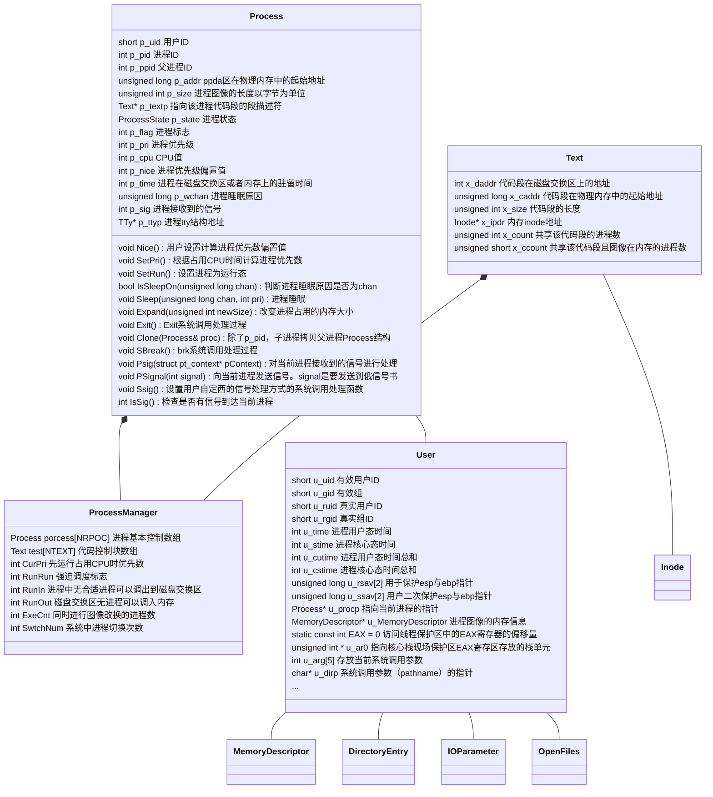

任课老师：Fang
---

# 中断
## 外设控制器
发出中断请求信号的外设控制器是中断源。系统为每一个可以发出中断请求的外设分配一个唯一的标识符，称此标识符为中断号。
## CPU对某个中断请求作出相应后会获得
- 相应的中断处理程序的入口地址
- 中断处理时处理机的状态字
## 中断的硬件机构
2块级联的8259A芯片

## 中断的一般处理流程
- 硬件中断响应
- 保存运行现场
- 中断处理函数
- 恢复现场
- 中断返回
## 中断优先级与中断嵌套
- 每一个中断源有一个中断优先级
- 多个中断有限响应高优先级中断
- 关中断下不响应任何中断
- 开中断下可以被高优先级的中断打断

# 异常
## 类型
- 程序出错
    包括：算术溢出，除数为0，试图执行非法指令，访问到不允许访问的位置，访问存储在磁盘上的指令和数据（可以通过虚拟存储器解决）
- 硬件故障
    奇偶校验错或者掉电等等
- Debug

# 进程
## UnixV6++ 进程类图


# 5 进程管理
## 5.1 进程的调度状态和状态转换
### swtch 函数
```c++
/* 在进程切换的过程中，根本没有用到TSS */
int ProcessManager::Swtch()
{	
	//Diagnose::Write("Start Swtch()\n");
	User& u = Kernel::Instance().GetUser();
	SaveU(u.u_rsav);

	/* 0#进程上台*/
	Process* procZero = &process[0];

	/* 
	 * 将SwtchUStruct()和RetU()作为临界区，防止被中断打断。
	 * 如果在RetU()恢复esp之后，尚未恢复ebp时，中断进入会导致
	 * esp和ebp分别指向两个不同进程的核心栈中位置。 good comment！
	 *
	 * 为什么，由0#进程承担挑选就绪进程上台的操作？
	 * 单从进程切换的角度，完全可以由下台进程挑选就绪进程上台。 但是，考虑时钟中断。
	 * 一秒末的 例行处理，最好系统idle时，其次是在执行应用程序过程中；不可以放在内核执行过程中。
	 * 如何判断？
	 * 内核idle的标志：  0#进程在睡眠态执行idle()子程序。
	 * 看 TimeInterrupt.cpp的Line 82.
	 * 如是，必须由0#进程执行select()。
	 *
	 */
	X86Assembly::CLI();
	SwtchUStruct(procZero);
	/* 原来的宏调用是这样写的   RetU(u0)，u0参数没用到，会引起歧义，删除 */
	RetU();
	X86Assembly::STI();

	/* 挑选最适合上台的进程 */
	Process* selected = Select();
	//Diagnose::Write("Process id = %d Selected!\n", selected->p_pid);

	/* 恢复被保存进程的现场 */
	X86Assembly::CLI();
	SwtchUStruct(selected);

	RetU();
	X86Assembly::STI();

	User& newu = Kernel::Instance().GetUser();

	newu.u_MemoryDescriptor.MapToPageTable();
	
	/*
	 * If the new process paused because it was
	 * swapped out, set the stack level to the last call
	 * to savu(u_ssav).  This means that the return
	 * which is executed immediately after the call to aretu
	 * actually returns from the last routine which did
	 * the savu.
	 *
	 * You are not expected to understand this.
	 */
	if ( newu.u_procp->p_flag & Process::SSWAP )
	{
		newu.u_procp->p_flag &= ~Process::SSWAP;
		aRetU(newu.u_ssav);
	}
	
	/* 
	 * 被fork出的进程在上台之前会在被调度上台时返回1，
	 * 并同时返回到NewProc()执行的地址
	 */
	return 1;
}

```
#### 就绪状态进程的特点
 - p_stat = SRUN
 - p_flag 包含 SLOAD标志
 - p_wchan = 0
当前运行的进程除了有就绪进程的特点以外，还有
 - cpu是当前进程的用户现场
 - cr3 寄存器登记这该进程的地址映射方式 即0x201号页框中的1023号页表项指向了这个进程的ppda区，同时0x202和0x203等记者该用户页表。
 - p_pri >= 100

#### 高优先级睡眠和低优先级睡眠的区别
|高优先级|低优先级|
|-------|---------|
|-100<=p_pri<0|0<=p_pri<100|
|等待快速设备的系统中断|等待低速设备的系统中断（鼠标）|
|SSLEEP|SWAIT|


- 睡眠状态会有
    - p_stat = SSLEEP/SWAIT
    - p_flags  拥有sload 标志位，表示进程在内存当中
    - p_wchan 记录了一个变量的地址
    - p_pri<0

    - 核心栈帧
        |栈帧|
        |--|
        |swait|
        |sleep|
        |外设栈帧|
        |Trap|
        |一次中断响应的栈帧|
- 唤醒之后会有
    - p_stat = SRUN
    - p_wchan = 0
    这个过程由WakeUpAll完成
#### 核心态就绪和用户态就绪

|核心态就绪|用户态就绪|
|-------|---------|
|p_pri<=100|p_pri>=100|
|用于等待io中断，是非抢占调度的结果|由于cpu占用时间过程，是抢占式调度的结果|

因此p_pri重算的过程中，不会重算核心态就绪的p_pri值，因为他们是人工设置得来的。而用户态就绪的是计算而来的。

- 由于系统调用睡眠的进程，它最近一次上台的机会是什么？
 
 当前cpu上的运行进程最近的一次例行调度。

### schedule 函数
#### 如果内存不足以容纳所有的进程？
更换优先级：
低睡>高睡>就绪

低谁和高睡在换出之后不会再换回来，只有到了就绪的状态才会回来。

### newProc 函数
新进程的 p_pri = 0

## 5.2 进程的睡眠与唤醒
- 低优先级睡眠在返回的时候需要进行信号处理和唤醒0号进程


### 睡眠原因不止一个？
- 如果系统中没有定时，进程自行设置定时。Time::Tout <= Time::time 
- 如果发现定时过晚，设置为更早的时间。Time :: Tout > waketime
- 如果发现定时过早，等着到这个闹钟被叫醒的时候改成合适的时间再睡。


```c++
void Process::SetRun()
{
	ProcessManager& procMgr = Kernel::Instance().GetProcessManager();

	/* 清除睡眠原因，转为就绪状态 */
	this->p_wchan = 0;
	this->p_stat = Process::SRUN;
	if ( this->p_pri < procMgr.CurPri )
	{
		procMgr.RunRun++;
	}
	if ( 0 != procMgr.RunOut && (this->p_flag & Process::SLOAD) == 0 )
	{
		procMgr.RunOut = 0;
		procMgr.WakeUpAll((unsigned long)&procMgr.RunOut);
	}
}
void ProcessManager::WakeUpAll(unsigned long chan)
{
	/* 唤醒系统中所有因chan而进入睡眠的进程 */
	for(int i = 0; i < ProcessManager::NPROC; i++)
	{
		if( this->process[i].IsSleepOn(chan) )
		{
			this->process[i].SetRun();
		}
	}
}


int SystemCall::Sys_Sslep()
{
	User& u = Kernel::Instance().GetUser();

	X86Assembly::CLI();

	unsigned int wakeTime = Time::time + u.u_arg[0];	/* sleep(second) */

	/*
	 * 对   if ( Time::tout <= Time::time || Time::tout > wakeTime )  中判断条件的解释：
	 * 1、系统先前设置的所有闹钟均已到期。  其后，第一个设置闹钟的进程看到的是条件 tout <= time成立，将自己的waketime写入tout变量。
	 * 2、系统中，存在闹钟未到期的进程。如果有进程设置闹钟，看到的是条件tout > time，进程比对tout变量和自己的waketime，令tout变量的值是所有进程waketime的最小值。
	 *
	 * 原先的注释：
	 * 此处不可以'wakeTime >= Time::time', 否则极端情况下前一次sleep(sec)刚结束，
	 * 紧接着第二次sleep(0)，会使wakeTime == Time::time == Time::tout，
	 * 而如果此时发生时钟中断恰为一秒末尾，Time::Clock()中Time::time++，
	 * 会导致Time::tout比Time::time小1，永远无法满足Time::time == Time::tout
	 * 的唤醒条件，调用sleep(0)的进程永远睡眠。         The end.
	 *
	 * 原先的注释不对。如果while循环的判断条件是'wakeTime >= Time::time'，执行sleep(0)的进程将把waketime和tout设为上个整数秒。整数秒时钟中断处理程序会time++，之后
	 * 1、如果不再有进程设置新闹钟，系统的闹钟服务就瘫痪了。这是因为， time==tout的条件永远无法满足，时钟中断处理程序不再会唤醒任何因设置了闹钟而入睡的进程。
	 * 2、如果有进程设置新闹钟newWaketime，执行sleep(0)操作的进程以及所有waketime<=newWaketime的进程的唤醒时刻将推迟到newWaketime。
	 *
	 * 现在的闹钟服务正确，执行sleep(0)的进程不会入睡更不会使tout值出现错误。
	 */
	while( wakeTime > Time::time )
	{
		if ( Time::tout <= Time::time || Time::tout > wakeTime )
		{
			Time::tout = wakeTime;
		}
		u.u_procp->Sleep((unsigned long)&Time::tout, ProcessManager::PSLEP);
	}

	X86Assembly::STI();

	return 0;	/* GCC likes it ! */
}
void Process::Sleep(unsigned long chan, int pri)
{
	User& u = Kernel::Instance().GetUser();
	ProcessManager& procMgr = Kernel::Instance().GetProcessManager();

	if ( pri > 0 )
	{
		/* 
		 * 进程在进入低优先权睡眠之前，以及被唤醒之后，如果接收到不可忽略
		 * 的信号，则停止执行Sleep()，通过aRetU()直接跳转回Trap1()函数
		 */
		if ( this->IsSig() )
		{
			/* return确保aRetU()跳回到SystemCall::Trap1()之后立刻执行ret返回指令 */
			aRetU(u.u_qsav);
			return;
		}
		/* 
		* 此处关中断进入临界区，保证进程在设置睡眠原因chan和
		* 改进程状态为SSLEEP之间不会发生切换。
		*/
		X86Assembly::CLI();
		this->p_wchan = chan;
		/* 根据睡眠优先级pri确定进程进入高、低优先权睡眠 */
		this->p_stat = Process::SWAIT;
		this->p_pri = pri;
		X86Assembly::STI();

		if ( procMgr.RunIn != 0 )
		{
			procMgr.RunIn = 0;
			procMgr.WakeUpAll((unsigned long)&procMgr.RunIn);
		}
		/* 当前进程放弃CPU，切换其它进程上台 */
		//Diagnose::Write("Process %d Start Sleep!\n", this->p_pid);
		Kernel::Instance().GetProcessManager().Swtch();
		//Diagnose::Write("Process %d End Sleep!\n", this->p_pid);
		/* 被唤醒之后再次检查信号 */
		if ( this->IsSig() )
		{
			/* return确保aRetU()跳回到SystemCall::Trap1()之后立刻执行ret返回指令 */
			aRetU(u.u_qsav);
			return;
		}
	}
	else
	{
		X86Assembly::CLI();
		this->p_wchan = chan;
		/* 根据睡眠优先级pri确定进程进入高、低优先权睡眠 */
		this->p_stat = Process::SSLEEP;
		this->p_pri = pri;
		X86Assembly::STI();

		/* 当前进程放弃CPU，切换其它进程上台 */
		//Diagnose::Write("Process %d Start Sleep!\n", this->p_pid);
		Kernel::Instance().GetProcessManager().Swtch();
		//Diagnose::Write("Process %d End Sleep!\n", this->p_pid);
	}
}
```

### 在sleep函数当中，为什么这个地方要开中断？

由于是先启动io操作再启动sleep函数。然而如果这个io操作很快，再sleep函数执行到		this->p_wchan = chan;被中断响应设置为中断结束。被setrun后，p_wchan = 0 ，然而，回到断点之后，接着执行p_stat = Process::SWAIT。随后进程就睡在了不明原因的chan上。永远不会被唤醒了。
```c++
		X86Assembly::CLI();
		this->p_wchan = chan;
		/* 根据睡眠优先级pri确定进程进入高、低优先权睡眠 */
		this->p_stat = Process::SWAIT;
		this->p_pri = pri;
		X86Assembly::STI();
```

### 什么时候会修改runrun?
setPri会修改这个值。
```c++
void Process::SetPri()
{
	int priority;
	ProcessManager& procMgr = Kernel::Instance().GetProcessManager();

	priority = this->p_cpu / 16;
	priority += ProcessManager::PUSER + this->p_nice;

	if ( priority > 255 )
	{
		priority = 255;
	}
	if ( priority > procMgr.CurPri )
	{
		procMgr.RunRun++;
	}
	this->p_pri = priority;
}
```
setPri会在如下情况会被重算：
- 整数秒，重算所有用户就绪进程的优先数
- 整数秒，重算当前进程优先数
- 系统调用末尾，重算现运行进程优先数。 


## 5.3 进程的创建和中止
