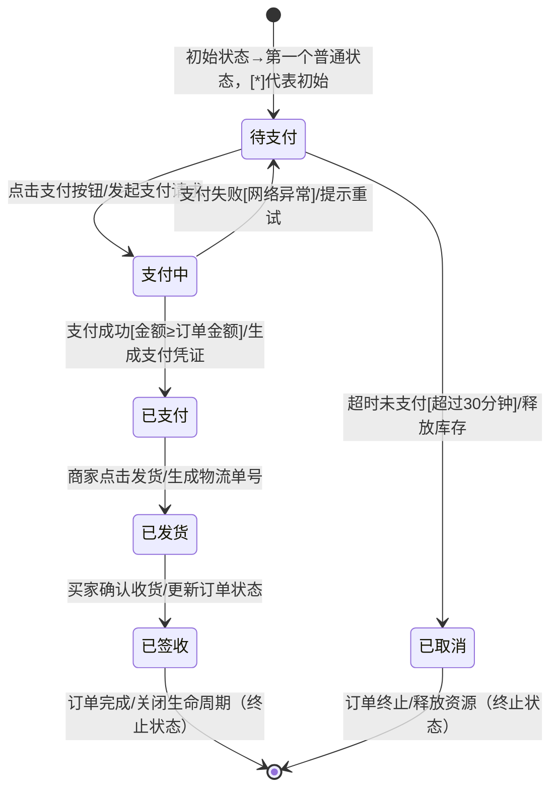

任课老师：Zhao

---

# uml
## uml类之间的关系
### 1. 依赖（Dependency）
- **定义**：表示一个类（依赖方）需要借助另一个类（被依赖方）的功能才能完成自身工作，是一种临时性、弱关联的关系。
- **UML图示**：用带箭头的虚线表示，箭头指向被依赖的类（即“谁被用，箭头就指向谁”）。
- **实例**：`Service`类需要调用`Logger`类的`log()`方法记录日志，`Service`依赖`Logger`，虚线箭头从`Service`指向`Logger`。
- **核心特点**：依赖方不持有被依赖方的实例，仅在特定方法中临时使用；被依赖方的变化可能影响依赖方。

---

### 2. 泛化（Generalization）
- **定义**：对应面向对象中的“继承”关系，表示一个子类（特殊类）继承自一个父类（一般类），子类拥有父类的属性和方法，并可扩展或重写。
- **UML图示**：用带空心三角形的实线表示，三角形指向父类（即“子类指向父类”）。
- **实例**：`Dog`和`Cat`类都继承自`Animal`类，`Animal`的“eat()`”“sleep()`”方法可被子类复用，虚线箭头从`Dog`/`Cat`指向`Animal`。
- **核心特点**：遵循“is-a”逻辑（如“Dog is an Animal”）；父类的共性被抽取，子类专注于个性扩展。

---

### 3. 实现（Realization）
- **定义**：表示一个类（实现类）实现了一个或多个接口（或抽象类），实现类需重写接口中所有抽象方法，满足接口定义的“契约”。
- **UML图示**：用带空心三角形的虚线表示，三角形指向接口（即“实现类指向接口”）。
- **实例**：`UserServiceImpl`类实现`UserService`接口，需重写接口中的`getUser()`“addUser()`”等抽象方法，虚线箭头从`UserServiceImpl`指向`UserService`。
- **核心特点**：遵循“implements”逻辑；接口定义规范，实现类提供具体实现，支持多实现（一个类可实现多个接口）。

---

### 4. 关联（Association）
- **定义**：表示两个类之间存在稳定、长期的结构关系，关联的类通常会持有对方的实例引用，分为单向关联和双向关联。
- **UML图示**：用带箭头（单向）或不带箭头（双向）的实线表示，箭头指向被引用的类；可在关联线上标注“关联名称”或“ multiplicity（ multiplicity（多重度）”（如1对1、1对多）。
- **实例**：`Teacher`类与`Student`类是双向关联，一个`Teacher`可教多个`Student`（1:N），一个`Student`可被多个`Teacher`教（N:M），实线连接两者并标注“1”“N”。
- **核心特点**：遵循“has-a”逻辑；关联关系是“聚合”“组合”的基础，比“依赖”更强，关联的类之间存在实例级的引用。

---

### 5. 聚合（Aggregation）
- **定义**：是“关联”的特殊形式，表示“整体与部分”的关系，且部分可脱离整体独立存在（即整体和部分的生命周期不绑定）。
- **UML图示**：用带空心菱形的实线表示，菱形指向“整体”类，实线连接“部分”类（即“部分指向整体”）。
- **实例**：`Car`类（整体）与`Wheel`类（部分）是聚合关系，`Car`包含`Wheel`，但`Wheel`可从`Car`上拆卸，单独存在或安装到其他`Car`上，空心菱形在`Car`端，实线从`Wheel`指向`Car`。
- **核心特点**：整体不负责部分的创建和销毁；部分可属于多个整体，是“弱整体-部分”关系。

---

### 6. 组合（Composition）
- **定义**：也是“关联”的特殊形式，同样表示“整体与部分”的关系，但部分完全依赖整体存在（即整体和部分的生命周期绑定，整体销毁时部分也随之销毁）。
- **UML图示**：用带实心菱形的实线表示，菱形指向“整体”类，实线连接“部分”类（即“部分指向整体”）。
- **实例**：`Person`类（整体）与`Heart`类（部分）是组合关系，`Heart`是`Person`的一部分，`Person`创建时`Heart`随之创建，`Person`销毁时`Heart`也无法独立存在，实心菱形在`Person`端，实线从`Heart`指向`Person`。
- **核心特点**：整体负责部分的创建、初始化和销毁；部分只能属于一个整体，是“强整体-部分”关系。
### UML类间六种关系对比表
| 关系类型 | UML图示特征 | 核心逻辑 | 生命周期绑定 | 耦合强度 | 典型实例 |
|----------|-------------|----------|--------------|----------|----------|
| 依赖（Dependency） | 带箭头的虚线，箭头指向被依赖类 | 类A临时使用类B的功能完成工作，无长期持有 | 无绑定，仅在调用时关联 | 最弱 | Service类调用Logger类的log()方法 |
| 泛化（Generalization） | 带空心三角形的实线，三角形指向父类 | 子类继承父类，遵循“is-a”逻辑 | 子类依赖父类存在，父类变化可能影响子类 | 较强 | Dog类、Cat类继承自Animal类 |
| 实现（Realization） | 带空心三角形的虚线，三角形指向接口 | 类实现接口的抽象方法，遵循“implements”逻辑 | 实现类依赖接口规范，接口变更需同步修改实现类 | 较强 | UserServiceImpl类实现UserService接口 |
| 关联（Association） | 带/不带箭头的实线，可标注多重度 | 类A长期持有类B的引用，遵循“has-a”逻辑 | 无强制绑定，双方可独立存在 | 中等 | Teacher类与Student类的教学关联（1:N） |
| 聚合（Aggregation） | 带空心菱形的实线，菱形指向整体类 | 整体包含部分，部分可脱离整体独立，遵循“整体-部分（弱）”逻辑 | 无绑定，整体销毁不影响部分 | 较强 | Car类（整体）与Wheel类（部分） |
| 组合（Composition） | 带实心菱形的实线，菱形指向整体类 | 整体包含部分，部分无法脱离整体，遵循“整体-部分（强）”逻辑 | 强绑定，整体创建则部分创建，整体销毁则部分销毁 | 最强 | Person类（整体）与Heart类（部分） |
### UML关联关系中“多重度”概念说明
“多重度”（Multiplicity）用于定义关联关系中，两个类的实例之间可以建立的对应数量关系，通常标注在关联线的两端，清晰界定实例交互的数量边界。

#### 1. 常用多重度符号及含义
| 符号 | 名称 | 具体含义 |
|------|------|----------|
| `1` | 一个 | 关联的一端必须且只能有1个实例 |
| `0..1` | 零或一个 | 关联的一端可以有0个实例（可选），也可以有1个实例 |
| `*` 或 `0..*` | 零或多个 | 关联的一端可以有0个、1个或多个实例（数量无上限） |
| `1..*` | 一个或多个 | 关联的一端至少有1个实例，也可以有多个实例 |
| `n..m`（如2..5） | 范围数量 | 关联的一端实例数量在n到m之间（包含n和m），n、m为具体数字 |

#### 2. 典型应用场景示例
- **1:1（一对一）**：一个实例仅对应另一个实例。例如“Person”与“IDCard”，一个人只能有一张身份证，一张身份证也仅属于一个人，关联线两端均标注`1`。
- **1:N（一对多）**：一个实例可对应多个实例，反之仅对应一个。例如“Department”与“Employee”，一个部门可有多个员工，一个员工仅属于一个部门，部门端标注`1`，员工端标注`*`。
- **N:M（多对多）**：两端实例均可对应多个实例。例如“Student”与“Course”，一个学生可选多门课程，一门课程可被多个学生选择，关联线两端均标注`*`。
## 状态图

状态图（State Diagram）是UML行为图的一种，用于描述对象从创建到销毁的生命周期中，不同状态的转换逻辑，核心是“状态”与“转换”两大要素。以下是分步骤的绘制方法，适用于Markdown（需借助Mermaid语法渲染）或可视化工具（如Visio、StarUML）。

### 1. 明确绘制目标与核心要素
在动笔前先界定范围，避免信息冗余。状态图的核心要素只有3个，需提前梳理清楚：
- **状态（State）**：对象的行为模式或属性集合，分3类
  - 初始状态：对象生命周期的起点，用“实心小圆”表示，一个图仅1个。
  - 普通状态：对象的常规行为，用“圆角矩形”表示（如“待支付”“已发货”）。
  - 终止状态：对象生命周期的终点，用“内部带实心圆的大圆”表示，可多个。
- **转换（Transition）**：状态间的切换，用“带箭头的实线”表示，箭头上需标注“触发事件[守卫条件]/动作”（如“支付成功[金额≥0]/生成订单”）。
- **对象（可选）**：若需明确归属，可在图顶部标注“对象名: 类名”（如“订单123: Order”）。

### 2. 按“生命周期流”梳理状态逻辑
以“电商订单”为例，按时间顺序拆解状态，避免逻辑断层，步骤如下：
1. 确定起点：初始状态（订单创建）。
2. 罗列普通状态：按流程拆解核心节点，如“待支付”→“支付中”→“已支付”→“已发货”→“已签收”。
3. 补充分支状态：考虑异常或分支场景，如“待支付”可因“超时未支付”转入“已取消”（终止状态）。
4. 确定终点：每个流程分支对应一个终止状态，如“已签收”“已取消”均为终止状态。

### 3. 用Mermaid语法编写Markdown状态图（实操示例）
Mermaid是Markdown中最常用的状态图渲染语法，无需手动拖拽，代码即图，以下是“电商订单”的完整示例：

- **语法说明**：
  - `stateDiagram-v2`：固定开头，确保渲染效果。
  - `[*]`：代表初始/终止状态（起点用`[*]-->状态`，终点用`状态-->[*]`）。
  - 转换规则：`源状态 --> 目标状态 : 触发事件[守卫条件]/执行动作`，“[守卫条件]”和“/动作”可省略（如仅“点击支付”）。

### 4. 绘制注意事项（避坑指南）
- 避免“状态冗余”：只保留影响行为的核心状态，如“订单”无需拆分“待支付-等待1分钟”“待支付-等待2分钟”。
- 转换标注清晰：触发事件需具体（如“点击支付”而非“操作”），守卫条件需可判断（如“超时30分钟”而非“超时”）。
- 逻辑闭环：每个普通状态都要有后续转换（除终止状态），避免“孤立状态”（如“已支付”必须能到“已发货”或异常状态）。

要不要我针对你具体的场景（如“用户登录流程”“设备运行状态”），帮你定制一份**专属的Mermaid状态图代码**，你直接复制到Markdown里就能渲染使用？