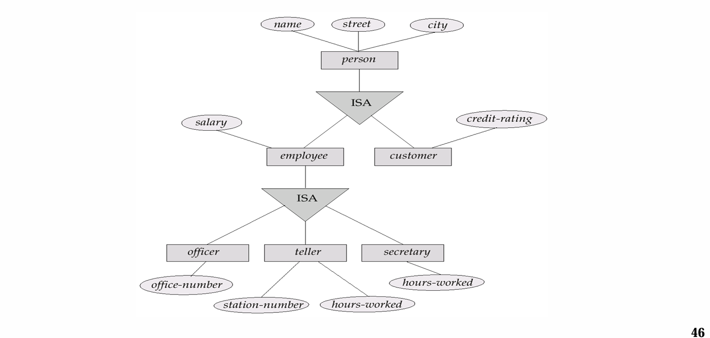

任课老师:Li  
请注意，本文档的结构来自于老师提供的复习PPT

---
<!-- more -->
## 第一章 数据库系统概述

### 传统文件处理系统的缺点
- 数据的冗余和不一致性
- 数据访问困难
- 数据孤立
- 完整性问题
- 原子性问题
- 并发访问异常
- 安全性问题

### 数据库定义
- 一组相互关联的有组织的可管理的可共享的数据集合
基本特征：按照一定的数据模型组织描述和存储，支持增删改查，支持并发查询处理
### DBMS
- 用户与操作系统之间的数据库管理软件
- 一个管理数据的大型复杂基础软件系统
### 数据抽象的层次
- 物理层：描述数据实际上是怎样存储的
- 逻辑层：描述数据之间的关系
- 视图层：提供一种抽象的机制，使得用户可以看到所需的数据

## 第二章 关系模型
### 数据模型与数据库模式
用户需求 --> 概念模型 --> 逻辑模型 --> 物理模型  
### 关系模式 Relational schema
### 关系 relation
表
### 关系实例 relation instance
一个关系特定的行
### 元组 tuple
一个行
### 属性 attibute
列
### 超码 superkey
一个或者多个属性的集合，能够唯一标识一个元组
### 候选码 candidate key
一个超码，任何真子集都不是超码
### 主码 primary key
被设计者选中作为区分不同数据库主要方式的候选码
### 外码 foreign key
一个关系中指向另一个关系的属性
### 查询语言 query language, procedural language, non-procedural language
query language: SQL, DML, DDL  
procedural language: PL/SQL, Java  
non-procedural language: C, C++, Python, JavaScript  
函数式查询语言，声明式查询语言，命令式查询语言
### 关系代数 
#### 选择 select
$\sigma_{A}(R)$ 选择满足条件A的元组  
例如 $\sigma_{age>20}(student)$ 选择年龄大于20的学生  
#### 投影 project
$\Pi_{A}(R)$ 投影出属性A的元组  
例如 $\Pi_{name,age}(student)$ 投影出学生的姓名和年龄  
#### 重名 rename
$\rho_{A}(R)$ 重命名属性R为A    
$\rho_{A(x_1,x_2,x_3 \dots)}(R)$ 将R重命名为A，同时重命名R的属性为$x_1 ,x_2 ,x_3 \dots$

#### 笛卡尔积 catesian product
$R \times S$ 所有元组的笛卡尔积  
例如 $student \times course$ 学生和课程的笛卡尔积，运算之后有两者大小乘积个元组  
#### 链接 
$\sigma_{A}(R \times S)$ 选择满足条件A的元组  
例如 $\sigma_{age>20}(student \times course)  
亦可写作$R \bowtie_{A} S$ 表示$R \times S$的子集，满足条件A的元组  
例如 $student \bowtie_{age>20} course$ 学生和课程的交集，满足年龄大于20的元组  

#### 自然连接 natural join
$R \bowtie S$ 所有元组的自然连接  $t_r$和$t_s$ 具有相同的属性和值
#### 赋值 assignment
相当于定义变量的过程 
A <- B 表示将A定义为B运算结果的值
#### 广义投影 generalized projection
$\Pi_{x-y}(R)$ 允许做运算   
例如 $\Pi_{age-name}(student)$ 投影出学生的年龄和姓名  
#### 并集 union
$R \cup S$ 所有元组的并集  
例如 $\sigma_{age>20}(student) \cup \sigma_{age<10}(student)$ 所有年龄大于20或者年龄小于10的学生  

#### 集差 set difference 
$R - S$ 所有元组在R中但不在S中的元组  
例如 $\sigma_{age>20}(student) - \sigma_{age>100}(student)$  年龄大于20但年龄不大于100的学生  
#### 集合交 intersection
$R \cap S$ 所有元组的交集  
例如 $\sigma_{age>20}(student) \cap \sigma_{age<10}(student)$ 所有年龄大于20并且年龄小于10的学生  
#### 外连接 outer join
$A \Join = B$ 表示保留A的所有属性，在B中没有匹配的元组，用NULL填充  
#### 除 division
$R \div S = \{t|t \in \Pi_{r-s 表示只有R有的属性}(R) \wedge \forall u \in S ,tu \in R\}$ 
#### 聚集函数 aggregate functions
f(A) 表示对A属性的值取平均值
- avg
- min
- max
- count
- sum
#### 空值 null values
表示值未知或不存在
#### 删除 deletion
#### 插入 insertion
#### 更新 updating
#### 视图 view

## 第三，四，五章 SQL
### DDL
定义关系及其相关信息，包括：
- 关系的模式
- 属性的域
- 完整性约束
- 索引结构
- 安全性和权限信息
- 物理存储结构
### DDM

### 主要数据类型 Domain types
- char(n) 定长字符串
- varchar(n) 变长字符串
- int 整数
- smallint 短整数
- numeric(p,s) 定点数 p是位数，s是小数点后位数
- real double preicision 双精度浮点数
- float 单精度浮点数
- null value 允许所有的类型
### 创建语言 Create table construct
```sql
CREATE TABLE table_name (
    column1 datatype constraint,
    column2 datatype constraint,
    ...
);
```
完整性约束：
- not null
- primary key (A1,A2,...)
- foreign key (A1,A2,...) references table_name(A1,A2,...)
- check (expression)
- unique 
- default value
### 删除或修改
```sql
drop table table_name;
```
表示从数据库中删除这个表

---
```sql
alter table r add A D constraint;
```
表示在关系r中增加一个属性A，数据类型为D，约束为constraint

---
```sql
alter table r drop A;
```
表示在关系r中删除属性A

---
### 数据库操作
#### select
基本查询结构：
```sql
select A1,A2...
from r1,r2...
where P
```
表示$\Pi_{A1,A2...}(\sigma_{P}(R_1 \times R_2 \times \cdots))$
##### select distinct/all 字句
- distinct 去除/保留重复的元组
``` sql
select [distinct/all] A1,A2...
from r1,r2...
```
##### where between and in 字句
- between A and B 选择A到B之间的元组
```sql
select A1,A2...
from r1,r2...
where A between B and C
```
#### join 
- natural join
``` sql
select A1,A2...
from r1 natural join r2
```
- join using 
``` sql
select A1,A2...
from r1 join r2 using (A)
```
#### rename
```sql
select customer_name.borrower.loan_number as loan_id,amount
from borrower,loan 
```
- inner join
```sql
select A1,A2...
from A inner join B on P
```
- left/right outer join
- full outer join
---
注意：natural 和using去重复，on不会
#### 字符串运算
- like ‘%’ 通配符可以匹配任意长度字符串
- like ‘_’ 通配符可以匹配任意单个字符
- 转义字符:
  - '\\' \
  - '\%' %
  - '\_' _
  - 此外支持以ascii码进行访问，例如char(34) 表示双引号
例如
```sql
building like '%Waston%'
```
#### ordering of tuples 排序
形式具体表现为：
```sql
select A1,A2...
from r1,r2...
where p
order by A1 [asc/desc],A2 [asc/desc]...
```
其中order by 按照先后顺序进行排序，asc表示升序，desc表示降序
#### set operations  集合运算
```sql
(select ...) union (select ...)
(select ...) intersect (select ...)
(select ...) except (select ...)
```
#### null values 空值
```sql
select * from r where A is null
```
特别的，所有的聚集函数当中除了count(*) 都将忽略所有的控制
#### aggregation 聚集函数
- avg
- min
- max
- count
- sum
```sql
select count( distinct ID)
from teachers 
where semester ='Spring' and year =2018
```
- group by 
按照某一属性进行分组
```sql
select avg(age)
from students
group by gender
```
表示对学生的性别进行分组，计算每个性别的平均年龄
- group by having
where 在 形成组之前使用
having 在 形成组之后使用
```sql
select class,avg(age)
from students
group by class having avg(age) > 20
```

#### nested subqueries 嵌套子查询

#### set comparison 集合比较
- 集合包含
```sql
select distinct customer_name
from borrower
where customer_name in (
    select customer_name 
    from depositor
)
```
- some
E \< comp \> some r 表示   
$\exists t \in r,E <comp > t$   
$comp \in \{\lt,\le,\gt,\ge,\neq,=\}$
```sql
select branch_name
from branch
where assets > some(
    select assets
    from branch
    where branch_city='Brooklyn'
)
```
- all
E \< comp \> all r 表示   
$\forall t \in r,E <comp > t$   
```sql
select branch_name
from branch
where assets > all(
    select assets
    from branch where branch_city='Brooklyn'
)
```
- 空关系测试
$ exists r \Leftrightarrow r \neq \emptyset$
$ not exists r \Leftrightarrow r = \emptyset$
```sql
select distinct customer_name
from borrower
where exists (
    select *
    from depositor
    where borrower.customre_name = depositor.customer_name
)
``` 
- 重复元组测试
测试子查询是否用重复元组在查询结果当中  
例如：找到所有的消费者拥有一个银行账户在嘉定支行当中
``` sql
select T.customer_name
from depositor as T
where unique (
    select R.customer_name
    from account,depositor as R
    where T.customer_name = R.customer_name and R.branch_name = 'Jiading'
)
```

#### view 视图
``` sql
CREATE view v as <query expression>;
```
视图的更新：   
一般来说，如果满足以下条件，SQL视图是可更新的：
- `from`子句只有一个关系。
- `select`子句仅包含该关系的属性名，且没有任何表达式、聚合函数或`distinct`指定。
- `select`子句中未列出的任何属性都可以设置为`null`。
- 该查询没有`group by`或`having`子句。 

#### 导出关系 Derived Relations
使用as字句在一个查询当中生明一个新的关系   
例如: 找到最大的银行账户余额总值
``` sql
select max(tot_blance)
from (
    select branch_name,sum(balance)
    from account
    group by branch_name)
    as branch_total(branch_name,tot_blance)
```
#### with 字句
定义作用域在数据库下的子查询作为一个新的关系
```sql
with max_balance (value) as 
    select max(balance)
    from account;
```
#### Deletion 
```sql
delete from r where p;
```
#### Insertion
``` sql
insert into r (A1,A2...) values (v1,v2...);
```
#### Update
```sql
update account 
set balance = balance + 100
where balance <= 10000;
```
- case
```sql
update R
set A =
case 
  when pred1 then result1
  .
  .
  .
  else
end;
```
例如
``` sql
update account 
  set balance =
case 
  when balance <= 10000 
    then balance + 100
    else balance *1.06
end ;
```
### Transactions 事务
事务是作为单个单元执行的查询和更新语句序列。
- 事务会自动启动，并通过以下方式之一终止：
    - commit [work]（提交[工作]）：使事务的所有更新在数据库中永久生效。
    - rollback [work]（回滚[工作]）：撤销事务执行的所有更新。 
### 完整性约束
完整性约束通过确保对数据库的授权更改不会导致数据一致性的丢失，来防止对数据库的意外破坏。
#### 域约束
``` sql
create domain d datatype;
create domain d datatype constraint value_test check (expression);
```
域约束是完整性约束的最基本形式
#### 非空约束
``` sql
not null
```
#### unique
```sql
create table t(
    unique (A1,A2,...)--表示A1,A2...为一个超码
)
``` 
#### check
```sql
check (expression)
```
#### foreign key
```sql
foreign key (dept_name) references deoartment
  on delete cascade/set null/set default
  on update cascade
```
#### assertion 断言
希望数据库总能满足某一个条件
```sql
create assertion a check (expression);
```
### 安全性与权限
#### levels of security 安全级别
从高级到低级，分为:
- Database system level 数据库系统级别
- Operation system level 操作系统级别
- Network level 网络级别
- Physic level
- Human level
#### forms of authorization to modify DB 数据修改权限
``` sql
grant/revoke permission
on view/relation
to role/user
```
$permission \in \{update,insert,delete,select,create table,drop table,alter table\dots \}$


#### Granting privileges ,role  保证数据安全的角色机制
```sql
create role r1;
```
创建一个用户，可以将某个用户授予某种角色，也可以将一个用户像角色一样授权给别人
- 直接执行 GRANT GRANT TO ROLE 会报错，因为 GRANT 本身不是一个可授予的对象权限，而是数据库操作语句。
- 正确做法：若要让角色拥有授权权限，需授予其特定权限的 WITH GRANT OPTION。例如：
```sql
-- 授予角色 `admin_role` 对数据库 `test_db` 中所有表的 SELECT 权限，并允许其授权给其他用户/角色
GRANT SELECT ON test_db.* TO admin_role WITH GRANT OPTION;
```

防止级联收权，u3的权限来自于u2,但是收回u3权限的同时不想收回u2的权限，因此有如下语句
```sql
revoke select on department from user restrict;
```
#### Audit trails encryption authentication 审计跟踪，加密，认证
- 审计跟踪  
审计跟踪是对数据库所有更改（插入/删除/更新）的日志记录，同时包含诸如以下信息：是哪个用户执行了更改，以及何时执行的更改。
  - 用于跟踪错误/欺诈性更新。
  - 可以使用触发器来实现，但许多数据库系统也提供直接支持。 
- 加密
当数据库授权条款无法提供足够保护时，数据可以进行加密。
  良好加密技术的特性：
  - 对于授权用户而言，加密和解密数据相对简单。  
  - 加密方案并不依赖于算法的保密性，而是依赖于算法中一个称为加密密钥（密钥）的参数的保密性。
  - 入侵者极难确定加密密钥。 
### 一些未尽的事务
#### 嵌入式SQL（Embedded SQL）  
**定义**：将SQL语句直接嵌入到宿主编程语言（如C、Java、Python）中的技术，用于实现数据库与应用程序的交互。  
**核心作用**：  
- **融合数据操作与业务逻辑**：在应用代码中直接编写SQL语句，避免数据在应用层与数据库层之间的频繁传输。  
- **示例场景**：在C语言中通过嵌入式SQL查询用户数据：  
  ```c
  EXEC SQL BEGIN DECLARE SECTION;  // 声明宿主变量
  int user_id;
  char username[50];
  EXEC SQL END DECLARE SECTION;
  
  EXEC SQL SELECT username INTO :username FROM users WHERE id = :user_id;
  ```  
- **关键机制**：通过`EXEC SQL`前缀标识SQL语句，使用宿主变量（带冒号前缀）与SQL交互。  


##### 通过游标更新（Update through Cursors）  
**游标（Cursor）**：类似文件指针，用于遍历查询结果集的逐行数据。  
**更新逻辑**：  
1. **声明游标**：绑定查询结果集到游标（如`DECLARE cur CURSOR FOR SELECT * FROM products`）。  
2. **打开游标**：执行查询并定位到首行（`OPEN cur`）。  
3. **遍历与更新**：通过`FETCH`获取当前行，用`UPDATE`修改数据，如：  
   ```sql
   FETCH cur INTO @id, @price;
   UPDATE products SET price = @price * 1.1 WHERE CURRENT OF cur;
   ```  
4. **关闭游标**：释放资源（`CLOSE cur`）。  
**应用场景**：处理需要逐行更新的场景（如库存批量调整、数据校验修正）。  


#### 动态SQL（Dynamic SQL）  
**定义**：在运行时动态拼接或生成SQL语句的技术，区别于静态预定义的SQL。  
**核心特性**：  
- **灵活性**：根据变量或条件动态构造语句，例如：  
  ```sql
  SET @table_name = 'users';
  SET @sql = CONCAT('SELECT * FROM ', @table_name, ' WHERE status = 1');
  PREPARE stmt FROM @sql;
  EXECUTE stmt;
  ```  
- **风险与防护**：  
  - **SQL注入风险**：未过滤用户输入时，可能被恶意拼接语句（如`' OR 1=1 --`）。  
  - **安全方案**：使用参数化查询（如MySQL的`PREPARE`+`EXECUTE`）或ORM框架自动转义。  
- **应用场景**：报表生成（动态指定查询字段）、通用数据接口（根据条件动态拼接WHERE子句）。  


#### 函数与过程构造（Functions and Procedures Constructs）  
##### 存储过程（Stored Procedure）  
- **定义**：预编译并存储在数据库中的SQL语句集合，可接受参数、执行逻辑操作。  
- **示例**：计算用户订单总额：  
  ```sql
  CREATE PROCEDURE calculate_order_total(IN order_id INT, OUT total DECIMAL)
  BEGIN
    SELECT SUM(price * quantity) INTO total FROM order_items WHERE order_id = order_id;
  END;
  ```  
- **优势**：减少网络传输、封装业务逻辑、提升性能（仅首次编译开销）。  

##### 函数（Function）  
- **定义**：类似存储过程，但必须返回单个值，可用于表达式中。  
- **示例**：返回用户等级：  
  ```sql
  CREATE FUNCTION get_user_level(age INT) RETURNS VARCHAR(20)
  BEGIN
    IF age >= 60 THEN RETURN 'Senior';
    ELSEIF age >= 18 THEN RETURN 'Adult';
    ELSE RETURN 'Youth';
    END IF;
  END;
  ```  
- **区别**：函数可在SELECT语句中调用（如`SELECT get_user_level(age) FROM users`），存储过程需单独执行。  


### 递归查询（Recursive Queries）  
**定义**：通过自引用或分层结构查询数据的方法，常用于处理树状或层级关系（如部门架构、家谱、目录结构）。  
**核心语法（以CTE为例）**：  
```sql
WITH RECURSIVE dept_hierarchy AS (
  -- 基础查询：获取顶层部门
  SELECT id, name, parent_id, 1 AS level
  FROM departments
  WHERE parent_id IS NULL
  UNION ALL
  -- 递归查询：关联子部门
  SELECT d.id, d.name, d.parent_id, dh.level + 1
  FROM departments d
  JOIN dept_hierarchy dh ON d.parent_id = dh.id
)
SELECT * FROM dept_hierarchy;
```  
**关键步骤**：  
1. **基础情况**：定义递归起点（如顶层节点）。  
2. **递归情况**：通过JOIN操作向下层扩展，直到无新数据加入。  
**应用场景**：  
- 计算员工汇报层级（如“谁是CEO的直接下属的下属”）。  
- 物料清单（BOM）查询：递归获取产品所有子组件。  


#### 高级SQL特性（Advanced SQL Features）  
##### 1. 窗口函数（Window Functions）  
- **作用**：在不分组的情况下对数据进行分组计算，保留原始行数据。  
- **示例**：计算每个部门的薪资排名：  
  ```sql
  SELECT dept, name, salary,
         RANK() OVER (PARTITION BY dept ORDER BY salary DESC) AS salary_rank
  FROM employees;
  ```  
- **常用函数**：`RANK()`、`DENSE_RANK()`、`ROW_NUMBER()`、`SUM() OVER()`。  

##### 2. 公用表表达式（CTE, Common Table Expression）  
- **作用**：临时定义一个查询结果集，可在主查询中多次引用，类似临时表但更轻量。  
- **示例**：  
  ```sql
  WITH high_salary AS (
    SELECT * FROM employees WHERE salary > 10000
  )
  SELECT dept, COUNT(*) FROM high_salary GROUP BY dept;
  ```  

##### 3. 分区表（Partitioned Tables）  
- **作用**：将大表数据按规则（如时间、地域）分割为多个物理子表，提升查询性能。  
- **示例（MySQL）**：  
  ```sql
  CREATE TABLE sales (
    id INT,
    sale_date DATE,
    amount DECIMAL
  )
  PARTITION BY RANGE(YEAR(sale_date)) (
    PARTITION p2020 VALUES LESS THAN (2021),
    PARTITION p2021 VALUES LESS THAN (2022),
    PARTITION p2022 VALUES LESS THAN MAXVALUE
  );
  ```  

##### 4. JSON/XML支持  
- **作用**：处理非结构化数据，如JSON字段的查询与解析。  
- **示例（PostgreSQL）**：  
  ```sql
  SELECT data->'name' AS username FROM users WHERE data->'age' > 30;
  ```  

##### 5. 空间数据类型  
- **作用**：存储与查询地理坐标、几何图形（如点、线、面），用于GIS系统。  
- **示例（PostGIS）**：  
  ```sql
  CREATE TABLE locations (
    id INT,
    point GEOMETRY(Point, 4326)
  );
  -- 查询半径5公里内的点
  SELECT * FROM locations WHERE ST_DWithin(point, ST_GeomFromText('POINT(116.4074 39.9042)', 4326), 5000);
  ```  

##### 6. 事务与锁机制  
- **高级特性**：如分布式事务（XA协议）、细粒度锁（行级锁、乐观锁），保障并发数据一致性。  

这些特性使SQL具备处理复杂业务逻辑、大规模数据和非结构化数据的能力，是现代数据库系统的核心竞争力之一。

## 第六章 数据库设计与E-R模型
### 数据库设计
- 概念设计（Conceptual design）——将现实世界中的组织映射为概念模型。 
- 逻辑设计（Logical design）——将概念模型转换为逻辑模型。 
- 物理设计（Physical design）——将逻辑模型实例化为物理组织和存储。 
### Entity Sets 实体集
所有同类型实体所构成的集合，在数据库中实际上为一个表
数据库可以建模为实体的集合以及不同实体之间的关系  
### 联系集 Relationship sets
代表着不同实体之间的一个联系    
- Degree of mapping cardinality 映射度
联系集的度为参与到联系集的实体集的数量
### ER图设计
#### entity sets vs attribute sets 实体集与属性集
- 一个实体可以有多个属性
- 复合属性指的是描述某个属性的属性
- 多值属性指的是某个属性可以有多个值
- 派生属性是指在数据库中通过计算、组合或转换已有属性得到的新属性，通常不直接存储在数据库中，而是在需要时动态计算得出。
#### entity sets vs relationship sets 实体集与关系集
- 一个关系集当中可以出现同一个实体集，但是以不同的角色(Roles) 出现 ，例如职员表中的boss和employee
#### binary vs n-ary relationships 二元关系与多元关系
- 很自然地，多元关系就是从多个属性映射到另外多个属性当中的过程
- 任何多元关系都可通过创建人工实体机使用二元关系来表示
#### 强实体集
**强实体集是指不依赖于其他实体集而独立存在的实体集。** 具体来说，强实体集具备以下关键特征：  
- 独立存在性：强实体集的每个实体可通过自身的主码（Primary Key）唯一标识，无需依赖其他实体的存在或属性。例如，“学生” 实体集可通过唯一的学生 ID（如student_id）标识每个学生，无需借助其他实体的信息。
- 不依赖于弱实体集：强实体集与弱实体集（Weak Entity Set）相对，弱实体集需要依赖 “标识性实体集”（Identifying Entity Set）才能存在，而强实体集本身即为独立的标识性实体集
#### 弱实体集
- 每个弱实体集必须与一个强实体集关联，其存在依赖于该强实体集。
- **标识性联系** ：弱实体集与强实体集之间的关联关系称为标识性联系（Identifying Relationship）。
- **拥有与被拥有关系** ：强实体集 “拥有” 弱实体集，即弱实体集的生命周期从属于强实体集。若强实体集的某个实体被删除，其关联的弱实体集实体通常也会被级联删除
#### use of specializations/generalizations 特化与泛化
- 在面向对象的程序设计当中有所设计。
- **特化** 代表着从基类到子类的映射。这一过程由标记为ISA的三角形表示  

- 特化和泛化是两个相反的过程，泛化代表着从子类到基类的映射。两者表示方式相同。

### Symbols used in E-R diagrams 符号在E-R图中的使用
- 实体集：方框
- 属性： 圆圈
- 联系集：菱形
- 实体集之间的联系：箭头
- 弱实体集：双实线框
- 将弱实体集连接到强实体集的联系集：双实线菱形
### Reduction of an E-R diagram to relational tables 简化E-R图为关系表
- **复合属性** : 通过为每个复合属性设计一个独特的属性集来扁平化复合属性
- **强实体集** ：强实体集被简化为相同属性的表
- **弱实体集** ：弱实体集被简化为相同属性的表，并添加包含表示强实体集的主键的列
- **多对多关系集** ：多对多关系集被简化为两个相同属性的表，并添加两个包含表示参与实体的主键的列
- **特化与泛化** :有两种方式：
  - 所有的继承类都采用相同的主键，在基类当中添加基本信息，每继承一次，添加的属性创建新的表。查询其中的一个角色需要将所有表都查询一遍。
  - 所有的继承类共用一个表，但是会有较多冗余
#### 数据库设计的不同阶段
- S1：需求分析
  - 数据存储要求
  - 功能需求分析
  - 描述将对数据执行的操作
- S2：概念设计（E-R 模型）

- S3：逻辑实现
  - 从概念模型到实施模型的映射
  - 例如，关系模型、OO 模型
- S4：物理实现
  - 指定数据库的物理特征，例如缓冲区大小、索引…


## 第七章 数据库关系设计
### Functional Dependency 函数依赖
**定义**：某一组属性的值唯一决定了另一组属性的值，记为 $\alpha \to \beta$（$\alpha$ 为决定属性集，$\beta$ 为依赖属性集）。  
**示例**：在关系模式 `in_dep(ID, name, salary, dept_name, building, budget)` 中，`dept_name -> building` 和 `dept_name -> budget` 为函数依赖，表示部门名称唯一决定所在建筑和预算。


#### Closure of Functional Dependency 函数依赖闭包
**定义**：由函数依赖集 $F$ 逻辑蕴含的所有函数依赖的集合，称为 $F$ 的闭包，记为 $F^+$。  
**计算方法**：  
1. **Armstrong's Axiom 阿姆斯特朗公理**（正确且完备）：  
   - **自反性（Reflexivity）**：若 $\beta \subseteq \alpha$，则 $\alpha \to \beta$。  
     *例*：`(dept_name, building) \to building` 恒成立。  
   - **增广性（Augmentation）**：若 $\alpha \to \beta$，则 $\gamma\alpha \to \gamma\beta$。  
     *例*：若 `ID \to name`，则 `ID, dept_name \to name, dept_name`。  
   - **传递性（Transitivity）**：若 $\alpha \to \beta$ 且 $\beta \to \gamma$，则 $\alpha \to \gamma$。  
     *例*：若 `dept_name \to building` 且 `building \to capacity`，则 `dept_name \to capacity`。  
2. **Additional Rules 补充规则**（由公理推导得出）：  
   - **合并规则（Union）**：若 $\alpha \to \beta$ 且 $\alpha \to \gamma$，则 $\alpha \to \beta\gamma$。  
   - **分解规则（Decomposition）**：若 $\alpha \to \beta\gamma$，则 $\alpha \to \beta$ 且 $\alpha \to \gamma$。  
   - **伪传递规则（Pseudotransitivity）**：若 $\alpha \to \beta$ 且 $\gamma\beta \to \delta$，则 $\alpha\gamma \to \delta$。  


#### Closure of Attribute Set 属性集的闭包
**定义**：给定属性集 $\alpha$，其在函数依赖集 $F$ 下的闭包 $\alpha^+$ 是指由 $\alpha$ 函数决定的所有属性的集合。  
**计算算法**：  
```plaintext
result := α
loop:
    for each 函数依赖 β → γ in F:
        if β ⊆ result:
            result := result ∪ γ
    until result 不再变化
```  
**示例**：  
- 若 $U = \{A, B, C, D, E\}$，$F = \{AB \to C, B \to D, C \to E\}$，则 $(AB)^+ = \{A, B, C, D, E\}$（通过逐步合并 $C$、$D$、$E$ 得到）。  


#### Canonical Cover 正则覆盖
**定义**：函数依赖集 $F$ 的正则覆盖 $F_c$ 是一个等价的最小函数依赖集，满足：  
1. 不含无关属性（Extraneous Attribute）：  
   - **左部无关属性**：若从函数依赖的左部删除属性 $A$ 后，剩余属性仍能决定右部，则 $A$ 为左部无关属性。  
   - **右部无关属性**：若从函数依赖的右部删除属性 $A$ 后，函数依赖仍被原集蕴含，则 $A$ 为右部无关属性。  
2. 无冗余函数依赖：每个函数依赖均无法由其他依赖推导得出。  


**计算步骤**：  
1. 分解右部为单属性
2. 逐个检查每个函数依赖的左部，删除无关属性。  
**示例**：  
- 若 $F = \{A \to BC, B \to C, AB \to C\}$，则正则覆盖 $F_c = \{A \to B, B \to C\}$（删除冗余依赖和无关属性）。  


#### Find All Candidate Keys 找到所有的候选键
**定义**：候选键是**最小的超键**，即其任意真子集均不是超键。  
**分类法步骤**：  
1. 将属性分为四类：  
   - **L类**：仅出现在函数依赖左部的属性（如 `ID` 在 `ID \to name` 中）。  
   - **R类**：仅出现在函数依赖右部的属性（如 `building` 在 `dept_name \to building` 中）。  
   - **LR类**：同时出现在左部和右部的属性（如 `dept_name` 在 `dept_name \to building` 和 `instructor \to dept_name` 中）。  
   - **N类**：未出现在任何函数依赖中的属性。  
2. **初步筛选**：  
   - L类和N类属性必定属于候选键（记为 $X$）。N类必须包含在所有候选键中  
   - R类属性必定不属于候选键。  
3. **闭包验证**：  
   - 计算 $X$ 的闭包，若 $X^+ = U$，则 $X$ 为唯一候选键。  
   - 否则，逐步添加LR类属性至 $X$，计算闭包，直至得到所有候选键。  
**示例**：  
- 关系模式 `R(U, F)`，$U = \{A, B, C, D\}$，$F = \{AB \to C, C \to D, D \to A\}$，则候选键为 `AB`、`BC`、`BD`（通过L类属性 `B` 逐步添加LR类属性验证）。  


### Decomposition 分解
**目标**：将关系模式分解为更小的模式，以消除冗余、插入/删除异常。  


#### Lossless-Join Decomposition 无损连接分解
**定义**：分解后的关系通过自然连接可还原原关系，即 $r = \prod_{R_1}(r) \bowtie \prod_{R_2}(r)$。  
**判定条件**：  
- 分解为 $R_1$ 和 $R_2$ 时，若 $R_1 \cap R_2 \to R_1$ 或 $R_1 \cap R_2 \to R_2$ 成立，则为无损连接分解。  
**示例**：  
- 分解 `in_dep` 为 `instructor(ID, name, salary, dept_name)` 和 `department(dept_name, building, budget)`，交集 `dept_name` 决定 `department`，故为无损分解。  


#### Dependency Preservation 依赖保持
**定义**：分解后，原函数依赖集 $F$ 可由各分解模式的函数依赖推导得出，即 $(F_1 \cup F_2 \cup \dots \cup F_n)^+ = F^+$。  

**验证方法**：  
1. 对每个函数依赖 $\alpha \to \beta \in F$，计算 $\alpha$ 在分解后的闭包：  
   ```plaintext
   result := α
   loop:
       for each 分解后的模式 R_i:
           t := (result ∩ R_i)^+ ∩ R_i
           result := result ∪ t
       until result 不再变化
       if β ⊆ result: 依赖保持
   ```  
2. 若所有依赖均通过验证，则分解为依赖保持的。  
- 通过 “闭包验证” 逐个检查原依赖，确保分解后仍能推导原依赖的全部逻辑，无推导能力丢失。


### Normalization and Normal Forms 规范化与范式
**目标**：通过分解消除关系中的异常（冗余、插入/删除失败），使关系满足特定范式。  
以下四种为递进关系。

#### 1NF 第一范式
**定义**：关系中所有属性均为原子属性（不可再分），且无多值属性。即最基本的要求  
**示例**：  
- 错误设计：`Emp(ID, Name, Courses)`（`Courses` 为多值属性）。  
- 正确设计：拆分为 `Emp(ID, Name)` 和 `Emp_Course(ID, Course)`。  


#### 2NF 第二范式
**定义**：满足1NF，且所有非主属性完全依赖于候选键（无部分依赖）。这意味着可以由主键完全推导到其他的属性。其他属性也完全依赖与主键。即$K为R的主键，那么\forall A\in R, A \leftrightarrow K$。即整个集合不可以分成两个部分来单独成立，这其中允许传递关系。  
这同时意味着关系依赖中不存在二部图。  
**判定**：  
- 若候选键为组合键（如 `(EmpID, CourseTitle)`），非主属性（如 `DateCompleted`）需依赖整个键，而非部分键（如 `EmpID`）。  
**示例**：  
- 关系 `Emp_Course(EmpID, CourseTitle, Name, DateCompleted)` 中，`Name` 仅依赖 `EmpID`，存在部分依赖，需分解为 `Emp(EmpID, Name)` 和 `Emp_Course(EmpID, CourseTitle, DateCompleted)`。  


#### 3NF 第三范式
**定义**：满足2NF，且无传递依赖（非主属性不依赖于其他非主属性）。  
**判定条件**：  
- 对函数依赖 $\alpha \to \beta$，若 $\alpha$ 非超键，则 $\beta - \alpha$ 中的属性必须属于某个候选键。  
**示例**：  
- 关系 `Sales(CustID, Name, Salesperson, Region)` 中，`CustID \to Salesperson \to Region` 为传递依赖，分解为 `Sales(CustID, Name, Salesperson)` 和 `Salesperson( Salesperson, Region)`。  


#### BCNF（Boyce-Codd Normal Form）
**定义**：满足3NF，且每个非平凡函数依赖的决定因素均为超键。  
**判定**：  
- 对函数依赖 $\alpha \to \beta$，若 $\beta \not\subseteq \alpha$，则 $\alpha$ 必须为某一个候选键。  
- 判定时计算其左侧闭包是否为R。即可。  
**示例**：  
- 关系 `R(A, B, C)`，$F = \{A \to B, B \to C\}$，候选键为 `A`，但 `B \to C` 不满足BCNF，需分解为 `(A, B)` 和 `(B, C)`。  
- 关系`R(A, B, C, D)`, $F=\{AC \to B, AC \to D,B \to C\}$ 不满足所有函数依赖的左部必须是候选键。


#### Testing for BCNF and 3NF  
- **BCNF检测**：检查所有非平凡函数依赖的决定因素是否为超键（通过计算闭包验证）。  
- **3NF检测**：在BCNF检测基础上，允许非主属性依赖于其他候选键（放宽条件）。  


#### Corresponding Decompositions and Dependencies  
- **BCNF分解算法**：  
  1. 若关系不满足BCNF，选择违规函数依赖 $\alpha \to \beta$，将关系分解为 $(R - \beta)$ 和 $(\alpha, \beta)$。  
  2. 重复直至所有模式均满足BCNF。  
  **特点**：保证无损连接，但可能不保持依赖。  
- **3NF分解算法**：  
  1. 根据正则覆盖生成初始分解（每个函数依赖对应一个模式）。  
  2. 若候选键未包含在分解中，添加候选键对应的模式。  
  **特点**：保证无损连接和依赖保持，但可能存在轻微冗余。  

**对比**：  
| 范式   | 消除的异常       | 依赖保持 | 无损连接 |
|--------|------------------|----------|----------|
| BCNF   | 所有函数依赖异常 | 可能不   | 是       |
| 3NF    | 部分函数依赖异常 | 是       | 是       |

通过规范化，可系统地优化关系数据库设计，在冗余控制和性能之间取得平衡。

### 满足3NF但不满足BCNF的例子  


#### **关系模式**  
- **关系 $ R(A, B, C) $**  
- **函数依赖集 $ F = \{AB \to C, \, C \to A\} $**  


#### **1. 计算候选键**  
- **候选键1：$ AB $**  
  闭包计算：$ (AB)^+ = AB \xrightarrow{AB→C} ABC $，覆盖全属性，且无真子集（$ A^+ = A $, $ B^+ = B $），故 $ AB $ 是候选键。  

- **候选键2：$ BC $**  
  闭包计算：$ (BC)^+ = BC \xrightarrow{C→A} BCA $，覆盖全属性，且无真子集（$ B^+ = B $, $ C^+ = CA $），故 $ BC $ 是候选键。  

- **主属性**：$ A, B, C $（所有属性均属于候选键）。  


#### **2. 检验3NF**  
3NF要求：非平凡函数依赖 $ X→Y $ 中，若 $ X $ 不是超键，则 $ Y $ 必须是主属性。  
- **依赖1：$ AB→C $**  
  左部 $ AB $ 是候选键（超键），满足3NF。  

- **依赖2：$ C→A $**  
  左部 $ C $ 不是超键（$ C^+ = CA \neq ABC $），但右部 $ A $ 是主属性（属于候选键），**满足3NF**。  


#### **3. 检验BCNF**  
BCNF要求：所有非平凡函数依赖的左部必须是超键。  
- **依赖2：$ C→A $**  
  左部 $ C $ 不是超键（无法决定 $ B $），**违反BCNF**。  


#### **结论**  
- 关系 $ R(A,B,C) $ 满足3NF（因所有非平凡依赖要么左部是超键，要么右部是主属性），但不满足BCNF（存在 $ C→A $ 左部非超键）。  

**核心原因**：3NF允许“非超键→主属性”的依赖，而BCNF禁止任何“非超键→非平凡依赖”，无论右部是否为主属性。


## 第12-13章 存储与文件结构解析
### 一、物理存储介质分类
物理存储介质主要依据速度、成本、可靠性、易失性等特性进行分类，具体如下表所示：
|存储类型|速度|成本|可靠性|是否易失性|典型设备|特点|
| ---- | ---- | ---- | ---- | ---- | ---- | ---- |
|高速缓存（Cache）|最快|最高|—|易失性|CPU缓存|容量小，用于加速数据访问|
|主存（Main Memory）|快（约100纳秒）|高|—|易失性|内存|容量达数十GB，断电数据丢失|
|闪存（Flash Memory）|读速接近主存，写速慢（微秒级）|与主存相近|高|非易失性|U盘、SSD|可擦写10K-1M次，广泛用于嵌入式设备|
|磁盘（Magnetic Disk）|慢（毫秒级）|低|较高|非易失性|硬盘|容量达TB级，长期存储主力，支持随机访问|
|光盘（Optical Storage）|较慢|低|高|非易失性|CD/DVD/蓝光光盘|WORM类型用于归档，存储密度高（如东京大学25T光盘）|
|磁带（Tape Storage）|最慢（顺序访问）|最低|高|非易失性|LTO磁带|容量达30TB+，成本低廉，用于冷数据备份|

### 二、磁盘访问性能测量与优化
#### （一）性能指标
1. **访问时间（Access Time）** 
    - **寻道时间（Seek Time）**：磁臂移动到目标磁道的时间，平均约为最坏情况的一半，典型值4-10毫秒。 
    - **旋转延迟（Rotational Latency）**：目标扇区旋转到磁头下方的时间，平均为半圈时间，典型值4-11毫秒（5400-15000 rpm转速）。 
2. **数据传输速率（Data Transfer Rate）**：磁盘读写数据的速度，最大值50-200 MB/s，受磁道位置影响（内圈较慢）。 
3. **平均故障时间（MTTF）**：新磁盘理论MTTF为50万-120万小时，随使用时间增长而降低。

#### （二）优化技术
1. **块（Block）管理** 
    - 磁盘与主存以块为单位传输数据，块大小通常4-16 KB。 
    - 小块增加传输次数，大块浪费空间，需平衡选择。 
2. **磁盘臂调度算法** 
    - **电梯算法（Elevator Algorithm）**：磁臂单向移动处理请求，减少来回移动，如先从外到内处理所有请求，再反向。 
3. **非易失性写缓冲区（Non-volatile Write Buffers）** 
    - 使用电池备份RAM或闪存缓存写操作，即使断电也能保存数据，待磁盘空闲时写入，减少等待时间并优化写入顺序。 
4. **日志磁盘（Log Disk）** 
    - 专用磁盘顺序记录块更新，无需寻道，速度快，常用于日志文件系统（如Journaling File Systems）确保数据安全。

### 三、存储与缓冲区管理
#### （一）存储层次结构
- **主存储器（Primary Storage）**：包括高速缓存和主存，速度快但易失性。 
- **辅助存储器（Secondary Storage）**：如闪存、磁盘，非易失性，在线存储，速度中等。 
- **三级存储器（Tertiary Storage）**：如磁带、光盘，非易失性，离线存储，速度慢，用于备份和归档。

#### （二）缓冲区管理（Buffer Manager）
- **功能**：管理主存中的磁盘块缓存，当程序请求块时，若缓存中存在则直接返回；若不存在则从磁盘读取，并在需要时替换其他块（如LRU算法）。 
- **替换策略** 
    - **LRU（最近最少使用）**：替换最久未使用的块，但对重复扫描数据的场景效率低。 
    - **MRU（最近最常使用）**：结合“钉住块”（Pinned Block）机制，处理完块后释放，避免频繁替换。 
    - **立即丢弃（Toss-immediate）**：处理完块的最后一个元组后立即释放空间。

### 四、文件组织与记录管理
#### （一）文件组织方式
1. **定长记录（Fixed-length Records）** 
    - 记录大小固定，按顺序存储（如记录i从第n*(i-1)字节开始），删除记录可通过移动后续记录或维护空闲列表（Free List）实现。 
2. **变长记录（Variable-length Records）** 
    - 支持多类型记录或可变字段（如数组、集合），通过“分槽的页（Slotted Page）”结构管理：块头记录条目数、空闲空间末端、记录位置及大小，指针指向块头而非记录本身，便于移动和更新。

#### （二）记录组织策略
1. **顺序文件（Sequential File）** 
    - 按搜索键顺序存储，适合批量处理，插入/删除可能导致碎片，需定期重组文件或使用溢出块。 
2. **堆文件（Heap File）** 
    - 记录可任意存放于空闲空间，插入高效，查询需全表扫描，适用于数据随机写入场景。 
3. **散列文件（Hashing File）** 
    - 通过哈希函数计算记录属性值，确定存储块，支持快速随机访问，但哈希冲突需通过链地址法等处理。 
4. **多表聚簇文件（Multi-table Clustering File）** 
    - 将相关表（如部门与教师）存储在同一文件，减少连接查询时的I/O，但可能导致变长记录和单表查询效率下降。

### 五、数据字典存储
- **定义**：存储元数据（如关系名、属性类型、视图定义、物理存储信息等），支持数据库管理和优化。 
- **结构**：通常以关系表形式存储（如relation_metadata、attribute_metadata等），可使用专用数据结构加速访问，包含完整性约束、用户权限、索引信息等。

### 六、RAID级别（1-6级）
|RAID级别|冗余方式|性能特点|适用场景|
| ---- | ---- | ---- | ---- |
|RAID 0|无冗余，块级拆分|读写速度高，容量利用率100%|非关键高性能场景（如临时数据）|
|RAID 1|全镜像|读速高，写速需双写，容量利用率50%|高可靠性需求（如日志文件、金融交易）|
|RAID 2|位级纠错码（ECC）|需多磁盘参与，已被RAID 3取代|历史方案，现代极少使用|
|RAID 3|位交叉奇偶校验|适合大块顺序读写，单奇偶校验盘易成为瓶颈|流媒体、科学计算（较少用）|
|RAID 4|块交叉奇偶校验|独立块读可并行，但奇偶校验盘写入瓶颈明显|已被RAID 5取代|
|RAID 5|分布式奇偶校验（块交叉）|奇偶校验分布于所有磁盘，读写性能均衡，容量利用率(N-1)/N|通用场景（如数据库存储、文件服务器）|
|RAID 6|P+Q双奇偶校验|支持双盘故障恢复，容量利用率(N-2)/N|极高可靠性需求（如大型数据中心）|

#### 选择建议
- **高更新场景**（如日志）：优先RAID 1，写性能更优。 
- **大数据量、低更新场景**：选择RAID 5/6，节省存储成本。 
- **可靠性要求极高**：RAID 6或RAID 1+0（组合级别）。


## 第14章 Indexing 索引  
### 基本概念  
索引是一种用于提升数据检索效率的数据结构，核心是基于**搜索码（Search Key）** 构建索引项（Searchkey, Pointer）。索引文件体积通常远小于原始数据文件，其评价标准包括：  
- **数据查询类型**（等值查询、范围查询）  
- **访问/插入/删除时间**  
- **存储空间开销**  

#### 索引分类  
1. **有序索引（Ordered Index）**：搜索码有序存储，包括：  
   - **主索引/聚集索引（Primary/Clustering Index）**：数据文件按搜索码顺序物理存储，一个表最多一个。  
   - **辅助索引/非聚集索引（Secondary/Non-clustering Index）**：索引顺序与数据物理顺序无关，叶节点通过指针指向数据块。  
2. **散列索引（Hash Index）**：通过哈希函数将搜索码映射到“桶”，适合等值查询。  

#### 稠密索引与稀疏索引  
- **稠密索引**：每个搜索码值均有索引项，查询快但空间开销大。  
- **稀疏索引**：仅部分搜索码值有索引项，空间节省但需顺序扫描数据快。  

#### 多级索引（Multilevel Index）  
当主索引无法完全存入内存时，对主索引建立稀疏索引，形成多层结构以减少磁盘I/O。  


### 有序索引（Ordered Index）  
#### B树（B-tree）  
- **特点**：搜索码在非叶节点唯一出现，可能提前命中，但插入/删除复杂，深度通常大于B+树，实际应用较少。  
- **节点结构**：非叶节点含搜索码和子树指针，叶节点含搜索码和数据指针。  

#### B+树（B+-tree）  
- **特点**：  
  - **平衡树**：所有叶节点在同一层，路径长度相同。  
  - **非叶节点**：构成稀疏索引，存储搜索码范围分隔子树。  
  - **叶节点**：含全部搜索码和数据指针，通过指针链有序连接，支持高效范围查询。  
  - **动态维护**：插入/删除通过节点分裂/合并局部处理，无需全局重组。  
- **查询效率**：树高约为 $\lceil \log_{n/2}(K) \rceil$（n为节点最大子树数，K为搜索码总数），比平衡二叉树更少磁盘I/O。  
- **插入/删除**：叶节点满时分裂，空时与兄弟节点合并，可能触发父节点调整。  


### 散列索引（Hash Index）  
#### 静态哈希（Static Hashing）  
- **原理**：通过哈希函数映射搜索码到固定桶（磁盘块），冲突时用溢出桶链处理。  
- **缺点**：数据增长导致溢出频繁，定期重组代价高。  

#### 动态哈希：可扩展哈希（Extendable Hashing）  
- **原理**：  
  - 哈希函数生成b位整数（如32位），通过前缀i位索引桶地址表，i动态调整适应数据量。  
  - 桶地址表大小为 $2^i$，多个表项可指向同一桶，分裂时仅调整前缀和表项。  
- **优势**：适应数据动态变化，空间开销小；缺点是间接寻址和表过大问题。  


### 有序索引 vs. 散列索引  
| **对比维度**       | **有序索引（B+树）**                | **散列索引（可扩展哈希）**          |  
|--------------------|------------------------------------|------------------------------------|  
| **查询类型**       | 等值/范围查询均高效                | 等值查询高效，范围查询需全桶扫描    |  
| **数据更新**       | 局部分裂/合并处理                  | 动态调整桶结构                      |  
| **存储开销**       | 非叶节点索引项占用空间             | 静态桶固定，动态按需扩展            |  
| **适用场景**       | 频繁范围查询、数据有序性要求高      | 等值查询为主、数据动态变化大        |  


### 索引定义在SQL中的使用  
```sql  
-- 创建索引  
CREATE [UNIQUE] INDEX <索引名> ON <表名>(<属性列列表>);  
-- 示例：在branch表的branch_name属性创建索引  
CREATE INDEX b_index ON branch(branch_name);  
-- 删除索引  
DROP INDEX <索引名>;  
```  


### 多码访问（Multiple-Key Access）  
#### 网格文件（Grid Files）  
- **结构**：为每个属性建立线性刻度，通过多维网格数组映射桶，支持多属性范围查询。  
- **查询**：根据属性范围确定网格单元，检索对应桶。  
- **问题**：刻度不均导致溢出桶多，重组代价高。  

#### 位图索引（Bitmap Indices）  
- **原理**：为每个属性值创建位图，位向量长度等于记录数，1表示对应记录具有该值。  
- **查询**：通过位图逻辑运算（与/或/非）处理多属性查询，适用于低基数属性（如性别、状态）。  
- **优势**：存储空间小（约为关系大小的1/800），支持快速计数和交集运算。  


### 补充学习：索引与数据库平台  
- **商用数据库**：  
  - Oracle：B树索引、位图索引；  
  - SQL Server：B树索引；  
  - DB2：B+树索引。  
- **开源数据库**：  
  - MySQL：B+树、Hash索引；  
  - PostgreSQL：B+树索引。  
- **NoSQL数据库**：  
  - HBase/Cassandra：基于列的索引；  
  - MongoDB：支持B树和文本索引。  


### B树，B+树的构建过程
#### B树的构建过程
B树的插入和删除操作是维护其平衡特性的关键，下面详细介绍这两个过程的步骤：

##### **插入操作步骤**
1. **定位插入位置**  
   从根节点开始，根据键值大小找到对应的叶子节点（B树的插入总是发生在叶子节点）。

2. **插入键值**  
   将新键值按升序插入到目标叶子节点中。

3. **检查节点是否溢出**  
   如果插入后节点的键数量超过最大限制（即 `2t-1`，其中 `t` 是B树的最小度数），则需要分裂节点：
   - **分裂节点**：将节点中间的键（第 `t` 个键）提升到父节点，原节点分为左右两个新节点，各包含 `t-1` 个键。
   - **递归处理父节点**：如果父节点因提升操作也溢出，则继续分裂，直至根节点。
   - **根节点分裂**：若根节点分裂，创建新的根节点，树的高度增加1。

##### **删除操作步骤**
1. **定位删除键**  
   从根节点开始，找到包含待删除键的节点。

2. **分类处理删除情况**  
   - **情况1：删除叶子节点中的键**  
     直接删除，若删除后节点键数量少于最小限制（`t-1`），需进行借键或合并操作。
   - **情况2：删除非叶子节点中的键**  
     用该键的前驱（左子树中的最大键）或后继（右子树中的最小键）替换，然后删除前驱/后继键（递归处理子树）。

3. **处理键数量不足的节点**  
   若删除后节点键数量少于 `t-1`，则：
   - **借键（旋转）**：从相邻兄弟节点借一个键，调整父节点的键以保持有序性。
   - **合并节点**：若兄弟节点键数量不足，将当前节点与兄弟节点合并，并从父节点移除一个键。若父节点因此键数量不足，继续向上处理，可能导致树的高度减小。


#### 4阶B树的构建、插入与删除过程
插入顺序：10, 12, 27, 5, 9, 15, 30, 7, 17, 26, 19 ，删除10和15

##### 插入10
初始为空树，插入10作为根节点：
```
[10]
```

##### 插入12
根节点未满，直接插入：
```
[10, 12]
```

##### 插入27
根节点仍未满，插入：
```
[10, 12, 27]
```

##### 插入5
根节点已满，需要分裂：
- 中间键12提升为新根
- 左子节点[5,10]，右子节点[27]
```
      [12]
     /   \
  [5,10]  [27]
```

##### 插入9
找到插入位置左子节点[5,10]，未满，插入：
```
      [12]
     /   \
[5,9,10]  [27]
```

##### 插入15
插入到右子节点[27]，未满，插入后：
```
      [12]
     /   \
[5,9,10] [15,27]
```

##### 插入30
右子节点[15,27]未满，插入：
```
      [12]
     /   \
[5,9,10] [15,27,30]
```

##### 插入7
插入到左子节点[5,9,10]，已满，需要分裂：
- 中间键9提升到父节点
- 左子节点[5,7]，右子节点[10]
- 父节点[12]现在变为[9,12]
```
        [9,12]
       /     \
   [5,7]   [10]   [15,27,30]
```

##### 插入17
插入到右子节点[15,27,30]，已满，需要分裂：
- 中间键27提升到父节点
- 左子节点[15,17]，右子节点[30]
- 父节点[9,12]变为[9,12,27]
```
          [9,12,27]
         /     |     \
     [5,7] [10] [15,17] [30]
```

##### 插入26
插入到[15,17]，未满，插入：
```
          [9,12,27]
         /     |     \
     [5,7] [10] [15,17,26] [30]
```

##### 插入19
插入到[15,17,26]，已满，需要分裂：
- 中间键17提升到父节点
- 左子节点[15,19]，右子节点[26]
- 父节点[9,12,27]变为[9,12,17,27]，但根节点最多3个键，需要再次分裂：
  - 中间键12和17中，中间键17提升？不，根节点有4个键需要分裂：
  - 中间键12和17，取中间位置，实际4个键分裂时，中间两个键中的左边一个提升？
  - 正确分裂方式：4个键[9,12,17,27]，中间位置是第2个键12，提升12，左子节点[9]，右子节点[17,27]
- 最终结构：
```
          [12]
         /   \
    [9]     [17,27]
   /  |    /   |   \
[5,7][10][15,19] [26] [30]
```

最终插入所有元素后的4阶B树结构：
```
          [12]
         /   \
    [9]     [17,27]
   /  |    /   |   \
[5,7][10][15,19] [26] [30]
```

##### 删除操作详解

###### 删除10

找到键10，位于左子树的[10]节点中，该节点只有1个键，需要借键或合并：
   - 查看左右兄弟：左兄弟是[5,7]，右兄弟是[15,19]
   - 左兄弟有2个键，可以借一个，但[10]是中间子节点，左兄弟是左子节点，右兄弟是右子节点
   - 从左兄弟借最大键7？或者从右兄弟借最小键15？
   - 这里从右兄弟借最小键15，将父节点中的12下移到[10]节点，右兄弟的15上移到父节点：
   - 调整后结构：
```
          [15]
         /     \
    [9]     [17,27]
   /  |     /   \   \
[5,7][12] [19] [26] [30]
```

###### 删除15

找到键15，位于父节点[12,15]中，非叶子节点，用中序前驱或后继替换：

   - 将12上移到父节点替换15，然后删除叶子节点中的12
   - 叶子节点[12]删除后为空，需要与左兄弟[5,7]合并：
     - 父节点[9]的键 9 下移到左兄弟[5,7]，合并为[5,7,9]，父节点[9]消失，左兄弟[5,7,9]直接作为根节点[12]的左子节点。
```
          [12]
         /   \
    [5,7,9] [17,27]
           /   \
        [19] [26] [30]
```
B+树是数据库索引中常用的数据结构，其构建与删除过程因结构特性（所有数据存储在叶子节点、非叶子节点仅存索引、叶子节点有序链表连接）而与B树有所不同。以下是详细步骤：


#### B+树的构建与插入过程
##### **核心特性**  
- 所有数据（键值对）存储在叶子节点，非叶子节点仅存储子节点的最大键（或最小键）作为索引；  
- 叶子节点按键值有序排列，并用双向链表连接，便于范围查询；  
- 每个节点最多包含 `2t` 个孩子（t为最小度数），非叶子节点最少有 `t` 个孩子，叶子节点最少有 `t` 个键。  


##### **插入步骤（自底向上分裂）**
1. **定位叶子节点**  
   从根节点出发，根据键值大小找到目标叶子节点（与B树类似，但非叶子节点仅用于索引，不存储实际数据）。  

2. **插入键值对**  
   将新键值对插入到叶子节点中，保持键的有序性（叶子节点内部按升序排列）。  

3. **检查叶子节点溢出**  
   若插入后叶子节点的键数量超过 `2t-1`（最大容量），则触发分裂：  
   - **分裂叶子节点**：将节点分为左右两部分，左节点保留前 `t-1` 个键，右节点包含后 `t` 个键（或相反，取决于实现）；  
   - **提升索引键**：将右节点的最小键（或左节点的最大键）提升到父节点作为索引，该键指向右节点（非叶子节点的索引键是子节点的边界值）；  
   - **维护链表**：分裂后的右节点接入叶子节点链表的尾部，保持链表顺序。  

4. **递归处理父节点**  
   若父节点因提升索引键导致孩子数量超过 `2t`，则对父节点进行分裂（非叶子节点分裂逻辑类似，但只复制子节点指针和索引键，不涉及数据）：  
   - 将父节点分为两个新节点，中间的子节点指针和索引键提升到新的父节点；  
   - 若根节点分裂，则创建新的根节点，树的高度加1。  


##### **删除步骤（自顶向下定位，自底向上调整）**
1. **定位叶子节点**  
   从根节点找到包含待删除键的叶子节点（若键不存在则直接返回）。  

2. **删除键值对**  
   在叶子节点中删除目标键值对，保持有序性。  

3. **检查叶子节点下溢**  
   若删除后叶子节点的键数量少于 `t-1`，需进行借键或合并：  
   - **情况1：兄弟节点可借键（旋转）**  
     - 找到左右兄弟节点，若兄弟节点的键数量 > t-1，从兄弟节点借一个键（左兄弟借最大键，右兄弟借最小键）；  
     - 调整父节点的索引键（因被借键的兄弟节点边界值变化），并维护叶子节点链表顺序。  
   - **情况2：兄弟节点不可借键（合并）**  
     - 若兄弟节点的键数量 = t-1，将当前节点与兄弟节点合并（合并后键数量 ≤ 2t-1）；  
     - 从父节点中删除指向当前节点的索引键（父节点的键数量减1）；  
     - 若父节点的孩子数量 < t，递归向上处理父节点的下溢（可能导致树高度减小）。  

4. **更新非叶子节点索引**  
   若合并或借键操作导致子节点的边界值变化（如右兄弟合并后，父节点中指向右兄弟的索引键需更新为合并后节点的最大键），需同步更新父节点的索引键。  

### 4阶B+树的构建、插入与删除过程

#### 初始构建过程

4阶B+树的节点最多包含3个键和4个指针，最少包含⌈4/2⌉-1=1个键（根节点除外）。

##### 插入顺序：10, 12, 27, 5, 9, 15, 30, 7, 17, 26, 19

1. 插入10：
   ```
   [10]
   ```

2. 插入12：
   ```
   [10, 12]
   ```

3. 插入27：
   ```
   [10, 12, 27]
   ```

4. 插入5（需要分裂）：
   ```
       [12]
      /    \
   [5,10] [12,27]
   ```

5. 插入9：
   ```
       [12]
      /    \
   [5,9,10] [12,27]
   ```

6. 插入15（需要分裂）：
   ```
       [10,12]
      /    |    \
   [5,9] [10,12] [15,27]
   ```

7. 插入30：
   ```
       [10,12]
      /    |    \
   [5,9] [10,12] [15,27,30]
   ```

8. 插入7（需要分裂）：
   ```
           [10,12]
         /     |     \
     [5,7,9] [10,12] [15,27,30]
   ```

9. 插入17（需要分裂）：
   ```
           [10,12,17]
         /     |     |     \
     [5,7,9] [10,12] [15,17] [27,30]
   ```

10. 插入26：
    ```
           [10,12,17]
         /     |     |     \
     [5,7,9] [10,12] [15,17] [26,27,30]
    ```

11. 插入19（需要分裂）：
    ```
               [12]
             /      \
        [10]        [17]
       /    \       /    \
    [5,7,9] [10,12] [15,17] [19,26,27,30]
    ```
    叶子节点超过容量，需要调整：
    ```
               [12]
             /      \
        [10]        [17,26]
       /    \       /   |   \
    [5,7,9] [10,12] [15,17] [19,26] [27,30]
    ```

#### 删除操作

##### 删除10

1. 从叶子节点[10,12]中删除10，变为[12]
2. 检查兄弟节点[5,7,9]是否可以合并，不需要（因为[12]仍有1个键）
3. 更新父节点中的键（不需要，因为10不是分隔键）

结果：
```
           [12]
         /      \
    [9]        [17,26]
   /    \       /   |   \
[5,7] [9,12] [15,17] [19,26] [27,30]
```

##### 删除15

1. 从叶子节点[15,17]中删除15，变为[17]
2. 检查兄弟节点[19,26]，可以重新分配或合并
3. 将[17]与[19,26]合并为[17,19,26]
4. 更新父节点中的键，删除17（因为现在只有一个子节点）

结果：
```
           [12]
         /      \
    [9]        [26]
   /    \       /    \
[5,7] [9,12] [17,19,26] [27,30]
```

#### 最终B+树结构

```
           [12]
         /      \
    [9]        [26]
   /    \       /    \
[5,7] [9,12] [17,19,26] [27,30]
```

所有叶子节点通过指针链接在一起：[5,7] -> [9,12] -> [17,19,26] -> [27,30]


## 第15章 Query Processing 查询处理
### Basic steps in query processing 查询处理的基本步骤
#### Parsing and translation 解析与翻译
- 将用户输入的查询语句转换为数据库内部可识别的形式，通常为抽象语法树。
- 进一步将抽象语法树翻译为关系代数表达式，作为后续处理的基础。

#### Optimization 优化
- 在多个等价的关系代数表达式中，选择执行代价最低的方案。
- 依据数据库目录中的统计信息（如关系的元组数、块数、索引信息等）估算不同执行计划的成本。

#### Execution 执行
- 查询执行引擎按照优化后的执行计划，调用相应的算法执行查询操作。
- 将最终结果返回给用户，同时可能涉及中间结果的存储与管理。

### Measures of query cost 查询成本的度量
#### Seek time 寻道时间
- 磁盘磁头移动到目标磁道所需的时间，是磁盘访问成本的重要组成部分，单次寻道时间约为4ms。

#### Number of data block transfers 数据块传输的数量
- 数据块在磁盘与内存之间传输的次数，单次块传输时间约为0.1ms。
- 总代价公式：$Cost = b \times t_T + s \times t_S$（$b$为块数，$s$为寻道次数，$t_T$为块传输时间，$t_S$为寻道时间）。
- 缓冲区大小影响实际磁盘访问次数，通常按最坏情况（缓冲区最小）估算。

### Selection operation 选择操作
#### File scan vs index scan 文件扫描与索引扫描
- **文件扫描（线性搜索A1）**：逐块扫描数据文件，适用于无索引或条件复杂的场景，最坏代价为$t_S + b_r \times t_T$（$b_r$为关系块数）。
- **索引扫描**：利用索引快速定位符合条件的记录，需条件与索引键匹配，包括主键索引（A2）、非键聚簇索引（A3）、辅助索引（A4-A6）等算法，代价与索引高度（$h_i$）、结果块数（$b$）或记录数（$n$）相关。

#### A1-A10算法
|算法|适用场景|代价公式|关键说明|
|----|----|----|----|
|A1|线性搜索（无条件限制）|$t_S + b_r \times t_T$||
|A1|线性搜索（码上的等值比较）|$t_S + (b_r/2) \times t_T$||
|A2|主键索引等值查询|$(h_i + 1) \times (t_T + t_S)$|索引高度$h_i$决定I/O次数，需一次数据块访问|
|A3|非键聚簇索引等值查询|$h_i \times (t_T + t_S) + t_S + b \times t_T$|结果块连续存储，无需额外寻道|
|A4|辅助索引等值查询（键）|$(h_i + 1) \times (t_T + t_S)$|每条记录可能位于不同块，寻道次数随$n$增加|
|A4|辅助索引等值查询（非键）|$(h_i + n) \times (t_T + t_S)$|每条记录可能位于不同块，寻道次数随$n$增加|
|A5|聚簇索引比较查询|$h_i \times (t_T + t_S) + t_S + b \times t_T$|利用索引定位起始点后顺序扫描|
|A6|辅助索引比较查询|$(h_i + n) \times (t_T + t_S)$|按索引顺序扫描，大量数据时可能退化为线性扫描|
|A7-A10|复杂条件（合取、析取、取反）|–|合取取索引交集，析取取并集，取反用线性扫描或反选索引|

以下是关于文档中 **A7-A10算法** 的详细介绍，结合文档内容梳理其适用场景、实现逻辑及代价特点：


##### **A7：合取条件选择（单索引法）**
###### **适用场景**
处理合取条件（Conjunction）查询，即多个条件通过逻辑与（AND）连接的选择操作，例如：  
`σ_(θ1 ∧ θ2 ∧ ... ∧ θn)(r)`。

###### **实现逻辑**
1. **选择最优单条件**：从合取条件中选择一个 **代价最低** 的条件 `θi`，使用算法 **A1-A6** 中适用于该条件的方法（如索引扫描或文件扫描）提取符合 `θi` 的元组。  
   - 选择依据：优先选择有索引且过滤效果强（结果集小）的条件，以减少后续处理的数据量。  
2. **内存过滤剩余条件**：将提取的元组读入内存缓冲区，逐一验证是否满足其他剩余条件（`θ1, ..., θi-1, θi+1, ..., θn`）。

###### **代价特点**
- **主要代价**：取决于第一步选择的条件算法（如索引扫描的代价为 `A2-A6` 中的对应公式），后续内存过滤代价可忽略。  
- **优化点**：通过减少参与后续条件验证的元组数（利用索引快速过滤），降低整体I/O和CPU开销。


##### **A8：合取条件选择（多键索引法）**
###### **适用场景**
合取条件中的多个属性构成 **复合索引（Multiple-Key Index）**，例如：  
`σ_(A=v1 ∧ B=v2)(r)`，其中 `(A,B)` 是复合索引的搜索键。

###### **实现逻辑**
直接使用 **复合索引** 进行查询：  
1. 复合索引的结构（如B+树）支持按多键顺序搜索，可直接定位同时满足所有合取条件的元组。  
2. 通过索引遍历快速获取符合条件的记录指针，进而读取数据块。

###### **代价特点**
- **低代价**：若复合索引存在且条件匹配索引键，代价与 **A2（主键索引等值查询）** 类似，即 `(h_i + 1) × (t_T + t_S)`，其中 `h_i` 为索引高度。  
- **局限性**：仅适用于条件完全匹配复合索引前缀的场景（如左前缀匹配原则）。


##### **A9：合取条件选择（索引交集法）**
###### **适用场景**
合取条件中的每个条件均有独立索引，但无复合索引，例如：  
`σ_(A=v1 ∧ B=v2)(r)`，其中 `A` 和 `B` 分别有独立索引。

###### **实现逻辑**
1. **独立索引扫描**：对每个条件 `θi` 使用对应的索引（如A2-A6算法），获取满足该条件的 **记录指针集合**（如RID列表）。  
2. **指针交集**：对多个记录指针集合取 **交集**，得到同时满足所有条件的指针。  
3. **数据读取**：根据交集后的指针，从数据文件中读取对应的元组。

###### **代价特点**
- **代价公式**：  
  `Σ(单个条件索引扫描代价) + 交集操作代价 + 数据块读取代价`  
  - 单个条件代价：如A2或A4的索引扫描代价。  
  - 数据读取代价：与结果集大小相关，若结果集为 `n` 条记录，且每条记录分布在不同块，代价为 `n × (t_T + t_S)`（辅助索引场景）。  
- **优化点**：适用于各条件索引过滤效果强（指针集合小）的场景，交集操作效率较高。


##### **A10：析取条件选择（索引并集法）**
###### **适用场景**
析取条件（Disjunction）查询，即多个条件通过逻辑或（OR）连接的选择操作，例如：  
`σ_(θ1 ∨ θ2 ∨ ... ∨ θn)(r)`。

###### **实现逻辑**
1. **独立索引扫描**：对每个条件 `θi` 使用对应的索引，获取满足该条件的记录指针集合。  
2. **指针并集**：将多个指针集合取 **并集**，去除重复指针。  
3. **数据读取**：根据并集后的指针，从数据文件中读取对应的元组。  
4. **无索引 fallback**：若部分条件无索引，对无索引的条件使用 **线性扫描（A1）**，再与其他索引结果取并集。

###### **代价特点**
- **代价公式**：  
  `Σ(有索引条件的索引扫描代价) + Σ(无索引条件的线性扫描代价) + 并集操作代价 + 数据块读取代价`  
  - 线性扫描代价：`t_S + b_r × t_T`（A1算法）。  
  - 数据读取代价：与并集后结果集大小相关，可能因重复指针导致额外I/O。  
- **局限性**：若析取条件多且无索引，代价可能退化为全表扫描（如所有条件均无索引时，直接使用A1线性扫描）。


##### **总结：A7-A10对比**
|算法|适用条件类型|核心逻辑|关键优化点|代价敏感因素|
|----|----|----|----|----|
|**A7**|合取（AND）|单索引过滤+内存验证|选择最低代价单条件|索引可用性、条件过滤率|
|**A8**|合取（AND）|复合索引直接查询|利用多键索引结构|复合索引存在性、键顺序|
|**A9**|合取（AND）|多索引指针交集|避免全表扫描，减少结果集|各索引结果集大小、交集效率|
|**A10**|析取（OR）|多索引指针并集|处理OR条件，兼容无索引场景|索引覆盖率、并集去重开销|

#### **应用建议**
- **合取条件优先**：  
  若有复合索引（A8），优先使用；若无，评估是否A7（单索引+内存过滤）或A9（索引交集）更优（取决于条件索引的过滤能力）。  
- **析取条件谨慎**：  
  A10的代价可能较高，尤其当部分条件无索引时，需权衡索引扫描与线性扫描的成本，必要时退化为全表扫描（A1）。  
- **统计信息依赖**：  
  算法选择高度依赖数据库目录中的统计信息（如索引存在性、元组分布、块数等），需确保统计信息更新及时。
### Sorting 排序
#### External sorting 外部排序
- **外排序-归并（External Sort-Merge）**
    - **步骤**：将数据分块读入内存排序，生成归并段；多趟归并段合并，直至得到完整有序结果。
    - **代价分析**
        - 初始归并段数：$\lceil b_r / M \rceil$（$M$为内存块数）。
        - 总磁盘访问：$b_r \times (2 \times \lceil \log_{(M-1)}(b_r/M) \rceil + 1)$，包含读、写操作。
        - 寻道次数：$2 \times \lceil b_r / M \rceil + \lceil b_r / b_b \rceil \times (2 \times \lceil \log_{(M-1)}(b_r/M) \rceil - 1)$（$b_b$为缓冲区块大小）。

### Join operation 连接操作
#### Nested loops join 嵌套循环连接
- 外层关系逐元组匹配内层关系，无条件限制，最坏代价：$b_r + n_r \times b_s$块传输  $n_r + b_r$寻道（$n_r$为外层元组数，$b_s$为内层块数）。
- 优化：小关系作为内层或外层，若内层全装入内存，代价降至$b_r + b_s$块传输 + 2寻道。

#### Block nested loops join 块嵌套循环连接
- 先作块级别的遍历，然后在块内进行逐个比较
- 按块匹配，减少内层循环次数，最坏代价：$b_r \times b_s + b_r$块传输 + $2 \times b_r$寻道。
- 内存分块优化：用$M-2$块存储外层数据，2块存储内层和输出，代价：$\lceil b_r / (M-2) \rceil \times b_s + b_r$块传输 + $2 \times \lceil b_r / (M-2) \rceil$寻道。

#### Indexed nested loops join 索引嵌套循环连接
- 内层关系使用索引加速查询，适用于等值连接，代价：$b_r \times (t_T + t_S) + n_r \times c$（$c$为单条查询索引代价）。

#### *Merge join 合并连接
- 先排序再合并，适用于已排序关系，代价：$b_r + b_s +$排序代价。
- 混合归并连接：利用索引与排序结合，减少排序开销。

#### *Hash join 哈希连接
- 哈希函数分区，同分区元组匹配，无递归分区代价：$2 \times (b_r + b_s)$块传输。
- 递归分区代价：$2 \times (b_r + b_s) \times \lceil \log_{(M-1)} b_s \rceil + b_r + b_s$，小关系作为构造输入更优。

### Evaluation of expressions 表达式的评估
#### Materialization 物化
- 逐操作计算并存储中间结果，适用于所有场景，代价：各操作代价 + 中间结果读写代价。
- 双缓冲优化：交替使用两个缓冲区，减少I/O等待时间。

#### Pipeline 流水线
- 多操作并发执行，直接传递元组避免存储中间结果，代价更低但受限于操作类型（如排序、哈希连接不适用）。
- 执行方式
    - **需求驱动**：上层操作按需请求下层元组，通过迭代器维护状态。
    - **生产者驱动**：下层操作主动生成元组存入缓冲区，上层读取，缓冲区满时阻塞。

## 第16章 查询优化
### Evaluating a given query   给定查询的评估


#### Equivalent expressions :equivalence results 等价表达式：等价结果
- $\sigma_{\theta_1 \land \theta_2}(E)=\sigma_{\theta_1}(\sigma_{\theta_2}(E))$
- $\sigma_{\theta_1}(\sigma_{\theta_2}(E))=\sigma_{\theta_2}(\sigma_{\theta_1}(E))$
- $\Pi_{t1}(\Pi_{t2}(...\Pi_{tn}(E)...))=\Pi_{t1}(E)$
- $\sigma_{\theta}(E_1 \times E_2)=\sigma_{\theta}(E_1) \times \sigma_{\theta}(E_2)$
- $\sigma_{\theta_1}(E_1 \bowtie_{\theta_2} E_2)= E_1 \bowtie_{\theta_1 \land \theta_2} E_2$
- $E_1 \bowtie_{\theta} E_2 = E_2 \bowtie_{\theta} E_1 $ 
- $E_1 \bowtie(E_2 \bowtie E_3) = (E_1 \bowtie  E_2) \bowtie E_3$
- $(E_1\bowtie_{\theta_1} E_2)\bowtie_{\theta_2 \land \theta_3} E_3 = E_1 \bowtie_{\theta_1 \land \theta_3} (E_2 \bowtie_{\theta_2} E_3)$ 要求$\theta_2$ 只涉及$E_2$ 和 $E_3$ 的属性。
- $\theta$只与其中一个表达有关的时候，可以内移  
$\sigma_{\theta_0}(E_1 \bowtie_{\theta} E_2)=(\sigma_{\theta_0}(E_1))\bowtie_{\theta} E_2$ 
- $\theta1$只涉及$E_1$ 的属性，$\theta2$只涉及$E_2$ 的属性，则$\theta1 \land \theta2$只涉及$E_1$ 和$E_2$ 的属性。  
$ \sigma_{\theta_1 \land \theta_2}(E_1 \bowtie_{\theta} E_2)=\sigma_{\theta_1}(E_1) \bowtie_{\theta} \sigma_{\theta_2}(E_2)$
- 如果$L_1$ 与 $L_2$ 分别为$E_1$ 和$E_2$ 的属性子集 则有
  - 如果 $\theta$只涉及 $L_1 \cup L_2$ 的属性，则$\Pi_{L_1 \cup L_2}(E_1 \bowtie_{\theta} E_2)=\Pi_{L_1}(E_1) \bowtie_{\theta} \Pi_{L_2}(E_2)$
  - 如果 $L_3$ 与 $L_4$ 分别为$E_1$ 和$E_2$ 出现在$\theta$ 中但不出现在$L_1 \cup L_2$ 中的属性子集，则  
  $\Pi_{L_1 \cup L_2}(E_1 \bowtie_{\theta} E_2)=\Pi_{L_1 \cup L_2} ((\Pi_{L_1 cup L3}(E_1))\bowtie_{\theta} (\Pi_{L_2 \cup L4}(E_2)))$
- 集合交并满足交换律 $E1 \cup E2 = E2 \cup E1$  $E1 \cap E2 = E2 \cap E1$
- 集合交并满足结合律 $E1 \cup (E2 \cup E3) = (E1 \cup E2) \cup E3$  $E1 \cap (E2 \cap E3) = (E1 \cap E2) \cap E3$
- $\sigma_{\theta}(E_1-E_2)=\sigma_{\theta}(E_1)-\sigma_{\theta}(E_2)= \sigma_{\theta}(E_1)-E_2$ 其中- 换成 $\cap$同样成立
#### Different algorithms :performance results 不同的算法：性能结果
### Measures of cost
#### select size
- $\sigma _{A=a}(r)$ 查询规模为$n_r/V(A,r)$,其中$n_r$ 表示在r上在该区间的元组数，$V(A,r)$ 表示在该区间上不同值的数目
- $\sigma_{A<=v}(r)$ 查询规模为$n_r \times \frac{v-min(A,r)}{max(A,r)-min(A,r)}$,其中$n_r$ 表示在r上在该区间的元组数，$V(A,r)$ 表示在该区间上不同值的数目
- 合取 $\sigma_{\theta_1 \land \theta_2 \land... \land \theta_n}(r)$ 查询规模为$n_r \times \frac{\prod_{i=1}^n s_i}{n_r^n}$,其中$s_i$为$\sigma_{\theta_i}(r)$的查询规模
- 析取 $\sigma_{\theta_1 \lor \theta_2 \lor... \lor \theta_n}(r)$ 查询规模为$n_r \times (1-\prod_{i=1}^n (1- \frac{s_i}{n_r}))$,其中$s_i$为$\sigma_{\theta_i}(r)$的查询规模
- 否定 $\sigma_{\neg \theta}(r)$ 查询规模为$n_r-s$,其中$n_r$ 表示在r上在该区间的元组数
#### join size
- $R \cap S = \emptyset$ 连接规模$n_r \times n_s$
- $R \cap S 是R的码$ 连接规模$n_s$
- $R \cap S $ 既不是R的码也不是S的码 连接规模$n_r \times n_s /min(V(A,r),V(A,s))$
#### distinct values 
- 一个特定值 1
- 一个集合当中的值 集合大小
- 一个比较运算符 V(A,r)* s
- 其余情况，$min(V(A,r),n_{\sigma_{\theta}(r)})$
### Evaltuation plan  评估计划
### Practical query optimizers combine the following approaches:
#### search all the plans and choose the best plan in a cost-based fashion :dynamic programming 搜索所有计划并以基于成本的选择最佳计划 :动态规划
算法课上的相似东西，建立一个n*n 的矩阵估计$r1 \bowtie r2 \bowtie... \bowtie rn$的查询成$表示第i个关系的查询规模。
#### Use heuristics to choose a good plan 启发式方法选择一个好的计划
 - 将联合选择解构为一系列单一选择操作（等价规则1）。
 - 将选择操作沿查询树向下移动，以便尽早执行（等价规则2、7a、7b、11）。
 - 首先执行那些将产生最小关系的选择和连接操作（等价规则6）。
 - 用连接操作替换后面跟着选择条件的笛卡尔积操作（等价规则4a）。
 - 解构投影属性列表，并尽可能将其沿树向下移动，在需要时创建新的投影（等价规则3、8a、8b、12）。
 - 识别那些其操作可以流水线化的子树，并使用流水线执行它们。 


## 第17章 Transactions 事务  
### Transaction  
#### 定义  
事务是由多个操作组成的程序执行单元。执行过程中数据库可能处于不一致状态，但提交后必须确保数据库一致。  
- **核心问题**：  
  - 多事务并发执行→并发控制（第18章）。  
  - 硬件故障或系统崩溃后的恢复→恢复机制（第19章）。  

#### ACID特性  
- **Atomicity（原子性）**  
  事务中的操作要么全部反映到数据库，要么全部不执行。  
  *例*：转账事务执行到一半失败时，系统需回滚已执行操作，避免部分更新导致数据不一致。  
- **Consistency（一致性）**  
  事务独立执行时，需保持数据库的一致性（如转账前后账户总和不变）。  
- **Isolation（隔离性）**  
  多个事务并发执行时，彼此不可感知，避免读取中间状态。  
  *例*：若事务T1转账未完成时，T2读取中间值，可能导致数据不一致。  
- **Durability（持久性）**  
  事务成功提交后，其对数据库的修改永久有效，即使系统故障也不丢失。  

#### 事务状态  
1. **Active（活跃）**：事务执行的初始状态。  
2. **Partially committed（部分提交）**：执行完最后一条语句，但未提交。  
3. **Failed（失败）**：发现无法正常执行。  
4. **Aborted（中止）**：事务回滚，数据库恢复到执行前状态。可选择重启（无逻辑错误时）或终止事务。  
5. **Committed（提交）**：事务成功完成。  

### Serializability 串行化  
#### Conflict Serializability 冲突串行化  
- **冲突定义**：两个事务对同一数据项的操作至少有一个是写操作时，称为冲突（如读-写、写-读、写-写）。  
- **冲突等价**：若通过交换非冲突操作可将调度S转换为串行调度S’，则S是冲突可串行化的。  
  *例*：调度Sc1通过交换非冲突操作可转换为串行调度Sc2，故Sc1冲突可串行化。  
- **关键结论**：冲突可串行化调度一定是可串行化的，但反之未必成立。  

#### View Serializability 视图串行化  
- **视图等价条件**：  
  1. 事务读取的初始值一致；  
  2. 事务读取的数据项值来源一致；  
  3. 最终写操作的事务一致。  
- **特点**：视图可串行化的调度范围更广，包含冲突可串行化调度，但检测复杂度更高。  

### Recovery 恢复  
#### Cascading Rollback 级联回滚  
- **定义**：一个事务失败导致一系列事务回滚的现象。  
  *例*：若T10失败且未提交，依赖其数据的T11、T12也需回滚，可能导致大量工作被撤销。  

#### Cascadeless Schedule 无级联回滚调度  
- **要求**：若事务Tj读取Ti修改的数据项，则Ti的提交必须在Tj读取之前。  
- **优势**：避免级联回滚，且无级联调度必然是可恢复的，是更优的调度策略。  

### Test for Serializability 测试串行化  
#### Precedence Graph 优先图  
- **构造方法**：  
  - 顶点为事务，若事务Ti与Tj存在冲突操作，且Ti先访问冲突数据项，则画一条从Ti到Tj的有向边（标注数据项）。  
- **检测规则**：  
  - 若优先图无环，则调度是冲突可串行化的，拓扑排序结果即为等价的串行调度顺序。  
  *例*：若图中存在环（如Ti→Tj且Tj→Ti），则调度不可冲突串行化。  


## 第18章 Concurrency Control 并发控制
### Lock-based protocols 基于锁的协议
#### Lock-compatibility matrix 锁兼容矩阵
- **锁模式**：数据项可锁定为排他型（X锁，允许读写，写锁）和共享型（S锁，仅允许读，读锁）。
- **兼容性规则**：仅当请求锁与已持有的锁兼容时，才会授予锁。S锁与S锁兼容，X锁与S锁、X锁均不兼容。

#### Deadlock and starvation 死锁与饥饿
- **死锁**：多个事务相互等待对方释放锁，导致阻塞。如事务T3持有B的X锁并等待A的X锁，事务T4持有A的S锁并等待B的S锁，形成循环等待。
- **饥饿**：事务因长期无法获得锁而反复回滚，如某事务持续等待X锁，而其他事务不断获取S锁。

#### Two phase locking protocol 两阶段锁定协议
- **阶段划分**
    - **增长阶段**：只能获取锁，不能释放锁。
    - **缩减阶段**：只能释放锁，不能获取锁。
- **作用**：确保冲突可串行化，事务按封锁点顺序串行化。
- **变种**
    - **strict two_phase locking 严格两阶段锁定**：事务提交前必须持有所有排他锁，可避免级联回滚。
    - **rigorous two_phase locking 强两阶段锁定**：事务提交前持有所有锁，事务按提交顺序串行化。

#### Lock manager and lock table 锁管理器和锁表
- **锁管理器**：作为独立进程处理锁请求，维护锁表记录已授予和待处理的锁，通过哈希表按数据项名称索引。
- **锁表**：记录锁的类型（已授予/请求）和事务队列，解锁时检查后续请求是否可授予，事务回滚时删除其所有锁。

#### graph based protocol :impose a partial ordering 基于图的协议：施加部分排序
- **基本思想**：对数据项集合定义偏序（如逻辑/物理结构），事务访问数据项需按偏序顺序。数据项集合构成有向无环图（数据库图），树协议是其简单形式。
- **树协议规则**：仅允许排他锁，首次可锁定任意节点，后续只能锁定当前已锁定节点的子节点，节点解锁后不可重新锁定。
- **优缺点**：确保冲突可串行化且无死锁，解锁更早、并发更高；但可能锁定未访问节点，增加开销。

### Multiple granularity 多粒度
#### intention lock modes 意图锁模式
- **IS（意向共享锁）**：表示将在子节点显式加共享锁。
- **IX（意向排他锁）**：表示将在子节点显式加共享锁或排他锁。
- **SIX（共享意向排他锁）**：表示当前节点显式加共享锁，且将在子节点显式加排他锁。

#### Compatibility matrix with intention lock modes 意图锁模式的兼容矩阵
|       | IS   | IX   | S    | SIX  | X    |
|-------|------|------|------|------|------|
| **IS**| true | true | true | true | false|
| **IX**| true | true | false| false| false|
| **S** | true | false| true | false| false|
| **SIX**| true | false| false| false| false|
| **X** | false| false| false| false| false|

### Deadlock handling
#### Deadlock prevention protocols 死锁预防协议
- **预先声明所有锁**：事务执行前锁定所有需访问的数据项。
- **基于图的协议**：按数据项偏序顺序加锁，避免循环等待。
- **基于时间戳的方案**
    - **等待-死锁协议（wait-die）**：非抢占式， older事务等待younger事务释放锁，younger事务请求冲突锁时回滚。
    - **等待-等待协议（wound-wait）**：抢占式，older事务强制回滚younger事务，younger事务等待older事务。
    - **特点**：回滚事务保留原始时间戳，避免饥饿。
- **基于超时的方案**：事务等待锁超时后回滚，实现简单但可能导致饥饿，超时时间难确定。

#### Deadlock detection
- **等待图（wait-for graph）**：顶点为事务，边$T_i \to T_j$表示$T_i$等待$T_j$释放锁。系统存在死锁当且仅当等待图有环，需定期检测环。


## 第19章 Recovery Systems 故障恢复系统  
### Shadowing page  
通过维护数据页的影子副本实现恢复，确保事务提交前保留原始数据页副本。事务提交时，将影子页替换为新页；若故障发生，直接丢弃新页，利用影子页恢复数据。该方法需额外存储空间，适用于简单场景。  

### log based recovery 日志恢复  
通过日志记录事务操作，确保故障后数据库一致性与事务原子性，包含以下核心机制：  

#### deferred database modification 延迟数据库修改   
- **核心逻辑**：事务操作先记录日志，延迟更新数据库。事务提交时，根据日志批量执行更新。  
- **恢复规则**：  
  - 仅当日志中存在`<T_i start>`和`<T_i commit>`时，执行`redo(T_i)`（将数据项更新为新值）。  
  - 示例：若事务`T0`和`T1`的日志完整，需按顺序重做；若日志不完整，则跳过。  

#### Immediate database modification 立即数据库修改  
- **核心逻辑**：允许事务未提交时更新数据库，但日志记录必须先于数据块写入磁盘。  
- **恢复规则**：  
  - 若日志存在`<T_i start>`但无`<T_i commit>`，执行`undo(T_i)`（回滚数据项至旧值）。  
  - 若日志同时存在`<T_i start>`和`<T_i commit>`，执行`redo(T_i)`。  
  - **执行顺序**：先执行所有`undo`，再执行`redo`。  

#### checkpoints 检查点  
- **作用**：定期生成检查点，减少恢复时扫描日志的范围，提升效率。  
- **操作步骤**：  
  1. 将内存中日志写入稳定存储。  
  2. 将修改的缓冲块写入磁盘。  
  3. 在日志中写入`<checkpoint>`记录。  
- **恢复流程**：  
  - 从日志末尾反向扫描，找到最近的检查点。  
  - 仅处理检查点之后的日志：对未提交事务执行`undo`，对已提交事务执行`redo`。  

### Recovery with concurrent transactions 并发事务下的恢复  
- **场景特点**：多事务共享缓冲区和日志，日志记录交叉分布，需结合严格两阶段锁控制并发。  
- **检查点增强**：检查点日志记录包含活跃事务列表`<checkpoint L>`，确保恢复时识别未完成事务。  
- **恢复步骤**：  
  1. 反向扫描日志，确定`undo-list`（未提交事务）和`redo-list`（已提交事务）。  
  2. 对`undo-list`中的事务执行`undo`，对`redo-list`中的事务执行`redo`。  
- **关键问题**：处理双分页问题（数据库缓冲页被操作系统换出至交换区），需协调数据库与操作系统避免额外I/O。