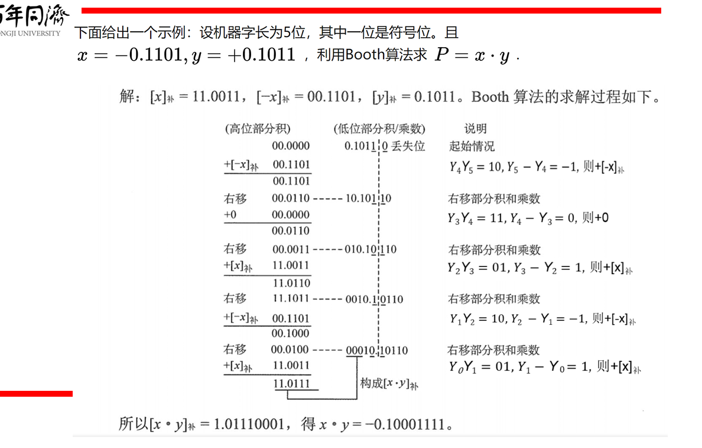
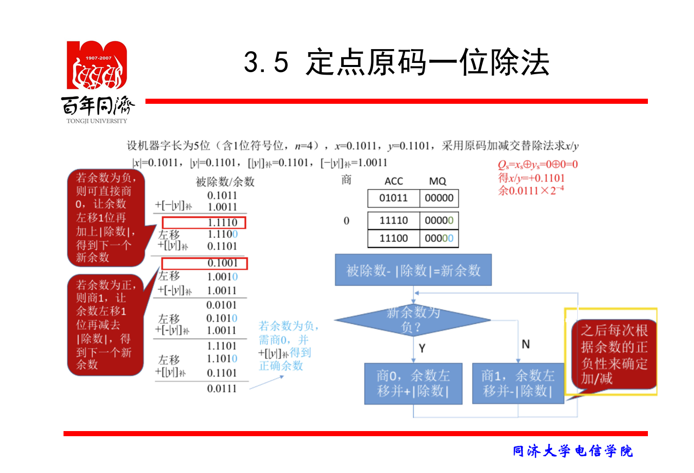
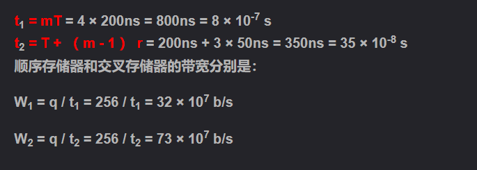
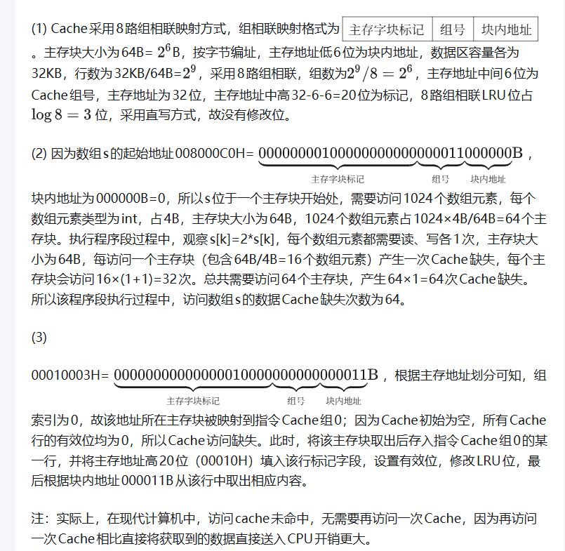

注：80% 题目为原题一模一样，20% 题目通过转述完成，所有题目均能表达原意。  
使用必须联系作者，否则构成侵权或盗用，将被追究法律责任。  
作者并不拥有所有题目的著作权，但是作者有维护本文档仅仅用于 **学生复习** 的义务，请勿用于商业用途。

---


## 一、选择题

### 1. 冯·诺依曼机中区分指令和数据的部件是：
- A. 总线  
- B. 控制器  
- C. 控制存储器  
- D. 运算器  
在冯·诺依曼机中，指令和数据存储在同一存储器中，但需要通过特定部件来区分它们。控制器是负责管理指令执行流程的部件，它从存储器中读取指令（根据程序计数器的指向），解码并执行指令，同时根据需要访问数据。因此，控制器是区分指令和数据的关键部件。

其他选项的作用如下：
- A. 总线：负责在组件之间传输信息，但不区分指令和数据。
- C. 控制存储器：用于存储控制信号或微程序，但不是区分指令和数据的主要部件。
- D. 运算器：负责算术和逻辑运算，但只处理数据，不区分指令和数据。

故正确答案是 **B. 控制器**。

### 2. 下列不属于CPU控制单元的是
- A. 指令寄存器(IR)  
- B. 程序字状态寄存器(PSW)  
- C. 存储器数据寄存器(MDR)  
- D. 通用寄存器（GR）  
在CPU中，控制单元负责指令的执行控制，包括取指、解码和执行等操作。控制单元通常包含指令寄存器（IR）、程序计数器（PC）、状态寄存器（如程序状态字PSW）等部件，用于管理指令流程和状态信息。

- **A. 指令寄存器(IR)**：用于存储当前执行的指令，属于控制单元。
- **B. 程序字状态寄存器(PSW)**：用于存储处理器的状态标志（如进位、零标志等），控制单元根据这些状态决定控制流程，因此属于控制单元。
- **C. 存储器数据寄存器(MDR)**：用于临时存储从内存读取或写入内存的数据，属于内存接口部分，而非控制单元。
- **D. 通用寄存器（GR）**：用于存储数据和地址，供算术逻辑单元（ALU）使用，属于数据路径部分，不属于控制单元。

虽然MDR和GR都不属于控制单元，但通用寄存器（GR）更直接地与数据操作相关，且通常不被视为控制单元的一部分。因此，本题中不属于CPU控制单元的是**D. 通用寄存器（GR）**。

**答案：D**
### 3. 已知'a'的ASCII码为0x61，如果字母'g'的ascii采用偶校验，最高位为校验位，那么数据传输应该为
- A. 66H  
- B. E6H  
- C. 67H  
- D. E7H  

### 4. 32位补码整数的最小值为()
- A. -2^31  
- B. -2^32-1  
- C. -2^32  
- D. -2^32+1  

### 5. 若某单精度浮点数、某原码、某补码、某移码的32位机器数均为0xF0000000，则这些数从大到小的排序分别为
- A. 浮点数> 原码 > 补码 > 移码  
- B. 浮点数>移码 > 补码 > 原码  
- C. 移码> 原码 > 补码 > 浮点数  
- D. 移码> 补码 > 原码 > 浮点数  
- 原码就是符号位加上真值的绝对值即用第一位表示符号 其余位表示值。比如如果是8位二进制: +1 = 0000_0001
- 正数的反码是其本身，负数的反码是在其原码的基础上符号位不变，其余各个位取反。
- 正数的补码就是其本身，负数的补码是在其反码的基础上+1
- 不管正负数，只要将其补码的符号位取反即可
### 6. X= 103 y= -25 采用8位补码运算会溢出的是
- A. x+y  
- B. -x+y  
- C. x-y  
- D. -x-y  

### 7. 某计算机的CPU有30根地址线，按字节编制，CPU和主存连接时，要求主存芯片占满所有的存储地址空间，并且RAM区和ROM区所分配的空间大小比是3:1。若RAM在低地址区，ROM在高地址区，则ROM的地址范围是()
- A. 0000 0000~0FFF FFFF  
- B. 1000 0000~2FFF FFFF  
- C. 3000 0000~3FFF FFFF  
- D. 4000 0000~4FFF FFFF  

### 8. 为了缩短指令中某个地址段的位数，有效的方式是采取()
- A. 立即寻址  
- B. 变址寻址  
- C. 间接寻址  
- D. 寄存器寻址  
#### 寻址方式
A 是指令当中给出的地址，EA是实际地址
- 隐含寻址  
第二个操作数由累加器ACC提供  
有利于缩短指令字长，缺点是需要增加存储操作数或者隐含地址的硬件
- 立即寻址  
第二个操作数直接在指令中给出  
优点是简单，缺点是操作数必须在指令中给出，不利于程序的可移植性
- 直接寻址  
A=EA  
第二个操作数在存储器中给出，地址由指令中的操作数给出  
优点是操作数可以是变量，缺点是指令字长太长，不利于缩短
- 间接寻址  
EA=(A) D=(EA)=((A))
- 寄存器寻址   
EA=R(A)
- 寄存器间接寻址  
EA=E(R(A))
- 相对寻址  
EA=(PC)+A  
广泛用于转移指令，基于下一条地址
- 基址寻址  
EA=(BR)+A  
可以扩大寻址范围，但是A的位数较少
- 变址寻址    
EA=(IX)+A  
用于数组  

### 9. 以下四种类型指令中，执行时间最长的是（）
- A. RR型指令 寄存器-寄存器  
- B. RS型指令 寄存器-基址寄存器  
- C. SS型指令 基址寄存器-基址寄存器  
- D. 程序控制指令  

### 10. 指令() 从主存储器中读出
- A. 总是根据程序计数器  
- B. 有时根据程序计数器，有时根据转移指令  
- C. 根据地址寄存器  
- D. 有时根据程序计数器，有时根据地址寄存器  

在冯·诺依曼架构中，指令从主存储器中读出时，总是依据程序计数器（PC）。程序计数器保存下一条要执行的指令的地址，CPU在取指阶段使用PC的值访问主存储器以获取指令。即使遇到转移指令（如跳转或分支），转移指令也会修改PC的值，但随后指令读取仍然基于更新后的PC。因此，指令读取始终依赖于程序计数器。

其他选项分析：
- B. 有时根据程序计数器，有时根据转移指令：转移指令本身不直接提供取指地址，而是通过修改PC来间接影响取指，因此取指始终基于PC。
- C. 根据地址寄存器：地址寄存器通常用于数据访问（如加载或存储操作），而非指令读取。
- D. 有时根据程序计数器，有时根据地址寄存器：地址寄存器可能用于间接寻址模式的数据访问，但指令读取始终由PC控制。

故正确答案是 **A. 总是根据程序计数器**。
### 11. 下列关于ROM和RAM的说法中,错误的是( ) 
    - Ⅰ.CD—ROM是ROM的一种,因此只能写入一次  
    - Ⅱ.Flash快闪存储器属于随机存取存储器,具有随机存取的功能  
    - Ⅲ.RAM的读出方式是破坏性读出,因此读后需要再生  
    - Ⅳ.SRAM读后不需要刷新,而DRAM读后需要刷新  
- A. Ⅰ和Ⅱ  
- B. Ⅰ、Ⅲ和Ⅳ  
- C. Ⅱ和Ⅲ  
- D. Ⅰ、Ⅱ和Ⅲ  
D
正确答案:D
解析:本题考查ROM和RAM的特点。CD—ROM属于光盘存储器,是一种机械式的存储器,和ROM有本质的区别,其名字中有ROM只是为了突出只读(read only)而已,Ⅰ错误。Flash存储器是E2PROM的改进产品,虽然它也可以实现随机存取,但从原理上讲仍属于ROM,而且RAM是易失性存储器,Ⅱ错误。SRAM的读出方式并不是破坏性的,读出后不需再生,Ⅲ错误。SRAM采用双稳态触发器来记忆信息,因此不需要再生;而DRAM采用电容存储电荷的原理来存储信息,只能维持很短的时间,因此需要再生,Ⅳ正确。 注意:通常意义上的ROM只能读出,不能写入。信息永久保存,属非易失性存储器。ROM和RAM可同作为主存的一部分,构成主存的地址域。ROM的升级版:EPROM、EEPROM、Flash。

### 12. 相对于微程序控制器，硬布线控制器的特点是（）
- A. 指令执行的速度慢，指令功能的修改和扩展容易  
- B. 指令执行的速度慢，指令功能的修改和扩展难  
- C. 指令执行的速度快，指令功能的修改和扩展容易  
- D. 指令执行的速度快，指令功能的修改和扩展难  

### 13. 堆栈计算机中有些堆栈零地址的运算类指令在指令格式中不能给出操作数地址，参加的两个操作数来自（）
- A. 累加器和寄存器  
- B. 累加器和暂存器  
- C. 堆栈的栈顶和次栈顶单元  
- D. 堆栈的栈顶单元和寄存器  

### 14. 一个计算机系统的虚拟存储器的最大容量由什么决定的（）
- A. 主存储器  
- B. 辅助存储器  
- C. 地址总线  
- D. 主存储器+辅助存储器  
虚拟存储器的最大容量是指虚拟地址空间的大小，这取决于计算机系统的地址寻址能力。地址总线的宽度决定了CPU可以访问的地址范围，从而限制了虚拟存储器的最大容量。例如，32位地址总线支持的最大虚拟地址空间为4GB（2^32字节），而64位地址总线支持更大的虚拟地址空间。

其他选项分析：
- A. 主存储器：主存储器（物理内存）的大小影响物理内存的容量，但不直接决定虚拟存储器的最大容量。
- B. 辅助存储器：辅助存储器（如硬盘）用于存储虚拟内存的页面文件，但其大小不限制虚拟地址空间的最大值。
- D. 主存储器+辅助存储器：虽然虚拟存储器使用主存和辅存结合的技术，但虚拟地址空间的最大容量由地址总线宽度决定，而不是实际存储器的总和。

因此，正确答案是 **C. 地址总线**。

### 15. 设计某指令系统时，假设采用16位定长指令字格式，操作码使用扩展编码方式，地址码为4位，包含零地址、一地址、二地址、三地址4种格式的指令。若三地址指令有15条，二地址指令有8条，一地址指令有127条，那么零地址指令有（）条
- A. 16  
- B. 15  
- C. 31  
- D. 32  

### 16. DMA 方式下，数据从内存传送到外设经过的路径是（）
- A. 内存-> 数据总线 -> 外设  
- B. 内存-> 数据总线 -> DMAC -> 外设  
- C. 内存-> CPU -> 数据总线 -> 外设  
- D. 外设 -> 内存
在DMA（直接内存访问）方式下，数据从内存传送到外设时，数据传输路径是直接的，不经过CPU。DMA控制器（DMAC）负责控制数据传输过程，但数据本身不流经DMAC的存储部件，而是通过数据总线直接从内存传输到外设。因此，正确的路径是内存 -> 数据总线 -> 外设。

选项分析：
- A. 内存 -> 数据总线 -> 外设：正确，反映了DMA直接传输的本质。
- B. 内存 -> 数据总线 -> DMAC -> 外设：错误，数据不流经DMAC，DMAC仅控制传输。
- C. 内存 -> CPU -> 数据总线 -> 外设：错误，DMA方式下数据不经过CPU。
- D. 外设 -> 内存：错误，方向与问题相反。

故正确答案是 **A. 内存-> 数据总线 -> 外设**。

## 二、填空题
### 17. 8位补码整数的最小值是_____，其二进制表示为_____.如果这是一个规格化浮点数，采用补码的方式表示，其尾数为负，那么它小数点后最高位一定是______.

- 8位补码整数的最小值是 -128。

- 其二进制表示为 10000000。

- 如果这是一个规格化浮点数，采用补码的方式表示，其尾数为负，那么它小数点后最高位一定是 1。
### 18. Cache的三种主存映射方式分别为____________,______________,______________.
 Cache的三种主存映射方式分别为 直接映射, 全相联映射, 组相联映射。
### 19. 计算机指令系统分为_________,__________.
计算机指令系统分为 CISC, RISC。
### 20. 微程序一般存放在_____当中，控制信号包括______与下地址。如果采用直接编码法，256个信号分为4个字段，那么每个字段至少有_________位。
- 微程序一般存放在 控制存储器 当中。

- 控制信号包括 操作控制信号 与下地址。

- 如果采用直接编码法，256个信号分为4个字段，那么每个字段至少有 6 位。（因为每个字段有64个信号，需要log₂64=6位进行编码。）
### 21. 一个完整的指令周期可包括_________,_________,_________,__________四个周期。
一个完整的指令周期可包括 取指周期, 译码周期, 执行周期, 写回周期 四个周期。
## 三．简答题
### 22. 
- (1) 什么是存储程序原理？按此原理，计算机由几大功能？
- (2) 执行程序的过程当中，CPU如何区分指令和数据？
#### (1) 存储程序原理及计算机功能组成

**存储程序原理**：由冯·诺依曼提出，其核心思想包括：
- 指令和数据以二进制形式存储在同一个存储器中
- 计算机按照顺序执行指令，通过程序计数器（PC）自动控制执行流程
- 计算机由五大基本部件组成：运算器、控制器、存储器、输入设备和输出设备

**按此原理，计算机的五大功能部件**：
1. **运算器**：执行算术运算和逻辑运算
2. **控制器**：控制程序的执行流程，协调各部件工作
3. **存储器**：存储程序和数据
4. **输入设备**：将外部信息输入计算机
5. **输出设备**：将计算机处理结果输出

#### (2) CPU区分指令和数据的机制

在执行程序过程中，CPU通过以下方式区分指令和数据：

**时间维度区分**：
- **取指周期**：从存储器中读取的是指令
  - 地址来自程序计数器（PC）
  - 读取内容存入指令寄存器（IR）
- **执行周期**：从存储器中读取的是数据
  - 地址来自指令中的地址字段
  - 读取内容存入存储器数据寄存器（MDR）

**空间维度区分**：
- **指令流**：从指令寄存器（IR）流向控制器
- **数据流**：从存储器数据寄存器（MDR）流向运算器

**硬件支持**：
- **程序计数器（PC）**：专门用于指示指令地址
- **指令寄存器（IR）**：专门用于存放当前执行的指令
- **地址寄存器（MAR）**：存放要访问的存储单元地址
- **控制信号**：控制器产生不同的控制信号来区分指令操作和数据操作

**举例说明**：
当执行"LOAD R1, [1000]"指令时：
- 取指阶段：根据PC值读取的是LOAD指令本身（指令）
- 执行阶段：根据地址1000读取的是要加载的数据（数据）

这种区分不是基于存储内容本身，而是基于**CPU在不同时间、不同用途下对同一存储空间中内容的解释方式**。
### 23. 使用补码加减交替法来计算x/y.其中x=0.1000，y=-0.1011





### 24. 计算1100 的CRC循环校验码，使用生成多项式1011.

### 25. 
某计算机的主频为50MHz，即每秒计算机有50M个时钟周期。现有设备A为，其数据传输速率为40MB/s，每次数据传输可以传输32位。
- （1）CPU每次中断需要400个时钟周期，那么A设备能否采用中断方式查询？
- （2）如果采用DMA方式，每次DMA传输的数据块大小为1000B，CPU用于DMA预处理和后处理的总时钟周期数为500，则CPU用于A设备输入/输出时间占CPU总时间的百分比最多是多少?
#### （1）中断方式查询的可行性分析

设备A的数据传输速率为40 MB/s，每次数据传输为32位（即4字节）。因此，设备A每秒传输的次数为：
$
\frac{40 \times 10^6 \text{ bytes/s}}{4 \text{ bytes/次}} = 10 \times 10^6 \text{ 次/s} = 10 \text{ M次/s}
$
即每秒产生10M次中断请求。

CPU每次中断需要400个时钟周期，因此每秒处理中断所需时钟周期为：
$
10 \times 10^6 \times 400 = 4 \times 10^9 \text{ cycles/s}
$
CPU主频为50 MHz，即每秒有50 × 10^6个时钟周期：
$
50 \times 10^6 \text{ cycles/s}
$
中断所需时钟周期占CPU总时钟周期的比例为：
$
\frac{4 \times 10^9}{50 \times 10^6} = 80 = 8000\%
$
这意味着中断处理需要占用CPU 8000%的时间，显然不可能实现。因此，设备A不能采用中断方式查询。

#### （2）DMA方式下CPU时间占用百分比

设备A的数据传输速率为40 MB/s，采用DMA方式，每次DMA传输的数据块大小为1000字节。因此，每秒DMA传输的次数为：
$
\frac{40 \times 10^6 \text{ bytes/s}}{1000 \text{ bytes/次}} = 40,000 \text{ 次/s}
$
每次DMA传输，CPU用于预处理和后处理的总时钟周期数为500，因此每秒CPU用于DMA的时钟周期为：
$
40,000 \times 500 = 20 \times 10^6 \text{ cycles/s}
$
CPU总时钟周期为50 × 10^6 cycles/s，因此CPU用于设备A输入/输出时间占CPU总时间的百分比为：
$
\frac{20 \times 10^6}{50 \times 10^6} \times 100\% = 40\%
$
故CPU用于A设备输入/输出时间占CPU总时间的百分比最多是40%。
### 26. 
设存储器容量为32个字，字长为64位，模块数m=4，分别采用顺序方式和交叉存储方式进行组织。存取周期T=200ns，数据总线宽度位64位，总线传输周期r=50ns。在连续读出4个字的情况下，求顺序存储器和交叉存储器各自的带宽。


### 27. 什么是微指令和指令，两者的关系是什么。
### 微指令与指令的定义及关系

#### 1. **指令（Instruction）**
- **定义**：指令是计算机程序中的基本操作命令，由操作码（Opcode）和操作数（Operand）组成，用于指示CPU执行特定的操作，如算术运算、逻辑运算、数据传输和控制流程等。指令是软件与硬件之间的接口，通常存储在主存储器中，由CPU直接解码和执行。
- **示例**：例如，一条加法指令 `ADD R1, R2` 表示将寄存器R1和R2的值相加，结果存回R1。

#### 2. **微指令（Micro-instruction）**
- **定义**：微指令是微程序中的基本步骤，用于实现一条指令的底层控制。每条微指令包含一组控制信号（如ALU操作、寄存器选择、总线控制等），这些信号直接驱动CPU的硬件组件（如运算器、寄存器、总线）。微指令存储在控制存储器（Control Store）中，由微程序控制器执行。
- **示例**：对于一条加法指令，其微程序可能包括多条微指令，如取指微指令、译码微指令、执行加法微指令和写回结果微指令。

#### 3. **两者关系**
- **层次关系**：微指令是指令的底层实现。一条指令通常被分解为一系列微操作（Micro-operations），每个微操作由一条或多条微指令控制。因此，指令是宏观层面的命令，而微指令是微观层面的控制信号。
- **执行过程**：当CPU执行一条指令时，微程序控制器会从控制存储器中读取对应的微程序（由微指令序列组成），并逐步执行这些微指令，从而完成指令的功能。例如：
  - **取指周期**：由微指令控制从主存读取指令到指令寄存器。
  - **译码周期**：由微指令解析指令操作码。
  - **执行周期**：由微指令生成控制信号，驱动ALU和寄存器执行操作。
  - **写回周期**：由微指令将结果写回寄存器或主存。
- **存储位置**：指令存储在主存储器中，而微指令存储在控制存储器中（通常为ROM或可写控制存储器）。
- **设计灵活性**：微指令的使用允许CPU设计者通过修改微程序来改变指令的行为，从而支持不同的指令集架构（如CISC和RISC）。在RISC架构中，指令通常直接由硬件电路执行，而不需要复杂的微程序，但微指令概念仍适用于控制逻辑。

#### 总结
微指令和指令是计算机体系中不同抽象级别的概念。指令是程序员可见的命令，而微指令是硬件控制器使用的内部信号。两者通过微程序关联，微指令序列共同实现一条指令的功能，确保了计算机的正确执行。
## 四、综合题
### 28. 某试验机总共有64种操作码，采用定长指令系统，有如下要求。
- （1）有两种指令系统分为一地址指令和二地址指令
- （2）有三种指令寻址方式，分别为寄存器寻址，直接寻址，相对寻址(-128~127)
- （3）有16个通用寄存器，算数逻辑运算在寄存器间进行，运算结果也存储在寄存器当中
- （4）与主存的存取过程也发生在通用寄存器当中
- （5）内存1MB，按照字节编址   
请分别设计算术逻辑指令，取存指令，相对转移指令的指令格式。

### 29. 假定主存地址为32位，按字节编址，指令Cache和数据Cache与主存之间均采用8路组相联映射方式，直写法（Write Through）和LRU替换算法，主存块大小为64B，数据区容量各为32KB。开始时Cache均为空。请回答下列问题
- （1）Cache每一行中标记（Tag），LRU位各占几位？是否有修改位？
- （2）有如下C语言程序段：
```c
for (k=0;k<1024;k++)
    s[k]=2*s[k];
```
若数组s及其变量k均为 int 型，int 型数据占4B，变量k分配在寄存器中，数组s在主存中的起始地址为0080 00C0H，则该程序段执行过程中，访问数组s的数据 Cache 缺失次数为多少?
- （3）若CPU最先开始的访问操作是读取主存单元0001003H中的指令，简要说明从Cache 中访问该指令的过程，包括 Cache 缺失处理过程。

### 30. 下图是一个简化的 CPU与主存连接结构示意图(图中省略了所有的多路选择器)。其中有一个累加寄存器(ACC)、一个状态数据寄存器和其他4个寄存器:存储器地址寄存器(MAR)、存储器数据寄存器(MDR)、程序寄存器(PC)和指令寄存器(IR)，各部件及其之间的连线表示数据通路，箭头表示信息传递方向。
  
要求:
- （1）请写出图中 a、b、c、d 四个寄存器的名称。
- （2）简述图中取指令的数据通路。
- （3）简述数据在运算器和主存之间进行存/取访问的数据通路(假设地址已在MAR 中)。
- （4）简述完成指令LDA X的数据通路(X为主存地址，LDA的功能为(X)→ACC).
- （5）简述完成指令 ADD Y的数据通路(Y为主存地址，ADD的功能为(ACC)+(Y)→ACC).
- （6）简述完成指令STA Z的数据通路(Z为主存地址，STA的功能为(ACC)→Z)。

[答案](https://blog.csdn.net/weixin_69884785/article/details/136219926)
