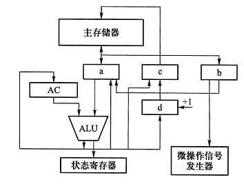

# 计算机组成原理试题

注：80% 题目为原题一模一样，20% 题目通过转述完成，所有题目均能表达原意。

---


## 一、选择题

### 1. 冯·诺依曼机中区分指令和数据的部件是：
- A. 总线  
- B. 控制器  
- C. 控制存储器  
- D. 运算器  

### 2. 下列不属于CPU控制单元的是
- A. 指令寄存器(IR)  
- B. 程序字状态寄存器(PSW)  
- C. 存储器数据寄存器(MDR)  
- D. 通用寄存器（GR）  

### 3. 已知'a'的ASCII码为0x61，如果字母'g'的ascii采用偶校验，最高位为校验位，那么数据传输应该为
- A. 66H  
- B. E6H  
- C. 67H  
- D. E7H  

### 4. 32位补码整数的最小值为()
- A. -2^31  
- B. -2^32-1  
- C. -2^32  
- D. -2^32+1  

### 5. 若某单精度浮点数、某原码、某补码、某移码的32位机器数均为0xF0000000，则这些数从大到小的排序分别为
- A. 浮点数> 原码 > 补码 > 移码  
- B. 浮点数>移码 > 补码 > 原码  
- C. 移码> 原码 > 补码 > 浮点数  
- D. 移码> 补码 > 原码 > 浮点数  

### 6. X= 103 y= -25 采用8位补码运算会溢出的是
- A. x+y  
- B. -x+y  
- C. x-y  
- D. -x-y  

### 7. 某计算机的CPU有30根地址线，按字节编制，CPU和主存连接时，要求主存芯片占满所有的存储地址空间，并且RAM区和ROM区所分配的空间大小比是3:1。若RAM在低地址区，ROM在高地址区，则ROM的地址范围是()
- A. 0000 0000~0FFF FFFF  
- B. 1000 0000~2FFF FFFF  
- C. 3000 0000~3FFF FFFF  
- D. 4000 0000~4FFF FFFF  

### 8. 为了缩短指令中某个地址段的位数，有效的方式是采取()
- A. 立即寻址  
- B. 变址寻址  
- C. 间接寻址  
- D. 寄存器寻址  

### 9. 以下四种类型指令中，执行时间最长的是（）
- A. RR型指令 寄存器-寄存器  
- B. RS型指令 寄存器-基址寄存器  
- C. SS型指令 基址寄存器-基址寄存器  
- D. 程序控制指令  

### 10. 指令() 从主存储器中读出
- A. 总是根据程序计数器  
- B. 有时根据程序计数器，有时根据转移指令  
- C. 根据地址寄存器  
- D. 有时根据程序计数器，有时根据地址寄存器  

### 11. 下列关于ROM和RAM的说法中,错误的是( ) 
- Ⅰ.CD—ROM是ROM的一种,因此只能写入一次  
- Ⅱ.Flash快闪存储器属于随机存取存储器,具有随机存取的功能  
- Ⅲ.RAM的读出方式是破坏性读出,因此读后需要再生  
- Ⅳ.SRAM读后不需要刷新,而DRAM读后需要刷新  
- A. Ⅰ和Ⅱ  
- B. Ⅰ、Ⅲ和Ⅳ  
- C. Ⅱ和Ⅲ  
- D. Ⅰ、Ⅱ和Ⅲ  

### 12. 相对于微程序控制器，硬布线控制器的特点是（）
- A. 指令执行的速度慢，指令功能的修改和扩展容易  
- B. 指令执行的速度慢，指令功能的修改和扩展难  
- C. 指令执行的速度快，指令功能的修改和扩展容易  
- D. 指令执行的速度快，指令功能的修改和扩展难  

### 13. 堆栈计算机中有些堆栈零地址的运算类指令在指令格式中不能给出操作数地址，参加的两个操作数来自（）
- A. 累加器和寄存器  
- B. 累加器和暂存器  
- C. 堆栈的栈顶和次栈顶单元  
- D. 堆栈的栈顶单元和寄存器  

### 14. 一个计算机系统的虚拟存储器的最大容量由什么决定的（）
- A. 主存储器  
- B. 辅助存储器  
- C. 地址总线  
- D. 主存储器+辅助存储器  

### 15. 设计某指令系统时，假设采用16位定长指令字格式，操作码使用扩展编码方式，地址码为4位，包含零地址、一地址、二地址、三地址4种格式的指令。若三地址指令有15条，二地址指令有8条，一地址指令有127条，那么零地址指令有（）条
- A. 16  
- B. 15  
- C. 31  
- D. 32  

### 16. DMA 方式下，数据从内存传送到外设经过的路径是（）
- A. 内存-> 数据总线 -> 外设  
- B. 内存-> 数据总线 -> DMAC -> 外设  
- C. 内存-> CPU -> 数据总线 -> 外设  
- D. 外设 -> 内存

## 二、填空题
### 17. 8位补码整数的最小值是_____，其二进制表示为_____.如果这是一个规格化浮点数，采用补码的方式表示，其尾数为负，那么它小数点后最高位一定是______.

### 18. Cache的三种主存映射方式分别为____________,______________,______________.

### 19. 计算机指令系统分为_________,__________.

### 20. 微程序一般存放在_____当中，控制信号包括______与下地址。如果采用直接编码法，256个信号分为4个字段，那么每个字段至少有_________位。

### 21. 一个完整的指令周期可包括_________,_________,_________,__________四个周期。

## 三．简答题
### 22. 
- (1) 什么是存储程序原理？按此原理，计算机由几大功能？
- (2) 执行程序的过程当中，CPU如何区分指令和数据？

### 23. 使用补码加减交替法来计算x/y.其中x=0.1000，y=-0.1011

### 24. 计算1100 的CRC循环校验码，使用生成多项式1011.

### 25. 某计算机的主频为50MHz，即每秒计算机有50M个时钟周期。现有设备A为，其数据传输速率为40MB/s，每次数据传输可以传输32位。
- （1）CPU每次中断需要400个时钟周期，那么A设备能否采用中断方式查询？
- （2）如果采用DMA方式，每次DMA传输的数据块大小为1000B，CPU用于DMA预处理和后处理的总时钟周期数为500，则CPU用于A设备输入/输出时间占CPU总时间的百分比最多是多少?

### 26. 设存储器容量为32个字，字长为64位，模块数m=4，分别采用顺序方式和交叉存储方式进行组织。存取周期T=200ns，数据总线宽度位64位，总线传输周期r=50ns。在连续读出4个字的情况下，求顺序存储器和交叉存储器各自的带宽。

### 27. 什么是微指令和指令，两者的关系是什么。

## 四、综合题
### 28. 某试验机总共有64种操作码，采用定长指令系统，有如下要求。
- （1）有两种指令系统分为一地址指令和二地址指令
- （2）有三种指令寻址方式，分别为寄存器寻址，直接寻址，相对寻址(-128~127)
- （3）有16个通用寄存器，算数逻辑运算在寄存器间进行，运算结果也存储在寄存器当中
- （4）与主存的存取过程也发生在通用寄存器当中
- （5）内存1MB，按照字节编址   
请分别设计算术逻辑指令，取存指令，相对转移指令的指令格式。

### 29. 假定主存地址为32位，按字节编址，指令Cache和数据Cache与主存之间均采用8路组相联映射方式，直写法（Write Through）和LRU替换算法，主存块大小为64B，数据区容量各为32KB。开始时Cache均为空。请回答下列问题
- （1）Cache每一行中标记（Tag），LRU位各占几位？是否有修改位？
- （2）有如下C语言程序段：
```c
for (k=0;k<1024;k++)
    s[k]=2*s[k];
```
若数组s及其变量k均为 int 型，int 型数据占4B，变量k分配在寄存器中，数组s在主存中的起始地址为0080 00C0H，则该程序段执行过程中，访问数组s的数据 Cache 缺失次数为多少?
- （3）若CPU最先开始的访问操作是读取主存单元0001003H中的指令，简要说明从Cache 中访问该指令的过程，包括 Cache 缺失处理过程。

### 30. 下图是一个简化的 CPU与主存连接结构示意图(图中省略了所有的多路选择器)。其中有一个累加寄存器(ACC)、一个状态数据寄存器和其他4个寄存器:存储器地址寄存器(MAR)、存储器数据寄存器(MDR)、程序寄存器(PC)和指令寄存器(IR)，各部件及其之间的连线表示数据通路，箭头表示信息传递方向。

要求:
- （1）请写出图中 a、b、c、d 四个寄存器的名称。
- （2）简述图中取指令的数据通路。
- （3）简述数据在运算器和主存之间进行存/取访问的数据通路(假设地址已在MAR 中)。
- （4）简述完成指令LDA X的数据通路(X为主存地址，LDA的功能为(X)→ACC).
- （5）简述完成指令 ADD Y的数据通路(Y为主存地址，ADD的功能为(ACC)+(Y)→ACC).
- （6）简述完成指令STA Z的数据通路(Z为主存地址，STA的功能为(ACC)→Z)。