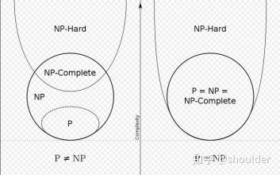

# 单纯型法
## 数学模型
- 决策变量 $X=(x_1,x_2,\cdots,x_n)^T$  $x_j \ge 0$
- 约束条件 $\sum_{j=1}^n a_ijx_j \le b_i$ $i=1,2,\cdots,m$
- 目标函数 $max(min)Z=\sum_{j=1}^n c_jx_j$
## 标准型
- 资源限量 $b_i \ge 0$
- 价值向量 $\bf{C} = (c_1,c_2,\cdots,c_n)^T$
### 化解步骤
- **目标函数最大**。最小值时，要把目标函数的符号反转$Z' = -Z$
- **资源限量非负** $b_i \ge 0$，对于不大于零的式子，要乘以$-1$
- **约束条件等式** 对于有小于等于的等式，要加上松弛变量，例如：$-2x_1+x_2+x_3 \le 9$ 变为 $-2x_1+x_2+x_3+x_4 = 9$。对于包含大于等于的式子，要减去剩余变量，例如：$x_1+x_2+x_3 \ge 5$ 变为 $x_1+x_2+x_3-x_5 = 5$。松弛变量与剩余变量分别表示未被充分利用的资源，但是价值系数保持为0。
- **决策变量非负**  对于$x_j \le 0$，要换成一个变量$x_j' = -x_j$。对于无约束的变量$x_k$,引入两个新的变量$x_k',x_k''$，将$x_k$转化为$x_k'-x_k''$。其中$x_k'\ge 0,x_k''\ge 0$。

## 解的概念
- 约束条件等式所构成的增广矩阵$\bf A $为满秩矩阵。
- 如果能够找到一个$\bf B$,使得$\bf B$为$\bf A $的满秩子矩阵，那么称$\bf B$为线性规划的一个基。
- 方程有n-m个自由变量
- 假设前m个变量的基向量为其系数向量，那么有$\sum_{i=1}^n \bf{a_i}  x_i = \bf b $，则有$\sum_{i=1}^m \bf{a_i}  x_i = \bf b - \sum_{i=m+1}^n \bf{a_i}  x_i$,可以将原来的$\bf X$ 化为$\bf X= (X_B,X_N)$
## 单纯型法的步骤
- 两阶段法这个网站讲的很好，按照这个例题来https://blog.csdn.net/se511/article/details/9042027，可以使用这个网站辅助计算https://www.mathstools.com/section/main/simplex_online_calculator#
# 算法复杂度分析
## 三种复杂度
- $f(n) \in O(g(n))$ 表示 $|f(n)| \le k g(n)$
- $f(n) \in \Omega(g(n))$ 表示 $|f(n)| \ge k g(n)$
- $f(n) \in \Theta(g(n))$ 表示 $|f(n)| = k g(n)$
## 复杂度运算法则
- $O(f)+O(g) = O(max(f,g))=O(f+g)$
- $O(f)O(g) = O(f \cdot g)$
## 主定理
在算法分析中，**主定理（Master Theorem）** 是用于求解形如递归关系式的时间复杂度的重要工具，尤其适用于分治算法的复杂度分析。下面将从定理内容、应用条件、常见案例及注意事项等方面详细介绍。

### 主定理的形式与定义
主定理用于求解以下形式的递归关系式：
$$T(n) = a \cdot T\left(\frac{n}{b}\right) + f(n)$$
其中：
- **n** 为问题规模；
- **a** 为递归调用的次数（$a \geq 1$）；
- **$\frac{n}{b}$** 为每个子问题的规模（$b > 1$，通常为整数）；
- **$f(n)$** 为递归外的计算成本（如合并子问题解的时间）。

主定理根据 $f(n)$ 与 $n^{\log_b a}$ 的增长关系，将复杂度分为三种情况：

### 主定理的三种情况
假设 $c = \log_b a$，则：

1. **情况一：$f(n) = O(n^{c - \varepsilon})$（$\varepsilon > 0$ 为常数）**  
   - 此时，递归项主导，复杂度为：
     $$T(n) = \Theta(n^c) = \Theta(n^{\log_b a})$$
   - **直观理解**：$f(n)$ 的增长速度显著慢于 $n^c$，子问题的递归成本占主导。

2. **情况二：$f(n) = \Theta(n^c \cdot \log^k n)$（$k \geq 0$ 为常数）**  
   - 此时，递归项与 $f(n)$ 增长速度相当，复杂度为：
     $$T(n) = \Theta(n^c \cdot \log^{k+1} n)$$
   - **常见子情况**：
     - 当 $k=0$ 时，$f(n) = \Theta(n^c)$，则 $T(n) = \Theta(n^c \cdot \log n)$。

3. **情况三：$f(n) = \Omega(n^{c + \varepsilon})$（$\varepsilon > 0$ 为常数），且满足正则条件 $a \cdot f(n/b) \leq k \cdot f(n)$（$k < 1$ 为常数）**  
   - 此时，非递归项主导，复杂度为：
     $$T(n) = \Theta(f(n))$$
   - **正则条件说明**：确保 $f(n)$ 的增长足够快，避免递归项对其主导性的影响（例如 $f(n)$ 不能是指数级震荡函数）。
## NP完全问题
### P问题
所有可以在多项式时间内用确定性算法求解的问题，如排序、最短路径等。
### NP问题
- 对于问题的任意一个可能解，存在一个多项式时间的验证算法（即验证时间为 $O(n^k)$，其中 $k$ 为常数），但不存在一个多项式时间的解算法。为常数），能够判断该解是否为正确解。
- 或者从非确定性图灵机的角度定义：可以在非确定性多项式时间内求解的问题（非确定性图灵机可理解为能 “猜测” 正确解并验证的抽象计算模型）。
- NP 类问题的求解可能需要指数级时间（如穷举搜索），但**验证**一个解的正确性仅需多项式时间。
### NPC(NP-complete)问题
- 首先，它得是一个NP问题；
- 然后，所有的NP问题都可以约化到它。
### NP-Hard问题
是这样一种问题，它满足NPC问题定义的第二条但不一定要满足第一条（就是说，NP-Hard问题要比 NPC问题的范围广，NP-Hard问题没有限定属于NP），即所有的NP问题都能约化到它，但是它不一定是一个NP问题。

