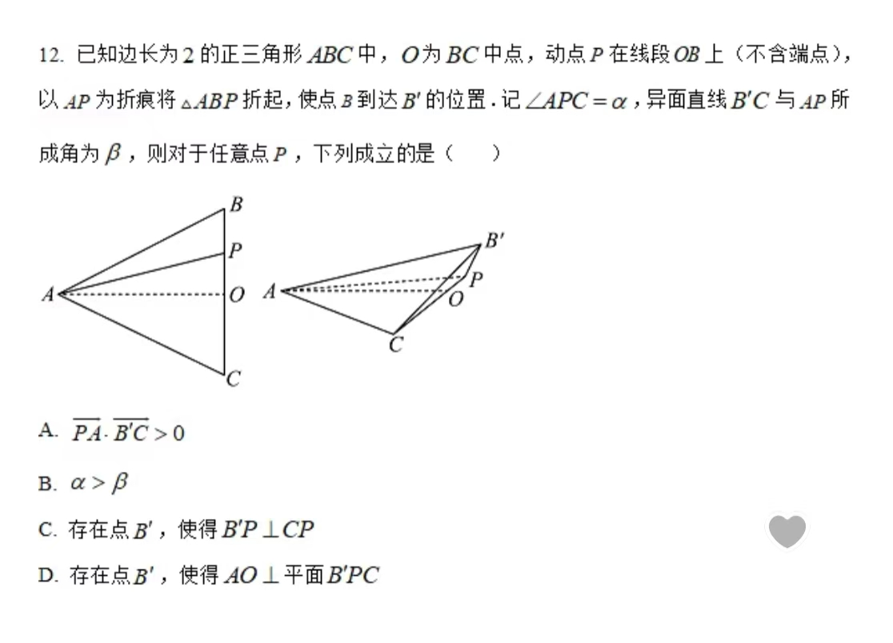

# 数学家教

## 阿基米德多面体

这里提供13个阿基米德多面体的图像以供感知。[Archimedean](https://cn.mathigon.org/step/polyhedra/archimedean)  

### 定义
由两种或多种不同类型的非相交正凸多边形以相同的方式围绕每个顶点排列，且所有边都具有相同的长度

### 性质
- 阿基米德立体都能够被正四面体外接，使得它们的四个面位于该四面体的面上。  
    - 尝试证明`cuboctahedron`满足如此性质

- 阿基米德立体满足  
    $$(2\pi-\sigma)\times V = 4\pi$$ 
  其中$\sigma$为顶点处面角的总和，$V$为顶点数。
    - 尝试证明`icosidodecahedron`满足如此性质

- 设 $r_d$ 为对偶多面体的内半径（对应于内切球，内切球与对偶立体的面相切），$\rho=\rho_d$ 为多面体及其对偶的中间半径（对应于中切球，中切球与多面体及其对偶的边都相切），$R$ 为阿基米德立体的外接球半径（对应于立体的外接球，外接球与立体的顶点相切），$a$ 为立体的边长。由于外接球和内切球彼此对偶，它们遵循以下关系
    $$
    R \times r_d = \rho^2
    $$
    此外，仍有性质：
    - $$ R = \frac{1}{2}(r_d + \sqrt{r_d^2+a^2} ) = \sqrt{\rho^2+\frac{1}{4}a^2} $$
    - $$ r_d = \frac{\rho^2}{\sqrt{\rho^2+\frac{1}{4}a^2}}=\frac{R^2-\frac{1}{4}a^2}{R} $$
    - $$ \rho = \frac{\sqrt{2}}{2}\sqrt{r_d^2+r_d\sqrt{r_d^2+a^2}}=\sqrt{R^2-\frac{1}{4}a^2}$$
    - 尝试证明`truncated tetrahedron`满足如此性质
## 翻折问题
- 翻折问题的关键在于寻找不变量，不变包括**线段长度**的不变和**线段关系**的不变。
- 如果找不到合适的不变量，那么寻找易于观察的参考者，例如旋转轴，以及垂直于旋转轴的平面。  
如下题： 

## 不规则几何体的外接球
### 一种程序化的笨办法如下
需要注意的是，这个办法的**计算复杂**，不到万不得已不使用。

可以按照如下步骤进行：
- 如果这个几何体存在外接球，则必然有每个定点位于外接球球面上
- 任取两组三个点组成的三角形，找到可以描述这两个三角形外接圆的语言。
- 沿着这两个圆的圆心垂线做出交点，没有交点就没有外接圆。
- 如果找到了交点，那么验证这个交点到所有顶点的距离相等。不相等则证明外接球不存在，相等则证明外接球存在。

然而高考中多数不会这么考，这么考浪费考生时间且没有技术含量。对于计算机编程来讲这样的算法已经足够健壮，但是对于某一道特定的高考题来讲，这仍然不够。

这个时候往往考察的是某一种凝神巧思，比如说对于四垂直四面体的外接球相对难求，但是补全变成长方体就会方便很多。

而对于一个普通的四面体，往往采用补全为长方体的办法。
## 三正弦定理

对于三正弦定理和三余弦定理的证明都是容易且显然的。

例题：
已知四棱锥S-ABCD是正四棱锥,侧棱长均相等,E是线段AB上的点(不含端点),设SE与BC所成的角为$\theta_1$,SE与平面ABCD所成的角为$\theta_2$，二面角S-AB-C的大小为$\theta_3$,则$\theta_1$,$\theta_2$,$\theta_3$的大小关系是什么？

以我的观感来看，三正弦三余弦的用途是特殊的，当题目考察的时候总能够明确感受到本知识点的出现。而对于不明确考察的题目，这样的知识是可有可无的，因为其证明并不困难，可以等价替换的方法有无数种，并不一定要这一定理辅助运算证明。

想要做更多题目练习可以参考这个网站[练习](https://m.fx361.cc/news/2025/0315/26015221.html)

## 外接球，内切球，棱切球
已经在阿基米德多面体当中做出讨论，不再考察。

## 复合函数
复合函数指的是原先的一个映射变成了两个映射的叠加。这一部分主要考察定义域和值域的问题。

例题：
已知$f(x+1)$的定义域为$[0,a]$，$(a>0)$，则$f(x)$的定义域为()

### 一个实用且变态的方法
旋转坐标轴，以内函数的y轴作为外函数的x轴。

## 分段函数的零点问题

本质是零点问题，零点问题的唯一求解办法为利用零点存在定理判定。