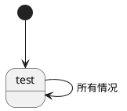

# Lecture3
## 自动机
- 一个有穷自动机可以接收$\epsilon$
### 无穷自动机
- $\delta$: $Q \times \Sigma_\epsilon \to P(Q)$  
- 幂级  
- 克林闭包： $\Sigma^*=U_{i=1}^{\infty}\Sigma^i$ 
### pump 崩？

### DFA 与 NFA 的等价性
- E(R) ={q| q can be reached from R by traeling along 0 or more $\epsilon $ arrows }
- 如果两个自动机能够识别相同的语言，那么可以认为两个自动机是等价的。$L(M) = L(N)$
#### 子集构造法
Proof let N = ($Q,\Sigma , \delta ,q_0 ,F$) be the DFA,recognizing language $\mathbb{A}$.Construct M=($Q`,\Sigma `,\delta`,q_0`,F`$)
1. Q'=P(Q)
2. $\delta`(R,a)=\{q \in Q |q \in E(\delta(r,a)) for $ $r \in R\}$
3. $q_0`=E(\{q_0\})$
4. $F`=\{R \in Q `| R$ $contains$  $an$  $accept\}$

result:$ L(M)=L(N)$

- **example**
    proof:两个正则语言的并叫做正则语言
    Def:有穷自动机能够识别的语言叫做正则语言。正则表达式描述的语言叫做正则语言。
    P:
    1. $Q = Q_1 \cap Q_2$
    2. $\delta(R,a)= \{q \in Q|\}$
- 一个NFA 可以通过$\epsilon$ 实现状态转移

