## MAC子层是什么
用来确定多路访问信道的下一个使用者的协议属于数据链路层的一个子层，成为介质1访问控制（Medium Access Control）MAC子层

## 多路复用技术简单回顾，这是物理层部分的知识

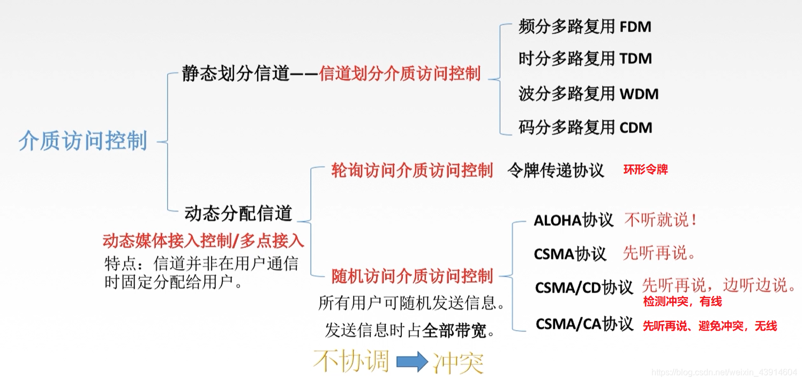
## 1 M/M/1 排队论模型
（参考来源：同济大学计算机科学与技术学院陆有军教授课堂补充文件）
## 1.1、网络性能分析的目的和方法
### （一）目的
- 对不同的网络设计策略、方案进行评价；
- 预测在给定输入负载下网络的性能；
- 对已经存在的网络，控制输入负载，从而得到需要的性能。

### （二）方法
网络性能分析主要有两种核心方法，具体如下：
1. **分析模型**：利用数学方法根据网络的基本特征构建模型，再通过数学计算与推导对网络性能进行评价。
2. **模拟**：利用模拟程序（如网络仿真工具）根据网络的基本特征构建模型，通过程序运行模拟网络运行过程，进而对网络性能进行评价。
3. **两者之间的关系**：
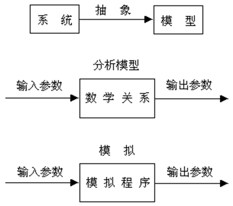

> 提示：本部分补充介绍网络性能分析中与排队理论相关的数学知识，为后续排队分析奠定基础。

## 二、相关概率论知识
### （一）最简单流
设$N(t)$表示在时间区间$[0,t]$内到达的顾客数（$t>0$），令$P_k(t_1,t_2)$表示在时间区间$[t_1,t_2]$（$t_2>t_1$）内有$k$个顾客到达的概率，即：
$P_k(t_1,t_2)＝P\{N(t_2)－N(t_1)＝k\}$（$k=0、1、2、…$，且$0≤t_1<t_2$）

当$P_k(t_1,t_2)$符合以下三个条件时，称顾客到达形成**简单流**：
1. **条件一（无后效性）**：在不相交的时间区间内，顾客到达数相互独立，即某一区间的到达情况不影响其他区间的到达概率。
2. **条件二（平稳性）**：对于充分小的$\Delta t$，在时间区间$[t,t+\Delta t]$内有1个顾客到达的概率与$t$无关，仅与区间长度$\Delta t$成正比，即：$$P_1(t,t+\Delta t)=\lambda\Delta t + O(\Delta t)$$其中，$O(t)$为当$t→0$时关于$t$的高阶无穷小量，常数$\lambda>0$称为**顾客平均到达率**。
3. **条件三（稀疏性）**：对于充分小的$\Delta t$，在时间区间$[t,t+\Delta t]$内有2个及以上顾客到达的概率极小，可忽略不计，即：$$\sum_{k=2}^{\infty}P_k(t,t+\Delta t)=O(\Delta t)$$
也就是说任意两个顾客不可能同时到达。

### （二）Poisson过程（泊松过程）
1. **泊松过程定义**
   定理：假定有无穷个顾客，且顾客在时间间隔$t$内独立到达$k$个的概率为：$$P\{N(t)=k\}=\frac{(\lambda t)^k e^{-\lambda t}}{k!} ,(k=0、1、2…) $$
   其中，$\lambda$是常数（顾客平均到达率），则称这种顾客到达过程为**泊松过程**。

2. **概率密度函数与统计特征**
   对于服从Poisson分布的顾客，其相邻到达间隔时间$x$的概率密度函数、数学期望和标准方差如下（推导过程略）：
   - （1）概率密度函数（负指数分布）：$f(x)=\lambda e^{-\lambda x}$（$x≥0$）
   - （2）数学期望（平均到达间隔时间）：$E[x]=\frac{1}{\lambda}$
   - （3）标准方差：$D[x]=\frac{1}{\lambda^2}$

## 三、Little定律（李特尔定律）
### 基本定义与推导
设在时间区间$[0,t]$内进入网络的报文数为$\alpha(t)$，离开网络的报文数为$\delta(t)$，则存储在网络中的报文数$N(t)$满足：$$N(t)＝\alpha(t)-\delta(t)$$

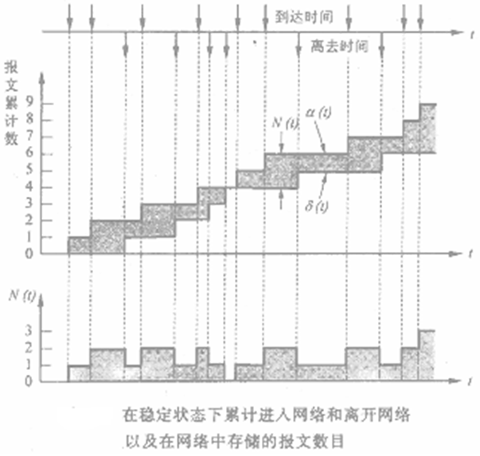

> 提示：典型的报文进入与离开网络的曲线（如$\alpha(t)$与$\delta(t)$的时序变化图）可直观展示报文在网络中的存储过程，图略。

基于上述定义，进一步推导关键参数：
1. **报文平均到达率**：$$\lambda_t=\frac{\alpha(t)}{t}$$  ——（A-1）
2. **报文在网络中的总经历时间**：$$\gamma(t)=\int_{0}^{t}N(\tau)d\tau$$（即曲线$\alpha(t)$和$\delta(t)$之间的面积，代表所有报文在网络中的总停留时间）
3. **时间区间[0,t]内网络中的平均报文数**：$$\bar{N}_t=\frac{1}{t}\int_{0}^{t}N(\tau)d\tau=\frac{\gamma(t)}{t}$$  ——（A-2）
4. **单个报文在网络中的平均经历时间**：$$T_t=\frac{\gamma(t)}{\alpha(t)}$$  ——（A-3）

5. 联立（A-1）、（A-2）、（A-3）式，可得：
$\bar{N}_t=\lambda_t \cdot T_t$  ——（A-4）

6. 当网络处于**稳定状态**时，令 $\bar{N}=\lim_{t \to \infty}\bar{N}_t$、 $\lambda=\lim_{t \to \infty}\lambda_t$、 $T=\lim_{t \to \infty}T_t$，则（A-4）式可改写为：
$\bar{N}=\lambda \cdot T$  ——（A-5）

### 定律核心含义
在稳定状态下，存储在网络中的报文平均数$\bar{N}$，等于报文的平均到达率$\lambda$乘以这些报文在网络中经历的平均时间$T$。

> 关键提示：
> 1. 网络边界可任意设定，但$\bar{N}$（平均存储报文数）、$\lambda$（平均到达率）和$T$（平均经历时间）必须对应同一个网络边界；
> 2. 报文输入规律（如到达间隔分布）或报文长度规律不影响Little定律的成立，该定律具有广泛适用性。

## 四、排队系统

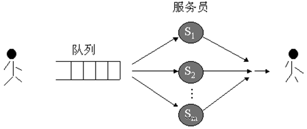
### （一）排队系统的基本模型
1. **模型核心要素**
   一个完整的排队系统由以下6个要素构成，各要素的设定决定了系统的运行特性：
   - 顾客总数：通常假定为无限（网络场景中报文数量可视为无限）；
   - 顾客到达规律：由**到达时间间隔的概率密度函数**描述（如负指数分布、确定分布）；
   - 服务员服务规律：由**服务时间的概率密度函数**描述（如报文发送时间的分布）；
   - 服务员个数：即网络中提供服务的资源数量（如信道数、服务器数量）；
   - 排队法则：报文在队列中的调度规则，常见包括优先级调度、FIFO（先进先出）、最短/最长先服务等；
   - 队列空间大小：通常假定为无穷大（忽略队列溢出场景，简化分析）。

2. **排队系统的标识方法**
   排队系统采用**A/B/m**格式标识，各符号含义如下：
   - A：顾客到达时间间隔的概率密度类型（到达规则）；
   - B：服务员服务时间的概率密度类型（服务规则）；
   - m：服务员个数（如信道数）。

   > 提示：A、B的常见取值说明：
   > - M（Markov）：表示负指数分布（具有无记忆性，适用于报文随机到达场景）；
   > - D（Deterministic）：表示确定值（到达间隔或服务时间固定，如周期性数据传输）；
   > - G（General）：表示通用分布（任意概率密度，适用于无法用简单分布描述的场景）。

### （二）M/M/1排队系统
#### 1. 系统定义与核心参数
- **含义**：顾客到达时间间隔服从负指数分布（A=M）、服务时间服从负指数分布（B=M）、服务员个数为1（m=1）的排队系统，对应网络中“单信道、报文随机到达与发送”的场景（如单条链路的报文传输）。
- **模型示意图**：
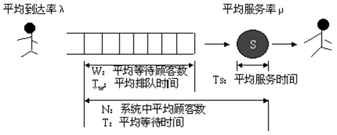
- **关键参数关系**：
  - $T_w = T - T_s$：$T_w$为平均排队等待时间（仅等待不包含服务），$T$为平均总停留时间（等待+服务），$T_s$为平均服务时间；
  - $W = \bar{N} - \rho$：$W$为平均等待队列长度（仅等待的顾客数），$\bar{N}$为系统中平均顾客总数（等待+服务），$\rho$为服务员忙的概率（即平均正被服务的顾客数）。

#### 2. 平均队列长度推导
##### （1）状态转移图
系统状态定义为"当前系统中的顾客数$k$"（$k=0,1,2,…$），状态转移图描述不同状态间的转换关系（如$k$→$k+1$表示新顾客到达，$k$→$k-1$表示服务完成）。
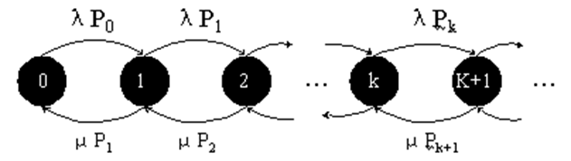
**平衡状态假设**：系统长期运行后，处于各状态的概率$P_k$（$k$状态的稳态概率）与时间无关，且状态转换的"流入率=流出率"。

##### （2）平衡方程
由平衡状态的“流入率=流出率”，对任意状态$k$（$k≥0$）可得：
$\lambda P_k = \mu P_{k+1}$（$k=0,1,2,…$）
其中，$\lambda$为顾客平均到达率，$\mu$为服务员平均服务率（$T_s=\frac{1}{\mu}$）。

令$\rho = \frac{\lambda}{\mu}$（称为“系统利用率”，表示服务员忙碌时间的占比），则平衡方程可变形为：
$P_{k+1} = \rho P_k$（$k=0,1,2,…$）  ——（A-6）

结合“所有状态概率之和为1”的约束（$\sum_{k=0}^{\infty}P_k = 1$），将（A-6）代入得：
$P_0 + \rho P_0 + \rho^2 P_0 + … = 1$
由于系统稳定时需满足$\lambda < \mu$（即$\rho < 1$，否则队列会无限增长），上述等比级数求和得：
$P_0 = 1 - \rho$

进一步推导任意状态$k$的概率：
$P_k = \rho^k P_0 = \rho^k (1 - \rho)$（$k=0,1,2,…$）

##### （3）平均顾客数与平均队列长度
- **系统中平均顾客总数**：$\bar{N} = \sum_{k=0}^{\infty}k P_k = \sum_{k=0}^{\infty}k \rho^k (1 - \rho) = \frac{\rho}{1 - \rho}$
- **平均等待队列长度**：$W = \bar{N} - \rho = \frac{\rho}{1 - \rho} - \rho = \frac{\rho^2}{1 - \rho}$（因$\rho$为服务员忙的概率，即平均正被服务的顾客数）

#### 3. 平均等待时间
根据Little定律，系统中平均顾客总数$\bar{N} = \lambda \cdot T$，因此平均总停留时间：
$T = \frac{\bar{N}}{\lambda} = \frac{\rho}{\lambda (1 - \rho)} = \frac{1}{\mu - \lambda}$  ——（A-7）

> 注意：（A-7）式是网络延迟时间分析中的关键结果，直接反映单信道场景下报文总延迟与到达率、服务率的关系。

#### 4. 平均排队等待时间
平均服务时间$T_s = \frac{1}{\mu}$，因此平均排队等待时间：
$T_w = T - T_s = \frac{1}{\mu - \lambda} - \frac{1}{\mu} = \frac{\lambda}{\mu (\mu - \lambda)} = \frac{\rho}{\mu (1 - \rho)}$

### （三）M/M/1排队网络
#### 1. 术语对应关系
排队网络与网络通信场景的术语映射如下，便于将排队理论直接应用于网络分析：
- 顾客 → 报文（网络中待传输的数据单元）；
- 服务员 → 信道（网络中传输报文的链路资源）；
- 服务时间 → 报文发送时间（报文长度/信道速率）。

#### 2. 网段平均延迟时间
##### （1）基本推导

在网络文献中，通常用$\frac{1}{\mu}$表示平均分组长度（单位：比特/分组），因此信道的平均服务率（单位：分组/秒）为：
$\mu = \frac{C}{\frac{1}{\mu}} = C \cdot \mu$（其中$C$为信道容量，单位：比特/秒）

结合M/M/1系统的平均总停留时间公式（A-7），一个分组通过某一节点及输出信道（即一个“网段”）的平均延迟时间为：
$T_{segment} = \frac{1}{\mu - \lambda} = \frac{1}{C \cdot \mu - \lambda}$

由于网络中不同网段的报文到达率$\lambda$可能不同，因此不同网段的平均延迟时间存在差异。

##### （2）总平均延迟时间
网络总平均延迟时间为“单个网段的平均延迟时间”与“报文经过的平均段数”的乘积，即：
$T_{total} = T_{segment\_avg} \times \bar{h}$
其中，$T_{segment\_avg}$为所有网段的平均延迟时间（加权平均，权重为各网段的报文流量占比），$\bar{h}$为报文经过的平均网段数。

#### 3. 实例分析（全双工通信网络）

##### （1）网络场景设定
- 通信子网：包含多条全双工信道，每条信道标注容量$C_i$（单位：Kbps）
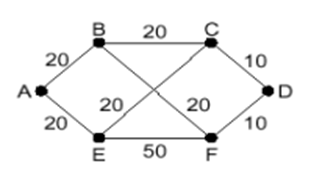
- 通信量和路由矩阵：矩阵元素$r_{ij}$表示从节点$i$到节点$j$的报文流量（单位：分组/秒），字母标注各流量的路由路径，
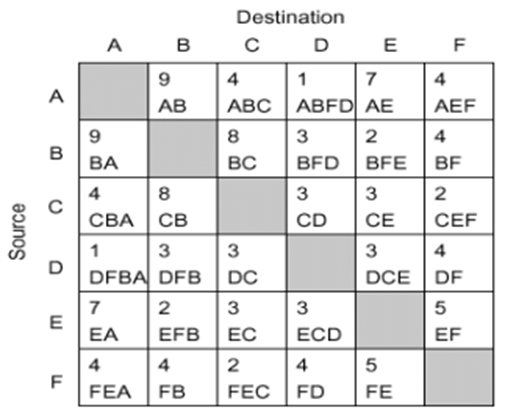
- 关键参数：平均分组长度$\frac{1}{\mu}=800$比特/分组，反向通信量与正向通信量相同（对称流量）。
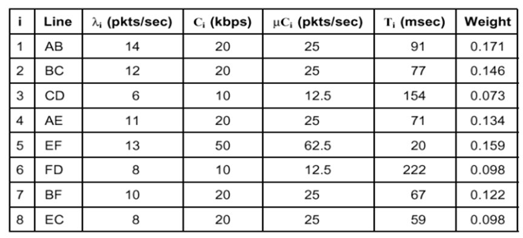

##### （2）分析步骤与结果
1. **计算网段平均延迟时间$T'_{segment}$**
   对所有网段，根据$T_{segment} = \frac{1}{\mu - \lambda}$计算单个网段延迟，再按流量加权求和得：
   $T'_{segment} = 86$ms（本例结果）

2. **计算网络中端到端信息量总和$\gamma$**
   统计所有端到端通信对的流量之和（含正向与反向）得：
   $\gamma = 62$分组/秒（本例结果）

3. **计算报文经过的平均网段数$\bar{h}$**
   由“总信息量×平均段数=各网段流量之和”推导得：
   $\bar{h} = 1.32$（本例结果）

4. **计算网络总平均延迟时间$T_{total}$**
   代入公式$T_{total} = T'_{segment} \times \bar{h}$得：
   $T_{total} ≈ 86 \times 1.32 ≈ 114$ms（本例结果）
## 2 动态信道分配
### 2.1 关键假设
- **流量独立** N个独立的站的发送互相独立
- **单信道** 所有的信道共享一条信道
- **冲突可观察** 所有的站都能够检测到冲突时间的发生。
- **时间连续或分槽**
- **载波侦听或不听**

### 2.2 纯aloha协议
[参考1](https://blog.csdn.net/u013669912/article/details/144479016)
[参考2](https://www.w3ccoo.com/articles/derive-the-efficiency-of-pure-aloha-protocol.html)
[参考3](https://blog.csdn.net/Jaihk662/article/details/80386620)
[参考4](https://zhuanlan.zhihu.com/p/20731045)
[参考5](https://zhuanlan.zhihu.com/p/593677462)

#### 关键思想
不监听信道，不按时间槽发送，随机重发。想发就发

#### 退避时间

此策略在纯 ALOHA 协议中起着至关重要的作用。当未收到数据包确认时，站点会等待一段更随机的时间，这段等待时间称为退避策略。

退避时间$$ (Tb) = k * RTT(往返时间)$$

其中 k 是站点选择的数值，一个 RTT 等于一个时隙。

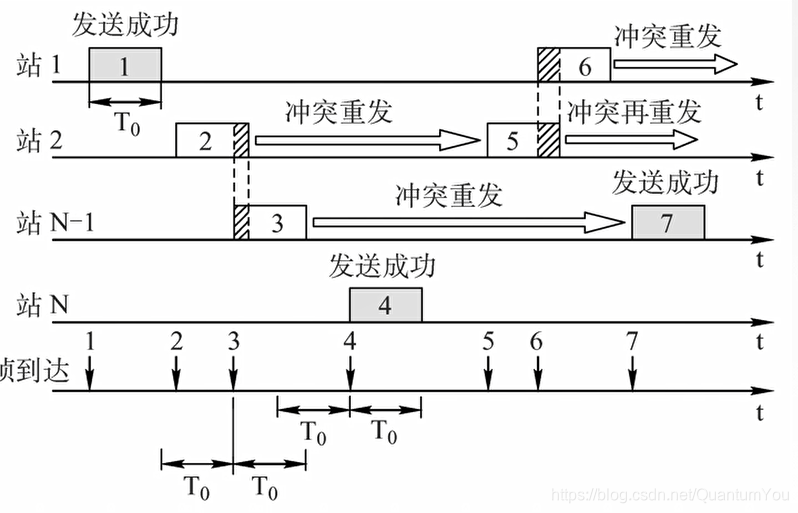

#### 易受攻击时间
易受攻击时间是指数据包发生冲突的时间。如果第一个帧"A"在特定时间 t 发送，在数据传输完成之前，而另一个帧"B"在帧"A"完成之前开始，则会导致冲突。

发生冲突时的易受攻击时间 $$(Vt) = 2 * Tt$$

其中 Tt 是帧的传输时间。

脆弱时间也称为从站点传输完整数据包所需的传播时间或总时间。

$$\mathrm{脆弱时间=\:\frac{(消息长度)}{(传输信道带宽)}}$$

#### 最大效率
- 帧时T：发送一个标准长的帧所需的时间
- 吞吐率S：在一个帧时T内发送成功的平均帧数（ 0 < S < 1，S=1时信道利用率100%）
- 运载负载G：一个帧时T内所有通信站总共发送的帧平均值（包括原发和重发帧）（G≥S，G=S表示无冲突）
- P0：一帧发送成功（未发生冲突）的概率，发送成功的分组在已发送分组的总数中所占的比例；公式：S = G*P0

冲突危险期：时间长度为2T（过了这个时间就会再发生冲突了）
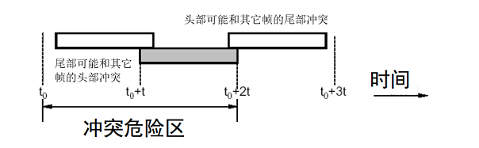

然而一个帧时内发生进站的帧数服从泊松分布$$P[k]=\frac{G^{k}e^{-G}}{k!}$$
那么在这个周期内发送成功的概率为2T内没有其他发送的概率。也就是两个帧时当中不会有其他帧发送。$$P_0=P[0]P[0]=e^{-2G}$$

那么能够正确发送的帧，也就是吞吐量为$$S=GP_0=Ge^{-2G}$$

$$\mathrm{\frac{\partial\:S}{\partial\:G}\:=(1-2G)(e^{-2G})}$$

$$\mathrm{\frac{\partial\:S}{\partial\:G}\:=\:0}$$

因此，当 G=1/2 并将 G 值代入吞吐量方程时，效率最高。

$$\mathrm{S\:=\:\frac{1}{2}\:*e^{-2(\frac{1}{2})}}$$ [由于 e^(-1) 的值0.367879]

$$\mathrm{S\:=\:\frac{1}{2}\:*e^{(-1)}}$$

$$\mathrm{S\:=\:\frac{1}{2}\:*\:0.367879}$$

$$\mathrm{S= 0.1839395}$$

纯 ALOHA 的效率百分比为 18.39%，由于碰撞次数较多，效率非常低。

### 2.3 时隙aloha协议

把时间分成若干个相同的时间片，所有用户在时间片开始时刻同步接入网络信道，若发生冲突，则必须等到下一个时间片开始时刻再发送。 控制想发就发的随意性

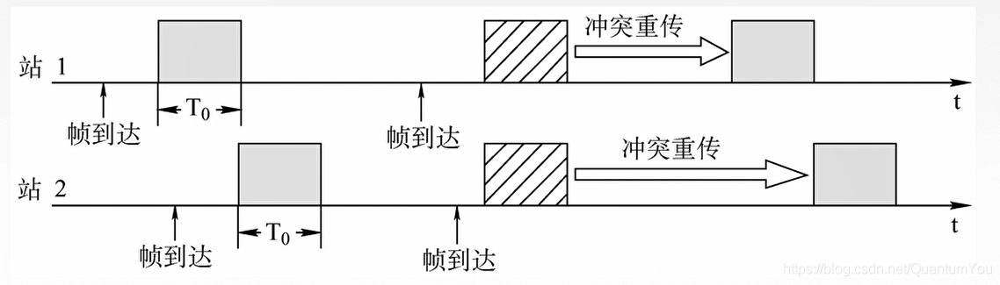

经过相同的运算方式，可以发现$$S=Ge^{-G}$$

有$G=1$时达到最大效率$S=e^{-1}$

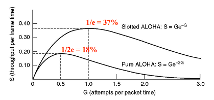

#### 对于发包方

从站开始发包开始，重传次数k的概率分布为$$P(k)=(1-e^{-G})^{k-1} e^{-G}$$

这是一个几何分布，他的期望为 $E=e^G$

#### story

**分槽aloha**在有线电视网络中，发挥出难以想象的优势，但是距离它发明已经经过了很久，人们突然发觉了分槽aloha的绝妙之处。

### 2.4 Carrier Sense Multiple Access(CSMA)
#### 1-persistences csma
节点需要持续监听信道，一旦节点发现信道空闲后，则立刻发送数据。

#### 0-persistences csma

节点不连续监听信道，若该时刻节点监听信道为busy，那么等待一段时间后，再次进行监听。若节点该时刻监听信道为空闲，则立刻发送数据。

#### p-persistences csma
节点需要持续监听信道，一旦发现信道空闲后，节点以p的概率立刻发送数据，以1-p的概率不发送数据。若节点该时刻不发送数据，那么等待一段时间后，再次进行监听，并以p概率再次发送

### 2.5 csma/cd /ca
**CSMA/CD:Carrier Sense Multiple Access with Collision Detection**
**CSMA/CA:Carrier Sense Multiple Access With Collision Avoidance**

请注意，截断二进制指数退避算法，人为干预，帧间最小间隔属于csma/ca的部分。
#### 概述
- **多点接入(Multipoint Access/MA)**: **总线**型网络, 多个计算机站连接在一条总线上。
- **载波监听(Carrier Sense/CS)**: 即"边发送, 边监听", 不管在想要发送数据之前, 还是在发送数据之中, 每个站都必须不停的检测信道。发送前检测, 信道空闲才可以发送数据; 发送中检测, 若检测出其他信道在发送, 就中断本站的发送。
- **碰撞检测(Collision Detection/CD)**: 载波监听的物理实现, 边发送数据边检测信道上电压的变化情况。两个站同时在总线上发送数据时, 总线上的电压变化幅度将增大, 当两个数据碰撞时, 数据失真, 信号电压变化幅度超过门限值。此**失真信号**(电压变化幅度异常的信息)经一段时间后传至双方各站, **两站被检测到数据失真**, 双方立即停止发送。

#### 碰撞检测
- **传播时延**: 数据是以电磁波的形式传输的, 某一方发送数据后, 需经过一定时间才能到达目的方。假设电缆为 $1km $则传播速率一般为 $2 \times 10^5 km/s$  传播时延约为 $\tau = 5 \mu s$
- **比特时间**: **发送 $n \mathrm{bit}$ (n为待发数据的长度)所需要的时间**, 这样做的好处是可直接用比特数代替时间, 比如发送 100bit 的时间为 100 比特时间。一般为了方便说明时间, 下文会经常用比特时间代替常见的秒、微秒等。比特时间与数据传输速率有关, 若一个以太网的数据率为 10Mbps ,**100比特时间**则为 $$t=\frac{100bit}{10Mbps}=10\mu s$$

- 碰撞时间点
设时延为$\tau$ , A 在 t = 0 时发送数据，B在$t = \tau - \delta$ 的时候发送了数据。那么二者回发送碰撞，而这个时候，B发现信道是空的。

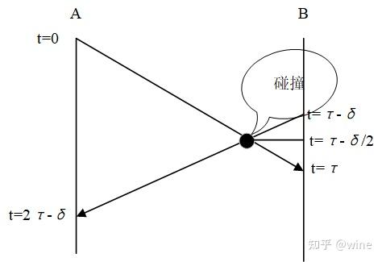

$t=\tau - \delta$ 的时候，数据发生碰撞
$t=\tau$ B 发现冲突
$t=2 \tau - \delta$ A 发现冲突

#### 争用期

根据上面的结论。只要$t=\tau$的时候，B没有发送数据那么就回接收到信道被占用。只要经过了$t=2\tau$的时间没有发生冲突那么A就能一直发下去，因为线路上的所有站都会知道**信道**被占用了。

这个$t=2\tau$被之为**争用期**。

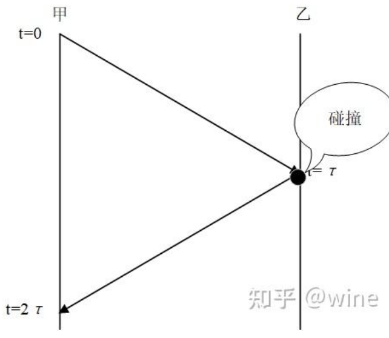

#### 截断二进制指数退避算法
- **算法目的**: 当发送数据双方检测出碰撞后, 利用此算法确定重传时机。
- **算法核心**: 当发送数据双方检测出碰撞后, 让双方各自等待一个**随机的时间**再重新发送。
    - 规定争用期取发送以太网最短帧512b的时间
    - 记AB双方重传次数为k，$n = \min{k,10}$。那么AB的重传时间为$r_A,r_B$ 。这两个数分别从$[0,1,3,\cdots,2^n-1]$ 当中随机选择一个。
    - k=16时仍然发送失败，丢弃掉本帧，向上层**报告**。
#### 人为干扰信号
当发送数据的站一旦发现发生了碰撞时, 除了立即停止发送数据外, 还要再继续发送 **32比特**或 **48比特**的人为干扰信号, 以便所有用户都知道已经发生碰撞。

另外,若发送人为干扰信号, 则退避算法的执行时间是等待发送完干扰信号后执行。
#### 帧间最小间隔
接收方接收一帧后, 为了让接收方的接收来得及清理, 做好接受下一帧的准备。于是规定若检测出信道空闲持续 **96比特**时间时, 才发送一帧。按照我们之前的算法，时间为$t=96\mu s$

### 2.6 位图协议
[借鉴](https://tutorialspoint.org.cn/what-is-bit-map-protocol-in-computer-networks)
- 算法解释
  - 使用位图或者位向量来表示一组优先的不同的整数。
  - 要对整数数组进行排序，需要将数组大小初始化为指定的范围，然后用零（程序中的默认值）填充它，然后为每个输入的整数在位图中将对应的位设置为1。
  - 扫描位图并按排序顺序打印整数

- 解释
  - 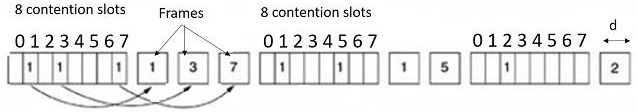
  - **每个竞争周期正好有N个时隙**。如果站点0有帧要发送，则它在时隙0期间传输1位。一般来说，站点j可以通过在其时隙j中插入1位来宣布它有帧要发送。
  - 在所有N个时隙结束后，每个站点都会知道哪个站点准备传输，然后**按数字顺序传输帧**。
  - 由于相互理解，没有碰撞的可能性。
  - 在最后一个准备就绪的站点传输其帧后，所有站点都可以监控，另一个N位竞争周期开始。
  -  如果某个站点在其比特时隙过去后才准备好，它必须保持静默，直到位图再次循环。
  -  像这样在实际传输之前广播传输意愿的协议被称为预留协议，因为它们预先预留了信道所有权并防止了冲突。

这相当于是一个，由一个**网络链路主理人**，依次询问大家是否准备发数据，大家要在属于自己的时间向网络主理人登记自己的想法，并在随后预留给大家发送帧的时间中拿到自己的帧。
- 信道利用率
  - 对于**低负载**的情况下，其实很少有人在发帧，那么只有发的时候才会影响到利用率，假设由$N$个站。帧长度为$d$，那么他的利用率为$$\eta=\frac{d}{N+d}$$
  - 在**高负载**的情况下，所有人都有说不完的话，那只好把位图的每一位都填满。这个时候，利用率为$$\eta=\frac{d\times N}{N+N\times d}=\frac{d}{d+1}$$
### 2.7 令牌传递协议
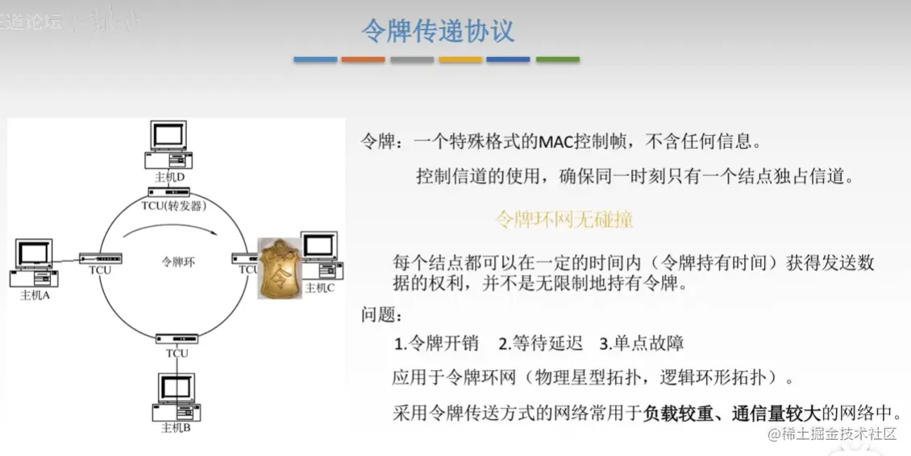
- 原理
  1. **令牌传递**：网络处于空闲状态，令牌就会在网络上各个主机之间进行传递
  2. **持有令牌发送数据**：当A想要发送数据时，只有在它持有令牌的时候，将令牌修改为**使用**状态，在令牌帧后，加上数据，然后将 **令牌+数据** 发送出去。此处假设数据的接受者是D。
  3. **非目的主机继续传递令牌**：当数据到达B时，B主机检查该数据是否是发给自己的，如果不是，继续传递下去。
### 2.8 二进制倒数协议
- 位图协议和令牌传递的一个问题是每站开销为 1 比特，因此位图和令牌传递不适用于有成千上万个站点的网络。
- 一个站点想要使用信道。它必须将其地址作为以高阶位开头的二进制位串广播出去。
- 假设所有地址长度相同。
- 当同时发送时，信道中的不同站点中的每个地址位置中的位通过布尔或运算在一起。我们称这种类型的协议为二进制倒计时。
- 它隐含地假定传输延迟可以忽略不计，因此所有站点可以立即看到断言的位。
- 要避免冲突，必须应用仲裁规则。每当站点看到地址中值为 0 的高阶位已经被 1 覆盖时，它就会放弃。
- 在竞标中获胜后，站点现在发送帧，此后开始另一个竞标周期。
- 它具有这样的属性：编号较高的站点比编号较低的站点具有较高的优先级，这取决于上下文可能是好是坏。

### 2.9 有限竞争协议

假设总共有$k$个用户在这个用户组当中，每个用户发送信息的概率为$p$，那么发送成功的概率是$$P=kp(1-p)^{k-1}$$求导可得$p=\frac{1}{k}$的时候效果最好。此时有$$P=(\frac{k-1}{k})^{k-1}$$这个值趋近于$\frac{1}{e}$。竞争成功的概率在$k<5$的状态下最良好，我们应当尽量减少参与竞争的用户的个数。

### 2.10 自适应树遍历协议
在一次传输成功后的第一个时间槽，即0号槽，允许所有的站尝试获取信道；如果它们之中的某个获得了信道，那么它将传输，如果发生了冲突，则在1号槽中，只有位于树中2号节点之下的那些站才可以参与竞争；一方面，如果其中某个站获得了信道，则在该站发送完一帧之后的那个槽被保留给位于节点3下面的那些站，另一方面，如果节点2也发生了冲突，则在2号槽中由位于节点4下面的站竞争。

这意味着，如果在0号槽当中发生了冲突，所有的节点都会被遍历到。上一次发现冲突并分而治之的节点不会被弃之不顾，会在处理完一个分支后回到另一边接着处理。
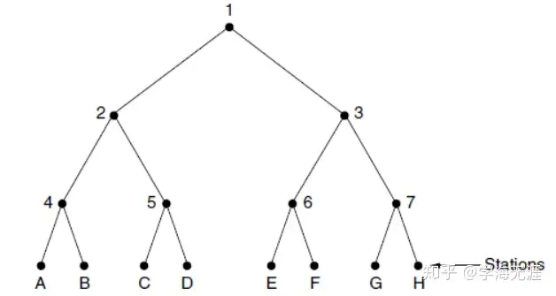

例：站点G和H请求获取信道
在时隙0，搜索节点1 ，因有两个站点请求获得信道，所以冲突；
在时隙1，按深度优先搜索节点2，但发现节点2所属的站点无信道请求；
在时隙2，跳过节点3，搜索节点3下属节点6，但发现节点6所属的站点也无信道请求；
在时隙3，跳过节点7，搜索节点7下属站点G，G获得信道。
