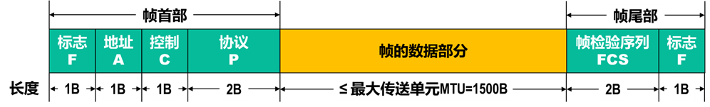
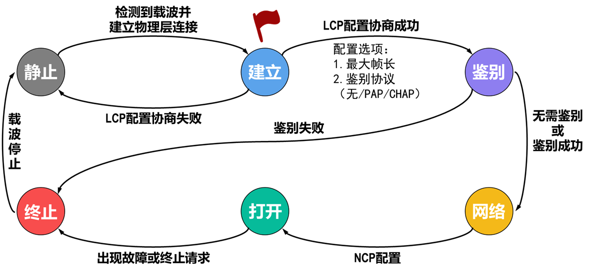

# ppp协议

## 1 概述

用户计算机与**ISP**（**Internet Service Provider**）进行通信时，所使用的**数据链路层协议**通常就是**点对点协议PPP**（**Point-to-Point Protocol**）。**PPP协议**是目前使用最广泛的点对点数据链路层协议，也广泛应用于广域网路由器之间的专用线路。

## 2 组成

- 对各种协议数据报的封装方法（封装成帧）
- **链路控制协议LCP** 用于建立、配置以及测试数据链路的连接
- 一套**网络控制协议NCPs** 其中的每一个协议支持不同的网络层协议

### 2.1 帧格式

- **Flag字段**为帧定界标志，用来标识**PPP帧**的开始与结束，长度为1字节，取值固定为`0x7E`。
- **Address字段**为地址字段，用来标识接收方的地址，长度为1字节，由于点到点链路的接收方是唯一的，故此字段取值固定为`0xFF`，表示只有对端才能接受到数据。
- **Control字段**为控制字段，长度为1字节，取值固定为`0x03`，表示**无序号信息**（**Unnumbered Information**）
- **Protocol字段**为协议字段，用来标识**PPP帧**封装的协议数据类型，长度为1-2字节。此字段使PPP得以封装不同的协议。

| 字段值    | 协 议                                                |
| -------- | ---------------------------------------------------- |
| `0x0021` | **IP**(**Internet Protocol**)                                |
| `0x0029` | **Appletalk**                                            |
| `0x8021` | **IPCP**(**Internet Protocol Control Protocol**)             |
| `0xC021` | **LCP**(**Link Control Protocol**)                           |
| `0xC023` | **PAP**(**Password Authentication Protocol**)                |
| `0xC025` | **LQR**(**Link Quality Report**)                             |
| `0xC223` | **CHAP**(**Challenge Handshake Authentication Protocol**)    |

- **Information字段**为信息字段，该字段长度不固定，最大长度等于**MRU**（**Maximum Receive Unit**）值，默认为1500字节。此字段存放承载的协议数据，包括LCP、NCP等
- **FCS**（**Frame Checksum**）字段为帧校验和字段，用来检测**PPP帧**的完整性（**CRC计算**），长度为2-4字节，通常为2。

**由于**Address和Control字段**总是常量，因此LCP提供了某种必要的机制，允许通信双方协商一个选项，确定是否省略这两个字段。**

### 2.2 字节填充法

- 如**PPP帧**的**标志字段**取值为`7E`（16进制），如果数据中出现`7E`则需要在数据前插入转义字符`7D`（16进制），并将原来的`7E` 与`0x20`（16进制） 做异或运算，所以`7E`在数据中最终会变成`7D,5E`
- 如果数据中有转义字符`7D`怎么办呢？可以在转义字符`7D`前再加一个转义字符`7D`，并将数据的`7D`减`0x20`（16进制），于是转义字符`7D`在数据中最终会变成`7D,5D`
- 数据中出现的每一个**ASCII码控制字符**（数值小于`0x20`的字符），则在该字符前面插入一个`7D`字节，同时将该字符的编码加上`0x20`。

### 2.3 差错控制

接收方每收到一个**PPP帧**，就进行**CRC检验**（多项式）。若**CRC检验**正确，就收下这个帧；反之就丢弃这个帧（不可靠传输服务）。检验由尾部的**FCS**实现

使用**PPP**的数据链路层，向上提供的是**不可靠数据传输服务**。**PPP** 数据链路层向上提供不可靠服务，核心原因是它未内置**确认**、**重传**等可靠性保障机制。

## 3 工作流程

1. **链路不可用阶段** Dead
2. **链路建立阶段** Establish
3. **认证阶段** Authenticate
4. **网络层协议阶段** Network
5. **OPEN**
6. **链路中止阶段** Terminate

## 4 LCP 协议

**LCP**（**Link Control Protocol**，**链路控制协议**）：用于建立、配置、维护和终止**PPP链路**

**LCP**负责**PPP**的链路管理，和上层（网络层）协议无关

### 报文格式

当**PPP帧**中**Protocol字段**为`0xC021`时，表示**Information** 字段数据为**LCP报文**。

- **Code**为代码字段（也称类型字段），长度为1字节，用来标识**LCP**中链路控制报文的类型。
- **Identifier**为标识符字段，长度为1字节，是报文的唯一标识。
  - **Identifier字段**用于匹配请求和回复。
- **Length**为长度字段，长度为2字节，**Length字段**指出该报文的长度，包括**Code**，**Identifier**，**Length**和**Data**。
- **Data**为数据字段，长度是零或多个八位字节，由**Length字段**声明。
  - **Data字段**的格式由**Code字段**决定。

## 5 NCP协议

**NCP**（**Network Control Protocol**，**网络控制协议**）用于建立、配置网络层协议，进行参数协商。

不同的网络层协议会使用不同的**NCP协议**。

- **IP协议**使用**IPCP**（**Internet Protocol Control Protocol**，**IP控制协议**）；
- **Appletalk协议**使用**Appletalk NCP**进行协商；
- **Novell**的 **IPX协议**使用**IPE**（**Internet Packet Exchange**，**互连网包交换协议**）进行协商。

## 6 hdlc协议

**HDLC**（**高级数据链路控制协议**）是**ISO**制定的面向比特的同步数据链路层协议，是数据链路层协议的经典标准，具有极强的通用性和灵活性。

### 一、核心定位与适用场景

- **定位**：替代早期面向字符的协议（如**BSC**），提供标准化的链路层数据传输、差错控制和流量控制功能。
- **适用场景**：支持点到点、点到多点拓扑，可用于专线、卫星链路等同步传输场景，是**X.25**、**帧中继**等协议的基础链路层协议。

### 二、核心特性

1. **面向比特传输**：以比特流为处理单位，不受字符编码限制，适配任意上层数据。
2. **同步传输**：依赖物理层同步信号（如时钟），无需额外同步字符，传输效率高。
3. **全双工通信**：支持双向同时传输，通信双方可随时发送数据。
4. **统一帧格式**：所有数据和控制信息均封装为统一格式的**HDLC帧**，结构清晰。
5. **内置可靠性机制**：自带差错控制、流量控制和帧序号管理，可提供可靠传输。

### 三、帧格式详解（核心组成）

**HDLC帧**由5个字段组成，字段长度除信息字段外均固定：

| 字段         | 长度（比特） | 功能说明                                                                 |
| ------------ | ------------ | ------------------------------------------------------------------------ |
| **标志字段**（**F**） | 8            | 帧起始和结束标识，固定为`01111110`，用于帧同步；通过"**0比特插入法**"避免数据中出现假标志。 |
| **地址字段**（**A**） | 8（可扩展）  | 指明接收方地址，点到点链路中可固定为全1，点到多点链路中需明确目标设备地址。       |
| **控制字段**（**C**） | 8            | 核心字段，区分帧类型（信息帧、监控帧、无编号帧），包含序号、确认号等控制信息。     |
| **信息字段**（**I**） | 可变长度     | 承载上层协议数据，长度无严格限制（由链路带宽和缓存决定）。                       |
| **帧校验序列**（**FCS**） | 16或32    | 采用**CRC校验**（**CRC-CCITT**或**CRC-32**），检测帧在传输过程中的差错（比特错、帧丢失等）。  |

### 四、三种帧类型及功能

1. **信息帧**（**I帧**）：用于传输上层数据，**控制字段**包含发送序号（**N(S)**）和接收序号（**N(R)**），支持连续发送和累计确认。
2. **监控帧**（**S帧**）：用于差错控制和流量控制，无信息字段，包含确认号（**N(R)**）和监控类型（如**接收准备好RR**、**接收未准备好RNR**、**拒绝重传REJ**等）。
3. **无编号帧**（**U帧**）：用于链路控制，无序号字段，包含链路建立（**SABM**）、链路释放（**DISC**）、确认（**UA**）等控制功能。

### 五、关键工作机制

1. **0比特插入/删除**：发送方在数据中连续5个"**1**"后插入1个"**0**"，接收方删除该"**0**"，避免数据与**标志字段**（`01111110`）混淆。
2. **差错控制**：通过**FCS校验**检测差错，结合**S帧**的**REJ**（拒绝）或选择性重传机制，实现差错恢复。
3. **流量控制**：接收方通过**RNR**（**接收未准备好**）帧告知发送方暂停发送，待缓存空闲后用**RR**帧恢复，避免接收方溢出。
4. **链路管理**：通过**U帧**完成链路建立（**SABM→UA**）、数据传输、链路释放（**DISC→UA**）的完整流程。

### 六、与PPP的核心区别

- **帧格式**：**HDLC帧**无协议字段，**PPP帧**新增协议字段以适配多种上层协议。
- **可靠性**：**HDLC**内置确认、重传机制，**PPP**默认无可靠性保障。
- **适用场景**：**HDLC**多用于设备间专线连接，**PPP**更适用于拨号、宽带等用户接入场景。
