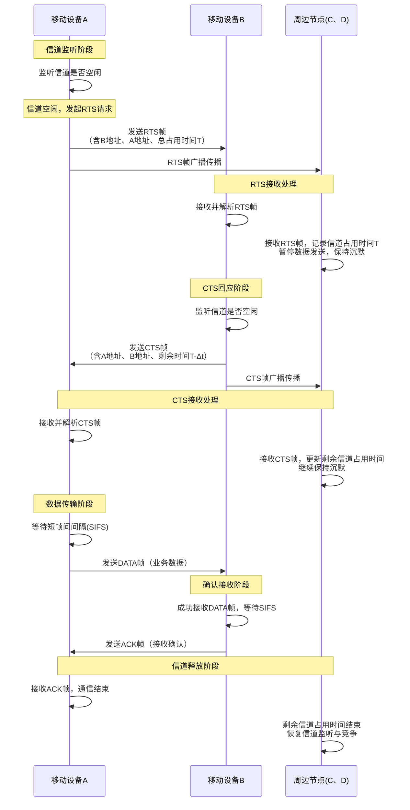
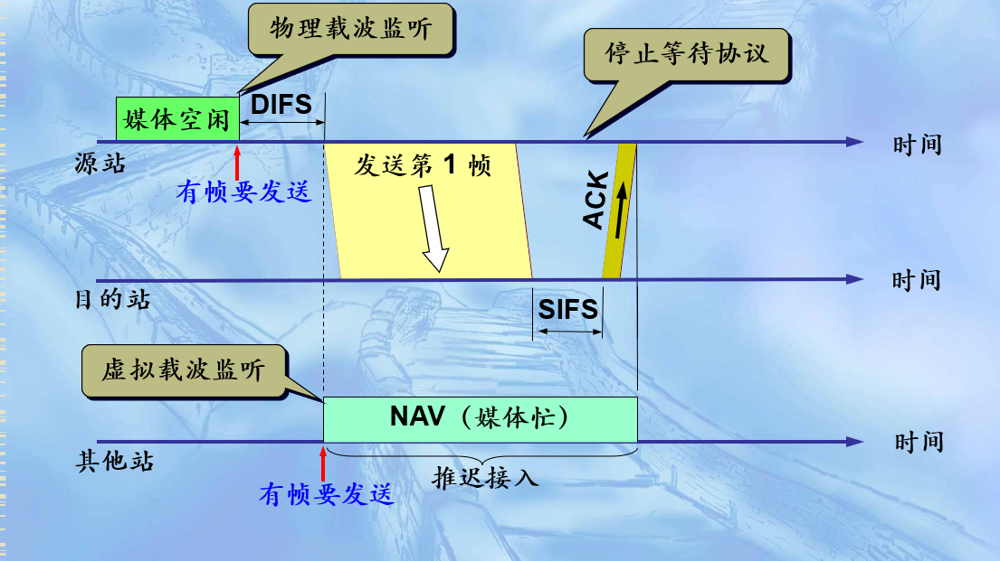
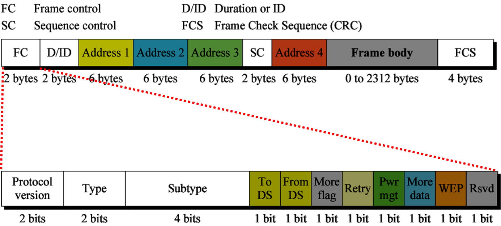
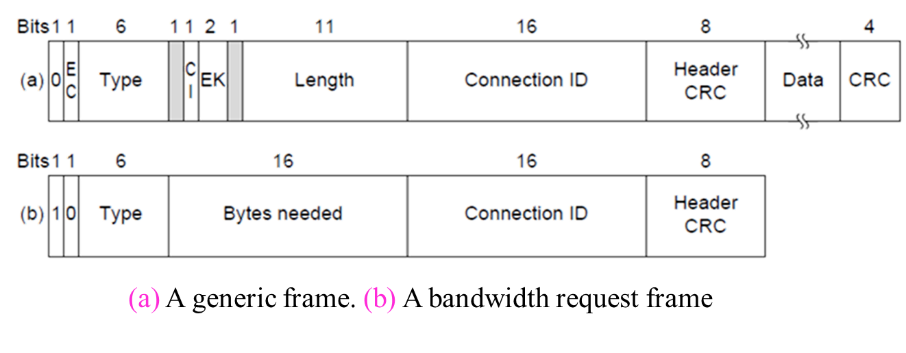
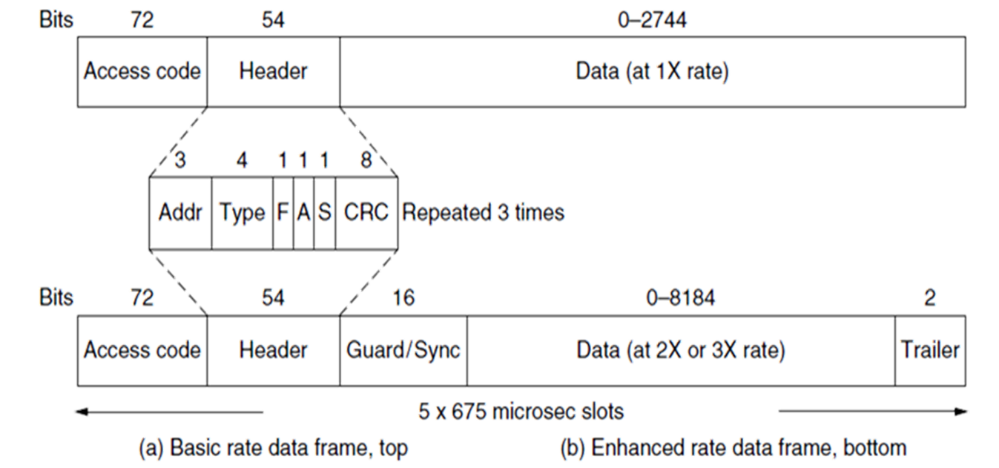

# 无线LAN协议  802.11
## 1 隐藏站问题

节点之间无法互相监听对方。但当其不可以同时传输时，其同时传输，从而导致冲突发生。隐藏终端在单个AP（或者单个Receiver）时就有可能发生。

两个人同时给B发消息，B无法一心二用。

## 2 暴露终端问题
节点之间能够互相监听对方。但其可以同时传输时，其不传输，从而造成浪费。暴露终端在多个AP（或者多个Receiver）时才有可能发生。

A给B发消息，但是收到了正在大吼大叫的C的干扰。

## 3 MACA协议
这时最早能解决以上两个问题的协议。
Multipule Access with Collision Avoidance (MACA) 协议。

### 3.1协议概述
#### 3.1.1 背景与定位
MACA（Multiple Access with Collision Avoidance）是由 Karn 于 1990 年提出的**无线局域网（WLAN）MAC 层协议**，核心目标是解决无线信道特有的**隐藏终端**和**暴露终端**问题——这两类问题导致传统有线网络的 CSMA/CD（载波监听多路访问/冲突检测）协议在无线场景下失效（无线信号衰减、隐藏终端无法监听彼此，且冲突检测需额外硬件开销）。

MACA 是首个提出**控制帧预约信道**思想的协议，为后续 802.11 协议（Wi-Fi 核心协议）的 DCF（分布式协调功能）奠定了基础，广泛应用于移动设备、传感器网络等无线通信场景（与你的移动设备分类/聚类项目中的设备通信层分析高度相关）。

#### 3.1.2 核心目标

| 目标                | 描述                                                                 |
|---------------------|----------------------------------------------------------------------|
| 解决隐藏终端问题    | 避免“不可见节点”同时向同一接收方发送数据导致的冲突                   |
| 解决暴露终端问题    | 允许“可见但不干扰”的节点并行通信，提升信道利用率                     |
| 降低冲突概率        | 无需冲突检测，通过预预约机制提前避免冲突                             |
| 适配无线信道特性    | 兼容无线信号衰减、多径效应等场景，保障通信可靠性                     |

### 3.2核心问题：隐藏终端与暴露终端
#### 3.2.1 隐藏终端（Hidden Terminal）
- **定义**：节点 A 和节点 C 均在接收方 B 的通信范围内，但 A 和 C 之间因信号衰减/遮挡无法相互监听（A 看不到 C，C 看不到 A）。
- **问题**：A 和 C 同时向 B 发送数据，导致数据在 B 处冲突，通信失败。
- **示例**：移动设备 A 和 C 分别位于房间两侧，均能与路由器 B 通信，但彼此无法直接通信，同时发送数据时会导致路由器接收冲突。

#### 3.2 暴露终端（Exposed Terminal）
- **定义**：节点 C 在发送方 A 的通信范围内，但不在接收方 B 的通信范围内（C 能看到 A，却看不到 B）。
- **问题**：C 检测到 A 正在发送数据，误以为自己发送会冲突，从而放弃向其他节点（如 D）发送数据，导致信道利用率降低（实际 C 与 D 的通信不会干扰 A 与 B）。
- **示例**：移动设备 A 向路由器 B 发送数据，移动设备 C 能搜到 A 的信号但搜不到 B，此时 C 想向路由器 D 发送数据却因“感知到 A 占用信道”而暂停，造成不必要的等待。

### 3.3MACA 基本原理与工作流程
#### 3.3.1 核心思想
通过**双向控制帧（RTS/CTS）预约信道**：发送方先发送“请求发送”帧（RTS），接收方回应“允许发送”帧（CTS），双方通过这两个控制帧告知周边节点“即将占用信道的时间”，周边节点据此延迟发送，避免冲突。

#### 3.3.2 关键帧类型
MACA 包含 4 类核心帧，各帧功能与交互逻辑如下：

| 帧类型 | 英文全称          | 中文含义          | 发送方 | 接收方 | 核心作用                                                                 |
|--------|-------------------|-------------------|--------|--------|--------------------------------------------------------------------------|
| RTS    | Request To Send   | 请求发送帧        | 数据发送方（A） | 数据接收方（B） | 向接收方申请信道，告知“后续数据帧+ACK帧”的总占用时间                     |
| CTS    | Clear To Send     | 允许发送帧        | 数据接收方（B） | 数据发送方（A） | 回应 RTS，确认信道空闲，告知周边节点“即将接收数据，请勿干扰”               |
| DATA   | Data Frame        | 数据帧            | 数据发送方（A） | 数据接收方（B） | 传输实际业务数据（如移动设备的传感器数据、文件数据等）                   |
| ACK    | Acknowledgment    | 确认帧            | 数据接收方（B） | 数据发送方（A） | 确认 DATA 帧接收成功，若未收到则发送方需重传                             |

#### 3.3.3 完整工作流程（时序图逻辑）
以移动设备 A 向移动设备 B 发送数据为例，步骤如下：
1. **信道监听**：A 先监听信道是否空闲，若空闲则发送 RTS 帧（包含接收方 B 地址、发送方 A 地址、后续 DATA+ACK 帧的总持续时间 T）。
2. **RTS 传播**：RTS 帧被 B 及周边节点（如 C、D）接收，周边节点记录“信道占用时间 T”并暂停发送（避免冲突）。
3. **CTS 回应**：B 监听信道空闲后，向 A 发送 CTS 帧（包含发送方 A 地址、接收方 B 地址、剩余持续时间 T-Δt，Δt 为 RTS 传输耗时）。
4. **CTS 传播**：CTS 帧被 A 及周边节点接收，周边节点更新“剩余信道占用时间”，继续保持沉默。
5. **数据传输**：A 收到 CTS 后，等待短帧间间隔（SIFS），发送 DATA 帧。
6. **确认接收**：B 成功接收 DATA 帧后，等待 SIFS，发送 ACK 帧确认。
7. **信道释放**：A 收到 ACK 后，通信结束；周边节点在“剩余持续时间”结束后，恢复信道监听与竞争。

#### 3.3.4 问题解决逻辑

| 问题类型   | MACA 解决机制                                                                 |
|------------|------------------------------------------------------------------------------|
| 隐藏终端   | 若 C 是 A 的隐藏终端（C 看不到 A），C 会收到 B 发送的 CTS 帧，得知 B 正在接收 A 的数据，从而延迟发送 |
| 暴露终端   | 若 C 是 A 的暴露终端（C 能看到 A 但看不到 B），C 向 D 发送 RTS 时，D 若空闲会回应 CTS，且 CTS 不会被 B 接收（B 不在 D 通信范围），因此 A 与 B、C 与 D 可并行通信 |

### 3.4 MACA 帧结构详解
MACA 各帧的核心字段（简化版，聚焦关键信息）如下，字段设计需适配无线信道的地址识别与时间预约需求：

#### 3.4.1 RTS 帧结构（长度固定，开销小）

| 字段         | 长度（比特） | 含义                                                                 |
|--------------|--------------|----------------------------------------------------------------------|
| 帧类型标识   | 8            | 标记为 RTS 帧（区别于 CTS/DATA/ACK）                                 |
| 接收方地址（RA） | 48           | 目标接收方的 MAC 地址（如 B 的硬件地址）                               |
| 发送方地址（TA） | 48           | 发送方的 MAC 地址（如 A 的硬件地址）                                   |
| 持续时间（Duration） | 16        | 后续 DATA 帧 + ACK 帧的总传输时间（单位：微秒），用于周边节点计算 NAV |
| FCS          | 32           | 帧校验序列（CRC 校验），检测帧传输错误                                 |

#### 3.4.2 CTS 帧结构（与 RTS 对称，长度相同）

| 字段         | 长度（比特） | 含义                                                                 |
|--------------|--------------|----------------------------------------------------------------------|
| 帧类型标识   | 8            | 标记为 CTS 帧                                                         |
| 接收方地址（RA） | 48           | 对应 RTS 的发送方地址（如 A 的 MAC 地址），确保 A 能识别是回应自己的 CTS |
| 发送方地址（TA） | 48           | 接收方的 MAC 地址（如 B 的 MAC 地址）                                   |
| 持续时间（Duration） | 16        | 剩余信道占用时间（RTS 中的 Duration - RTS 传输耗时）                   |
| FCS          | 32           | 帧校验序列                                                           |

#### 3.4.3 DATA 帧结构（长度可变，承载业务数据）

| 字段         | 长度（比特） | 含义                                                                 |
|--------------|--------------|----------------------------------------------------------------------|
| 帧类型标识   | 8            | 标记为 DATA 帧                                                       |
| 接收方地址（RA） | 48           | 目标接收方地址（如 B）                                               |
| 发送方地址（TA） | 48           | 发送方地址（如 A）                                                   |
| 数据长度     | 16           | 后续数据字段的字节数                                                 |
| 数据字段     | 可变（0~1500） | 实际业务数据（如移动设备的传感器读数、文本数据等）                     |
| FCS          | 32           | 帧校验序列                                                           |

#### 3.4.4 ACK 帧结构（长度固定，仅用于确认）

| 字段         | 长度（比特） | 含义                                                                 |
|--------------|--------------|----------------------------------------------------------------------|
| 帧类型标识   | 8            | 标记为 ACK 帧                                                        |
| 接收方地址（RA） | 48           | 对应 DATA 的发送方地址（如 A）                                         |
| 发送方地址（TA） | 48           | 接收方地址（如 B）                                                   |
| FCS          | 32           | 帧校验序列                                                           |

### 3.5 MACA 优缺点分析
#### 3.5.1 优点
1. **解决核心无线问题**：首次有效解决隐藏终端和暴露终端问题，相比传统 CSMA 大幅提升无线信道利用率。
2. **无冲突检测开销**：无需像 CSMA/CD 那样在发送时检测冲突，降低硬件复杂度（适配移动设备低功耗需求）。
3. **预约机制高效**：通过 Duration 字段告知周边节点信道占用时间，避免盲目监听与竞争。
4. **适配移动场景**：帧结构简洁，控制帧开销小，适合移动设备频繁切换通信对象的场景。
#### 3.5.2 缺点
1. **控制帧开销**：RTS/CTS 帧虽短，但在低数据量场景（如移动设备短消息传输）中，控制帧占比过高，降低效率。
2. **重传风险**：若 RTS/CTS 帧丢失（如无线信号干扰），发送方会超时重传，导致数据传输延迟。
3. **不支持 QoS**：无优先级机制，无法满足移动设备中语音、视频等实时业务的低延迟需求。
4. **高负载下性能下降**：多节点竞争时，RTS/CTS 帧可能发生冲突，且冲突后需重传，导致信道吞吐量下降。
5. **未考虑链路不对称**：假设 RTS/CTS/DATA/ACK 帧的传输链路对称（发送方能收到 CTS，接收方能收到 DATA），但实际无线信道可能存在“单向衰减”（如 A 能收到 B 的 CTS，但 B 收不到 A 的 DATA），导致通信失败。

### 3.6 改进版本与实际应用
#### 3.6.1 关键改进版本：MACAW（MACA for Wireless LANs）
MACA 的不足催生了 MACAW 协议（1994 年提出），核心改进如下：
- 增加 **ACK 帧的 Duration 字段**：让周边节点更精准地计算信道占用时间。
- 引入 **NAV（Network Allocation Vector）**：节点通过 Duration 字段维护 NAV 计时器，计时器归零前不发送数据，避免冲突（后续 802.11 协议核心机制）。
- 支持 **多速率传输**：适配移动设备不同通信距离下的速率切换（如近距离高速、远距离低速）。
- 增加 **DS（Data Sending）帧**：优化数据帧传输逻辑，提升可靠性。

#### 3.6.2 实际应用：802.11 DCF 协议
MACA/MACAW 是 **Wi-Fi 802.11 协议的核心基础**，802.11 的 DCF（分布式协调功能）模式直接沿用了“RTS/CTS+NAV”机制，仅做了如下优化：
- 引入 **CSMA/CA 混合机制**：发送前先监听信道（CSMA），空闲则发送 RTS，进一步降低冲突概率。
- 增加 **退避算法（Binary Exponential Backoff）**：RTS/CTS 冲突后，发送方随机退避一段时间再重传，避免连续冲突。
- 支持 **可选 RTS/CTS**：短数据帧可跳过 RTS/CTS 直接发送，减少控制开销。

### 3.7 MACA 与其他 MAC 协议对比

| 协议       | 核心机制               | 解决的问题               | 适用场景                     | 缺点                     |
|------------|------------------------|--------------------------|------------------------------|--------------------------|
| MACA       | RTS/CTS 预约           | 隐藏终端、暴露终端       | 移动设备、传感器网络         | 控制帧开销、无 QoS       |
| CSMA/CA    | 载波监听+冲突避免      | 一般冲突（无隐藏/暴露终端） | 低节点密度无线场景           | 隐藏/暴露终端问题未解决 |
| CSMA/CD    | 载波监听+冲突检测      | 有线网络冲突             | 以太网（有线）               | 不适用无线场景           |
| TDMA       | 时间片划分             | 多节点有序通信           | 卫星通信、基站调度           | 时间片分配复杂、灵活性差 |
| FDMA       | 频率划分               | 并行通信                 | 蜂窝网络（如 4G）            | 频谱利用率低             |

## 4 WLAN协议
### 4.1 802.11b（HR-DSSS）
也叫Wi-Fi（Wireless Fidelity），使用2.4GHz的ISM频段。
### 4.2 802.11a (OFDM)
使用5GHz的ISM频段，采用正交频分复用（OFDM），也称多载波调制技术（载波数可达52个：48个用作数据，4个用作同步）。可以使用的数据速率为6、9、12、18、24、36、48或54Mbps
但是，802.11a与802.11b并不兼容
### 4.3 DCF 
Distribute Coodrdination Function
#### 4.3.1 采用CSMA/CA
- CSMA：物理载波监听和虚拟载波监听
   欲发送数据的站先检测信道，在物理层的空中接口进行物理层的载波监听，通过收到的相对信号强度是否超过一定的门限数值就可判定是否有其他的移动站在信道上发送数据。若检测到信道空闲，且是该站要发送的第一个 **MAC帧**，则在等待一段时间 **DIFS**(帧间最小间隔) 后就可发送。 
- CA：冲突避免
  虚拟载波监听就是让源站将它要占用信道的时间（包括目的站发回确认帧所需的时间）通知给所有其他站，以便使其他所有站在这一段时间都停止发送数据。这可以通过MAC帧首部中的“持续时间”字段实现。
  当一个站检测到正在信道中传送的MAC 帧首部的“持续时间”字段时，就调整自己的网络分配向量NAV 。NAV指出了必须经过多少时间才能完成数据帧的这次传输，才能使信道转入到空闲状态。

#### 4.3.2 IFS
[参考](https://www.cnblogs.com/sudochen/p/16291365.html)
##### 一、IFS核心基础定义
1. **术语本质**：WLAN中规范帧发送时序的关键参数，定义为「从前一帧的最后一个符号结束，到下一帧第一个符号开始的时间间隔」，核心作用是避免多设备帧传输冲突，保障无线信道有序使用。
2. **计量单位**：统一为 **微秒（μs）**，是WLAN时序参数的标准计量单位。

##### 二、6种IFS类型的详细解析（按原文顺序）
##### 1. RIFS：缩减帧间间隔（Reduced Interframe Space）
- **核心定位**：缩短型帧间间隔，核心目标是提升传输效率。
- **引入标准**：由802.11n标准首次引入。
- **关键特性**：
  - 时长：固定为 **2μs**，远短于传统SIFS（2.4GHz频段10μs、5GHz频段16μs）；
  - 适用场景：HT设备（支持802.11n的设备）向同一接收方连续发送两个帧时，可通过RIFS分隔，替代更长的SIFS；
  - 局限性：虽能节省时序开销，但两个帧仍需各自完整的报头和PLCP（物理层汇聚协议）帧，效率不及聚合帧；
  - 后续变化：802.11ac标准不再使用RIFS——因A-MPDU（聚合MAC协议数据单元）可同时传输多个帧，仅需一个块确认（block ACK），效率更优。

##### 2. SIFS：短帧间间隔（Short Interframe Space）
- **核心定位**：高优先级帧的专属间隔，保障关键帧的快速传输。
- **适用场景**：用于高优先级通信场景，例如RTS（请求发送）/CTS（清除发送）帧交互、ACK（确认）帧响应等。
- **本质构成**：SIFS的时长并非固定配置，而是由「PHY CCA（物理层空闲信道评估）+ PHY PLCP + MAC Rx processing（MAC层接收处理）+ RxTx Turnaround（收发切换）」的总耗时决定。
- **具体时长**：随PHY（物理层）标准和频段不同而变化：
  - 2.4GHz频段（802.11b/g/n）：**10μs**；
  - 5GHz频段（802.11a/n/ac）：**16μs**。

##### 3. PIFS：PCF帧间间隔（Point Coordination Function Interframe Space）
- **核心定位**：无竞争场景下的帧间间隔，用于PCF（点协调功能）机制。
- **适用场景**：仅在PCF的「无竞争周期」中使用，该周期内设备无需竞争信道资源，可直接发送帧（“想发就不会有竞争”）。
- **时长计算**：固定公式为 `SIFS + 1×slottime`（slottime为WLAN中的时隙单位，需结合具体场景确定）。

#### 4. DIFS：DCF帧间间隔（Distributed Coordination Function Interframe Space）
- **核心定位**：竞争场景下的基础帧间间隔，用于DCF（分布式协调功能）机制。
- **适用场景**：所有工作在DCF模式下的客户端，**第一次发送帧时**必须等待的最小间隔（需先检测信道空闲）。
- **关联机制**：DCF基于CSMA/CA（载波监听多路访问/冲突避免）协议竞争信道资源，客户端需先确认信道空闲，再等待DIFS时长后，才能发起帧传输。

##### 5. AIFS：仲裁帧间间隔（Arbitration Interframe Space）
- **核心定位**：支持QoS（服务质量）的优先级区分间隔，解决DCF无优先级的缺陷。
- **设计背景**：传统DCF模式中，所有数据（视频、语音、普通文件等）无优先级区分，导致高实时性数据（如语音、视频）传输卡顿，AIFS通过“不同优先级队列对应不同间隔”实现差异化调度。
- **关键特性**：
  - 适用范围：仅在QoS场景中使用（基于IEEE802.11e标准）；
  - 优先级分类：将数据报文分为4类AC（Access Categories，访问类别），分别是「BestEffort（尽力而为）、Background（背景）、Video（视频）、Voice（语音）」；
  - 配置参数：每个AC对应一个AIFSN（AIFS Number，仲裁帧间间隔数），该值通常可配置，默认值由AP（接入点）的beacon帧（信标帧）广播提供；
  - 发送条件：客户端（Sta）需检测到链路空闲状态时长 ≥ `DIFS + BackoffTime`（退避时间），才能发送对应优先级的帧。

##### 6. EIFS：扩展帧间间隔（Extended Interframe Space）
- **核心定位**：帧传输失败后的重发间隔，用于DCF机制中的错误恢复。
- **适用场景**：仅当DCF模式下的设备发送帧后，**未收到ACK（确认帧）**（即帧丢失），需要重新发送该帧时，必须等待EIFS时长（目的是预留时间让其他设备完成正常帧交互，避免重发冲突）。

#### 三、IFS类型核心差异总结表

| 类型缩写 | 中文名称       | 核心用途                          | 关键特性/时长                          | 依赖机制/标准       |
|----------|----------------|-----------------------------------|----------------------------------------|--------------------|
| RIFS     | 缩减帧间间隔   | 提升连续帧传输效率（802.11n）     | 2μs；802.11ac弃用；需双报头/PLCP帧     | 802.11n、HT设备    |
| SIFS     | 短帧间间隔     | 高优先级帧（RTS/CTS、ACK）        | 2.4GHz=10μs；5GHz=16μs；含收发处理耗时 | 全PHY标准          |
| PIFS     | PCF帧间间隔    | PCF无竞争周期帧传输               | SIFS+1×slottime；无需竞争              | PCF（点协调功能）  |
| DIFS     | DCF帧间间隔    | DCF竞争周期首次发帧               | 基础竞争间隔；依赖CSMA/CA              | DCF（分布式协调功能）|
| AIFS     | 仲裁帧间间隔   | QoS优先级区分（语音/视频等）      | 按AC分类；AIFSN可配置；默认AP广播      | IEEE802.11e、QoS    |
| EIFS     | 扩展帧间间隔   | DCF帧丢失后的重发                 | 重发专属间隔；预留其他帧交互时间       | DCF错误恢复机制    |

### 4.4 帧格式

## 5 宽带无线
### 5.1 协议栈
- 物理层
  - 802.16d（802.16-2004）：是固定宽带无线接入空中接口标准（2 ~ 66 GHz频段）。
  - 802.16e：支持移动性的宽带无线接入空中接口标准（2 ~ 6 GHz频段），它向下兼容 802.16-2004。
- 数据链路层
  - 安全子层：涉及隐私和安全，管理加/解密和密钥；
  - MAC公共子层：MAC层核心功能（面向连接），例如：系统接入、带宽分配、连接建立和连接维护等；
- 特定服务汇聚子层： 为上下两层进行映射和转换，不同的网络层有不同的汇聚子层；
  - 网络层：例如IP（无连接）
### 5.2 帧格式

## 6 蓝牙
### 6.1 概述
- 微微网（piconet）
  - 包含一个主节点，以及10m范围内至多7个活跃的从节点；
  - 最多255个驻留节点（进入睡眠以降低功耗）；
  - 集中式的TDM系统，主节点控制时钟，并决定每个时间槽被哪个节点使用；
  - 所有的通信都是在主节点和从节点之间进行，从节点之间不能直接通信。
- 扩散网（scatternet）：多个微微网通过桥接从节点连接起来。
### 6.2 协议栈
- 物理无线电层：涉及无线传输和调制解调；
- 链路控制（基带）层：涉及主节点如何控制时间槽以及如何将时间槽组成帧；
- 链路管理器：处理设备之间的逻辑信道建立，包括电源管理、配对和加密以及服务质量；
- 逻辑链路控制适配协议（L2CAP）：以帧携带可变长度的消息，如需要可提供可靠性；
- 服务发现协议：在网络中寻找可用服务；
- 射频通信协议：模拟PC上的标准串行端口，用于连接键盘、鼠标和MODEM等设备；
### 6.3 蓝牙无线电层
- 范围：10m；
  - 频段：2.4GHz的ISM频段；
  - 信道：整个频段划分成79个信道，每个1MHz宽；
- 调制
  - 蓝牙1.0使用FSK实现每$\mu s$ 发送1bit/baud(1Mbps)；
  - 蓝牙2.0使用PSK实现每$\mu s$ 发送2~3bit/baud (2~3Mbps)；
- 分配
  - 采用FHSS进行分配，跳跃频率为1600跳/秒，停留时间为625s，由主节点指定跳频序列；
  - 为解决与802.11 LAN互相干扰，使用自适应调频；
### 6.4 链路管理协议
主从节点的彼此发现
个人识别号码（PIN）：旧的
密码：新的
### 6.5 SCO链路
#### 6.5.1 同步性与时隙预留
- 蓝牙采用**跳频时分多址（FH-TDMA）** 机制，SCO链路会在主设备（Master）和从设备（Slave）之间**预留固定的时隙对**（通常为1个主时隙+1个从时隙，间隔固定跳频信道）。
- 时隙周期固定（如625μs/时隙），预留的时隙不被其他链路占用，确保带宽稳定（类似“专用通道”）。

#### 6.5.2 面向连接与连接管理
- 必须通过**三次握手**建立连接：主设备发送连接请求→从设备响应→主设备确认，连接建立后保持会话直到主动断开。
- 支持点对点连接（1个主设备↔1个从设备），不支持点对多（1主多从需建立多条独立SCO链路）。

#### 6.5.3 低延迟与可靠性权衡
- 延迟特性：端到端延迟通常＜20ms（满足语音实时传输要求），无重传机制（丢失的数据包直接丢弃，避免延迟累积）。
- 可靠性保障：仅依赖物理层的前向纠错（FEC）编码（如1/3速率FEC），不支持CRC校验或重传（重传会导致延迟超标）。

#### 6.5.4 固定带宽与数据速率
- 单条SCO链路带宽固定：经典蓝牙（BR/EDR）中，单条SCO链路速率为64kbps（PCM语音编码标准），支持同时建立最多3条SCO链路（总带宽192kbps）。
- 数据单元：传输单位为**SCO分组**（长度固定），分组类型包括HV1（1/3 FEC）、HV2（2/3 FEC）、HV3（无FEC，速率最高但可靠性最低）。
### 6.6 ACL链路
ACL链路利用SCO链路间的任意时隙传输数据，采用“尽最大努力”（best-effort）进行传输，可用于传输突发性数据。一个从节点与主节点间仅有一条ACL链路。
### 6.7 帧结构

访问码：72bit，用于标识主节点。
首部：54bit，重复3次所得（可靠性）。
地址：3bit，用于区分8个活动从节点。
类型：4bit，用于指明帧类型（ACL、SCO或轮询）、数据字段中所使用的纠错类型以及该帧占用多少时隙（1、3或5）。
F位：1bit，表示从节点的缓冲区是否满，用于对ACL链路进行流量控制。
A位：1bit，用于捎带确认。
S位：1bit，用于帧序号（停-等协议）。
CRC：8bit，仅对首部计算。
