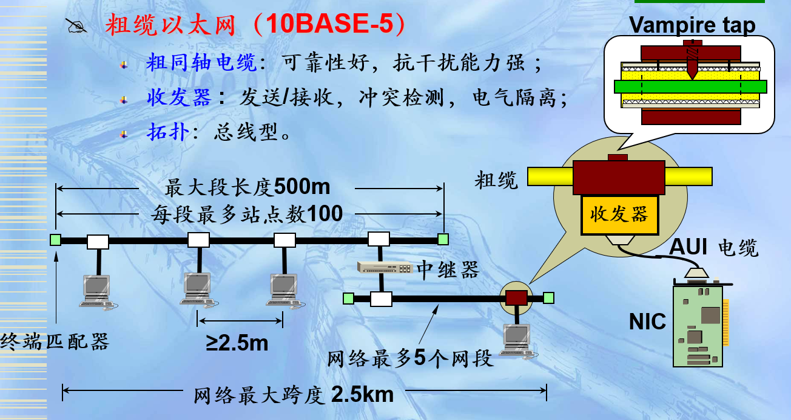
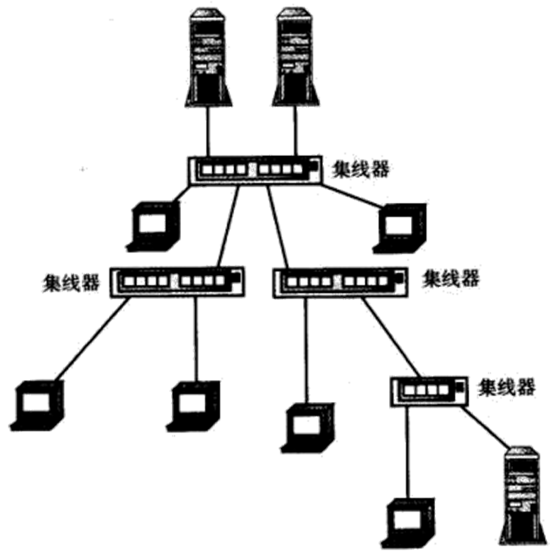
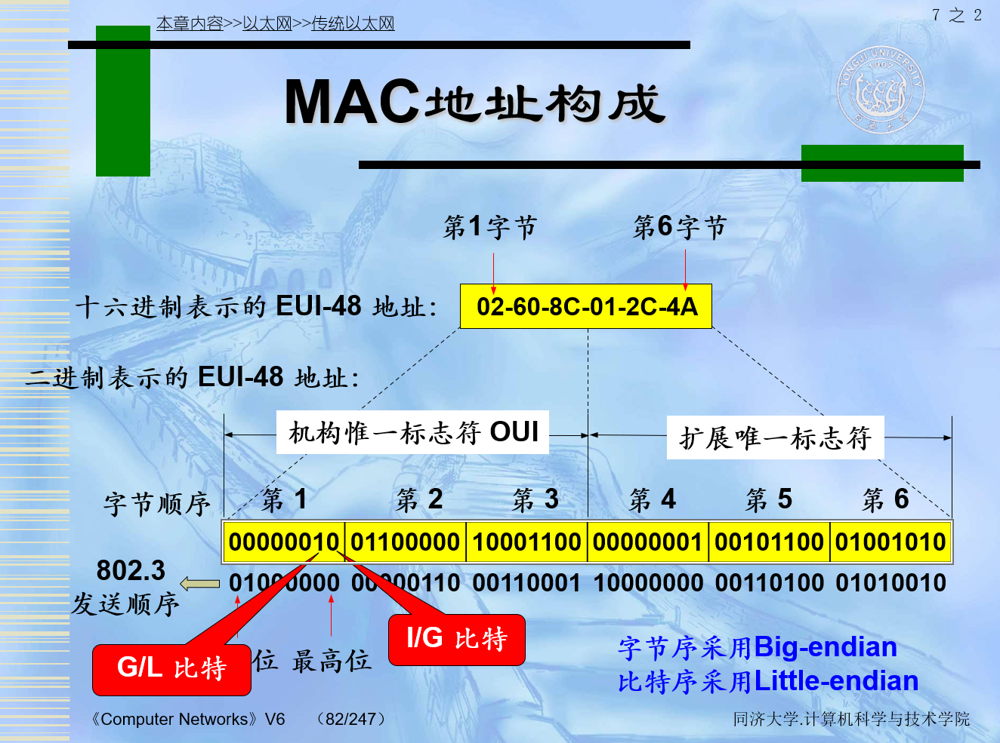
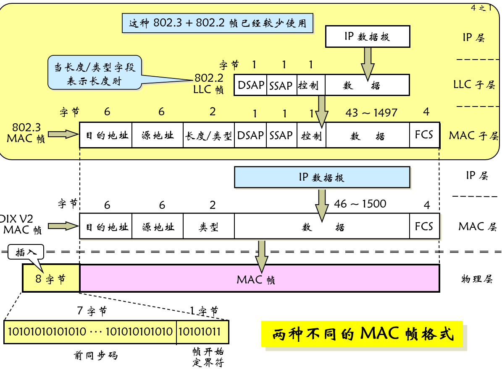
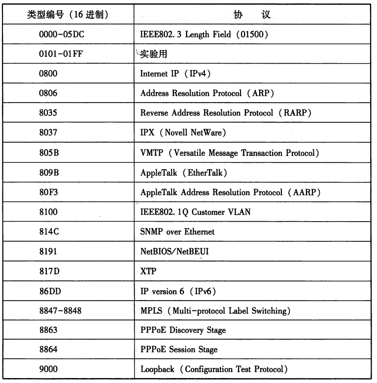
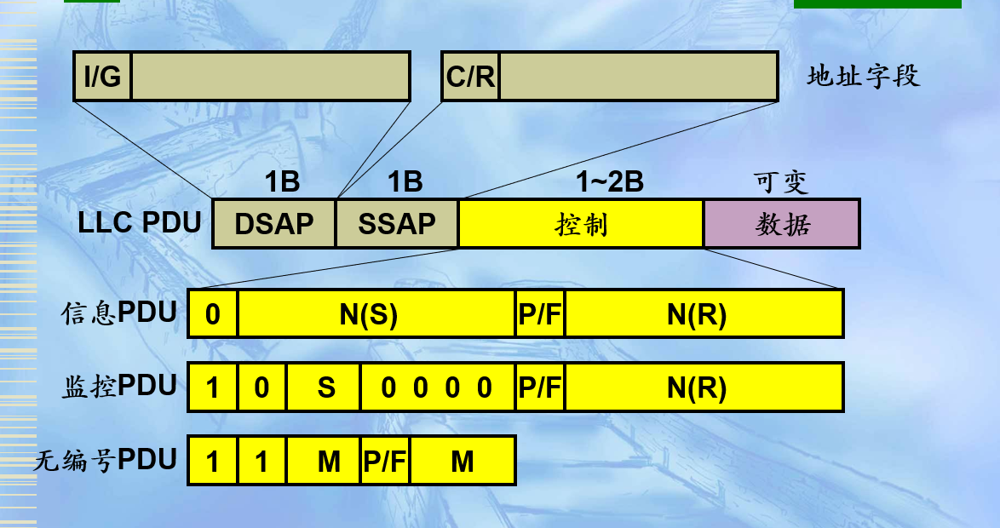

# 1 物理层
## 1.1 10 BASE-5
### 名称
  - 10 表示 10Mbps
  - BASE 表示 基本带宽
  - 5 表示 网络段最大的长度为500m
### 特点
  - 粗同轴电缆：可靠性好，抗干扰能力强 ；
  - 收发器 :  发送/接收，冲突检测，电气隔离；
  - 拓扑：总线型。
  

### 组网部件
  - **计算机** ：网络服务的提供者，也是网络服务的使用者。
  - **同轴电缆**：50Ω粗同轴电缆，每隔2.5m一个标记标明接头处。
  - **收发器** ：用插入式分接头牢牢地夹在电缆的接头处，主要进行数据的接收/发送。
  - **收发器电缆**：最长50m，内有5对独立的屏蔽双绞线，用于连接收发器和网卡。
  - **网卡** ：网卡又称为通信适配器(adapter)或网络接口卡 NIC (Network Interface Card)，此场合下的网卡需带有AUI接口。网卡插入主机的扩展槽中，主要完成物理层（发送/接收数据）和数据链路层（实现CSMA/CD、差错控制等）的功能。
  - **集线器**：中继器工作在物理层，用于互连两个相同类型的网段（例如：两个以太网段），主要功能是延伸网段和改变传输媒体，从而实现信息的转发。
- 组网规则——5-4-3原则
    源和目的地的任意路径要满足以下条件：最多经过5个网络段，最多经过4个中继器进行连接，最多经过3个含有工作站的网络段。
    - 每个网络段不能超过500m
    - 整个网络长度不能超过2500m
    - 网络段最多只能连入100个节点
    - 两个相邻收发器之间的最小距离为2.5m
    - 收发器电缆的最大长度为50m
### 争用期
采用64B时间作为争用期
#### 1. 单网段最大长度：500m（核心指标）
- **计算依据**：粗同轴电缆（50Ω特性阻抗）的信号衰减特性决定。  
  以太网信号采用曼彻斯特编码，传输时会因电缆电阻、分布电容产生能量损耗（衰减）。当电缆长度超过500m时，信号的信噪比（SNR）会低于解码阈值，接收端无法区分“0”和“1”，导致数据传输错误。  
- **计算逻辑**：这是 **单段连续粗同轴电缆的物理长度上限**（从一个中继器的输出端到下一个中继器的输入端，或从中继器到终端电阻的电缆长度），不含收发器电缆、设备接口线等额外连接线。

#### 2. 整个网络最大长度：2500m
- **计算依据**：5-4-3原则中的“最多5个网络段”限制。  
  以太网允许通过中继器（工作在物理层，放大信号、补偿衰减）连接多个网段，但中继器无法无限制放大（会累积噪声），因此最多支持 **4个中继器连接5个网络段**。  
- **计算逻辑**：总长度 = 单网段最大长度 × 最大网络段数 = 500m × 5 = 2500m。  
  例：5个网段分别为480m、500m、490m、500m、530m（错误，最后一段超500m），正确总长度需每个网段≤500m，且总和≤2500m。

#### 3. 收发器电缆最大长度：50m
- **计算依据**：收发器与网卡之间的AUI线缆（5对屏蔽双绞线）信号衰减更快。  
  AUI线缆的线径比粗同轴电缆细，屏蔽效果较弱，信号衰减速率高于粗缆，超过50m后信号失真严重，无法被网卡正确接收。  
- **特殊说明**：这段长度是 **设备到主干电缆的“分支距离”**，不计入“网络段长度”（网络段长度仅指主干粗同轴电缆的长度），且每个收发器的AUI线缆长度独立计算，互不影响。

#### 4. 相邻收发器最小距离：2.5m
- **计算依据**：避免相邻收发器的信号干扰（近场耦合）。  
  收发器通过分接头接入粗同轴电缆，相邻收发器的信号会产生电磁耦合（近场干扰），导致信号失真。2.5m的间隔是经过测试的最小无干扰距离。  
- **计算逻辑**：两个相邻收发器的分接头之间的粗同轴电缆长度≥2.5m（不是收发器物理位置的直线距离，而是电缆实际铺设长度）。
    
## 1.2  10 BASE-2
### 名称
  - 10 表示 10Mbps
  - BASE 表示 基本带宽
  - 2 表示 网络段最大的长度为200m
### 特点
  - 细同轴电缆：抗干扰能力较差，但可靠性高；
  - 无外置收发器
  - 轻便、灵活、成本较低
  - 总线型拓扑
### 组网部件
  - **计算机** ：网络服务的提供者，也是网络服务的使用者。
  - **网卡（带有BNC接口）** ：插入主机的扩展槽中，同时具有10BASE-5中网卡和收发器的功能。
  - **同轴电缆**：采用50Ω细同轴电缆（比粗缆便宜，易于转弯）。
  - **无源的BNC T型接头**：需切断电缆。
  - **中继器**：延伸网段和改变传输媒体，从而实现信息的转发。
### 组网规则——5-4-3原则
  源和目的地的任意路径要满足以下条件：最多经过5个网络段，最多经过4个中继器进行连接，最多经过3个含有工作站的网络段。

- 每个网络段不能超过185m
- 整个网络长度不能超过925m
- 两个相邻BNC T型接头之间的距离应是0.5m的整数倍，最小距离为0.5m
- 网络段最多只能连入32个节点
#### 1. 单网段最大长度：185m（实际值，标称200m）
- **计算依据**：细同轴电缆的信号衰减比粗缆更严重。  
  细同轴电缆的线径（通常0.2英寸）远小于粗缆（0.4英寸），特性阻抗同样为50Ω，但信号传输时的衰减速率更高。理论标称200m，但实际组网中，超过185m后信号衰减已无法满足解码要求，因此实际按185m执行。  
- **计算逻辑**：单段细同轴电缆的长度（从一个BNC T型接头到另一个BNC T型接头的电缆长度），不含网卡接口、终端电阻等部分。

#### 2. 整个网络最大长度：925m
- **计算依据**：同样遵循5-4-3原则（最多5个网络段、4个中继器）。  
- **计算逻辑**：总长度 = 单网段最大长度 × 最大网络段数 = 185m × 5 = 925m。  
  例：5个网段分别为180m、185m、175m、185m、190m（错误，最后一段超185m），正确总长度需每个网段≤185m，且总和≤925m。

#### 3. 相邻BNC T型接头最小距离：0.5m（整数倍）
- **计算依据**：避免阻抗不匹配导致的信号反射。  
  BNC T型接头需切断细同轴电缆后插入，接头处的阻抗会有微小变化。若相邻接头距离过近（<0.5m），多个接头的阻抗不匹配会叠加，导致信号反射严重，影响传输质量。  
- **计算逻辑**：两个相邻BNC T型接头之间的细同轴电缆长度≥0.5m，且必须是0.5m的整数倍（如0.5m、1.0m、1.5m等），确保阻抗匹配的一致性。

## 1.3 10 BASE-T
### 名称
- 10：表示数据速率为10Mbps。
- BASE：表示电缆上的信号是基带信号。
- T：表示采用双绞线进行组网。

### 特点
- 三类UTP
- 所有站点都与Hub项链
- 物理星型拓扑，逻辑总线结构
- 轻便、安装密度高、便于维护
### 组网部件
- **计算机** ：网络服务的提供者，也是网络服务的使用者。
- **双绞线** ：3类UTP
- **网卡（带有RJ-45接口）** ：插入主机的扩展槽中，同时具有10BASE-5中网卡和收发器的功能。RJ45是布线系统中信息插座（即通信引出端）连接器的一种，连接器由插头（接头、水晶头）和插座（模块）组成，插头有8个凹槽和8个触点。RJ是Registered Jack的缩写，意思是“注册的插座”。在FCC（美国联邦通信委员会标准和规章）中RJ是描述公用电信网络的接口，计算机网络的RJ45是标准8位模块化接口的俗称。
- **集线器** ：集线器作为以太网的集中连接点，它放大接收到的信号并进行广播传输，无过滤、路径检测和交换功能，不同速率的集线器不能级联。


# 2 MAC 地址

## 2.1  作用
也成为**硬件地址、物理地址**，在局域网上的计算机利用MAC地址表示自己和他人的身份。

## 2.2 存储
MAC地址通常存储在网络接口卡NIC当中。

## 2.3 格式
IEEE802标准规定MAC地址可采用6B或者2B编码。采用16进制表示，例如：00:11:aa:bb:cc:dd。

我们规定
```c++
bool mac[48];
```

存储方式采用大端序的存储方式。但是发送却采用了小端序的发送方式。

### 2.3.1 G/L比特 
```c++
mac[1]
```
- 唯一性保证
  - MAC地址由IEEE的注册管理机构 RA 负责向厂家分配地址字段的前3字节（高24bit，即：地址块、厂商代码），称为机构唯一标识符（OUI）；
  - 由厂商负责分配地址字段的后3字节（低24bit），称为扩展唯一标识符，必须保证生产出的网卡没有重复地址；
  - 例如：3Com公司的OUI是00-0F-CB（不唯一）， 华为公司的OUI是10-32-7E（不唯一）。
- 如果厂商不向IEEE申请厂商代码，而自行分配地址字段，可使用地址字段的第一字节的最低第二位（G/Lbit）进行区分：G/L=1表示局部地址，G/L=0表示全局地址。
- 采用2B MAC地址全都是局部地址。
### 2.3.2 I/G比特 
```c++
mac[0]
```
#### 通信方式
- 广播：一个发全部收。
- 组播（多播）：一个发多个收。
- 单播：一个发一个收。
#### 单播地址和组播地址
区分可通过使用地址字段的第一字节的最低位（I/Gbit）来进行：I/G=0表示单播地址，I/G=1表示组播地址。
#### 广播地址
所有 48位都为 1 ，只能作为目的地址使用。
### 2.3.3 如何接受
- 网卡从网络上每收到一个 MAC 帧就首先用硬件检查 MAC 帧中的 MAC 地址：
  若是发往本站的则收下，然后再进行其他的处理；
  否则就将此帧丢弃，不再进行其他的处理。
- 网卡如果以混杂方式(promiscuous mode)进行工作，只要“听到”有帧在以太网上传输就都接收下来。
- 所有的网卡都至少能够识别单播地址和广播地址。
- 有的网卡可用编程方法识别组播地址。
- 只有目的地址才能使用广播地址和组播地址。
## 2.4 MAC帧格式

请注意，这里的MAC帧参考了曾经的HDLC协议的相关标准进行拓展。
### 2.4.1 DIX V2 帧格式
- 前导码(8B):由物理层加上，每一字节都是10101010，用于时钟同步
- 地址字段(12B):目的MAC地址，源MAC地址，用于标识发送者和接收者
- 类型字段(2B):帧类型，用于标识数据类型例：IPv4:0x0800、ARP:0x0806、PPPoE:0x8864等。
- 
- 数据字段(46-1500B):数据部分，可以是任意类型的数据，最大长度为1500字节。书本上注明，这一字段当中由46字节的填充部分。
- FCS(4B):帧检验序列，用于检验数据是否被篡改。
### 2.4.2 802.3帧格式
  类型字段被替换为帧长度
  前导码的最后两个比特全部是1，这一2b的段被称之为**SOF** (Start of Frame)。

  - 请注意，DIXV2 的帧格式字段中转化出的帧长度一定是大于1500字节的。也就是说，除了SOF以外，也可以使用这个字段分析出的长度来区分这两种帧格式。例如：0x800=2048。于是IEEE规定，0x600(1536)以下都可以被认为是长度。
### 2.4.3 如何校验MAC帧

- 数据字段的长度与长度字段的值不一致。
- 帧的长度不是整数个字节
- 用收到的帧检验序列FCS查出有差错。
- 数据字段的长度不在46-1500B之间。
### 2.4.4 LLC子层
Logical link control 子层。
#### 类型
类型1（LLC1）
提供不确认的无连接服务，即：数据报服务
适合：点到点通信；广播通信和组播通信；周期性采集网络中的数据
类型2（LLC2）
提供面向连接服务，即：虚电路服务
适合：传送很长的数据文件 
类型3（LLC3）
提供带确认的无连接服务，目前只用于令牌总线网中，适合传送非常重要且时间性也很强的信息。
类型4（LLC4）
提供高速传输服务，专为MAN所用。
#### 帧格式

目的服务访问点（DSAP）：1B
I/G位：I/G=0表示单个DSAP（单播），I/G=1表示一组DSAP（组播）
其它7位：用于目的服务访问点
源服务访问点（SSAP）：1B
C/R位：C/R=0表示命令帧，C/R=1表示响应帧
其它7位：用于源服务访问点
提示：SAP地址是指进程在主机中的地址
控制字段：2B或1B，用于区分不同帧
数据字段：长度不限，但应是整数个字节
# 3 交换机
## 如何工作
当交换机收到数据时，它会检查它的目的MAC地址，然后把数据从目的主机所在的接口转发出去。交换机之所以能实现这一功能，是因为交换机内部有一个MAC地址表，MAC地址表记录了网络中所有MAC地址与该交换机各端口的对应信息。某一数据帧需要转发时，交换机根据该数据帧的目的MAC地址来查找MAC地址表，从而得到该地址对应的端口，即知道具有该MAC地址的设备是连接在交换机的哪个端口上，然后交换机把数据帧从该端口转发出去。
- “分段”就是将一个大型的以太网分割成两个或多个小型的以太网，每个段（分割后的每个小以太网）使用CSMA/CD方法维持段内用户的通信。
## 交换方式
### 存储-转发交换
思想：在转发前先将数据帧全部存储到内部缓冲区中。
优点：具有帧差错检测能力；支持不同速率端口间的帧转发
缺点：交换延迟时间长。
### 切入法
思想：在测出数据帧的目的地址后马上转发。
优点：交换延迟时间短。
缺点：无帧差错检测能力；不支持不同速率端口间的帧转发
### 改进型切入法
思想：收齐数据帧的前64B，判断已收到部分是否正确，若正确立即转发，否则丢弃。
特点：前两者的综合。 
# 4 快速以太网 802.3u
## 4.1 核心特性与设计目标
| 特性                | 描述                                                                 |
|---------------------|----------------------------------------------------------------------|
| 速率提升            | 从10Mbps升级至100Mbps，单帧传输延迟大幅降低（如1500字节帧传输时间从1.2ms降至0.12ms） |
| 完全兼容性          | 沿用以太网帧格式（帧头、帧尾、MTU=1500字节）、CSMA/CD冲突检测机制，上层协议（IP、TCP/UDP）无需修改 |
| 传输介质灵活        | 支持双绞线（铜缆）、光纤，适配不同组网场景（桌面接入、楼宇互联）       |
| 拓扑结构兼容        | 仍以星型拓扑为主（通过交换机/集线器连接），兼容传统以太网的布线系统（部分需升级） |
| 低成本演进          | 技术升级无需重构网络架构，硬件（网卡、交换机）成本逐步降低，性价比突出 |

### 设计目标
1. 解决传统10Mbps以太网的带宽瓶颈（如文件传输、视频会议等高速业务需求）；
2. 避免技术断层，让现有以太网用户可平滑升级（无需更换上层软件、重新布线）；
3. 保持与以太网生态的兼容性，降低部署和维护成本。


## 4.2 核心技术改进（相比传统10Mbps以太网）
快速以太网能实现10倍速率提升，核心依赖以下3点技术优化：
### 1. 编码方式升级
- 传统以太网（10BASE-T）：采用**曼彻斯特编码**（每个比特位都有一个跳变，用于同步和数据传输），编码效率50%（1bit数据需2个信号周期）；
- 快速以太网：
  - 铜缆介质（100BASE-TX/T4）：采用**4B/5B编码**（4个比特数据映射为5个比特信号），编码效率80%，在相同信号速率下传输更多数据（信号速率125MHz→数据速率100Mbps）；
  - 光纤介质（100BASE-FX）：同样采用4B/5B编码，搭配光信号传输，抗干扰能力更强。

### 2. 传输介质优化
- 放弃传统同轴电缆（10BASE-5/2），主力采用**双绞线**（Cat5及以上）和**光纤**，大幅降低信号衰减、提升传输稳定性：
  - 双绞线：支持星型拓扑，布线灵活，适合桌面终端接入；
  - 光纤：支持长距离传输，无电磁干扰，适合楼宇间、机房互联。

### 3. 冲突域控制
- 传统以太网依赖集线器（HUB），所有终端共享一个冲突域，速率提升后冲突概率会急剧增加；
- 快速以太网主流使用**交换机（Switch）** 替代集线器，交换机每个端口对应一个独立冲突域，仅在目标端口转发数据，大幅减少冲突，充分发挥100Mbps速率优势。


## 4.3  关键物理层标准（IEEE 802.3u定义）
快速以太网的物理层（PHY）定义了3种核心标准，核心差异在于传输介质、距离和编码细节，具体对比如下：

| 标准          | 传输介质                | 传输距离（单段） | 编码方式 | 线对数量 | 特性与应用场景                     |
|---------------|-------------------------|------------------|----------|----------|------------------------------------|
| 100BASE-TX    | 5类/超5类非屏蔽双绞线（UTP） | 100m             | 4B/5B+MLT-3 | 2对（发送+接收） | 最主流标准，用于桌面终端、服务器接入，支持全双工模式 |
| 100BASE-T4    | 3类/5类非屏蔽双绞线      | 100m             | 4B/5B+8B/6T | 4对（无专用发送/接收线对） | 兼容旧3类双绞线，速率相同但线对利用率高，现已少见 |
| 100BASE-FX    | 多模光纤（62.5/125μm）  | 2km（半双工）/4km（全双工） | 4B/5B+NRZ-I | 2芯（发送+接收） | 抗干扰、长距离，用于楼宇间互联、机房骨干链路 |

# 5 千兆以太网 802.3ab标准
实际上，1998年6月，所使用的标准为802.3z标准。随后1999年6月，802.3ab标准正式发布。即1000Base-T。
## 特性
- 与现有的以太网标准保持向后兼容
- 支持半双工和全双工操作，优选全双工操作
- 采用星型/树型/网状连接方式
- 支持UTP、STP和光纤
- 采用新的编码方案
- 使用CSMA/CD协议
- 为保持最大电缆长度（100m）和最短帧长（64B）不变，需将争用期变成512B。扩展字节采用特殊的非数据符号表示，由发送硬件添加、接收硬件移走，协议软件不须变动也无需知道。
## 载波扩充与帧突发
在这样的告诉网络中多个小包会降低效率。
在发送很多短帧（64B）时，载波扩展存在着浪费严重现象（信道效率只有9%）。
为减低浪费，第一个短帧采用“载波扩展”进行填充，以后的短帧直接发送，直到8192B（突发限度）为止 。