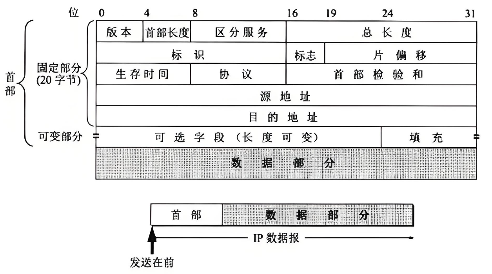

[参考](https://blog.csdn.net/u014035968/article/details/149017356)
## 简介
IP（Internet Protocol）数据报是网络层的基本数据单元，其格式由固定长度的首部（Header）和可变长度的数据部分（Payload）组成。

## 帧格式

以下是将 IPv4 首部字段转化为 **分点（位级分段）形式** 的详细表示，严格对应每个字段的比特长度、位置及含义，便于理解 IP 首部的二进制结构：

### IPv4 首部分点（位级）结构
（总长度：20 字节 = 160 比特，按从高位到低位、从左到右的顺序排列）

| 比特位范围（第 n 位，从 0 开始） | 字段名称         | 长度（bit） | 分点说明（含取值规则）                                                                 |
|----------------------------------|------------------|-------------|----------------------------------------------------------------------------------------|
| 0~3                              | 版本（Version）  | 4           | - 取值：4（IPv4）、6（IPv6） - 二进制示例（IPv4）：`0100`                             |
| 4~7                              | 首部长度（IHL）  | 4           | - 单位：4 字节（32 比特） - 取值：最小 5（20 字节，无选项）、最大 15（60 字节，含选项） - 二进制示例（无选项）：`0101` |
| 8~15                             | 服务类型（TOS）  | 8           | - 前 6 位：DiffServ 字段（区分服务） - 后 2 位：ECN 字段（显式拥塞通知） - 无 QoS 需求时默认填 `00000000` |
| 16~31                            | 总长度（Total Length） | 16      | - 范围：5×4=20 字节（仅首部）~ 65535 字节（最大） - 二进制示例（1000 字节）：`0000001111101000` |
| 32~47                            | 标识（Identification） | 16      | - 唯一标识数据报，主机每发送 1 个报文自增 1 - 二进制示例（序号 1234）：`0000010011010010` |
| 48                               | 标志（Flags）- 保留位 | 1      | - 强制取值 0（二进制：`0`）                                                             |
| 49                               | 标志（Flags）- DF（禁止分片） | 1    | - 取值：0（允许分片）、1（禁止分片）（二进制示例：`1`）                                 |
| 50                               | 标志（Flags）- MF（更多分片） | 1    | - 取值：0（最后一片/未分片）、1（非最后一片）（二进制示例：`0`）                         |
| 51~63                            | 片偏移（Fragment Offset） | 13    | - 单位：8 字节（64 比特） - 未分片时取值 0（二进制：`0000000000000`） - 分片时表示当前片在原数据报中的偏移位置 |
| 64~71                            | 生存时间（Time to Live） | 8     | - 范围：0~255，每经过 1 个路由器减 1，为 0 时丢弃 - 二进制示例（64 跳）：`01000000`   |
| 72~79                            | 协议（Protocol）  | 8           | - 取值：TCP=6（`00000110`）、UDP=17（`00010001`）、ICMP=1（`00000001`）等                |
| 80~95                            | 头部校验和（Header Checksum） | 16  | - 仅校验 IP 首部（不包含数据部分），每经过路由器重新计算 - 二进制示例（校验值示例）：`1010011001011001` |
| 96~127                           | 源IP地址（Source Address） | 32    | - 32 比特 IPv4 地址，按 4 个字节拆分表示 - 示例（192.168.1.1）：`11000000.10101000.00000001.00000001`（二进制，`.`仅为分隔） |
| 128~159                          | 目的IP地址（Destination Address） | 32  | - 32 比特 IPv4 地址，格式同源 IP - 示例（203.0.113.5）：`11001011.00000000.01110001.00000101`（二进制，`.`仅为分隔） |

### 关键补充说明
1. **位级顺序**：IP 首部为 **大端序（网络字节序）**，即字段的高位比特先传输/存储，表格中“比特位范围”从左到右对应首部的二进制流顺序。
2. **可选字段**：上述结构为 IPv4 基本首部（20 字节），若 IHL 大于 5，则后续会紧跟“选项（Option）”字段（最长 40 字节），但基本字段的位级位置不变。
3. **单位换算**：
   - IHL（4 比特）：值 × 4 字节 = 实际首部长度；
   - 片偏移（13 比特）：值 × 8 字节 = 实际偏移长度；
   - 总长度（16 比特）：直接表示字节数（最大 2¹⁶ - 1 = 65535 字节）。

该分点形式清晰体现了每个字段的比特级分布，可直接用于理解 IP 首部的二进制解析、协议实现或抓包分析场景。