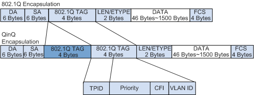

# VLAN（虚拟局域网）技术详解
VLAN（Virtual LAN，虚拟局域网）是网络技术中核心的隔离与组网方案，其核心是将物理上相连的局域网，在逻辑上划分为多个独立的“广播域”，实现广播控制、安全隔离与灵活组网，广泛应用于企业级网络及各类复杂组网场景。

## 一、为什么需要VLAN？
### 1. 未划分VLAN的痛点：广播风暴
在未划分VLAN的纯二层网络中，所有设备处于同一个广播域。当某台主机发送ARP请求（用于获取目标设备MAC地址）等广播报文时，交换机会将报文“泛滥”到所有端口，导致全网所有设备都接收并处理该报文——这就是“广播风暴”。其危害包括：
- 消耗大量网络带宽，导致传输效率下降；
- 占用所有设备的CPU资源，严重时引发网络瘫痪。

### 2. VLAN的核心作用
- **限制广播域**：广播报文仅在所属VLAN内传播，避免全网泛滥，节省带宽、提升网络处理能力；
- **增强安全性**：不同VLAN的报文默认相互隔离，无路由转发时无法直接通信，防止跨工作组信息泄露；
- **提高健壮性**：故障被限制在单个VLAN内，某一VLAN的设备故障、广播风暴不会影响其他VLAN正常运行；
- **灵活构建虚拟工作组**：同一工作组用户无需局限于物理位置，可通过VLAN跨交换机、跨楼层组网，网络维护更便捷。

## 二、VLAN的核心基础概念
### 1. VLAN标签（Tag）：报文的“身份标识”
为了让设备区分不同VLAN的报文，IEEE 802.1Q协议规定在以太网数据帧中添加4字节的VLAN标签（Tag），位于目的MAC地址与协议类型字段之间。标签包含4个关键字段：
| 字段   | 长度 | 含义与核心规则                                                                 |
|--------|------|------------------------------------------------------------------------------|
| TPID   | 2字节 | 标签协议标识符，默认取值0x8100（标识为802.1Q VLAN帧），不支持该协议的设备会直接丢弃该帧；厂商可自定义，需确保设备间配置一致才能互通 |
| PRI    | 3比特 | 报文优先级（0-7），值越大优先级越高，网络阻塞时优先转发高优先级帧                 |
| CFI    | 1比特 | 标准格式指示位，以太网中固定为0（表示MAC地址以标准格式封装）                     |
| VID    | 12比特 | VLAN编号（0-4095），其中0和4095为协议保留，有效取值范围为1-4094                 |

设备通过VID识别报文所属VLAN，确保广播帧仅在同一VID的VLAN内转发。

### 2. 帧的类型：Tagged帧与Untagged帧
- **Tagged帧**：带4字节VLAN标签的帧，用于设备间（交换机、路由器）传输，携带VLAN身份信息；
- **Untagged帧**：无VLAN标签的原始以太网帧，用于用户终端（主机、服务器、Hub）与设备通信（终端无法识别标签）。

**设备收发规则**：
- 终端（主机、服务器、Hub）：仅收发Untagged帧；
- 网络设备（交换机、路由器、AC）：可收发两种帧，内部处理时一律转换为Tagged帧；
- 特殊设备（语音终端、AP）：可同时收发1个Tagged帧和1个Untagged帧。

### 3. 链路类型与接口类型
为适配“终端-设备”“设备-设备”的不同连接场景，VLAN定义了两种链路类型和三种接口类型：

#### （1）链路类型
- **接入链路（Access Link）**：仅承载1个VLAN的Untagged帧，用于连接设备与终端；
- **干道链路（Trunk Link）**：可承载多个VLAN的Tagged帧，用于设备间（交换机-交换机、交换机-路由器）互联，确保VLAN信息跨设备传递。

#### （2）接口类型（核心区别在对Tag的处理）
| 接口类型 | 连接对象                | 接收帧处理规则                                                                 | 发送帧处理规则                                                                 |
|----------|-------------------------|------------------------------------------------------------------------------|------------------------------------------------------------------------------|
| Access   | 终端（主机、服务器）    | 收到Untagged帧：添加接口缺省VLAN（PVID）的Tag；收到Tagged帧：仅接收VID与PVID一致的帧，否则丢弃 | 剥离帧的Tag，仅发送Untagged帧                                                 |
| Trunk    | 交换机、路由器、AP      | 收到Untagged帧：添加PVID的Tag，仅接收PVID在允许列表内的帧；收到Tagged帧：仅接收VID在允许列表内的帧 | VID与PVID一致：剥离Tag；VID与PVID不一致：保留Tag（允许多个VLAN带Tag通过）       |
| Hybrid   | 终端、交换机、路由器等  | 与Trunk接口一致                                                               | 可灵活配置：部分VLAN带Tag发送，部分VLAN剥Tag发送（适用于一个接口连接多VLAN网段的场景） |

### 4. 缺省VLAN（PVID）
- 定义：每个接口默认关联的VLAN ID，用于给收到的Untagged帧分配VLAN身份；
- 取值规则：默认值为1；端口被分配到单个VLAN n时，PVID自动改为n；端口分配到多个VLAN时，PVID为最小非1值；
- 特点：仅在本地交换机有效，不跨设备传递，常用于隔离同VLAN内不同端口的通信。

## 三、VLAN的访问机制（通信原理）
VLAN通信分为“同VLAN内互访”和“跨VLAN互访”，核心差异在于是否需要三层路由转发。

### 1. 同VLAN内互访
#### （1）同设备互访（如同一交换机下的两台主机）
1. 源主机发送ARP广播请求（目的MAC为全F），获取目标主机MAC；
2. 交换机收到Untagged帧，添加接口PVID的Tag，生成“源MAC+VID+入接口”的MAC表项；
3. 交换机在所有允许该VLAN通过的接口广播该帧，发送前剥离Tag；
4. 目标主机收到ARP请求，回应自身MAC，交换机记录目标主机的MAC表项；
5. 后续通信直接通过MAC表转发，无需再广播。

#### （2）跨设备互访（如两台交换机下的同一VLAN主机）
- 关键：设备间通过Trunk链路互联，Trunk接口允许该VLAN的VID通过；
- 流程：与同设备互访类似，但Trunk链路会透传带Tag的帧（不添加/剥离Tag），确保VLAN身份跨设备传递。

### 2. 跨VLAN互访（需三层路由技术）
不同VLAN属于不同广播域，默认无法直接通信，需通过“VLAN间路由”实现，常用两种技术：

#### （1）核心技术
- **VLANIF接口**：三层逻辑接口，每个VLAN对应一个VLANIF，配置IP地址（作为该VLAN的网关）；设备会生成“VLANIF MAC+VID”的表项，实现三层转发（最常用，配置简单，但较浪费IP地址）；
- **Dot1q终结子接口**：三层逻辑子接口，一个主接口可承载多个VLAN，需配置Dot1q终结功能（适用于一个接口下接多VLAN网络的场景，但存在带宽争用风险）。

#### （2）同设备跨VLAN互访（同一路由器下的不同VLAN主机）
1. 源主机判断目标IP与自身不在同一网段，发送ARP请求获取网关（VLANIF接口）的MAC；
2. 路由器收到帧后添加Tag，记录源主机的ARP表项（IP-MAC映射）；
3. 路由器进行三层转发：根据目标IP查找路由表，匹配到目标VLAN的直连网段；
4. 路由器在目标VLAN内广播ARP请求，获取目标主机MAC；
5. 路由器转发报文给目标主机，发送前剥离Tag；后续通信通过三层转发表直接转发。

#### （3）跨设备跨VLAN互访（不同路由器下的不同VLAN主机）
- 额外配置：除了在各路由器上配置VLANIF接口，还需配置静态路由或动态路由协议（如OSPF），让路由器之间学习到对方VLAN的网段路由；
- 流程：源主机→源路由器（三层转发）→目标路由器（三层转发）→目标主机，Trunk链路透传VLAN标签。

## 四、VLAN的划分方式
VLAN划分分为“静态”和“动态”两类，适用于不同场景：

### 1. 静态VLAN（基于端口）
- 定义：明确指定交换机端口所属的VLAN，固定不变；
- 优点：配置简单、逻辑清晰，易于理解；
- 缺点：扩展性差，终端移动端口后需手动修改配置，不适用于大型网络或频繁变更拓扑的场景。

### 2. 动态VLAN（自动适配端口所属VLAN）
根据终端特征自动分配VLAN，无需手动修改端口配置，分为三类：
| 类型               | 划分依据                     | 优点                                   |
|--------------------|------------------------------|----------------------------------------|
| 基于MAC地址的VLAN  | 终端网卡的MAC地址            | 终端移动端口后，VLAN身份不变（不受端口限制） |
| 基于子网的VLAN     | 终端的IP地址                 | 不受MAC地址变更影响（如更换网卡）       |
| 基于用户的VLAN     | 终端登录的用户名（如Windows域用户） | 基于用户身份划分，适用于多用户共享终端的场景 |

## 五、交换机之间的VLAN互联方式
当需要跨交换机部署同一VLAN时，有两种核心连接方式：

### 1. 方法一：按VLAN分接口互联
- 原理：为每个VLAN在交换机间预留专用接口和网线，实现该VLAN的跨设备通信；
- 缺点：扩展性差，新增VLAN需新增网线和端口，浪费设备资源，不适用于多VLAN场景。

### 2. 方法二：Trunk链路互联（推荐）
- 原理：将交换机间的互联端口配置为Trunk接口，一根网线承载所有VLAN的Tagged帧，帧中携带VLAN标识；
- 流程：源交换机发送帧时添加VLAN Tag，Trunk链路透传该帧，目标交换机接收后根据Tag识别VLAN，剥离Tag后转发给目标端口；
- 优点：节省端口和网线资源，扩展性强，支持新增VLAN无需修改互联配置。

## 六、VLAN间通信的核心逻辑
- 同一VLAN内：通信仅在二层交换机内部完成，无需路由器转发；
- 不同VLAN间：必须经过“源主机→交换机→路由器→交换机→目标主机”的流程，路由器通过子接口或VLANIF接口处理不同VLAN的帧，实现跨广播域转发。