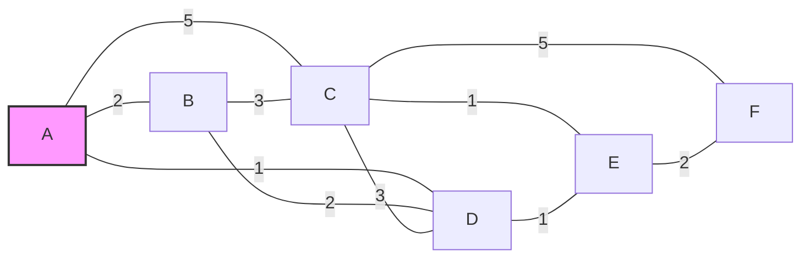

# 1 构成
- 路由选择部分： 也叫控制部分，核心是路由选择处理机，其任务是根据所选定的路由算法构造出路由表，同时经常或定期地和相邻路由器交换路由信息而不断地更新和维护路由表。
- 数据转发部分：根据转发表将分组从合适的端口转发出去，有三部分组成：交换结构、一组输入端口和一组输出端口。
- 注意：路由表是根据路由算法得出的，而转发表是从路由表得出的。在讨论路由选择的原理时，往往不去区分转发表和路由表的区别。

也就是说，从端口进来的数据经过一定的解析通过路由算法转发给另一个端口。

# 2 路由算法
- 静态路由
    简单的被程序员写死
- 动态路由
    依据当前网络状态进行适当的变化，但是有计算开销。
- 路由算法需要考虑很多性质，总结起来就是你感觉好就是**好**。包括正确性，简单性，健壮性，稳定性，最佳性，公平性。
    - **不存在一种绝对的最佳路由算法。** 所谓“最佳”只能是相对于某一种特定要求下得出的较为合理的选择而已。
    - **实际路由算法应尽可能接近理想算法**
    - 一个显然的性质
        - **如果路由器J在从路由器I到K的最佳路由上，那么从J到K的最佳路由一定在同一路由之中。**
    
    
    
- 代价 cost
    由一个或几个因素综合决定的一种度量（metric），如链路长度、数据率、链路容量、是否要保密、传播时延等，甚至还可以是一天中某一个小时内的通信量、结点的缓存被占用的程度、链路差错率等。
## 2.1 汇集树 sink tree
从所有源端到一个目的端的最佳路由的集合就可以形成以目的端为根的树
ainski:相信如果能够回忆起dijikstra算法，一定会意识到，dijikstra算法给出的就是一个目的端的汇集树。
## 2.2 dijikstra算法
ainski:这是你学过的内容，担心你忘掉，因为会考怎么算，这里讲一下，如果不感兴趣可以跳过。

Dijkstra（迪杰斯特拉）算法是由荷兰计算机科学家艾兹赫尔·迪杰斯特拉于1959年提出的**单源最短路径算法**，用于求解**带权有向/无向图**中从一个起点到其余所有顶点的最短路径，要求图中所有边的权重为**非负数**（若存在负权边，需使用 Bellman-Ford 或 SPFA 算法）。

### 2.2.1算法核心思想
1. **贪心策略**：每次从未确定最短路径的顶点中，选择距离起点最近的顶点（记为 `u`），将其标记为“已确定”；
2. **松弛操作**：以 `u` 为中介，更新起点到其他未确定顶点的最短路径长度；
3. **迭代**：重复上述步骤，直到所有顶点都被标记为“已确定”。

### 2.2.2算法前置定义
假设图 `G = (V, E)`，其中：
- `V` 是顶点集合，`E` 是边集合；
- 起点为 `s`；
- `dist[v]`：记录起点 `s` 到顶点 `v` 的当前最短路径长度，初始时 `dist[s] = 0`，其余 `dist[v] = ∞`（无穷大）；
- `visited[v]`：标记顶点 `v` 是否已确定最短路径，初始时全为 `false`；
- `w(u, v)`：边 `u→v` 的权重（非负）。

### 2.2.3算法步骤
1. **初始化**：
   - `dist[s] = 0`，其余 `dist[v] = ∞`；
   - `visited` 数组全为 `false`。
2. **迭代处理**（共 `n` 轮，`n` 为顶点数）：
   - **步骤2.1**：在未标记的顶点中，找到 `dist` 值最小的顶点 `u`（即 `u = argmin{dist[v] | v ∈ V, visited[v] = false}`）；
   - **步骤2.2**：标记 `visited[u] = true`（确认 `u` 的最短路径）；
   - **步骤2.3**：对 `u` 的所有邻接顶点 `v`，执行**松弛操作**：
     若 `dist[v] > dist[u] + w(u, v)`，则更新 `dist[v] = dist[u] + w(u, v)`。
3. **结束**：`dist` 数组中存储了起点 `s` 到所有顶点的最短路径长度。

### 2.2.4算法优化（堆优化）
原始 Dijkstra 算法每轮查找最小 `dist` 顶点的时间复杂度为 `O(n)`，总复杂度为 `O(n²)`（适合稠密图）。
对于**稀疏图**（边数远小于 `n²`），可通过**优先队列（最小堆）** 优化查找过程，将时间复杂度降至 `O(m log n)`（`m` 为边数）：
- 堆中存储 `(dist[v], v)`，始终弹出当前 `dist` 最小的顶点；
- 若堆中弹出的顶点已被标记（`visited[v] = true`），直接跳过；
- 否则执行松弛操作，并将更新后的 `dist[v]` 和 `v` 入堆（允许堆中存在重复的 `v`，但标记后不再处理）。

### 2.2.5代码实现（堆优化版，Python）
```python
import heapq

def dijkstra(graph, start):
    """
    graph: 邻接表表示的图，格式为 {顶点: [(邻接顶点, 权重), ...]}
    start: 起点
    return: 起点到所有顶点的最短路径长度
    """
    # 初始化距离数组，无穷大表示初始不可达
    dist = {v: float('inf') for v in graph}
    dist[start] = 0
    # 优先队列：(当前距离, 顶点)，最小堆
    heap = []
    heapq.heappush(heap, (0, start))
    # 标记是否已确定最短路径
    visited = {v: False for v in graph}

    while heap:
        # 弹出当前距离最小的顶点
        current_dist, u = heapq.heappop(heap)
        # 若已确定，跳过
        if visited[u]:
            continue
        # 标记为已确定
        visited[u] = True
        # 遍历u的所有邻接顶点
        for v, weight in graph[u]:
            # 松弛操作
            if not visited[v] and dist[v] > dist[u] + weight:
                dist[v] = dist[u] + weight
                # 入堆（允许重复，后续弹出时会跳过）
                heapq.heappush(heap, (dist[v], v))
    return dist

# 示例：无向图邻接表
if __name__ == "__main__":
    # 顶点：0,1,2,3,4
    graph = {
        0: [(1, 2), (2, 5)],
        1: [(0, 2), (2, 1), (3, 3)],
        2: [(0, 5), (1, 1), (3, 1), (4, 4)],
        3: [(1, 3), (2, 1), (4, 2)],
        4: [(2, 4), (3, 2)]
    }
    start_vertex = 0
    shortest_dist = dijkstra(graph, start_vertex)
    print(f"起点 {start_vertex} 到各顶点的最短路径：")
    for v, d in shortest_dist.items():
        print(f"到 {v}：{d}")
```

输出结果
```
起点 0 到各顶点的最短路径：
到 0：0
到 1：2
到 2：3
到 3：4
到 4：6
```

## 2.3洪泛算法
这是一种很朴素的算法，它将收到的数据除了收到的端口以外，发送到所有其它端口去。**弊端** 也很明显，就是会造成网络拥塞。我们给出了三种解决办法:
- 设置站计数器：在分组中设置，其初值为最大网络直径，每经过一台路由器减1，若为0丢弃
- 设置分组序号：路由器记录下哪些分组已经被扩散过了，从而避免再次发送这些数据
- 选择性洪泛法：将收到的分组发送到与正确方向接近的那些线路，而非所有输出线路

ainski:显然，dijikstra带来了很大的开销以及很大的精确度，有时候并没有那么好用，我们局部性有限制的洪泛算法，感觉在某个地方就范围打击，反而是集合了正确性和效率性的更好的选择。

---
以上的内容是静态路由算法，下面介绍几个动态路由算法。
---
## 2.4 距离矢量算法 Distance Vector
### 2.4.1 Bellman-Ford方程
Bellman-Ford方程（离散形式，适用于最短路径计算）：

$$d_v(t) = \min_{u \in \text{Neighbors}(v)} \left\{ w(v,u) + d_u(t) \right\}$$

其中：
- $d_v(t)$：节点$v$到目标节点$t$的最短距离；
- $\text{Neighbors}(v)$：节点$v$的直接相邻节点集合；
- $w(v,u)$：节点$v$与$u$之间的链路权重（非负/负权均可）；
- $d_u(t)$：邻居节点$u$到目标节点$t$的最短距离。

ainski：感觉速度也一般啊，不如洪泛。。。


### 2.4.2 路由表
每台路由器都有一张以子网其它路由器为索引的路由表，每条记录对应一台路由器，至少包含：
估计目的地所需的代价值（cost）：站点数、队列长度或延时等；
去目的地的输出线路：下一个路由器。
对于这个路由图



A节点的路由表为

| 目的路由器 | 延迟（路径代价） | 下一个路由器 | 说明 |
|------------|------------------|--------------|------|
| A          | 0                | *            | 自身，无需转发 |
| B          | 2                | B            | 直接转发到B |
| C          | 5                | C            | 直接转发到C |
| D          | 1                | D            | 直接转发到D |
| E          | 6                | C            | 需先转发到C，再到达E |
| F          | 8                | C            | 需先转发到C，再到达F |

所以，路由器每隔Tms都会使用上文提到的，利用每个路由器根据邻居路由器的延迟清单更新自己的路由表，使用 [bellman-ford方程](#241-bellman-ford方程)来更新自己的路由表，这是简明的。

### 2.4.3 收敛状态

我们已经介绍了路由器是如何获得路由表的，那么路由表的建立就是所有的距离一步一步在邻居之间传递直到不再变化，那么不再变化的状态就是**收敛状态**。

ainski:我们是否能够看到，这是一个所有服务器都各自进行dijikstra算法的过程呢？

### 2.4.4 无穷计算问题 Count to Infinity Problem
它指的是：当网络中某条链路失效后，路由器之间的路由信息更新会陷入“到失效目标的距离持续增大（趋近‘无穷’）”的循环，直到达到协议预设的最大阈值才会停止。


### 典型场景（结合之前的路由拓扑举例）
假设路由器A→B→C的链路（A到B延迟2，B到C延迟3）：
1. 初始状态：A到C的距离是 `2+3=5`（下一跳B），B到C的距离是3。
2. 当B→C的链路失效后，B先知道“自己到C的距离是无穷大”。
3. 但B会收到A的路由更新：“A到C的距离是5”，于是B错误地认为“可以通过A到达C”，将自己到C的距离更新为 `5+2=7`。
4. 接着A收到B的更新：“B到C的距离是7”，又将自己到C的距离更新为 `7+2=9`……
5. 这个过程会持续到距离达到协议的**最大阈值**（如RIP协议的16跳，一般采用最大网络直径+1来表示），才会判定“目标不可达”。

## 2.5 链路状态算法 Open Shortest Path First

为了解决上述Count to Infinity Problem ，我们引入了OSPF算法。
### 2.5.1 cost
现在我们要好好看看前文所述cost了。
cost受到一下内容度量：带宽、跳数、延迟、负载、可靠性等影响。
- 链路带宽：使代价与链路带宽成反比
    -例如：1Gbps以太网的线路代价设为1，而100Mbps以太网的线路代价设为10，这样高带宽的路径成为路由的更好选择
- 延迟：适用于网络在地理上分散
    发送一个echo包，另一端立即回送一个应答
    通过测量往返时间RTT，可以获得一个合理的延迟估计值

#### 链路状态分组Link State Packet

每个路由器拥有一个链路状态分组，其实就是一个数据包。
这个数据包当中包括了序列号seq，老化时间age，以及OSPF邻居和它们的距离。
- age的作用：
    - seq递增使用，让重复的seq得以区分
    - 路由器崩溃后从0开始编号，然而入站的包仅仅只有新的包才能进入，这里的age可以帮助重建出站序列。
    - 也可以帮助顺序号传输出错后的重传，这与上一点类似
- 每个LSP分组包含一个序列号，且递增路由器记录所收到的所有(源路由器,序列号)对
- 当一个新分组到达时，路由器根据记录判断：
    - 如果是新分组，洪泛广播
    - 如果是重复分组，丢弃
    - 如果是过时分组，拒绝
