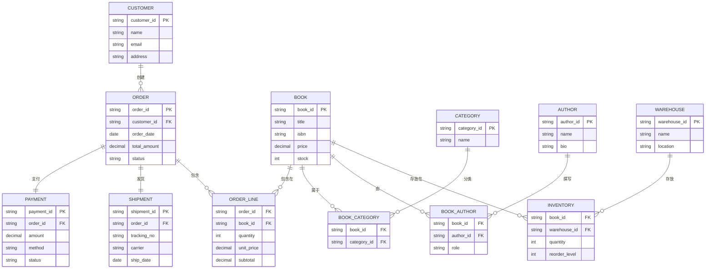

任课老师：Zhao

---

# 一、UML
## （一）UML类之间的关系
### 1. 依赖（Dependency）
- **定义**：表示一个类（依赖方）需要借助另一个类（被依赖方）的功能才能完成自身工作，是一种临时性、弱关联的关系。
- **UML图示**：用带箭头的虚线表示，箭头指向被依赖的类（即“谁被用，箭头就指向谁”）。
- **实例**：`Service`类需要调用`Logger`类的`log()`方法记录日志，`Service`依赖`Logger`，虚线箭头从`Service`指向`Logger`。
- **核心特点**：依赖方不持有被依赖方的实例，仅在特定方法中临时使用；被依赖方的变化可能影响依赖方。

---

### 2. 泛化（Generalization）
- **定义**：对应面向对象中的“继承”关系，表示一个子类（特殊类）继承自一个父类（一般类），子类拥有父类的属性和方法，并可扩展或重写。
- **UML图示**：用带空心三角形的实线表示，三角形指向父类（即“子类指向父类”）。
- **实例**：`Dog`和`Cat`类都继承自`Animal`类，`Animal`的“eat()`”“sleep()`”方法可被子类复用，虚线箭头从`Dog`/`Cat`指向`Animal`。
- **核心特点**：遵循“is-a”逻辑（如“Dog is an Animal”）；父类的共性被抽取，子类专注于个性扩展。

---

### 3. 实现（Realization）
- **定义**：表示一个类（实现类）实现了一个或多个接口（或抽象类），实现类需重写接口中所有抽象方法，满足接口定义的“契约”。
- **UML图示**：用带空心三角形的虚线表示，三角形指向接口（即“实现类指向接口”）。
- **实例**：`UserServiceImpl`类实现`UserService`接口，需重写接口中的`getUser()`“addUser()`”等抽象方法，虚线箭头从`UserServiceImpl`指向`UserService`。
- **核心特点**：遵循“implements”逻辑；接口定义规范，实现类提供具体实现，支持多实现（一个类可实现多个接口）。

---

### 4. 关联（Association）
- **定义**：表示两个类之间存在稳定、长期的结构关系，关联的类通常会持有对方的实例引用，分为单向关联和双向关联。
- **UML图示**：用带箭头（单向）或不带箭头（双向）的实线表示，箭头指向被引用的类；可在关联线上标注“关联名称”或“ multiplicity（多重度）”（如1对1、1对多）。
- **实例**：`Teacher`类与`Student`类是双向关联，一个`Teacher`可教多个`Student`（1:N），一个`Student`可被多个`Teacher`教（N:M），实线连接两者并标注“1”“N”。
- **核心特点**：遵循“has-a”逻辑；关联关系是“聚合”“组合”的基础，比“依赖”更强，关联的类之间存在实例级的引用。

---

### 5. 聚合（Aggregation）
- **定义**：是“关联”的特殊形式，表示“整体与部分”的关系，且部分可脱离整体独立存在（即整体和部分的生命周期不绑定）。
- **UML图示**：用带空心菱形的实线表示，菱形指向“整体”类，实线连接“部分”类（即“部分指向整体”）。
- **实例**：`Car`类（整体）与`Wheel`类（部分）是聚合关系，`Car`包含`Wheel`，但`Wheel`可从`Car`上拆卸，单独存在或安装到其他`Car`上，空心菱形在`Car`端，实线从`Wheel`指向`Car`。
- **核心特点**：整体不负责部分的创建和销毁；部分可属于多个整体，是“弱整体-部分”关系。

---

### 6. 组合（Composition）
- **定义**：也是“关联”的特殊形式，同样表示“整体与部分”的关系，但部分完全依赖整体存在（即整体和部分的生命周期绑定，整体销毁时部分也随之销毁）。
- **UML图示**：用带实心菱形的实线表示，菱形指向“整体”类，实线连接“部分”类（即“部分指向整体”）。
- **实例**：`Person`类（整体）与`Heart`类（部分）是组合关系，`Heart`是`Person`的一部分，`Person`创建时`Heart`随之创建，`Person`销毁时`Heart`也无法独立存在，实心菱形在`Person`端，实线从`Heart`指向`Person`。
- **核心特点**：整体负责部分的创建、初始化和销毁；部分只能属于一个整体，是“强整体-部分”关系。

### 7. UML类间六种关系对比表

| 关系类型 | UML图示特征 | 核心逻辑 | 生命周期绑定 | 耦合强度 | 典型实例 |
|----------|-------------|----------|--------------|----------|----------|
| 依赖（Dependency） | 带箭头的虚线，箭头指向被依赖类 | 类A临时使用类B的功能完成工作，无长期持有 | 无绑定，仅在调用时关联 | 最弱 | Service类调用Logger类的log()方法 |
| 泛化（Generalization） | 带空心三角形的实线，三角形指向父类 | 子类继承父类，遵循“is-a”逻辑 | 子类依赖父类存在，父类变化可能影响子类 | 较强 | Dog类、Cat类继承自Animal类 |
| 实现（Realization） | 带空心三角形的虚线，三角形指向接口 | 类实现接口的抽象方法，遵循“implements”逻辑 | 实现类依赖接口规范，接口变更需同步修改实现类 | 较强 | UserServiceImpl类实现UserService接口 |
| 关联（Association） | 带/不带箭头的实线，可标注多重度 | 类A长期持有类B的引用，遵循“has-a”逻辑 | 无强制绑定，双方可独立存在 | 中等 | Teacher类与Student类的教学关联（1:N） |
| 聚合（Aggregation） | 带空心菱形的实线，菱形指向整体类 | 整体包含部分，部分可脱离整体独立，遵循“整体-部分（弱）”逻辑 | 无绑定，整体销毁不影响部分 | 较强 | Car类（整体）与Wheel类（部分） |
| 组合（Composition） | 带实心菱形的实线，菱形指向整体类 | 整体包含部分，部分无法脱离整体，遵循“整体-部分（强）”逻辑 | 强绑定，整体创建则部分创建，整体销毁则部分销毁 | 最强 | Person类（整体）与Heart类（部分） |

### 8. UML关联关系中“多重度”概念说明
“多重度”（Multiplicity）用于定义关联关系中，两个类的实例之间可以建立的对应数量关系，通常标注在关联线的两端，清晰界定实例交互的数量边界。

#### （1）常用多重度符号及含义

| 符号 | 名称 | 具体含义 |
|------|------|----------|
| `1` | 一个 | 关联的一端必须且只能有1个实例 |
| `0..1` | 零或一个 | 关联的一端可以有0个实例（可选），也可以有1个实例 |
| `*` 或 `0..*` | 零或多个 | 关联的一端可以有0个、1个或多个实例（数量无上限） |
| `1..*` | 一个或多个 | 关联的一端至少有1个实例，也可以有多个实例 |
| `n..m`（如2..5） | 范围数量 | 关联的一端实例数量在n到m之间（包含n和m），n、m为具体数字 |

#### （2）典型应用场景示例
- **1:1（一对一）**：一个实例仅对应另一个实例。例如“Person”与“IDCard”，一个人只能有一张身份证，一张身份证也仅属于一个人，关联线两端均标注`1`。
- **1:N（一对多）**：一个实例可对应多个实例，反之仅对应一个。例如“Department”与“Employee”，一个部门可有多个员工，一个员工仅属于一个部门，部门端标注`1`，员工端标注`*`。
- **N:M（多对多）**：两端实例均可对应多个实例。例如“Student”与“Course”，一个学生可选多门课程，一门课程可被多个学生选择，关联线两端均标注`*`。

## （二）状态图
状态图（State Diagram）是UML行为图的一种，用于描述对象从创建到销毁的生命周期中，不同状态的转换逻辑，核心是“状态”与“转换”两大要素。以下是分步骤的绘制方法，适用于Markdown（需借助Mermaid语法渲染）或可视化工具（如Visio、StarUML）。

### 1. 明确绘制目标与核心要素
在动笔前先界定范围，避免信息冗余。状态图的核心要素只有3个，需提前梳理清楚：
- **状态（State）**：对象的行为模式或属性集合，分3类
  - 初始状态：对象生命周期的起点，用“实心小圆”表示，一个图仅1个。
  - 普通状态：对象的常规行为，用“圆角矩形”表示（如“待支付”“已发货”）。
  - 终止状态：对象生命周期的终点，用“内部带实心圆的大圆”表示，可多个。
- **转换（Transition）**：状态间的切换，用“带箭头的实线”表示，箭头上需标注“触发事件[守卫条件]/动作”（如“支付成功[金额≥0]/生成订单”）。
- **对象（可选）**：若需明确归属，可在图顶部标注“对象名: 类名”（如“订单123: Order”）。

### 2. 按“生命周期流”梳理状态逻辑
以“电商订单”为例，按时间顺序拆解状态，避免逻辑断层，步骤如下：
1. 确定起点：初始状态（订单创建）。
2. 罗列普通状态：按流程拆解核心节点，如“待支付”→“支付中”→“已支付”→“已发货”→“已签收”。
3. 补充分支状态：考虑异常或分支场景，如“待支付”可因“超时未支付”转入“已取消”（终止状态）。
4. 确定终点：每个流程分支对应一个终止状态，如“已签收”“已取消”均为终止状态。

### 3. 用Mermaid语法编写Markdown状态图（实操示例）
Mermaid是Markdown中最常用的状态图渲染语法，无需手动拖拽，代码即图，以下是“电商订单”的完整示例：

- **语法说明**：
  - `stateDiagram-v2`：固定开头，确保渲染效果。
  - `[*]`：代表初始/终止状态（起点用`[*]-->状态`，终点用`状态-->[*]`）。
  - 转换规则：`源状态 --> 目标状态 : 触发事件[守卫条件]/执行动作`，“[守卫条件]”和“/动作”可省略（如仅“点击支付”）。

### 4. 绘制注意事项（避坑指南）
- 避免“状态冗余”：只保留影响行为的核心状态，如“订单”无需拆分“待支付-等待1分钟”“待支付-等待2分钟”。
- 转换标注清晰：触发事件需具体（如“点击支付”而非“操作”），守卫条件需可判断（如“超时30分钟”而非“超时”）。
- 逻辑闭环：每个普通状态都要有后续转换（除终止状态），避免“孤立状态”（如“已支付”必须能到“已发货”或异常状态）。

## （三）数据流图（DFD）详解与完整示例
### 1. 定义与特点
- 描述系统**逻辑模型**，仅描绘信息流动和处理情况，不涉及具体物理实现。
- 直观易懂，便于技术人员与需求方（客户、用户）沟通，体现工程思想。
- 属于**行为模型、功能模型**，不同于程序流程图。

### 2. 核心符号（术语）

| 符号类型 | 定义与说明 | 表示形式 |
|----------|------------|----------|
| 外部实体 | 数据的源点或终点（如人、设备、其他系统）。 | 正方形 |
| 处理 | 数据转换器，将输入转换为输出。 | 圆形/矩形（带编号） |
| 数据流 | 数据在系统内的有方向流动。 | 带箭头的线段 |
| 数据存储 | 数据的静止存储状态（如文件、数据库）。 | 两条平行线 |

### 3. 绘图规则总结
- **加工**：必须有输入和输出，标签用动词短语。
- **数据存储**：数据不能直接在存储间流动，必须通过加工；标签用名词短语。
- **外部实体**：数据不能直接从源点流向终点；标签用名词短语。
- **数据流**：单向流动，分叉/汇合有意义，不能回流，标签用名词短语。

### 4. 绘制方法与分层原则
- **宏观原则**：“由外向里”——先定系统边界，再画内部。
- **分层结构**：
  - **顶层（0层）**：系统整体边界，只有一个加工。
  - **一级细化图**：分解顶层加工为核心子加工（3-7个）。
  - **二级及以下细化图**：对单一加工继续分解，直至每个加工功能单一。
- **关键原则**：
  1.  **保持平衡**：子图的输入输出必须与父图对应加工的输入输出完全一致。
  2.  **编号规范**：加工编号体现层级（如1.0, 1.1, 1.1.1）。
  3.  **合理分解**：每层加工数建议控制在7±2个。

### 5. 完整案例：在线购书系统DFD
#### （1）第一步：顶层DFD（0层）—— 定系统边界


**要点**：明确系统与外部世界的所有接口。

#### （2）第二步：一级DFD —— 分解核心流程


**要点**：展示系统内部核心处理流程和数据存储，保持与顶层图的输入输出平衡。

#### （3）第三步：二级DFD —— 细化“1.0 订单处理”


**要点**：展示单一加工的详细处理步骤，保持与父加工（1.0）的输入输出平衡。

## （四）数据字典（DD）详解与示例
### 1. 定义与作用
- 对系统中**所有数据元素**的有组织列表及精确定义。
- 与DFD共同构成完整的系统逻辑模型，是需求规格说明书的核心。

### 2. 核心条目及描述要素

| 条目类型 | 关键描述要素 |
|----------|--------------|
| 数据流 | 名称、说明、来源、去向、组成（数据结构）、流量 |
| 数据元素 | 名称、类型、长度、取值范围、相关元素 |
| 数据文件 | 名称、简述、输入/输出数据、组成、存储方式、存取频率 |
| 加工逻辑 | 名称、编号、简要描述、输入/输出、加工规则 |
| 源点/汇点 | 名称、简述、相关数据流 |

### 3. 数据定义式符号

| 符号 | 含义 | 示例 |
|------|------|------|
| `=` | 定义为 | `订单编号 = 10{数字}10` |
| `+` | 与（顺序连接） | `购书请求 = 用户ID + 图书列表 + 收货地址` |
| `{ }` | 重复（循环） | `图书列表 = 1{图书ID + 数量}10` |
| `\[ \| \]` | 或（选择） | `支付状态 = [ “成功” \| “失败” \| “待处理” ]` |
| `( )` | 任选（可选） | `发票信息 = (公司名称 + 税号)` |
| `m..n` | 界域（次数/值域） | `数量 = 1..999` |
| `“ ”` | 基本数据元素 | `用户ID = “字符串”` |

### 4. 数据字典示例（针对在线购书系统）

```
// ========== 数据流定义 ==========
1. 数据流名：购书请求
   说明：顾客提交的购买图书的信息集合。
   来源：外部实体“顾客”
   去向：加工“1.1 接收与校验请求”
   组成：用户ID + 图书列表 + 收货地址
   流量：约500份/天，高峰时段100份/小时。

2. 数据流名：图书列表
   组成：1{（图书ID + 数量）}10
   说明：一次请求中最多购买10种图书。

// ========== 数据文件定义 ==========
1. 数据文件：F2 用户订单表
   简述：存储所有生成订单的详细信息。
   输入数据：订单草稿（来自加工1.3）、支付验证结果（来自加工3.0）
   输出数据：订单详情（去向加工4.0）
   组成：订单号 + 用户ID + 订单状态 + 下单时间 + 图书列表 + 总金额 + 收货地址 + (支付单号) + (发货时间)
   存储方式：按订单号索引存储。
   存取频率：非常频繁。

// ========== 数据元素定义 ==========
1. 数据元素：订单号
   类型：字符串
   长度：12位
   格式：“DD”-“YYYYMMDD”-“0000”
   取值范围：系统自动生成，唯一。
   相关文件：F2 用户订单表

2. 数据元素：订单状态
   类型：枚举字符串
   长度：10
   取值：[ “待支付” | “已支付” | “配货中” | “已发货” | “已完成” | “已取消” ]
```

## （五）实体关系图（E-R图）详解与示例
### 1. 定义与作用
- 描述现实世界中**实体及其关系**的图示化概念模型，独立于系统实现。
- 核心用于数据库概念设计，是数据库逻辑设计的基础。

### 2. 核心组成成分

| 成分 | 定义 | 表示形式 |
|------|------|----------|
| 实体 | 需维护数据的对象（人、物、事件、概念）。 | 长方形 |
| 属性 | 实体的命名特性。 | 椭圆形（连接实体） |
| 联系 | 实体实例间的关联。 | 菱形框（连接相关实体） |

### 3. 联系的类型（Cardinality）
- **1:1（一对一）**：一个A实体关联一个B实体。
- **1:N（一对多）**：一个A实体关联多个B实体。
- **M:N（多对多）**：多个A实体关联多个B实体。

### 4. E-R图示例：在线购书系统核心实体关系


**图例说明**：
- `CUSTOMER`（顾客）与 `ORDER`（订单）是 **1对多** 关系：一个顾客可以提交多个订单。
- `ORDER`（订单）与 `ORDER_LINE`（订单明细）是 **1对多** 关系：一个订单包含多条图书购买明细。
- `BOOK`（图书）与 `ORDER_LINE`（订单明细）是 **1对多** 关系：一种图书可以出现在多个订单明细中。
- `ORDER`（订单）与 `PAYMENT`（支付记录）是 **1对1** 关系：一个订单对应一次支付记录。
- **ORDER_LINE** 是一个**关联实体**，用于解决`ORDER`和`BOOK`之间直接的“多对多”关系，并记录“数量”、“小计”等关联属性。

## （六）总结：结构化分析建模流程

1.  **需求调研**：获取用户初始需求。
2.  **绘制顶层DFD**：划定系统范围，识别所有外部实体和输入输出流。
3.  **逐层细化DFD**：
    - 分解加工，加入数据存储。
    - 始终遵循**平衡原则**和绘图规则。
    - 分解至功能足够简单、明确为止。
4.  **定义数据字典（DD）**：
    - 对DFD中出现的**所有**数据流、数据存储、数据元素进行严格定义。
    - 使用定义式符号清晰描述数据结构。
5.  **绘制E-R图**：
    - 从DFD和数据字典中识别需要持久化存储的核心数据对象（实体）。
    - 分析实体间的静态业务关系（联系）。
    - 确定联系的种类（1:1, 1:N, M:N）。
6.  **集成与验证**：
    - 检查DFD、DD、E-R图之间的一致性。
    - 与用户共同评审模型，确保准确反映需求。
    - 形成正式的《软件需求规格说明书（SRS）》。

通过 **DFD（功能与流程）、DD（数据定义）、E-R图（数据关系）** 这三者的有机结合，结构化分析方法能够从不同维度全面、清晰、无歧义地定义软件系统的需求，为后续的系统设计奠定坚实基础。

# 二、E-R图中联系的类型详解与示例

在E-R图中，**联系（Relationship）** 是实体之间的连接或关联。根据实体参与联系的方式和数量，主要有三种基本类型：

## （一）三种基本联系类型
### 1. 一对一联系（1:1）
**定义**：实体集A中的每个实体至多与实体集B中的一个实体相关联，反之亦然。

**表示**：`||---||`（双竖线连接）

**示例**：


**业务场景**：
- 一个学生只有一张学生证，一张学生证只属于一个学生
- 一个人只有一个身份证号，一个身份证号只对应一个人
- 一个公司只有一个法人代表，一个法人代表只代表一个公司

### 2. 一对多联系（1:N）
**定义**：实体集A中的每个实体可以与实体集B中的任意多个实体相关联，但实体集B中的每个实体至多与实体集A中的一个实体相关联。

**表示**：`||--o{`（左边双竖线，右边空心圆+大括号）

**示例**：


**业务场景**：
- 一个部门有多个员工，一个员工只属于一个部门
- 一个客户可以有多个订单，一个订单只属于一个客户
- 一个分类下有多个商品，一个商品只属于一个分类

### 3. 多对多联系（M:N）
**定义**：实体集A中的每个实体可以与实体集B中的任意多个实体相关联，反之亦然。

**表示**：`}o--o{`（两边都是空心圆+大括号）

**示例**：


**业务场景**：
- 一个学生可以选修多门课程，一门课程可以被多个学生选修
- 一个作者可以写多本书，一本书可以有多个作者
- 一个订单可以包含多种商品，一种商品可以在多个订单中

## （二）联系的重要概念
### 1. 联系的度（Degree）
- **一元联系**（递归联系）：同一实体集内的实体之间的联系
- **二元联系**：两个实体集之间的联系（最常见）
- **多元联系**：三个或更多实体集之间的联系

### 2. 参与约束（Participation Constraints）
- **完全参与**：实体集中的每个实体都必须参与联系（用双线表示）
- **部分参与**：实体集中的部分实体参与联系（用单线表示）

**示例**：


在这个例子中：
- `||--`表示部门对员工是完全参与（每个部门都有员工）
- `||{`表示员工对部门是部分参与（可能有员工不属于任何部门）

## （三）在线购书系统完整E-R图示例



## （四）联系的高级概念
### 1. 弱实体与强实体


**解释**：
- **强实体**：ORDER，有自己的主键（order_id）
- **弱实体**：ORDER_LINE，依赖于ORDER存在，其主键包含父实体的主键（order_id + line_no）

### 2. 三元联系


**解释**：医生、病人、药物之间的三元联系，通过处方（PRESCRIPTION）关联实体实现。

### 3. 递归联系（一元联系）


**解释**：员工实体集内部的"管理"联系，表示员工之间的上下级关系。

## （五）实际设计中的注意事项
1. **多对多联系的分解**：在数据库实现中，M:N联系需要通过**关联实体**转换为两个1:N联系
2. **联系属性**：当联系本身具有属性时，必须创建关联实体
3. **参与度约束**：明确是完全参与还是部分参与，影响数据完整性和业务规则
4. **基数约束**：除了1:1、1:N、M:N，还可以指定具体数量范围（如1..5）

## （六）总结

| 联系类型 | 符号表示 | 数据库实现 | 示例 |
|---------|---------|-----------|------|
| 1:1 | `\|\|---\|\|` | 外键放在任意一方，或合并为一张表 | 用户-用户档案 |
| 1:N | `\|\|--o{` | 外键放在"多"的一方 | 部门-员工 |
| M:N | `}o--o{` | 创建关联表（连接表） | 学生-课程 |

**关键设计原则**：
1. **识别正确的联系类型**：仔细分析业务规则
2. **避免过度复杂**：尽量使用二元联系，谨慎使用三元以上联系
3. **考虑性能**：联系类型影响查询效率和数据库设计
4. **保持一致性**：在整个E-R图中使用统一的符号和命名约定